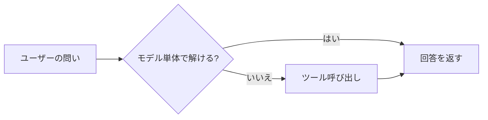
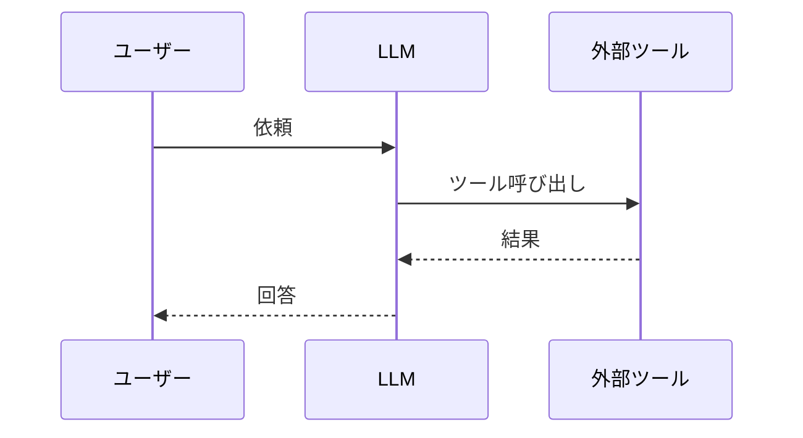

# 執筆ガイドライン

「awesome docs ai works」へようこそ。ここは、非エンジニアの社会人（ただし、ITリテラシーはそれなりにある人）を読者に想定し、生成AIツール群の使いどころを解説するドキュメント置き場です。

書き手ごとに方針がバラバラだと、読者は章ごとに読み方を切り替えさせられて疲弊します。本ガイドは、そうならないように全章で共通して守っておきたいルールをまとめたものです。

## このガイドの対象

- 本リポジトリの各章（`docs/*.md` および `docs/appendix-*.md`）を執筆する人
- 既存章の改善をプルリクエストで入れるレビュアーと寄稿者

## 想定読者像

どの章にも通底する読者像です。執筆中は、この人が肩越しに読んでいる前提で書きましょう。

- IT／インターネット企業で働く非エンジニア
- 日常的にGoogle WorkspaceやSlackを業務で使っている
- 「APIを叩く」「関数を書く」といった前提は置かない
- 「ちょっと難しそうな単語でも、意味が分かれば使ってよい」くらいの距離感

章の冒頭では、この想定を前提にします。誰に向けて、何の疑問を解く章なのかを、最初に明示します。

## ガイドの使い方

本ガイドは、執筆と書き直しの**着地点を示す参照軸**です。次の4点を前提に運用します。

- 機械チェックの規則集ではなく、執筆方針の文書として読む。ルールに合致しない語句を機械置換で直すための指示集ではなく、書き直しのときに「どこへ着地させたいか」を共有するための文書である
- 書き直しの単位は段落、または節とする。問題箇所だけを差し替えるのではなく、節を読み直して節として書き直す。原文は事実と構造の出典として参照するが、語順や言い回しを保存する義務はない。語句単位の置換は段落の流れを壊しやすいため避ける
- 末尾の点検フレーズや`prh-style.yml`の検出ルールは、点検トリガーとして使う。「ここで何かが起きている可能性がある」という注意喚起にすぎず、機械置換のターゲットではない。ヒットを見て該当節を読み直すかどうかを判断する
- 品質の最終判定は人の通読である。ルール準拠は二次評価で、一次評価は「この節を読んで説明として前進しているか、流れに引っかかりがないか」を人が読んで判定する。ルール違反が0でも流れが落ちていれば書き直し、ルール違反が残っていても流れが自然なら採用する余地を残す

比喩を消す場合は、その比喩が担っていた役割（次段への橋渡し、読者の足場）を別の説明・図・対応関係で埋めること。削っただけで段落が宙に浮く形にはしません。

## 情報の鮮度

生成AI界隈は、月単位で仕様が変わる領域です。過去の知識で書き切らず、毎回一次ソースに当たる前提でお願いします。

- 仕様・料金・利用規約・画面の記述は、公式ドキュメントまたは公式発表を一次ソースとする
- 参照した日付を「最終確認： YYYY-MM-DD」の形で本文末または該当セクション末に書く
- 記憶や経験則だけで「たぶんこう動くはず」と書かない。書くときは、経験則である旨を明示する
- モデル名・バージョン名は、執筆時点の公式表記をそのまま使う

### 最終確認日の更新ルール

「最終確認」は **URLを実際に開いて、参照している情報がまだ生きていることを確かめた日** を書きます。章本文の加筆・修正とは独立に扱います。

- 参考節のURLを追加・差し替え・削除したときは、触ったエントリの最終確認日を当日に更新する
- 章本文の中で参考URLに紐づく事実（料金・仕様・機能名など）を書き換えたときは、根拠のURLを開き直し、当該エントリの最終確認日を当日に更新する
- タイポ修正や表現のリライトなど、参考URLの妥当性に影響しない編集では最終確認日を動かさない
- URLを開いて確認していないのに日付だけ今日に差し替えるのは **禁止**（「確認した」の信頼性が崩れる）
- 章ごとに日付が混在するのは正常な状態。揃えること自体は目的ではない
- 半年〜四半期に一度を目安に、章横断で棚卸しPRを出し、全章の参考URLをまとめて再確認して日付を揃える

## 用語表記の統一

表記揺れは、読み進めるうえでじわじわと読者の負担になります。基本方針として、本ドキュメントの共通用語は `prh.yml` で機械的にそろえます。

<!-- textlint-disable prh -->
- 「生成AI」（「生成系AI」は不可）
- 「Google Workspace」
- 「Claude」「Claude Code」（`ClaudeCode` や小文字の `claude` は矯正される）
- 「Gemini」
<!-- textlint-enable prh -->

新しい用語を複数章で使い始めるときは、自分の好みでそろえず、`prh.yml` にルールを足すPRを別立てで出してください。後続の執筆者が迷わずに済みます。

## Lint運用

手元での確認と、PRに対するCIの二段構えです。

- 書き終えたら `npm install` のうえ `npm run lint` を実行する
- PRを開くとGitHub Actionsがtextlintとmarkdownlintを走らせ、警告はインラインコメントで返ってくる
- 現状 `level: warning` でマージはブロックされないが、見えているものは原則解消する
- 自動修正できるものは `npm run lint:fix` でまとめて直せる

```bash
npm install
npm run lint
npm run lint:fix
```

## ファイル名とH1見出しの規約

- 章ファイル： `docs/<番号>-<英小文字ハイフン区切り>.md`（例： `docs/03-external-system-integration.md`）
- 付録ファイル： `docs/appendix-<英小文字ハイフン区切り>.md`
- H1はファイル冒頭に1つだけ。章タイトルと完全一致させる
- H1の例： `# 3. 外部システムとの接続: ツール呼び出しの仕組み`
- H2以降に節番号（`## 3.1 ...`）は基本付けない。GitHub上での閲覧性と、将来の章順入れ替えを優先する

## 章の骨格テンプレート

新しい章は、下の骨格から書き始めると構成で迷いにくくなります。骨格はあくまで目安なので、章の性格に合わせて適宜削ってください。

```markdown
# <番号>. <章タイトル>

<リード文: この章を読むことで解ける疑問を、2〜4文でまとめる>

## 対象読者と前提

- <この章で前提になる知識>
- <前の章への軽い参照>

## <本題のセクション>

<本文 / 箇条書き / 表 / 図>

## まとめ

- <この章の「1行で言える」持ち帰り>

## 参考

- <一次ソースのURL>（最終確認: YYYY-MM-DD）
```

骨格に加えて、節と章のつなぎ方は次のルールでそろえます。

- **節タイトル＝結論**にする。節の冒頭で「結論を先に言うと」「一行で言うと」のように本文中であらためて結論宣言する形は、節タイトルと二重化するため避ける
- **章末の「まとめ」は箇条書き4点以内**、各点は事実1個に絞る。「次は〜で扱います」を入れる場合は1文だけにする
- 章冒頭の「前章では〜していただきました」式の振り返りは置かない。代わりに「対象読者と前提」の箇条書きの中で、前章の参照を1〜2行で示す

## 表と図の活用

平均的な読者は、5行以上の平坦な文章から情報を拾うのが得意ではありません。整理できる情報は、早めに表か図へ分離します。

### 表

比較や選択肢の整理に有効です。

| 用途 | 向いている題材の例 |
| ---- | ---- |
| サービス比較 | 入力コスト、連携先、主要機能の対比 |
| 判断フロー | 「個人向けか組織向けか」などの分岐整理 |
| 設定値 | 推奨値とデフォルト値の対比 |

### 図は Mermaid で書く

GitHubのMarkdownはMermaidをそのままレンダリングしてくれます。画像の差し替えが不要なので、第一選択はMermaidです。

フローチャートの例です。



シーケンス図の例です。



Mermaidで表現しきれない場合（実画面のスクリーンショットや詳細なネットワーク構成図など）に限り画像へフォールバックし、`docs/images/<章番号>-<名前>.png` の規約で配置します。

## 文体ルール

- 本文はです・ます調で統一する
- 1文は120字以内に収める（textlintで検知される）
- 箇条書きは1行1ネタとし、読点で複数の情報を詰め込まない
- カタカナ語は一般的な表記に寄せる（「インターフェース」「ユーザー」など）
- ジョークはスパイスとして2章に1回程度、読者を置き去りにしない範囲で使う
- 本書全体を指すときは「本ドキュメント」を用いる（書籍ではないため「本書」は使わない）
- 「筆者」「私」などの一人称は主語に立てない。複数執筆者を想定した文書のため、経験則は「経験則として〜」「一般的に〜」などの宣言形に寄せる

## 太字の運用

太字は、文章での強意で足りない場合に限って使います。語順・文の作り・節タイトルで強調できるなら、まずそちらで処理します。太字は最終手段の位置づけです。

用途は次の2つに限定します。

- **定義された用語の初出** — 章が以後ずっと使う術語を初出時に1度だけ太字にする。同じ語の2度目以降は太字にしない
- **見出しでは拾えない短い対比語** — 表や箇条書きの項目名で、対比軸の語そのものを最小限に強調する場合

次の用法は避けます。

- 文中の動詞・形容詞・節の太字化（「**こうなります**」「**もっともらしい**」のような形）。これは強調ではなく口頭の抑揚を文字に持ち込む癖で、教科書的な文体から離れる
- 「ここが重要」を示すための太字。重要なら本文の構造（節タイトル・段落の位置）で示す
- 1段落に複数の太字（情報の優先順位が壊れる）
- 引用ブロック内の太字（引用そのものがすでに強調の役目を持つ）

運用基準は1節につき太字0〜2箇所が目安です。3箇所を超えるなら、節の組み立て（タイトル・段落分け）を見直すサインです。太字を入れる前に「節タイトルに昇格できないか」「文を2文に割って語順で前置できないか」を一度自問します。

## 避けたい言い回し

生成AIに下書きを任せると、文章が「AIっぽく」見える語尾や常套句に引っ張られがちです。以下の10カテゴリに該当する表現は、書いたあとに一度目視で点検し、中立な記述へ置き換えてください。Before / Afterは代表例です。

### 1. 根拠のない断定

「必ず」「確実に」「間違いなく」「外しません」「迷わない」のような、条件を省いた言い切り。

| Before | After |
| ---- | ---- |
| ハルシネーションは必ず残る | ハルシネーションは、現時点のモデルの性質上、一定量残り続けると考えておく |
| このやり方で大きく外しません | このやり方から始めると、つまずきにくい |
| 事故はほぼ防げる | 事故に至る経路の多くは避けられる |

事実として必須な手順（「送信前に必ず確認する」など）にのみ「必ず」を残します。

### 2. 読者視点の効果断定

読者の業務に対して「〜が楽になります」「〜が減ります」「〜が収まります」と効果を言い切る表現。

| Before | After |
| ---- | ---- |
| 犯人探しが一気に楽になります | 原因の切り分けが進めやすくなります |
| 混乱はだいぶ収まります | 議論の焦点がそろえやすくなります |
| 手戻りが減ります | 手戻りの少ない形でまとまります |

効果は「〜しやすくなる」「〜の条件に当てはめやすい」のように、結果を確約しない表現に寄せます。

### 3. 主観的・情緒的な形容

「地味」「派手」「華やか」「夢のある」「意外と」「素直に」のような、書き手の印象を断定する語。

| Before | After |
| ---- | ---- |
| 事故率も同じくらい地味で済みます | 想定外の事故も起きにくい作り方になっています |
| 派手さはありませんが | 見た目は淡白ですが |
| 意外と効きます | 手軽なわりに違いが出やすい指示です |

読者自身の印象を先回りして固定する書き方は避け、仕組みから導ける表現に置き換えます。

### 4. システム運用者寄りの語彙

「潰す」「犯人探し」「誤爆」「監視」「肩代わり」「監督役」など、道具を運用管理する側の目線が前に出る語。

| Before | After |
| ---- | ---- |
| 代表的なものを先に潰しておきましょう | 代表的なものを先に並べておきます |
| 誤爆の規模だけが大きくなる | 意図しない操作の影響範囲が大きくなる |
| 監督役を省略しない | 人の確認を省略しない |

本ドキュメントの読者は、道具として便利に使いたい立場です。「運用する／監視する」が主語になる文は、組織側の仕組みを説明する箇所にのみ残します。

### 5. 過剰な比喩・擬人化

「電卓を叩き割る」「最終兵器」「ハーレーで通勤」「家電並み」「白旗をあげる」のように、章の主題から距離のある比喩や、道具の擬人化。

| Before | After |
| ---- | ---- |
| 月末に電卓を叩き割ることになる | 月末の請求額で初めて問題に気づく |
| 素直に白旗をあげてくれる場面が増えます | 「分かりません」と答える選択肢を取りやすくなります |
| 家電並みの扱いやすさで付き合ってくれます | 素直な手触りのまま使い続けられます |

比喩は1章に1〜2本までに抑え、同じ題材の比喩を連鎖させない（たとえば「受付係の比喩」を段落ごとに繰り返さない）ようにします。

#### 比喩の採否は3条件で判定する

比喩そのものを禁じる意図ではありません。**説明の骨格を担う比喩**は採用し、装飾としての比喩は削ります。個々の比喩を残すか削るかは、次の3条件で判定します。3つすべてを満たすときに残します。

1. **目的が明示できる** — 何を理解させるための比喩か、一文で言える
2. **対応関係が一貫している** — 比喩の側のA・Bが、説明対象のA'・B'と1対1で対応し、文中で追跡できる
3. **本文の主張に橋を渡している** — 比喩の含意が、続く説明の補助になっている

採用してよい比喩の例：「モデルはAIサービスの頭脳です。頭脳が大量のエネルギーを必要とするように、モデルの稼働にも大量の電力を消費します」。目的（モデルの位置づけと電力消費を同時に伝える）、対応関係（頭脳→モデル、エネルギー→電力）、橋渡し（次段の電力の話に直結）の3点が成立しています。

避ける比喩の典型は次の3種類です。

- 装飾・トーン作りだけの比喩。「料理番組ふうに」「肩慣らし」「土俵に乗せる」のように、対応関係が示されないまま雰囲気だけを足す形
- 対応物が文中で示されない比喩。「中身を広げて仕分けする」「像だけ持っておく」のように、比喩の側だけ提示して、何に何が対応するかを書かないもの
- 文化・流行・特定世代に依存する比喩。目的が明確でも、読者層の前提が割れるもの。普及曲線・市場規模・利用率のような数字や、図に置き換える

比喩を入れるときは、初出時に対応関係を1文で書き、読者が対応関係を頭の中で組み立てなくて済む形にします。比喩で言い換えただけで前進していない段落（次段の説明と接続しないもの）は削ります。

### 6. 身体性の比喩の連鎖

<!-- textlint-disable prh -->
ツールの動作（ファイルを読み書きする、コマンドを実行する、APIを呼ぶ）を「触る」「腕と足」「手と目」のような身体語で描写すると、章をまたいで「兄弟」「ファミリー」「顔ぶれ」「並ぶ」「入口」「階段」など同系の語彙を呼び込みやすくなります。1段落だけなら親しみが出ますが、章単位で連鎖すると、本来説明したい**実行場所・通信経路・権限範囲**が比喩の後ろに隠れます。

| Before | After |
| ---- | ---- |
| 自分のPCの中で動き、手元のファイルを触れるClaude | 自分のPCの中で動き、許可した範囲のローカルファイルを読み書きするClaude |
| 会話の頭脳は同じままで、腕と足がついている | 同じモデルを呼び出すが、ローカルのファイル読み書きとコマンド実行まで担う |
| 4つの製品の顔ぶれ | 4つの製品の比較 |
| 入口の性格が違うため、得意分野も変わります | 動作環境と権限範囲が違うため、得意分野も変わります |
<!-- textlint-enable prh -->

身体性の比喩そのものを禁じる意図ではありません。狙いは次の2点です。

- 比喩を使う段落では、**実行場所・通信経路・権限範囲のいずれか**を平易な言葉で1度は直接書く
- 同じ章で身体語を主役にする段落は、2つまでに抑え、語彙を連鎖させない

### 7. 評価語で選択肢を格下げする

<!-- textlint-disable prh -->
「最後の手段」「最後の選択肢」「〜せざるを得ない」「温存する」「できる限り避ける」「使うべきでない」のような枕言葉は、書き手の判断（なるべく避けたほうがよい）が利用場面の説明より先に出ます。読者は自分の用途と照らして判断する前に、選択肢のラベルを受け取ってしまいます。

| Before | After |
| ---- | ---- |
| Computer Useは他の道が塞がれたときの最後の選択肢として残しておきます | Computer Useは、APIや連携機能のないアプリを画面越しに操作したい場面で選びます |
| APIを持たないアプリを相手にせざるを得ないとき | APIや連携が公開されていないアプリを操作したいとき |
| APIが塞がっているときの選択肢として温存する | APIが公開されていないアプリの操作に向く |
<!-- textlint-enable prh -->

リスクや費用を伝えること自体は対象外です。次のような書き方は、判断材料として読者に残します。

- 速度・費用・失敗パターンの**事実記述**（例：「遅い・高い・壊れやすい」）
- **具体的な根拠と紐付いた**警告（例：「スクリーンショットを毎ターン読み込むため、トークン消費は通常のチャットの数倍になる」）
- 濫用の戒め（具体的な使い所と紐付いているもの）

問題にしたいのは、根拠と切り離して「最後の」「避けるべき」と評価ラベルだけを置く書き方です。**利用場面**で書ければ、読者は自分の事情に当てはめて判断できます。

### 8. 特定部署名を役割の代名詞にしない

「情シス」「総務」「法務」「人事」のような特定部署名を、組織内の役割や観点の代名詞として使うのを避けます。組織により担当部署は異なり、また**利用者自身が一定の関心と責務を持つべき事柄**まで部署名で括ると、読者が「自分には関係のない話」として距離を置く理由になりかねません。

| Before | After |
| ---- | ---- |
| 情シス部門の方針で無効化されている | 組織のWorkspace管理者の設定で無効化されている |
| 情シスや法務が気にしているポイント | 組織のデータ取扱や契約を扱う担当（法務・セキュリティなど、組織により分担は異なります）が気にしているポイント |
| 情シスや上長に確認 | 組織の相談先（担当部署や上長）に確認 |
| 情シス観点 | 観点（契約・プラン／データ取扱／権限／監査／法務など）を分解して書く |

書き分けの軸は次の2点です。

- **観点**（契約・プラン、データ取扱、アカウント・権限、監査・ログ、法務・コンプライアンスなど）と、**相談先**（組織のエスカレーション経路）は、性質が違うので分けて書く
- 利用者と組織の**分担**を並べると、読者が自分の責務を取り違えにくい

### 9. 定型句の反復

「〜しましょう」「〜と覚えておけば十分です」「〜するのが現実的です」「結局いちばん速い道のりです」など、どの章でも使える定型句。

| Before | After |
| ---- | ---- |
| この一行を守りましょう | この一行を外さないようにします |
| 〜とだけ覚えていただければ十分です | 〜だけ押さえていれば先の章を読み進められます |
| 結局いちばん速い学び方です | 事前の比較検討に手を取られにくく、実地の感覚が先に育ちます |

指示口調（〜しましょう）は、手順セクションの明確な指示だけに限定し、解説文では「〜します」「〜しておきます」の宣言形に寄せます。

### 10. カジュアルなアナロジー語と、読者の主観を先回りする構文

「理屈」「事故る」「活きる」「腹落ちする」「早道」「ほぐす（解きほぐす）」「（説明・話が）通る／通らない」のような、日常会話では便利だが概念の輪郭をぼかすアナロジー語。あわせて「**…という感覚を持っておくと、以降の章が読み進めやすくなります**」のように、読者側の主観の動きを先回りで仮定する構文。

| Before | After |
| ---- | ---- |
| 組織がそう決めた理屈 | 組織がそう決めた背景 |
| サイコロを振るのと同じ理屈です | サイコロを振るのと同じ原理です |
| 実務でよく事故るのは | 実務でよく事故が起きるのは |
| エディタ側の差分表示が活きる | エディタ側の差分表示をそのまま使える |
| 「コンテキスト」の話が腹落ちしやすくなります | 「コンテキスト」の説明を、自分の体験に重ねて読み解きやすくなります |
| プラン側を確認するのが早道です | プラン側の確認から始めるのが順当です |
| 言葉のほぐし方／丁寧にほぐします | 言葉の整理／順を追って整理します |
| 人の目を通らない経路 | 人の確認を経由しない経路 |
| 会社の環境ではそのまま通らない | 会社の環境ではそのまま機能しない |
| 〜という感覚を持っておくと、以降の章が読み進めやすくなります | 〜である、という前提は共有しておきます。以降の章はこの前提に立って書いてあります |

書き分けの軸は次の3点です。

- **「理屈」は、文脈に応じて「背景」「原理」「仕組み」「構造」「筋道」に開く**。「理屈で納得する」のような形は、ほぼ必ず別語に置換できる
- **「事故る」「活きる」のような口語の動詞化は使わない**。「事故が起きる」「事故につながる」「直接利用できる」「そのまま使える」のように、動作そのものを書く
- **「ほぐす」「腹落ち」「（説明が）通る」など、内容の理解を比喩空間で語る言い回しは、説明側が読者の主観を先取りする形になる**。「整理する」「読み解きやすくなる」「機能する」のように、対象側で起きていることを書くか、読者側に先回りせず「前提として共有しておきます」と宣言する

注意：同じ語でも、技術用語として確立した用法（「テストが通る」「ビルドが通る」など）は固有名詞に近い扱いで残します。問題にしたいのは、概念の説明や読者の理解の進み方を比喩で代用している場合です。

### 点検のヒント

書き上がった原稿を読み直すときは、次のフレーズで検索をかけると取りこぼしが減ります。

<!-- textlint-disable prh -->
```text
必ず / 確実に / 間違いなく / 大きく外しません
楽になります / 減ります / 収まります / 安心です
地味 / 派手 / 華やか / 夢のある / 素直に / 意外と
潰す / 犯人探し / 誤爆 / 監督 / 肩代わり
ファイルを触れる / ファイルに触る / 腕と足 / 手と目 / 顔ぶれ / 兄弟 / ファミリー / 入口の性格
最後の手段 / 最後の選択肢 / せざるを得な / 温存する / 使うべきでない / できる限り避け
情シス / 情シス部門 / 情シス観点
結局いちばん / 覚えていただければ十分 / しましょう
理屈 / 事故る / 活きる / 活きにくい / 腹落ち / 早道 / ほぐす / ほぐし / 解きほぐ / 感覚を持って / 読み進めやすくなり
```
<!-- textlint-enable prh -->

下2行（身体性比喩・評価ラベル）に該当する候補は、`prh-style.yml` の検出ルールでも警告として並びます。`npm run lint` の出力を素材に、章単位で書き直しを進めてください。本ファイルでルールを読み込んだまま `npm run lint:fix` を流すと注釈語が本文に混入するため、自動修正は使わず、手作業で整えます。

引っかかった箇所を、ここまでのBefore / Afterの型に沿って書き直してください。

## コマンドと画面操作の表記

- コマンド例はコードブロックで囲み、言語指定は `bash` で統一する
- 画面操作の手順は「メニュー名 → ボタン名」の順で書く（例：「設定」→「拡張機能」→「Gemini」）
- スクリーンショットは賞味期限が短い。キャプションで画面の要点を補い、古くなっても意味が通るようにする

## コミットとPR

- 章単位で細かめにコミットし、PRは「1章に対する加筆」を基本サイズにする
- PRタイトルは日本語・英語のどちらで書いてもよい。本文に「変更の要点」と「確認方法」を書く
- Lintが警告まみれのままのPRは原則マージしない

## よくある落とし穴

- 古いモデル名やUIが残ったまま公開される → 最終確認日の更新ルールと定期棚卸しで早期に発見する
- スクリーンショット依存 → テキスト手順を先に書き、画像は補助に回す
- 章の独立性が高すぎて流れが切れる → リード文と前後章への参照を忘れない

---

ここまで守れば、章ごとのバラつきはかなり抑えられます。残りの味付けは、書き手それぞれの個性です。肩の力を抜いて、楽しんで書いてください。
