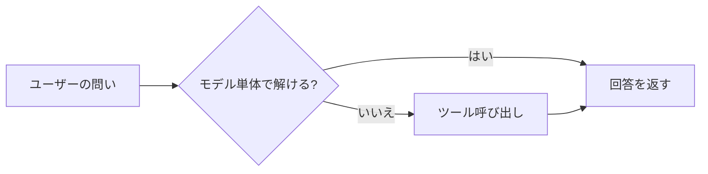
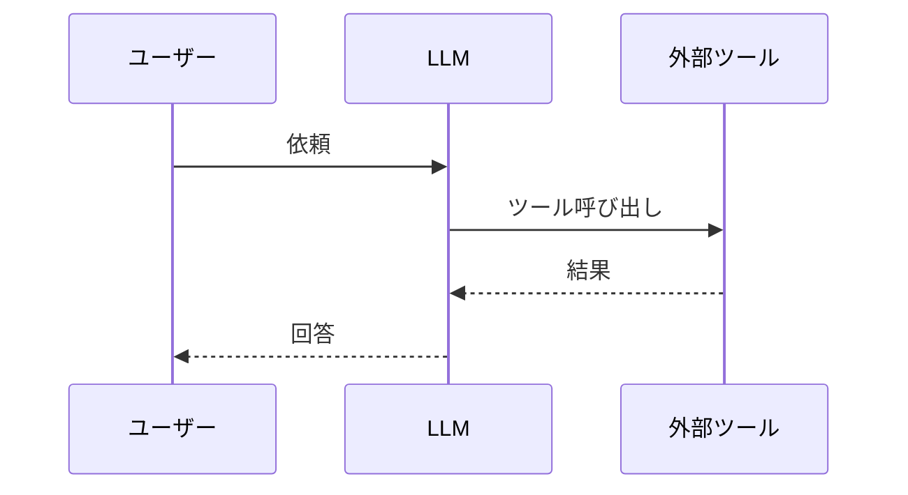

# 執筆ガイドライン

「awesome docs ai works」へようこそ。ここは、非エンジニアの社会人（ただし、ITリテラシーはそれなりにある人）を読者に想定し、生成AIツール群の使いどころを解説するドキュメント置き場です。

書き手の方向がバラバラだと、読者は地図を持たずに森へ迷い込むことになります。本ガイドは、そうならないように全章で共通して守っておきたいルールをまとめたものです。

## このガイドの対象

- 本リポジトリの各章（`docs/*.md` および `docs/appendix-*.md`）を執筆する人
- 既存章の改善をプルリクエストで入れるレビュアーと寄稿者

## 想定読者像

どの章にも通底する読者像です。執筆中は、この人が肩越しに読んでいる前提で書きましょう。

- IT／インターネット企業で働く非エンジニア
- 日常的にGoogle WorkspaceやSlackを業務で使っている
- 「APIを叩く」「関数を書く」といった前提は置かない
- 「ちょっと難しそうな単語でも、意味が分かれば使ってよい」くらいの温度感

章の冒頭では、この想定を前提にします。誰に向けて、何の疑問を解く章なのかを最初に明示しましょう。

## 情報の鮮度

生成AI界隈は、ビール瓶の賞味期限より早く仕様が変わります。過去の知識で書き切らず、毎回一次ソースに当たる前提でお願いします。

- 仕様・料金・利用規約・画面の記述は、必ず公式ドキュメントまたは公式発表を一次ソースにする
- 参照した日付を「最終確認： YYYY-MM-DD」の形で本文末または該当セクション末に書く
- 記憶や経験則だけで「たぶんこう動くはず」と書かない。書くときは、経験則である旨を明示する
- モデル名・バージョン名は、執筆時点の公式表記をそのまま使う

## 用語表記の統一

表記揺れは地味に読者のスタミナを奪います。基本方針として、本書の共通用語は `prh.yml` で機械的にそろえます。

<!-- textlint-disable prh -->
- 「生成AI」（「生成系AI」は不可）
- 「Google Workspace」
- 「Claude」「Claude Code」（`ClaudeCode` や小文字の `claude` は矯正される）
- 「Gemini」
<!-- textlint-enable prh -->

新しい用語を複数章で使い始めるときは、自分の好みでそろえず、`prh.yml` にルールを足すPRを別立てで出してください。後続の執筆者が迷わずに済みます。

## Lint運用

手元での確認と、PRに対するCIの二段構えです。

- 書き終えたら `npm install` のうえ `npm run lint` を実行する
- PRを開くとGitHub Actionsがtextlintとmarkdownlintを走らせ、警告はインラインコメントで返ってくる
- 現状 `level: warning` でマージはブロックされないが、見えているものは原則つぶす
- 自動修正できるものは `npm run lint:fix` でまとめて直せる

```bash
npm install
npm run lint
npm run lint:fix
```

## ファイル名とH1見出しの規約

- 章ファイル： `docs/<番号>-<英小文字ハイフン区切り>.md`（例： `docs/3-external-system-integration.md`）
- 付録ファイル： `docs/appendix-<英小文字ハイフン区切り>.md`
- H1はファイル冒頭に1つだけ。章タイトルと完全一致させる
- H1の例： `# 3. 外部システムとの接続: ツール呼び出しの仕組み`
- H2以降に節番号（`## 3.1 ...`）は基本付けない。GitHub上での閲覧性と、将来の章順入れ替えを優先する

## 章の骨格テンプレート

新しい章は、下の骨格から書き始めると迷いません。骨格はあくまで目安なので、章の性格に合わせて適宜削ってください。

```markdown
# <番号>. <章タイトル>

<リード文: この章を読むことで解ける疑問を、2〜4文でまとめる>

## 対象読者と前提

- <この章で前提になる知識>
- <前の章への軽い参照>

## <本題のセクション>

<本文 / 箇条書き / 表 / 図>

## まとめ

- <この章の「1行で言える」持ち帰り>

## 参考

- <一次ソースのURL>（最終確認: YYYY-MM-DD）
```

## 表と図の活用

平均的な読者は、5行以上の平坦な文章から情報を拾うのが苦手です（正直、我々もそうです）。整理できる情報は、早めに表か図へ逃がしましょう。

### 表

比較や選択肢の整理に有効です。

| 用途 | 向いている題材の例 |
| ---- | ---- |
| サービス比較 | 入力コスト、連携先、主要機能の対比 |
| 判断フロー | 「個人向けか組織向けか」などの分岐整理 |
| 設定値 | 推奨値とデフォルト値の対比 |

### 図は Mermaid で書く

GitHubのMarkdownはMermaidをそのままレンダリングしてくれます。画像の差し替えが不要なので、第一選択はMermaidです。

フローチャートの例です。



シーケンス図の例です。



Mermaidで表現しきれない場合（実画面のスクリーンショットや詳細なネットワーク構成図など）に限り画像へフォールバックし、`docs/images/<章番号>-<名前>.png` の規約で配置します。

## 文体ルール

- 本文はです・ます調で統一する
- 1文は120字以内に収める（textlintで検知される）
- 箇条書きは1行1ネタとし、読点で複数の情報を詰め込まない
- カタカナ語は一般的な表記に寄せる（「インターフェース」「ユーザー」など）
- ジョークはスパイスとして2章に1回程度、読者を置き去りにしない範囲で使う

## コマンドと画面操作の表記

- コマンド例はコードブロックで囲み、言語指定は `bash` で統一する
- 画面操作の手順は「メニュー名 → ボタン名」の順で書く（例：「設定」→「拡張機能」→「Gemini」）
- スクリーンショットは賞味期限が短い。キャプションで画面の要点を補い、古くなっても意味が通るようにする

## コミットとPR

- 章単位で細かめにコミットし、PRは「1章に対する加筆」を基本サイズにする
- PRタイトルは日本語・英語のどちらで書いてもよい。本文に「変更の要点」と「確認方法」を書く
- Lintが警告まみれのままのPRは原則マージしない

## よくある落とし穴

- 古いモデル名やUIが残ったまま公開される → 最終確認日付の運用で早期に発見する
- スクリーンショット依存 → テキスト手順を先に書き、画像は補助に回す
- 章の独立性が高すぎて流れが切れる → リード文と前後章への参照を忘れない

---

ここまで守れば、章ごとのバラつきは十分に小さくなります。残りの魔法は、書き手それぞれの個性です。肩の力を抜いて、楽しんで書いてください。
