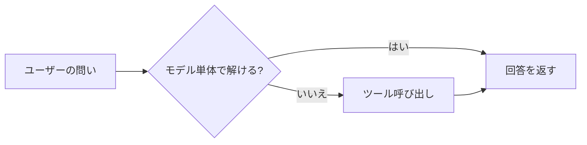

# 執筆ガイドライン

「awesome docs ai works」へようこそ。ここは、非エンジニアの社会人（ただし、ITリテラシーはそれなりにある人）を読者に想定し、生成AIツール群の使いどころを解説するドキュメント置き場です。章の執筆と改稿は、人とAIの両方が担います。

書き手ごとに方針がバラバラだと、読者は章ごとに読み方を切り替えさせられて疲弊します。本ガイドは、そうならないために全章で共有する方針をまとめたものです。

旧版のガイドは「避けたい言い回し」の列挙を中心にしていました。この方式には実際に運用して分かった限界があります。語を1つ封じても、同じ役割を担う近くの語が選ばれるだけです。そして、リストにない新しい癖は、そのあいだにも章をまたいで育ちます。実例を2つ挙げます。点検リストを全部すり抜けたまま、「入口」は47回、「位置づけ」は43回も繰り返されていました。また、効果断定を一括で「〜しやすくなります」に置き換えた章では、今度はその語尾が連鎖を始めました。

そこで本版は、構成を3層に改めます。言い回しの列挙は、人が覚える規範からツールの設定へ移します。人が覚えるのは、目指す文章の姿と、そこへ至る工程だけにします。

| 層 | 内容 | 主に使うタイミング |
| ---- | ---- | ---- |
| 目指す文章 | 声、主張と根拠の結び方、比喩の扱い | 書く前に読む |
| 執筆の工程 | 構造 → 文章化 → 通読の3工程と、AIでの役割分担 | 書く前と書いている間 |
| 規約と検出 | 章の規約、量の目安、lintと文体統計ツール | 書いている間と書いた後 |

## このガイドの対象

- 本リポジトリの各章（`docs/*.md` および `docs/appendix-*.md`）を執筆する人とAI
- 既存章の改善をプルリクエストで入れるレビュアーと寄稿者

## 想定読者像

どの章にも通底する読者像です。執筆中は、この人が肩越しに読んでいる前提で書きましょう。

- IT／インターネット企業で働く非エンジニア
- 日常的にGoogle WorkspaceやSlackを業務で使っている
- 「APIを叩く」「関数を書く」といった前提は置かない
- 「ちょっと難しそうな単語でも、意味が分かれば使ってよい」くらいの距離感

この読者は、生成AIを道具として便利に使いたい人であって、システムを運用・管理したい人ではありません。章の冒頭では、誰に向けて、何の疑問を解く章なのかを最初に明示します。

## 目指す文章

### この文書の声

全章で共有する書き手の立ち位置です。語彙の規則ではなく、判断に迷ったら立ち返る軸として使います。

- 道具をフラットに扱う。売り込みも、不安を煽る注意喚起もしない。事実・条件・利用場面で語る
- 読者の代わりに感動したり、怖がったり、納得したりしない。対象側で起きることを書けば、判断は読者ができる
- 結論を先に置き、根拠と例で支える。1文は1主張に絞る
- 効果や評価には、必ず条件か根拠を添える。添えられないなら、その文はまだ書ける段階にない
- 説明は前進させる。前の段落と同じことを別の言葉で繰り返す段落は、削るか、新しい情報を持たせる

### 見本

抽象的な規則より、実際の文のほうが多くを伝えます。本リポジトリの本文から、声の手本になる箇所を2つ引きます。

> 押さえておきたいのは、AI本体はネットワークに出ていない点です。AIは依頼文を出力するだけで、実際にネットワークへ出ていくのは外側のプログラムです。客がレストランで厨房に直接行かず、店員にオーダー票を渡す関係に対応します。客がユーザー、店員がAI、オーダー票がツール呼び出しの依頼文、厨房が外部ツールにそれぞれ対応します。（4章）

事実の言い切り → 比喩 → 対応関係の明示、という順で進みます。比喩が装飾ではなく、直前に言い切った事実の構造を読者の頭に固定する仕事をしています。対応関係を1文で全部書いているため、読者が推測で補う部分がありません。

> 棄権は、明示的に許可されない限り選ばれにくい振る舞いです。（中略）利用者の側で「分からないときは分からないと書いてよい」と明示すると、棄権の選択肢を取りやすくなります。（6章）

効果（取りやすくなる）を、条件（明示すると）および仕組みの説明とセットで書いています。誇張や断定をせずに、読者が行動に移せる具体性を保っています。

新しい章を書くときは、声のアンカーとして既存章を1〜2本通読してから始めると、文がそろいやすくなります。

### 主張と根拠の結び方

「AIっぽい」と感じられる文の多くは、語彙ではなく、主張と根拠の距離に問題があります。原則は3つです。

1. 根拠が直前にあるなら、言い切ってよい
2. 根拠を添えられない効果は、語尾を弱めるのではなく、根拠を当てるか削る
3. 読者の主観は先回りせず、対象側で起きることを書く

1つ目は、事実の言い切りまで禁じる趣旨ではない、という確認です。「経路が一本減ります」のような記述は、条件が直前に示されていれば断定で構いません。すべての語尾をぼかすと、今度はぼかしの語尾が連鎖します。

書き直しでもっとも誤解されやすいのは2つ目です。「楽になります」を「楽になりやすくなります」に薄めても、根拠がない点は変わりません。直すべきは語尾ではなく、後述の工程1に戻って根拠を用意するか、文ごと削るかの二択です。

<!-- textlint-disable prh -->
3つ目は、「腹落ちするはずです」「迷いません」のように読者の内面を予告する書き方をやめて、対象側で何が起きるかを書く、という原則です。読者の理解の動きまで書きたくなったら、「〜という前提は共有しておきます」と文書側の宣言にとどめます。
<!-- textlint-enable prh -->

なお、事実として必須の手順（「送信前に必ず確認する」など）にのみ「必ず」を残します。

### 比喩の扱い

比喩は禁止しません。説明の骨格を担う比喩は採用し、装飾としての比喩は削ります。残すかどうかは次の3条件で判定し、3つすべてを満たすときに残します。

1. 目的が明示できる — 何を理解させるための比喩か、一文で言える
2. 対応関係が一貫している — 比喩側のA・Bが、説明対象のA'・B'と1対1で対応し、文中で追跡できる
3. 本文の主張に橋を渡している — 比喩の含意が、続く説明の補助になっている

<!-- textlint-disable prh -->
採用してよい例：「LLMは生成AIの中核にあたる頭脳です。頭脳が大量のエネルギーを必要とするように、LLMの稼働にも大量の電力を消費します」。目的（位置づけと電力消費を同時に伝える）、対応（頭脳→LLM、エネルギー→電力）、橋渡し（次段の電力の話に直結）の3点が成立しています。
<!-- textlint-enable prh -->

比喩を入れるときは、初出時に対応関係を1文で書きます。見本に引いた4章のオーダー票の段落が、その形です。

運用上の注意を3点添えます。

<!-- textlint-disable prh -->
- ツールの動作を身体語で描くと、同系の語彙（「触る」「腕と足」「入口」など）が章をまたいで連鎖しやすい。比喩を使う段落では、実行場所・通信経路・権限範囲のいずれかを平易な言葉で1度は直接書く
- 画面上の実体（ボタン、URL、表の列名）を指す語は比喩ではない。たとえば「入口」は、UI経路の列挙に使う分には機能的な用法として残してよい。概念の説明を運ばせ始めたら（「入口の性格が違う」のような形になったら）、「呼び出し方」「提供形態」「動作環境」など実体側の語に開く
- 比喩を削るときは、その比喩が担っていた役割（次段への橋渡し、読者の足場）を別の説明・図・対応関係で埋める。削っただけで段落を宙に浮かせない
<!-- textlint-enable prh -->

## 執筆の工程

文体の問題に見えるものの大半は、実は構造の問題です。同じ形の節が10個並ぶ。節の締めに同じ定型文が15回現れる。主張のない段落が決まり文句で埋まる。いずれも、語彙を直しても解決しません。節に固有の主張がなければ、何語に置き換えても決まり文句が呼ばれるからです。

そこで、構造の決定と文章化を別の工程に分けます。分けると、それぞれの品質を独立に確認でき、AIに書かせる場合はこの分離がそのまま役割分担になります。

### 工程1: チャプタープラン（構造）

文章を書き始める前に、章のプランを作ります。プランは箇条書きで構いません。次を含めます。

- この章が解く読者の疑問（1〜3個）
- 各節について：節タイトル（＝結論）、その節の主張1文、主張に当てる材料（事実・例・表・図・参照）、形式（段落中心／表＋補足／番号付き手順）、軽重（しっかり書く節か、短く流す節か）
- 用語の初出位置と、前後章への参照
- この章で扱わないことのリスト

プランの段階で確認すべきことが1つあります。同じ形式・同じ軽重の節が3つ以上並んでいたら、構造の問題としてここで崩します。並列の機能紹介でも、重要な節は厚く、軽い節は表を畳んで短く、と強弱を付けます。文章化の後から強弱を付け直すのは、最初から設計するより高くつきます。

### 工程2: 文章化

プランに沿って、節ごとに本文を書き起こします。守ることは4つです。

- プランの主張だけを書く。書きながら思いついた主張は、本文に足さずプランへ差し戻して、構造ごと判断する
- 形式と軽重はプランに従う。隣の節と同じ組み立て・同じ締め方を繰り返しそうになったら、文章化を中断して工程1に戻る
- 「この文書の声」と、指定された声のアンカー章に文をそろえる
- 節の終わりは、次の節への手渡しか、事実の言い切りで閉じる。「〜できれば十分です」のような汎用の締め文は、章内で同じ型を繰り返さない

プランが具体的であるほど、文章化に要する判断は小さくなります。この性質は、AIで執筆する場合に効いてきます（後述）。

### 工程3: 通読と推敲

章全体を、読者として頭から読みます。一次評価は次の2問だけです。

- 説明は前進しているか（各節は、前の節が言っていないことを言っているか）
- 流れは自然か（読者の注意が途切れる箇所、推測で補わされる箇所はないか）

そのうえで機械検査を回します（`npm run lint` と `npm run style:stats`、詳細は後述）。検出された箇所を直すときは、段落または節の単位で書き直します。語句の差し替えは、置換語の新しい連鎖を生むだけで、構造の問題を温存します。ルールへの準拠は二次評価であり、一次評価はあくまで上の2問です。

### 既存章の改稿

既存章を直すときも、同じ工程を逆向きに踏みます。

1. 現行章から各節の主張を1文ずつ抜き出し、プランを復元する
2. 主張が立たない節、同型が並ぶ節は、構造の問題としてプラン側で直す
3. 直した構造に沿って、該当の節を書き直す（工程2と同じ規律で）
4. 章全体を通読する（工程3）

指摘一覧から直す場合も、引用文をアンカーに該当箇所を特定したうえで、節として読み直してから書き直します。行番号はずれている前提で扱います。

### AIで執筆する場合の役割分担

工程の分離は、AIの構成にそのまま対応させられます。

| 工程 | 担当 | 理由 |
| ---- | ---- | ---- |
| 工程1: プラン | もっとも判断力の高いモデル（または人） | 章の品質の大半はここで決まる。構造の判断は局所では下せない |
| 工程2: 文章化 | 標準的なモデルのサブエージェントで足りる | プランが判断を済ませているため、残る作業は声に沿った文章化に絞られる |
| 工程3: 通読 | プランを作った側に戻す | 構造の意図を知っている側でないと、ずれを検出できない |

一発の長文生成では、構造の判断と文章の判断が同時に走り、モデルは自分が直前に書いた節の形を引き写しながら進むため、強いモデルでも同型の反復に流れます。プランを先に固定し、文章化はプランに対して行う（隣の節の文に対してではなく）ことで、この反復を断ちます。

この進め方は `.claude/skills/chapter-writing` のスキルに手順として落としてあります。Claude Codeで章を書く・改稿する場合は、そちらを起点にしてください。1つのセッションで全工程を進める場合も、工程の区切りは守ります。

## 章の規約

### ファイル名とH1見出し

- 章ファイル： `docs/<番号>-<英小文字ハイフン区切り>.md`（例： `docs/04-external-system-integration.md`）
- 付録ファイル： `docs/appendix-<英小文字ハイフン区切り>.md`
- H1はファイル冒頭に1つだけ。章タイトルと完全一致させる（例： `# 4. 外部システムとの接続: ツール呼び出しの仕組み`）
- H2以降に節番号（`## 3.1 ...`）は基本付けない。GitHub上での閲覧性と、将来の章順入れ替えを優先する

### 章の骨格テンプレート

新しい章は、下の骨格から書き始めると構成で迷いにくくなります。骨格は目安なので、章の性格に合わせて適宜削ってください。

```markdown
# <番号>. <章タイトル>

<リード文: この章を読むことで解ける疑問を、2〜4文でまとめる>

## 対象読者と前提

- <この章で前提になる知識>
- <前の章への軽い参照>

## <本題のセクション>

<本文 / 箇条書き / 表 / 図>

## まとめ

- <この章の「1行で言える」持ち帰り>

## 参考

- <一次ソースのURL>（最終確認: YYYY-MM-DD）
```

節と章のつなぎ方は、次のルールでそろえます。

- **節タイトル＝結論**にする。節の冒頭で「結論を先に言うと」のようにあらためて結論宣言する形は、節タイトルと二重化するため避ける
- 「まとめ」の各点は事実1個に絞り、「次は〜で扱います」を入れる場合は1文だけにする
- 章冒頭の「前章では〜していただきました」式の振り返りは置かない。「対象読者と前提」の箇条書きの中で、前章の参照を1〜2行で示す
- リード文と前後章への参照を忘れない。章の独立性が高すぎると、読者の流れが切れる

### 表と図

平均的な読者は、5行以上の平坦な文章から情報を拾うのが得意ではありません。比較・選択肢・設定値のように整理できる情報は、早めに表へ分離します。

図の第一選択はMermaidです。GitHubのMarkdownがそのままレンダリングするため、画像の差し替えが要りません。



Mermaidで表現しきれない場合（実画面のスクリーンショットなど）に限り画像へフォールバックし、`docs/images/<章番号>-<名前>.png` の規約で配置します。スクリーンショットは賞味期限が短いため、テキスト手順を先に書き、画像は補助に回します。

### 文体ルール

- 本文はです・ます調で統一する
- 1文は120字以内に収める（textlintで検知される）
- 箇条書きは1行1ネタとし、項目末は「である」調または体言止めに揃える。本文のです・ます調と混在すると、textlintの`no-mix-dearu-desumasu`がエラーを出す
- カタカナ語は一般的な表記に寄せる（「インターフェース」「ユーザー」など）
- 本書全体を指すときは「本ドキュメント」を用いる（書籍ではないため「本書」は使わない）
- 「筆者」「私」などの一人称は主語に立てない。経験則は「経験則として〜」「一般的に〜」などの宣言形に寄せる
- ジョークはスパイスとして2章に1回程度、読者を置き去りにしない範囲で使う
- コマンド例はコードブロックで囲み、言語指定は `bash` で統一する。画面操作の手順は「メニュー名 → ボタン名」の順で書く

### 太字の運用

太字は、語順・文の作り・節タイトルで強調しきれない場合の最終手段です。用途は次の2つに限定します。

- **定義された用語の初出** — 章が以後ずっと使う術語を初出時に1度だけ太字にする。同じ語の2度目以降は太字にしない
- **見出しでは拾えない短い対比語** — 表や箇条書きの項目名で、対比軸の語そのものを最小限に強調する場合

文中の動詞・形容詞・節の太字化、「ここが重要」を示すための太字、1段落に複数の太字、引用ブロック内の太字は使いません。太字を入れる前に「節タイトルに昇格できないか」「文を2文に割って語順で前置できないか」を一度自問します。

## 量の目安

数えられる上限は、書き直しの議論を短くします。超えていたら節の組み立てを見直すサイン、として使ってください。

| 対象 | 目安 |
| ---- | ---- |
| 比喩 | 1章に1〜2本。初出時に対応関係を1文で書く |
| 太字 | 1節に0〜2箇所 |
| まとめ | 4点以内。1点に事実1個 |
| 1文の長さ | 120字以内 |
| 同じ形式・軽重の節 | 連続2節まで。3つ以上並ぶならプランに戻る |
| 節締めの同型文 | 同じ型は章内1回まで |

## 機械による検出

冒頭で述べたとおり、言い回しの列挙は人の規範としては機能しませんが、既知の癖を機械的に見つける用途ではもっとも確実に働きます。列挙はツールに持たせ、検出結果を節単位の書き直しの素材にする、というのが本リポジトリの分担です。

検出は3層あります。

| 層 | ツール | 何を見つけるか |
| ---- | ---- | ---- |
| 規約 | textlint / markdownlint | 文長、混在文体、表記スペーシングなどの機械的規約 |
| 既知の癖 | prh（`prh.yml` / `prh-style.yml`） | 用語の表記揺れと、過去に特定済みの文体の偏り |
| 未知の反復 | `npm run style:stats` | まだ誰もリスト化していない反復の兆候 |

### Lintの運用

手元での確認と、PRに対するCIの二段構えです。

```bash
npm install
npm run lint
```

- PRを開くとGitHub Actionsがtextlintとmarkdownlintを走らせ、警告はインラインコメントで返ってくる
- 現状 `level: warning` でマージはブロックされないが、見えているものは原則解消する
- `prh-style.yml` の検出は注意喚起であり、ヒットしただけで置き換えない。根拠と紐付いた警告文や、3条件を満たす比喩は、段落単位で `<!-- textlint-disable prh -->` / `<!-- textlint-enable prh -->` に囲んで除外する
- `prh-style.yml` を読み込んだまま `npm run lint:fix` を流すと注釈語が本文に混入するため、文体系の修正は手作業で整える

### 文体統計（style:stats）

語を列挙しない検出層です。何が反復しているかを事前に知らなくても、反復そのものを測って報告します。

```bash
npm run style:stats            # docs配下すべて
npm run style:stats -- docs/13-claude.md   # 章を指定
```

報告するのは次の観点です。

- 章内の頻出語と、章をまたいで多用される語（「入口」47回型の連鎖の検出）
- 文末の型の反復（「〜しやすくなります」連鎖型の検出。語を問わず、同じ文末が並べば報告される）
- 節の冒頭文・締め文の型の重複（「Claudeには**X**機能があります」×3型、節末定型文型の検出）
- 節ごとの太字の数と、「まとめ」の点数（量の目安との照合）

出力は警告ではなく観測です。製品名や章の主題語が上位に来るのは正常なので、通読の2問（説明の前進と流れの自然さ）に照らして、直す必要があるものだけを選びます。直すと決めたら、語句置換ではなく節単位で書き直します。

### 新しい癖を見つけたら

通読やstyle:statsで新しい反復語・定型句を特定したら、自分の頭の禁止リストに足すのではなく、`prh-style.yml` に検出ルールを足すPRを別立てで出してください。知識は機械の層に蓄積し、人とAIは目指す文章と工程に集中する、という分担を保ちます。

## 症状カタログ

検出された表現を書き直すときの参照表です。書く前に暗記するリストではありません。各症状には根本原因があり、対処は表面の語ではなく原因側にあります。

<!-- textlint-disable prh -->
| 症状 | 例（Before → After） | 根本原因と対処 |
| ---- | ---- | ---- |
| 根拠と切り離された断定・効果 | 手戻りが減ります → 手戻りの少ない形でまとまります（条件付きで） | 根拠が手元にない。工程1に戻って根拠を当てるか、文を削る |
| 読者・書き手の主観の持ち込み | 腹落ちしやすくなります → 自分の体験に重ねて読み解きやすくなります | 読者の内面を描写している。対象側で起きることを書く |
| 利用者でない立場の語彙 | 誤爆の規模が大きくなる → 意図しない操作の影響範囲が大きくなる | 運用者・管理者の目線。読者は道具として使う人だと思い出す |
| 評価ラベルでの格下げ | 最後の手段として温存する → APIのないアプリを画面越しに操作したい場面で選ぶ | 利用場面の調査不足。場面で書けば読者が自分で判断できる |
| 比喩への寄りかかり・連鎖 | 入口の性格が違う → 動作環境と権限範囲が違う | 1個の比喩に章を運ばせている。実体（実行場所・経路・権限）を直接書く |
| 定型句・締め文の反復 | 〜と覚えておけば十分です（章内N回） → 節ごとに固有の手渡しで閉じる | 節に固有の主張がない。工程1に戻る |
| 特定部署名の代名詞化 | 情シスに確認 → 組織の相談先（担当部署や上長）に確認 | 観点（契約・データ取扱・権限）と相談先の混同。分けて書く |
<!-- textlint-enable prh -->

対象外として残すものも明記しておきます。

- 必須手順の「必ず」（送信前確認・出典確認など）
- 技術用語として確立した用法（「テストが通る」「ビルドが通る」など）
- 速度・費用・失敗パターンの事実記述と、具体的な根拠に紐付いた警告
- 表の列名やUI経路の列挙のような、画面上の実体を指す機能的な語

## 情報の鮮度

生成AI界隈は、月単位で仕様が変わる領域です。過去の知識で書き切らず、毎回一次ソースに当たる前提でお願いします。

- 仕様・料金・利用規約・画面の記述は、公式ドキュメントまたは公式発表を一次ソースとする
- 参照した日付を「最終確認： YYYY-MM-DD」の形で本文末または該当セクション末に書く
- 記憶や経験則だけで「たぶんこう動くはず」と書かない。書くときは、経験則である旨を明示する
- モデル名・バージョン名は、執筆時点の公式表記をそのまま使う

### 最終確認日の更新ルール

「最終確認」には、URLを実際に開いて、参照している情報がまだ生きていることを確かめた日を書きます。章本文の加筆・修正とは独立に扱います。

- 参考節のURLを追加・差し替え・削除したときは、触ったエントリの最終確認日を当日に更新する
- 章本文の中で参考URLに紐づく事実（料金・仕様・機能名など）を書き換えたときは、根拠のURLを開き直し、当該エントリの最終確認日を当日に更新する
- タイポ修正や表現のリライトなど、参考URLの妥当性に影響しない編集では最終確認日を動かさない
- URLを開いて確認していないのに日付だけ今日に差し替えるのは禁止（「確認した」の信頼性が崩れる）
- 章ごとに日付が混在するのは正常な状態。揃えること自体は目的ではない
- 半年〜四半期に一度を目安に、章横断で棚卸しPRを出し、全章の参考URLをまとめて再確認して日付を揃える（`.claude/skills/source-patrol` に手順がある）

## 用語表記の統一

表記揺れは、読み進めるうえでじわじわと読者の負担になります。本ドキュメントの共通用語は `prh.yml` で機械的にそろえます。

<!-- textlint-disable prh -->
- 「生成AI」（「生成系AI」は不可）
- 「Google Workspace」
- 「Claude」「Claude Code」（`ClaudeCode` や小文字の `claude` は矯正される）
- 「Gemini」
<!-- textlint-enable prh -->

新しい用語を複数章で使い始めるときは、自分の好みでそろえず、`prh.yml` にルールを足すPRを別立てで出してください。後続の執筆者が迷わずに済みます。

## コミットとPR

- 章単位で細かめにコミットし、PRは「1章に対する加筆」を基本サイズにする
- PRタイトルは日本語・英語のどちらで書いてもよい。本文に「変更の要点」と「確認方法」を書く
- Lintが警告まみれのままのPRは原則マージしない

---

ここまでが共有の方針です。工程を守り、検出をツールに任せれば、章ごとのバラつきはかなり抑えられます。残りの味付けは、書き手それぞれの個性です。肩の力を抜いて、楽しんで書いてください。
