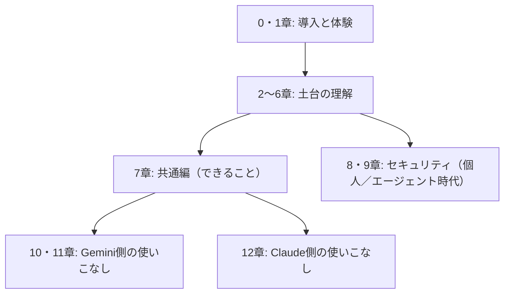

# オーバービュー: すごいAI時代の到来

「うちの会社でも、そろそろ生成AIを本気で使っていこう」。2026年のいま、この一言を聞かない週はないくらいです。本章は、本ドキュメントという森へ足を踏み入れる前に、全体の地図をお渡しするページです。どこに何があり、どの順番で歩けば迷わないかを、先に見通しておきましょう。

## 対象読者と前提

- IT／インターネット企業に勤める非エンジニアの人
- Google WorkspaceやSlackを普段使いしており、新しいツールへの抵抗がそれほどない人
- ClaudeやGeminiの名前に聞き覚えはあるが、業務で使いこなす手順までイメージできていない人

本書は「APIを書きましょう」「関数を定義しましょう」といった話からは離れて、**チャットUIや設定画面で触れる範囲**を入口にします。ブラウザでツールが開けて、社内のSlackで通知が受け取れれば、それで準備は完了です。

## 何が「すごい」のか

生成AIの記事には、だいたい「すごい」「革命」「ゲームチェンジ」という単語が並びます。正直、食傷気味になる気持ちもよく分かります。ただ、**読者の業務で何が変わったのか**という切り口で見ると、2026年時点の状況は「ひとつ前の世代とは違う」と言える段階まで来ています。

具体的には、次の3つが同時に進行しています。

- **入力** — ブラウザ、Slack、メール、ドキュメント、カレンダー。日々の業務画面のほとんどに、AIと会話する窓口が埋め込まれた
- **出力** — テキストだけでなく、表、スライド、簡単なWebアプリ（アーティファクト）までが、対話の延長で得られる
- **行動** — AIが外部ツールを自ら呼び、手を動かす（エージェント、コネクタ、MCP）モードが業務の選択肢に入った

感触としては、30年ほど前にメールが社内へ入ってきたときに近いかもしれません。最初は「便利なおもちゃ」扱いだったものが、気がつくとメールなしでは仕事が回らなくなっていました。**生成AIは、いまちょうど「便利なおもちゃ」を卒業しかけている段階**です。

## 本書で扱うこと／扱わないこと

期待値は先に合わせておきましょう。のちの章で「そういう話じゃなかったのか」とがっかりされるのがいちばん悲しいからです。

| 扱うこと | 扱わないこと |
| ---- | ---- |
| ClaudeとGeminiを**日々の業務で使い倒す**ための勘どころ | モデル研究の最前線（ベンチマーク比較やアーキテクチャ論） |
| コネクタ、エージェント、MCPといった現場の共通語 | AIに関する哲学的・倫理的な長大な議論 |
| 個人利用と組織利用で異なるセキュリティの勘どころ | 画像生成・動画生成・音声合成の詳細（別冊が必要な分量です） |
| 「ハルシネーション」「学習」など誤解されがちな言葉のほぐし方 | 特定プロダクトの全機能カタログ |

本書が狙うのは、読み終えたその週のうちに自分の業務へ取り込める範囲だけです。「とりあえず全部知っておきたい」という網羅志向は、読み切る前に仕様のほうが先に変わってしまうので、あえて追いません。

## 本書の歩き方

本編は12章構成、末尾に現場向けの付録が3本付きます。章はおおまかに4つのかたまりに分かれます。

はじめて読むときは、番号順がいちばん遠回りの少ない経路です。急ぐ読者のために、用途別の最短ルートも用意しました。

| 目的 | おすすめ順路 |
| ---- | ---- |
| まず触ってみたい | 1章 → 7章 → （関心に応じて10章または12章） |
| 社内導入の判断材料がほしい | 2章 → 4章 → 8章 → 9章 |
| エージェント運用を始めたい | 3章 → 6章 → 9章 → 付録「Claude Code」 |

付録3本は、本編から少し離れた道具箱です。「Claude Code」は開発者寄りの入口、「デスクトップの自動化」は自席PCの繰り返し作業、「ワークフローツール」はZapierやn8nとの合わせ技に触れます。本編を読み終えてから、必要になったタイミングで覗いてください。

## 小さな期待値調整

本書は、魔法の呪文集ではありません。生成AIは、プロンプトひとつで期待どおりの答えが毎回出てくるおみくじではなく、適切に段取りを組んだときだけ頼れる相棒です。以下の3点は、本書を通じて繰り返し出てきます。

- 便利さと引き換えに、ハルシネーション（もっともらしい嘘）は必ず残る
- コネクタやエージェントは強力だが、「どこに何を渡したか」の設計が甘いと事故につながる
- モデルや機能は四半期単位で入れ替わる。**定点観測の習慣**を前提に、本書でも各章末に「最終確認日」を明記する

このあたりは4章・5章・8章・9章で丁寧にほぐします。期待と恐れのどちらにも偏らず、**道具として冷静に付き合う**のが、本書を通して変わらない温度感です。

## まとめ

- 2026年の生成AIは、入力・出力・行動の3方向で「ひとつ前の世代」から踏み込んだ地点にある
- 本書は非エンジニア向けに、ClaudeとGeminiを**日々の業務で使いこなす**ことだけに焦点を絞る
- 章は「導入と体験 → 土台の理解 → 共通編と個別 → セキュリティ」の順に並び、急ぐ読者向けの最短ルートも用意した

## 参考

- Anthropic「Meet Claude」: <https://www.anthropic.com/claude>（最終確認：2026-04-23）
- Google「Gemini models」: <https://ai.google.dev/gemini-api/docs/models>（最終確認：2026-04-23）
- Model Context Protocol: <https://modelcontextprotocol.io/>（最終確認：2026-04-23）
