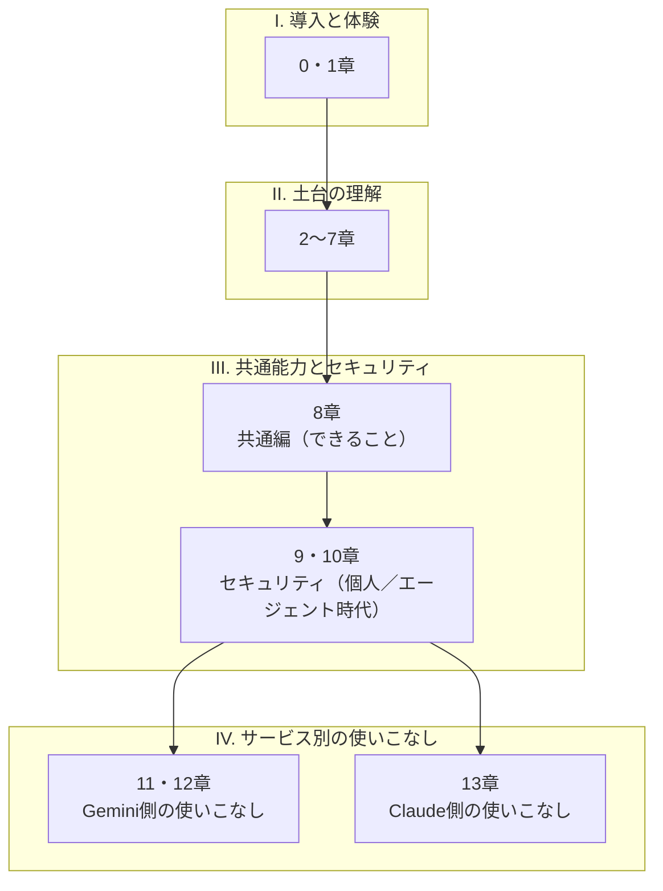

# 0. オーバービュー: 本ドキュメントの地図

本章は、本ドキュメント全体を読み進めるための地図です。章構成と読み順、本ドキュメントが扱う範囲と扱わない範囲、全章を通じて前提にしている考え方を、最初にまとめておきます。

## 対象読者と前提

- IT／インターネット企業に勤める非エンジニアの人
- Google WorkspaceやSlackを普段使いしており、新しいツールへの抵抗がそれほどない人
- ClaudeやGeminiの名前に聞き覚えはあるが、業務で使う手順までイメージできていない人

本ドキュメントは「APIを書きましょう」「関数を定義しましょう」といった話からは離れて、チャットUIや設定画面で触れる範囲を入口にします。ブラウザでツールを開き、社内のSlackで通知を受け取れる環境であれば、本ドキュメントの内容を試すための前提はそろいます。

## 2026年、生成AIは入力・出力・行動の3方向に広がった

本ドキュメントが想定する2026年時点の状況を、業務での触れ方の変化として整理します。生成AIの業務への組み込みは、次の3方向に同時に広がりました。

- **入力** — ブラウザ、Slack、メール、ドキュメント、カレンダーといった日常の業務画面のほとんどに、AIと会話する窓口が埋め込まれた
- **出力** — テキストだけでなく、表、スライド、簡単なWebアプリ（アーティファクト）までが、対話の延長で得られる
- **行動** — AIが外部ツールを自ら呼び、操作（エージェント、コネクタ、MCP）まで担うモードが業務の選択肢に入った

過去の生成AIブームと2026年時点とを分けるのは、この3方向への同時的な広がりです。本章以降では、3方向のそれぞれを章ごとに分けて扱います。

## 本ドキュメントで扱うこと／扱わないこと

本ドキュメントが対象とする範囲と、対象外とする範囲を表で示します。

| 扱うこと | 扱わないこと |
| ---- | ---- |
| ClaudeとGeminiを日々の業務で活用するための勘どころ | モデル研究の最前線（ベンチマーク比較やアーキテクチャ論） |
| コネクタ、エージェント、MCPといった現場の共通語 | AIに関する哲学的・倫理的な長大な議論 |
| 個人利用と組織利用で異なるセキュリティの勘どころ | 画像生成・動画生成・音声合成の詳細（別冊が必要な分量です） |
| 「ハルシネーション」「学習」など誤解されがちな言葉の整理 | 特定プロダクトの全機能カタログ |

本ドキュメントが狙うのは、読み終えたその週のうちに自分の業務へ取り込める範囲です。「とりあえず全部知っておきたい」という網羅志向は、仕様の更新速度に追いつきにくいため、本ドキュメントではあえて追いません。

## 本ドキュメントの歩き方

本編は1〜13章の構成で、本章（0章）はその地図にあたります。末尾には現場向けの付録が5本付きます。本編の章は、READMEの目次と同じI〜IVの4ブロックに分かれており、各ブロックの中で読み順がさらに分岐します。

はじめて読むときは、番号順がもっとも遠回りの少ない読み順です。目的別に最短ルートも示します。

| 目的 | おすすめ順路 |
| ---- | ---- |
| まず触ってみたい | 1章 → 8章 → （関心に応じて11章または13章） |
| 社内導入の判断材料がほしい | 2章 → 5章 → 9章 → 10章 |
| エージェントで自動化を始めたい | 4章 → 7章 → 10章 → 付録「Claude Code」 |

付録5本は、本編から少し離れた領域を扱います。並びは、日常業務寄り→開発寄り→技術解説寄りの順です。

- **ワークフローツール** — ZapierやMake、n8nといったSaaS連携のノーコードツールに生成AIを組み込むときの観点
- **デスクトップの自動化** — 自席のPC上で繰り返している手作業を生成AIに任せる選択肢の整理
- **Claude Code** — Claude製品群のうち、利用者のPC上で動作するCLIにあたり、許可した範囲のローカルファイル読み書きやコマンド実行までを担う
- **拡張検索と埋め込み検索** — RAG・Embedding・ベクトル検索・グラウンディングといった用語と仕組みの整理
- **ローカルLLM** — 提供事業者のクラウド以外で生成AIを動かす選択肢と、検討の動機の整理

本編を読み終えたあと、必要になったタイミングで参照する想定です。

## 本ドキュメント全体で参照する3つの前提

本ドキュメントは、生成AIを「プロンプトひとつで期待どおりの答えが毎回出る装置」としては扱いません。生成AIは、プロンプトと段取りに応じて結果の質が変わる道具です。次の3点は、5章・6章・9章・10章で順を追って整理します。

- 便利さと引き換えに、ハルシネーション（もっともらしい嘘）は現時点のモデルの性質上、一定量残り続ける
- コネクタやエージェントは強力ですが、「どこに何を渡したか」の設計が甘いと、意図しない情報の流出や操作の影響範囲が広がる
- モデルや機能は四半期単位で入れ替わる。新しい情報を折に触れて確認する前提で、本ドキュメントでも各章末に「最終確認日」を明記する

これら3点を、本ドキュメント全体を通じた共通前提として置きます。

## まとめ

- 2026年の生成AIは、入力・出力・行動の3方向で業務画面に組み込まれた
- 本ドキュメントは非エンジニア向けに、ClaudeとGeminiを日々の業務で活用する手順に焦点を絞る
- 章は「導入と体験 → 土台の理解 → 共通編 → セキュリティ → 個別の使いこなし」の順に並び、目的別の最短ルートも用意した

## 参考

- Anthropic「Meet Claude」: <https://www.anthropic.com/claude>（最終確認：2026-04-24）
- Google「Gemini models」: <https://ai.google.dev/gemini-api/docs/models>（最終確認：2026-04-24）
- Model Context Protocol: <https://modelcontextprotocol.io/>（最終確認：2026-04-24）
