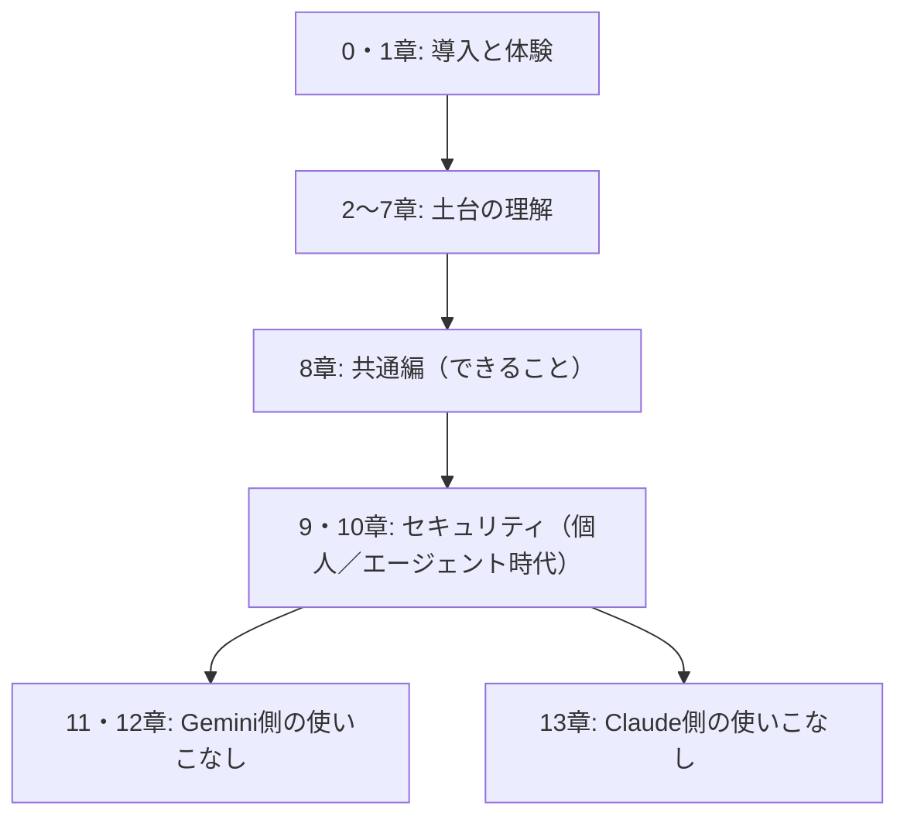

# 0. オーバービュー: 本ドキュメントの地図

「うちの会社でも、そろそろ生成AIを本気で使っていこう」。2026年のいま、この一言を聞かない週はないくらいです。本章は、本ドキュメントを読み進める前に渡しておきたい地図にあたります。どこに何が書いてあり、どの順に読むと遠回りが少ないかを、最初にお伝えします。

## 対象読者と前提

- IT／インターネット企業に勤める非エンジニアの人
- Google WorkspaceやSlackを普段使いしており、新しいツールへの抵抗がそれほどない人
- ClaudeやGeminiの名前に聞き覚えはあるが、業務で使いこなす手順までイメージできていない人

本ドキュメントは「APIを書きましょう」「関数を定義しましょう」といった話からは離れて、**チャットUIや設定画面で触れる範囲**を入口にします。ブラウザでツールが開けて、社内のSlackで通知が受け取れれば、それで準備は完了です。

## 2026年、何が変わったのか

生成AIの話題には「すごい」「革命」「ゲームチェンジ」といった見出しが並びがちです。ここではそうした枕言葉から一歩引いて、**読者の業務で何が変わったのか**という切り口で見ていきます。2026年時点の状況は、ひとつ前の世代とは質的に異なってきた、と言ってよさそうです。

具体的には、次の3つが同時に進行しています。

- **入力** — ブラウザ、Slack、メール、ドキュメント、カレンダー。日々の業務画面のほとんどに、AIと会話する窓口が埋め込まれた
- **出力** — テキストだけでなく、表、スライド、簡単なWebアプリ（アーティファクト）までが、対話の延長で得られる
- **行動** — AIが外部ツールを自ら呼び、手を動かす（エージェント、コネクタ、MCP）モードが業務の選択肢に入った

感触としては、30年ほど前にメールが社内へ入ってきたときに近いかもしれません。当初は「便利なおもちゃ」扱いだったものが、気がつくとメールなしでは仕事が回らなくなっていました。生成AIもちょうどそのあたりの位相にさしかかっています。

## 本ドキュメントで扱うこと／扱わないこと

期待値は先に合わせておきます。のちの章で「そういう話じゃなかったのか」となるのは、書き手としても残念な結果だからです。

| 扱うこと | 扱わないこと |
| ---- | ---- |
| ClaudeとGeminiを**日々の業務で使い倒す**ための勘どころ | モデル研究の最前線（ベンチマーク比較やアーキテクチャ論） |
| コネクタ、エージェント、MCPといった現場の共通語 | AIに関する哲学的・倫理的な長大な議論 |
| 個人利用と組織利用で異なるセキュリティの勘どころ | 画像生成・動画生成・音声合成の詳細（別冊が必要な分量です） |
| 「ハルシネーション」「学習」など誤解されがちな言葉の整理 | 特定プロダクトの全機能カタログ |

本ドキュメントが狙うのは、読み終えたその週のうちに自分の業務へ取り込める範囲です。「とりあえず全部知っておきたい」という網羅志向は、読み切る前に仕様のほうが先に変わってしまうため、本ドキュメントではあえて追いません。

## 本ドキュメントの歩き方

本編は1〜13章の13章構成で、本章（0章）はその地図役、末尾に現場向けの付録が3本付きます。章はおおまかに4つのかたまりに分かれます。

はじめて読むときは、番号順がいちばん遠回りの少ない経路です。急ぐ読者のために、用途別の最短ルートも用意しました。

| 目的 | おすすめ順路 |
| ---- | ---- |
| まず触ってみたい | 1章 → 8章 → （関心に応じて11章または13章） |
| 社内導入の判断材料がほしい | 2章 → 5章 → 9章 → 10章 |
| エージェントで自動化を始めたい | 4章 → 7章 → 10章 → 付録「Claude Code」 |

付録3本は、本編から少し離れた道具箱です。踏み込み深度の浅い順に並べており、「ワークフローツール」はZapierやn8nでのSaaS同士の橋渡し、「デスクトップの自動化」は自席PCの繰り返し作業、「Claude Code」は開発者寄りの入口に触れます。本編を読み終えてから、必要になったタイミングで覗いてください。

## 小さな期待値調整

本ドキュメントは、魔法の呪文集ではありません。生成AIは、プロンプトひとつで期待どおりの答えが毎回出てくる装置ではなく、段取りを組んで初めて期待どおりに働いてくれる道具です。以下の3点は、本ドキュメントを通じて繰り返し出てきます。

- 便利さと引き換えに、ハルシネーション（もっともらしい嘘）はつねに残り続ける
- コネクタやエージェントは強力ですが、「どこに何を渡したか」の設計が甘いと事故につながる
- モデルや機能は四半期単位で入れ替わる。新しい情報を折に触れて確認する前提で、本ドキュメントでも各章末に「最終確認日」を明記する

このあたりは5章・6章・9章・10章で順を追って整理します。期待と恐れのどちらにも偏らず、1つの道具として淡々と付き合う姿勢を、本ドキュメントを通して崩さずにいきます。

## まとめ

- 2026年の生成AIは、入力・出力・行動の3方向で「ひとつ前の世代」から踏み込んだ地点にある
- 本ドキュメントは非エンジニア向けに、ClaudeとGeminiを**日々の業務で使いこなす**ことだけに焦点を絞る
- 章は「導入と体験 → 土台の理解 → 共通編と個別 → セキュリティ」の順に並び、急ぐ読者向けの最短ルートも用意した

## 参考

- Anthropic「Meet Claude」: <https://www.anthropic.com/claude>（最終確認：2026-04-24）
- Google「Gemini models」: <https://ai.google.dev/gemini-api/docs/models>（最終確認：2026-04-24）
- Model Context Protocol: <https://modelcontextprotocol.io/>（最終確認：2026-04-24）
