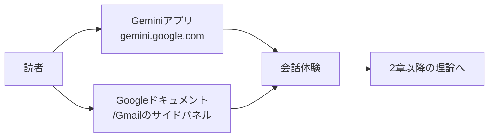

# 1. Google Workspaceで使えるGeminiを使ってみる (入門)

本章は、生成AIの理論を扱う前段のハンズオンです。Google Workspaceから呼び出せるGeminiを操作し、Geminiアプリ、Googleドキュメントのサイドパネル、Gmailの返信補助の3つを順に試します。続く理論章で扱う性質を、自分の手元の挙動と重ねて読めるようにすることが目的です。

## 対象読者と前提

- [0章](00-overview.md)で、本ドキュメントの章構成と前提に目を通した人
- Google Workspace（Gmail、Googleドキュメント、Googleスプレッドシートなど）を業務で日常的に使っている人
- 会社のアカウントでGeminiを有効化済み、または個人アカウントでGeminiのアプリを開ける人

会社アカウントでGeminiが見つからない場合は、組織のWorkspace管理者の設定で無効化されている可能性があります。その場合は、個人アカウントで本章を進めるか、組織側の有効化方針を確認したうえで本章に戻ります。

## Geminiから始めるのはアクセスの敷居がもっとも低いから

本ドキュメントは後半でClaudeも扱いますが、最初の章はGeminiから始めます。理由は次の3点です。

- Google WorkspaceやGoogleアカウントに紐付くため、追加のサインアップがほぼいらない
- GmailやGoogleドキュメントの右側に呼び出し口が組み込まれており、業務画面のままで試せる
- 単独のチャット画面、Workspace内のサイドパネル、モバイルアプリと、入口の選択肢が複数あり、入口の比較自体が学びになる

ブラウザひとつで試せる入口から入り、操作感を確認したうえで、後半の章でClaudeとの比較に入る順序で構成しています。

## Geminiの入口は3系統あり、本章では上の2つだけ使う

Geminiに話しかける場所は、大きく3系統に分かれます。名称は2026年4月時点のもので、UIは月単位で更新されるため、迷ったら[参考](#参考)のリンクから最新情報を確認してください。

| 入口 | 使う場面 | URLまたは場所 |
| ---- | ---- | ---- |
| Geminiアプリ | 真っ白な画面に、何でも相談する | `gemini.google.com` |
| Workspaceのサイドパネル | ドキュメントやメールを開きながら、その場で手伝ってもらう | GmailやGoogleドキュメント画面右上のGeminiアイコン |
| モバイルアプリ | 移動中の音声入力やカメラ入力 | iOS／Androidの「Google Gemini」アプリ |

本章では上の表のうち、Geminiアプリと、Workspaceのサイドパネルの2系統だけを扱います。モバイルアプリは、本章を終えたあとに必要に応じて試してください。



## ハンズオン1: Geminiアプリで「相談相手」を体験する

最初に試すのは、真っ白なチャット画面です。次の手順で、業務に関する短い相談を1件打ち込みます。

1. ブラウザで `gemini.google.com` を開く
2. 会社アカウントと個人アカウントを両方持っている場合は、画面右上のアイコンで、どちらのアカウントで話しているかを確認する
3. 入力欄に、業務に関する軽い相談を1件入力する

最初のお題は、次のテンプレートから選ぶと感触をつかみやすいはずです。難易度は低めから始めます。

- 「明日の営業会議のアジェンダを、15分・30分・60分の3パターンで箇条書きにして」
- 「この社内文書（本文を貼る）を、事情を知らない新人向けに3行で要約して」
- 「英語でカジュアルな『遅刻のお詫び』メールを3つ、トーン違いで下書きして」

回答が返ってきたら、続けて細かい注文を重ねます。「もう少しフォーマルに」「結論を先に」「表形式で」と段階的に修正していくと、生成AIの会話らしさが立ち上がります。一問一答で打ち切ると、チャット形式の特長はほとんど出ません。

### 確認しておくとよい挙動

- 同じ質問を2回投げると、返ってくる文章が毎回少し違う（偶然ではなく、生成AIの仕組み上の性質。[2章](02-what-is-generative-ai.md)で扱う）
- 「直前の回答の2つめを英語にして」のような指示で会話がつながる（直前までのやり取りを踏まえて応答する点が、チャット形式の中心）
- 新しいチャットを開くと、過去の会話はリセットされる（会話履歴の範囲は[7章](07-terminology.md)の「コンテキスト」につながる話題）

新しいチャットでは前の会話が引き継がれない、という挙動を一度試しておくと、以降の章で出てくる「コンテキスト」の説明を、自分の体験に重ねて読み解きやすくなります。

## ハンズオン2: Googleドキュメントのサイドパネルで下書きを作る

次は、業務アプリの内側に組み込まれたGeminiです。Geminiアプリとの違いは、並べて使うと見えてきます。

1. Googleドキュメントで新規ファイルを作る（ファイル名は「Gemini試し書き」など、なんでも構いません）
2. 画面右上のGeminiアイコン（星型のマーク）をクリックしてサイドパネルを開く
3. パネルの入力欄に、次の例のような依頼を入力する

依頼例です。

```text
来月のチーム合宿の告知メールを、以下の条件で下書きしてください。
- 対象: 所属チームのメンバー約20名
- 目的: 日程と申し込みフォームの案内
- トーン: 社内向けで、硬すぎず
- 分量: 200〜300文字程度
```

サイドパネルに生成された下書きには、「ドキュメントに挿入」ボタンが添えられます。押すと本文に反映され、以降は通常のGoogleドキュメントと同じ手順で編集できます。

### サイドパネルの利点

- 開いているドキュメントの内容を材料として渡せるため、「このドキュメントを3行に要約して」「タイトルを5案考えて」のような依頼が、コピー貼り付けなしで通る
- 編集画面とチャットが別ウィンドウに分かれないため、下書き、本文への反映、手直しまでを同じ画面で進められる
- 機密情報を別タブの外部チャットへ貼り付ける手間がなくなり、情報漏えいや誤送信の経路を減らしやすい

社外秘のドキュメントを扱う場合の作法は[9章](09-security-individual.md)で整理します。本章では、サイドパネルが業務画面から呼び出せる場所にある、という事実を確認できれば十分です。

## ハンズオン3: Gmailで返信のたたき台を作る

最後はGmailです。日常のやり取りはSlackなどに移っていても、社外との窓口としてはメールが残ります。Geminiの下書き機能は、件名と本文の初稿を短時間で生成するため、滞っている返信をまとめて処理する用途に向きます。

1. Gmailで返信したいメールを開く
2. 返信フォームを開き、ツールバーの「Geminiで下書き」相当のボタンを押す（ボタン名はUI更新で揺れる）
3. 短い依頼を入力する

依頼の例です。1〜2行で構いません。

```text
この件、来週水曜まで回答を保留したい旨を、丁寧に伝える返信
```

下書きが出たら、そのまま送信せず、必ず一度読み直します。Geminiは、依頼に書かれていないニュアンスを補って書き足すことがあります。社外宛のメールでは、意図にない約束を含んだ文面が紛れ込む経路になりかねません。

確認は次の3点に絞ります。

- 事実関係（日時、担当者名、固有名詞）が合っているか
- 約束していないことを勝手に約束していないか
- 相手との距離感に合ったトーンか

この3点を確認するだけで、初稿の多くはそのまま使える内容になります。

## ここまでの体験は2章以降で順に説明する

3つの入口を試すと、想定と違う挙動にいくつか出会うはずです。よく出会うものを、後続の章のどこで扱うかとあわせて並べておきます。

| 感じたこと | 実際に起きていること | どこで扱うか |
| ---- | ---- | ---- |
| 毎回答えが微妙に違う | 生成AIは確率的に次の単語を選ぶ | 2章 |
| さっき話したことを覚えていない | セッション（ウィンドウ）ごとに会話履歴がリセットされる | 7章 |
| 事実と違う文が混ざっていた | ハルシネーションと呼ばれる性質 | 6章 |
| 外のデータを見にいったように見える | コネクタやツール呼び出しの仕組み | 4章、8章 |

「答えが揺れる」「依頼にない話まで書く」のは、故障ではなく仕組み上の性質です。この前提で受け止めるところから、業務での付き合い方が決まります。

## 詰まったときは依頼の書き方を見直す

使い始めの段階でよく起きる詰まりどころを、対処と合わせて並べます。

- 日本語で頼んだのに英語で返ってくる場合は、依頼文の末尾に「日本語で」と添える。英語のほうが得意そうな文脈と判断されたときに起きる現象への対処
- 出力が途中で切れた場合は、「続けて」を入力して再開する。長い成果物は、章ごと・項目ごとに区切って依頼するほうが安定する
- 依頼のとおりに動かない場合は、「目的／対象読者／分量／トーン」を箇条書きで明示する。曖昧な依頼には曖昧な応答が返る
- 社内の独自用語で返してくれない場合は、サイドパネルから該当ドキュメントを材料として指定するか、略語の意味を依頼文に書き添える（Geminiは社内辞書を持たないため）

プロンプトの書き方は[8章](08-common-capabilities.md)で整理します。本章では、「依頼の書き方で応答が大きく変わる」という挙動を体験できれば目的を果たしたことになります。

## まとめ

- Geminiの入口は、Geminiアプリ／Workspaceのサイドパネル／モバイルアプリの3系統がある。最初の2つで入門には足りる
- 会話は段階的に修正を重ねる前提で組み立てる。一問一答ではチャット形式の特長は出ない
- 同じ質問に毎回少し違う応答が返るのは仕様。事実確認は人間の作業として残る
- Workspaceのサイドパネルは、業務画面から離れずに依頼でき、情報漏えい・誤送信の経路も減らせる

次は [2章（生成AIとは何か）](02-what-is-generative-ai.md) で、ここで体験した挙動の根拠となる仕組みを整理します。

## 参考

- Google「Gemini for Google Workspace」: <https://workspace.google.com/solutions/ai/>（最終確認：2026-04-24）
- Google「Geminiアプリを使ってみる」: <https://support.google.com/gemini/answer/13275745>（最終確認：2026-04-24）
- Google「GmailでGeminiを使う」: <https://support.google.com/mail/answer/14200580>（最終確認：2026-04-24）
- Google「GoogleドキュメントでGeminiを使う」: <https://support.google.com/docs/answer/14206696>（最終確認：2026-04-24）
