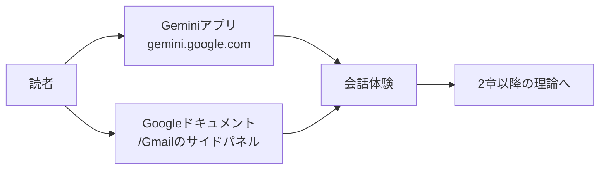

# 1. Google Workspaceで使えるGeminiを使ってみる (入門)

理屈の前に、まずは触りましょう。本章は、[0章](0-overview.md)でお渡しした地図を脇に置いて、最初の一歩を足踏みで終わらせないためのハンズオンです。Google Workspaceを普段使いしている皆さんなら、追加のインストールもほぼいらないまま、Geminiと30分ほど会話する体験まで進めます。

理論は[2章（生成AIとは何か）](2-what-is-generative-ai.md)以降でたっぷり扱います。ここでは「なるほど、こういう感触か」という**身体感覚**を先に掴んでもらうのが目的です。

## 対象読者と前提

- 0章を流し読みした人（全体像がうっすら頭に入っていれば大丈夫）
- Google Workspace（Gmail、Googleドキュメント、Googleスプレッドシートなど）を日々触っている人
- 会社のアカウントでGeminiを有効化済み、もしくは個人アカウントでGeminiのアプリが開ける人

会社アカウントでGeminiが見えない場合は、情シス部門の方針で無効化されていることがあります。そのときは個人アカウントで試すか、有効化の予定を社内に確認してから本章へ戻ってきてください。

## なぜGeminiから始めるのか

本書は後半でClaudeもたっぷり扱いますが、最初の章をGeminiにしているのには理由があります。

- **アクセスの敷居が低い** — Google WorkspaceやGoogleアカウントに紐付くので、追加のサインアップがほぼ不要
- **普段の業務画面から呼べる** — GmailやGoogleドキュメントの右側に、Geminiのパネルがすでに座っている
- **入口が何通りもある** — 単独のチャット画面、Workspace内のサイドパネル、Android／iOSのアプリ。入口の比較自体が学びになる

「まずはブラウザひとつで試せるもの」から入り、違和感や便利さを肌で感じてから、後半でClaudeと比較する。これが本書の流儀です。

## Geminiに触れる入口の全体像

Geminiに話しかける場所は、大きく分けて3つです。名称は2026年4月時点のものですが、UIは月単位で刷新されるため、迷ったら[参考](#参考)のリンクから最新情報をご確認ください。

| 入口 | 使う場面 | URLまたは場所 |
| ---- | ---- | ---- |
| Geminiアプリ | 真っ白な画面に、何でも相談する | `gemini.google.com` |
| Workspaceのサイドパネル | ドキュメントやメールを開きながら、その場で手伝ってもらう | GmailやGoogleドキュメント画面右上のGeminiアイコン |
| モバイルアプリ | 移動中の音声入力やカメラ入力 | iOS／Androidの「Google Gemini」アプリ |

本章では、上の表の**上から2つ**だけ使います。モバイルは、感覚を掴んだあとに各自で触るほうが早道です。



## ハンズオン1: Geminiアプリで「相談相手」を体験する

まずは真っ白なチャット画面です。仕事中に隣の席へ話しかけるように、気楽に打ち込みます。

1. ブラウザで `gemini.google.com` を開く
2. 会社アカウントと個人アカウントを両方持っている場合は、右上のアイコンで**どちらのアカウントで話しているか**を必ず確認する
3. 入力欄に、今日の業務に関する軽い相談を書く

最初のお題は、以下のテンプレートから選んでみてください。難易度は低いほど、感触が掴みやすいはずです。

- 「明日の営業会議のアジェンダを、15分・30分・60分の3パターンで箇条書きにして」
- 「この社内文書（本文を貼る）を、事情を知らない新人向けに3行で要約して」
- 「英語でカジュアルな『遅刻のお詫び』メールを3つ、トーン違いで下書きして」

回答が返ってきたら、**続けて細かく注文を付ける**のがコツです。「もう少しフォーマルに」「結論を先に」「表形式で」と重ねていくと、生成AIの会話らしさが一気に立ち上がってきます。一問一答で切り上げてしまうと、せっかく相談に乗ってくれる相手に、自己紹介だけさせて席を立つようなもったいない使い方になります。

### 確認してみてほしいこと

- **同じ質問を2回投げると、返ってくる文章がわずかに違う** — 偶然ではなく仕様（2章で扱う性質）
- **「この直前の回答の2つめを英語にして」で会話がつながる** — 直前までの流れを覚えてくれるのがチャットの肝
- **新しいチャット（左上の「新規」相当）を開くと、過去の会話はリセットされる** — 履歴の範囲は[6章](6-terminology.md)の「コンテキスト」につながる話題

ここで、「30分前に話していた内容がふっと消える」ような感覚を味わっておくと、以降の章の吸収が早くなります。

## ハンズオン2: Googleドキュメントのサイドパネルで下書きを作る

次は、業務アプリの内側に埋め込まれたGeminiです。Geminiアプリとの違いを、並べると見えてきます。

1. Googleドキュメントで新規ファイルを作る（ファイル名は「Gemini試し書き」など、なんでも可）
2. 画面右上の**Geminiアイコン**（星型のマーク）をクリックしてサイドパネルを開く
3. パネルの入力欄に、以下のような依頼を書く

依頼例です。

```text
来月のチーム合宿の告知メールを、以下の条件で下書きしてください。
- 対象: 所属チームのメンバー約20名
- 目的: 日程と申し込みフォームの案内
- トーン: 社内向けで、硬すぎず
- 分量: 200〜300文字程度
```

サイドパネルに生成された下書きには、「ドキュメントに挿入」ボタンが添えられます。押すと本文に流し込まれ、あとは通常のGoogleドキュメントと同じように編集できます。

### サイドパネルならではの便利さ

- **開いているドキュメントの内容を材料にできる** —「このドキュメントを3行に要約して」「タイトルを5案考えて」が即座に効く
- **編集画面とチャットが分断されない** — アプリを行き来する必要がなく、下書き→本文反映→手直しがワンストップで進む
- **コピペ事故が減る** — 機密情報を別タブに貼り付けて他人に見られる、といった軌道外れが起きにくい

社外秘のドキュメントを扱う場合の作法は[8章](8-security-individual.md)で整理します。ここでは、まず「サイドパネルが意外と近い場所にある」という事実を体感してください。

## ハンズオン3: Gmailで返信のたたき台を作る

最後は、毎日いちばん開いているであろうGmailです。Geminiが下書きを手伝ってくれる機能は、件名や本文の初稿を**数秒で**出してくれるので、返信が滞っているメールをまとめて片付けるのに向いています。

1. Gmailで返信したいメールを開く
2. 返信フォームを開き、ツールバーの**「Geminiで下書き」**相当のボタンを押す（UIの表現は環境によって揺れる）
3. ふんわりした依頼を入力する

依頼の例です。短くて構いません。

```text
この件、来週水曜まで回答を保留したい旨を、丁寧に伝える返信
```

下書きが出たら、そのまま送信せずに**一度読む**のが肝心です。Geminiは、依頼に含まれないニュアンスを想像で足すことがあります。社外の相手に宛てたメールで、そのまま出すと「え、そんなこと約束したっけ」と後でお互いに首を傾げるような文面が紛れ込むこともあります。

- 事実関係が合っているか（日時、担当者名、固有名詞）
- 約束していないことを勝手に約束していないか
- 相手との距離感に合ったトーンか

この3点を確認するだけで、初稿の7割くらいはそのまま活かせます。

## ここまでの体験をふり返る

3つ触ったら、思っていた感触と違った部分が必ずあるはずです。以下の表で、よく出会う「あれ？」を先回りしておきます。

| 感じたこと | 実際に起きていること | どこで扱うか |
| ---- | ---- | ---- |
| 毎回答えが微妙に違う | 生成AIは確率的に次の単語を選ぶ | 2章 |
| さっき話したことを覚えていない | セッション（ウィンドウ）ごとに記憶がリセットされる | 6章 |
| 事実と違う文が混ざっていた | ハルシネーションと呼ばれる性質 | 5章 |
| 外のデータを見にいったように見える | コネクタやツール呼び出しの仕組み | 3章、7章 |

「答えが揺れる」「勝手なことを言う」のは、壊れているのではなく**そういう道具**です。この事実と折り合いを付けることが、上手く付き合う最短ルートになります。

## うまくいかないときのヒント

触り始めの段階で、よく起きる詰まりどころを並べておきます。

- **日本語で頼んだのに英語で返ってくる** — 依頼文の末尾に「日本語で」と添える。AIが英語のほうが得意そうな文脈と判断してしまう現象への対処
- **出力が途中で切れる** —「続けて」と送るだけで再開できる。長い成果物は、最初から章ごと・項目ごとに区切って頼むほうが安定
- **依頼のとおりに動かない** —「目的／対象読者／分量／トーン」を箇条書きで明示すると命中率が上がる。曖昧な依頼には曖昧な回答が返るもの
- **社内の独自用語で返ってくれない** — Geminiは社内の辞書を持たない。サイドパネルから該当ドキュメントを材料として指定するか、略語の意味を依頼文に書き添える

プロンプトの書き方の理屈は[7章](7-common-capabilities.md)でまとめます。ここでは、「頼み方で返答が大きく変わる」という感覚が掴めれば、この章の目的はおおむね達成です。

## 次の章への橋渡し

ここまでで、Geminiという相棒と小さな会話を3つ重ねました。お疲れさまでした。このあたりで、「そもそもこの裏側では何が起きているんだろう？」という疑問が芽生えてきたら、ちょうど次の章の出番です。

- [2章（生成AIとは何か）](2-what-is-generative-ai.md) — いま体験した「会話する機械」の中身を噛み砕いた章
- [6章（用語について）](6-terminology.md) —「コンテキスト」「トークン」「プロンプト」など、本章の端々に出てきた言葉の辞書
- [7章（共通編）](7-common-capabilities.md) — ClaudeとGeminiを横並びで見る章。本章で触った「チャット」と「アーティファクト」の位置づけが明確になる

## まとめ

- Geminiの入口は、**アプリ／Workspaceサイドパネル／モバイルアプリ**の3系統があり、最初の2つだけでも入門には足りる
- 会話は**重ねて直す**のがコツ。一発で決めようとすると、生成AIの相棒力を引き出せない
- **同じ質問に違う答え**が返るのは仕様。事実確認は人間の仕事として残る
- Workspaceのサイドパネルは、普段の画面から離れずに手伝ってもらえる入口。コピペ事故も減らしやすい

## 参考

- Google「Gemini for Google Workspace」: <https://workspace.google.com/solutions/ai/>（最終確認：2026-04-24）
- Google「Geminiアプリを使ってみる」: <https://support.google.com/gemini/answer/13275745>（最終確認：2026-04-24）
- Google「GmailでGeminiを使う」: <https://support.google.com/mail/answer/14200580>（最終確認：2026-04-24）
- Google「GoogleドキュメントでGeminiを使う」: <https://support.google.com/docs/answer/14206696>（最終確認：2026-04-24）
