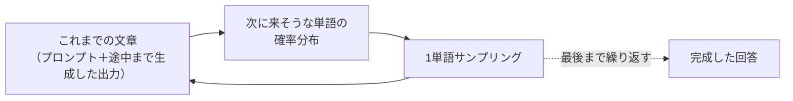
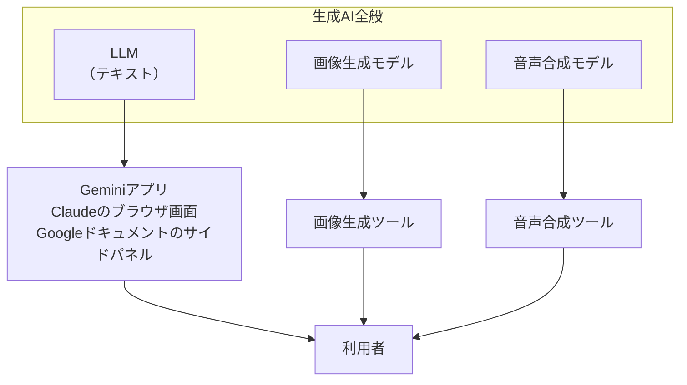
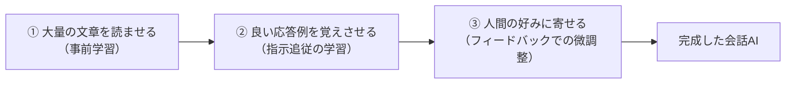

# 2. 生成AIとは何か

本章は、生成AIの中核にある計算を、「次の単語を確率で選び続ける」という見方から整理します。[1章](01-gemini-in-workspace.md)で観察した「毎回答えが違う」「前の話を覚えていない」「もっともらしい嘘が混じる」といった挙動は、この中核の計算からそのまま導かれる性質です。細かいメカニズムは後続の章で扱うため、ここでは全体像の輪郭としてまとめます。

## 対象読者と前提

- [1章](01-gemini-in-workspace.md)でGeminiを実際に操作したことがある人
- 「LLM」「生成AI」という言葉に聞き覚えはあるが、内部で何が起きているかはまだ整理できていない人
- 数式やコードを使わない説明を求めている人

本章で初めて登場する用語の定義は、[7章（用語集）](07-terminology.md)に集約してあります。本章は輪郭、7章は用語の定義、という役割分担です。

## LLMの中核は、次の単語を確率で選ぶ計算

生成AIの中核にあるのが、大規模言語モデル（Large Language Model、略してLLM）です。LLMが学習時に課されている主な目的を一文でまとめると、これまでの文章の流れから次にどの単語が続きそうかを確率で選ぶ、という計算です。チャット画面に出てくる回答は、この計算を何千回も繰り返して組み立てられています。

たとえば「マーク・トウェインの最後の名言は、」という途中までの文章を入力すると、続きの単語の候補を何百万もの語彙から確率で1個選びます。選んだ単語を文末に足し、同じ計算をもう一度行います。これを繰り返した結果が、画面に表示される整った日本語です。

処理の流れは次のとおりです。

LLMの中核にある計算はこのとおりです。実際にチャット画面で見ている応答は、この計算に、入力の整形・単語選びのランダムさの調整・人間からのフィードバックで身につけた応答傾向など、いくつもの要素が積み重なって出力されています。本章では個々の内訳には踏み込まず、「中核には次の単語を確率で選ぶ計算がある」という見方を、以降の説明の足場にします。なぜこの単純な計算の積み重ねから対話のような応答が成り立つのかは、研究者のあいだでも完全には解明されておらず、現在も研究が進んでいる領域です。

この確率計算は、**Transformer**と呼ばれるニューラルネットワークの構造の上で実装されています。中核に置かれているのが**アテンション**（self-attention、自己注意）と呼ばれる仕組みで、入力に含まれる各トークンが文脈中の他のどの位置をどれくらい参照するかを動的に重みづけし、次のトークンの確率分布の計算へつなげます。本ドキュメントは数式や層構成までは踏み込みません。記事や社内資料で出てくる「Transformerベース」「アテンション機構」という表現は、本節で扱った次トークン予測の計算を支える土台を指しています。Transformer以外のアーキテクチャも研究されていますが、現行の主要なLLMはおおむねTransformerを基盤にしています。

## モデルが扱う最小単位は「単語」ではなく「トークン」

正確には、モデルが扱う最小単位は単語ではなく**トークン**と呼ばれる単位です。文字よりは大きく、単語よりは細かい粒度で、英単語であればおおむね1個が1トークン、日本語であれば2〜3文字で1トークンに相当します。

日常の利用範囲では、トークン数を直接数える場面はそれほどありません。一方で、課金の単位や、一度にモデルへ渡せる文章量の上限（コンテキストウィンドウ）の単位として後の章で再登場するため、用語として押さえておきます。詳細は[7章（用語集）](07-terminology.md)を参照してください。

## 「生成AI」「LLM」「チャット画面」は3層で整理する

1章で操作したのは、正確には「Geminiというチャット画面」です。生成AI、LLM、チャット画面の3語は混同されがちですが、指している階層が違います。

| 呼び方 | 指しているもの | 具体例 |
| ---- | ---- | ---- |
| 生成AI | テキスト・画像・音声・動画など、何かを新しく作り出すAI全般の総称 | ChatGPT、Gemini、Claude、画像生成、音声合成 |
| LLM（大規模言語モデル） | そのうち文章の生成を担う中核の計算モデル | GPT-5、Gemini Pro、Claude Opus |
| チャット画面・アプリ | LLMに入力を渡し、応答を表示するアプリケーション | `gemini.google.com`、Claudeのブラウザ画面 |

図で表すと、次のように並びます。

本ドキュメントが主に扱うのは、図の左にあるLLMと、それを利用するチャット画面の組み合わせです。画像や音声の扱いは独立した章を設け、概要は[3章（マルチモーダル）](03-multimodal.md)で整理します。本章は文章生成の仕組みを軸に進めます。

## 「確率で次の単語を選ぶ」から、4つの挙動が直接導ける

ここまでの内容を踏まえると、1章で観察された4つの挙動は、それぞれ中核の計算から説明できます。

### 毎回答えが微妙に違う

同じ質問を2回入力しても、まったく同じ文面は返ってきません。確率分布からサンプリングしている以上、毎回同じ単語列が選ばれるとは限らないためです。サイコロを2回振って同じ目が出るとは限らないのと同じ原理です。

プロバイダによっては「温度（temperature）」という設定で、このランダムさを調整できます。値を下げると回答は安定しますが、無難な文面に寄りやすくなります。チャット画面では利用者側から温度を変更できない場合が多く、応答にある程度の揺らぎがある前提で使うことになります。

### さっき話したことを「覚えている」ように振る舞う

同じチャット内では、過去のやり取りを踏まえた応答が得られます。これは、モデル本体が記憶しているのではなく、画面の裏で、過去の発話をまとめて毎回もう一度モデルに渡しているためです。発話のたびに、それまでの会話ログを頭から読み直したうえで応答が生成されています。

一度に渡せる文章量には上限があり、これを**コンテキストウィンドウ**と呼びます。長大な資料を丸ごと入力すると、上限を超えた部分はモデルに渡らず、応答にも反映されません。この性質は[6章](06-hallucination-and-knowledge-literacy.md)・[7章](07-terminology.md)で再登場します。

### 新しいチャットを開くと、前の話を全部忘れている

新しいチャットでは、毎回モデルに渡していた会話ログが空の状態から始まります。モデル本体には、昨日の会話も、その前の1週間の打ち合わせも保持されません。会話の連続性を維持しているのはモデル側ではなく、画面の裏で会話ログを保持しているアプリ側の仕組みです。

メモを長期保存する仕組みは別途用意されており、各社の「メモリ機能」や「プロジェクト知識」がそれにあたります。「学習」という言葉との混同が起きやすい領域のため、[5章（「学習」というキーワードの誤解）](05-misunderstanding-learning.md)で、両者の区別と合わせて扱います。

### もっともらしい嘘をつく（ハルシネーション）

「確率で自然な続きを選ぶ」目的と、「事実を正しく答える」目的は異なります。一致する場面が多いため誤解されがちですが、モデルにとっての主な目的は自然な文章を生成することであり、生成された内容の真偽は直接の評価軸にはなっていません。

結果として、存在しない書籍を実在のように引用したり、実在の人物に架空の経歴を付与したりする現象が起きます。この性質は業務利用での要点となるため、独立した章として[6章](06-hallucination-and-knowledge-literacy.md)で集中的に扱います。

## 「人間っぽさ」は3段階の学習で形成される

中核にあるのは次の単語を確率で選ぶ計算ですが、これが対話で人間らしい応答に近づくのは、3段階の学習を経るためです。

各段階の役割は次の通りです。

- **① 事前学習** — インターネット上の記事、書籍、コードなど、人間が書いた膨大な文章を読ませる。この段階で、自然な文章がどう続くかを統計的に学習させる
- **② 指示追従の学習** — 望ましい応答のお手本（「こう聞かれたらこう答える」など）を人間が用意し、追加で学習させる
- **③ 人間の好みでの微調整** — 2つの応答のどちらが好ましいかを人間に選ばせ、その判断に応じて応答の傾向をさらに調整する

本ドキュメントではこれ以上の深追いはしません。以降の章では、LLMを「次の単語を確率で選ぶ計算を中核に、大量の文章での事前学習と、人間の好みに寄せる調整を経た対話システム」として扱います。

「ここに自分の入力した文章が混ざるのではないか」という疑問が浮かぶかもしれません。業務利用の経路では、入力した内容がモデル本体の重みに反映される現象は通常起きません。詳細と例外は[5章（「学習」というキーワードの誤解）](05-misunderstanding-learning.md)で扱います。

## 推論モデル（思考モード）は、回答前に内部で長く考える

2024年以降、各社のモデルには、応答を返す前にいったん内部で長めに考えてから回答を組み立てるモードが用意されるようになりました。**推論モデル**（reasoning model）、あるいは思考モードと呼ばれます。同じ「次のトークンを確率で選ぶ」計算の上に乗っていますが、利用者から見える応答の前に、内部で考察やステップ分解にあたるトークン列を多く生成します。その分、回答までに時間と費用はかかりますが、難問での精度が上がりやすい、という観察が共有されています。

通常モードと推論モードの対比を、観察ベースで整理すると次のとおりです。

| 観点 | 通常モード | 推論モード |
| ---- | ---- | ---- |
| 応答までの時間 | 短い（数秒台） | 長い（数十秒〜分単位になる場合がある） |
| 費用（API利用時） | 入出力トークン分のみ | 内部の思考分のトークンも課金対象になりやすい |
| 得意になりやすい題材 | 要約、言い換え、定型の下書き | 多段の数学、コード生成、厳密な手順の組み立て |

呼び名はプロバイダ・モデルごとに異なります。Claudeでは `extended thinking`、Geminiでは `Deep Think`、OpenAI系では `o`系列の推論モデルというように、表記がそろっていません。社内資料や外部記事を読むときは、これらが同じ系統の機能を指していると見ておくと、各社の比較を整理しやすくなります。各社のモデル並びでの位置づけは[11章](11-gemini-advanced.md)・[13章](13-claude.md)で扱います。

業務での使い分けの目安は、定型作業や下書きには通常モード、複数の条件をたどる検証や厳密な手順の組み立てには推論モード、という分け方です。費用と所要時間が増える分、すべての依頼を推論モードに切り替える必要はありません。

## 得意・苦手は仕組みから直接導ける

ここまでの内容を踏まえると、得意な作業と苦手な作業の傾向は、仕組みから直接導けます。

| 仕組み上の特徴 | 得意になりやすい作業 | 苦手になりやすい作業 |
| ---- | ---- | ---- |
| 自然な文章を生成する処理が中心 | 要約、言い換え、翻訳、ドラフト作成、トーン調整 | 厳密な四則演算、桁の多い計算 |
| 読み込んだ文章のパターンに沿って続きを選ぶ | 定型的な議事録、報告書、スライド骨子の下書き | 誰も書いたことがない新規の事実の検証 |
| 確率で自然な続きを選ぶ | 複数案を出して比較検討する | 「これが唯一の正解」と言い切る場面 |
| 入力された文脈をまとめて受け取れる | 添付資料や対話履歴を踏まえた回答 | 外部の最新情報の取得（ツール連携が別途必要） |

苦手側に並ぶ作業を任せた場合は、もっともらしい嘘が混ざりやすくなります。得意側に並ぶ作業であれば、下書きとして使える応答が返りやすくなります。

苦手分野を補う方法として、外部のシステムに接続する仕組みが用意されています。Webの検索、社内データベースの参照、計算機（コードインタプリタ）の呼び出し、といった経路です。この外部接続の全体像は[4章（外部システムとの接続）](04-external-system-integration.md)で扱います。

## 画像や音声も同じ確率計算の枠組みで扱える

画像や音声を扱う生成AIも、処理の基本的な考え方は文章と変わりません。画像はピクセル、音声は音の波形を、文章のトークンに相当する単位へ変換し、確率的に次の要素を選んでいきます。1章でGeminiに画像をアップロードして説明を求めたときも、内部では画像をモデルが扱える形式に変換したうえで、文章と同じ確率計算で応答が生成されていました。文章とは別の仕組みではなく、同じ枠組みの拡張として扱えます。

入出力の組み合わせ方や、業務で押さえておきたい点は、独立した章にまとめてあります。詳しくは[3章（マルチモーダル）](03-multimodal.md)を参照してください。

## まとめ

- 生成AIの中核にあるLLMは、これまでの文章から次のトークンを確率で選ぶ計算を基礎に、学習を通じた応答傾向の調整が重なったシステムである
- 「生成AI」「LLM」「チャット画面」は層が違い、層で整理すると混同しにくい
- 「毎回答えが揺れる」「前の話を覚えていない」「もっともらしい嘘が混じる」は、すべて確率計算の仕組みから導かれる性質である
- 苦手な作業は、Web検索・社内データ参照・計算機などの外部接続で補える（詳細は4章以降）

次は [3章（マルチモーダル）](03-multimodal.md) で、テキスト以外の入力と出力をひととおり眺めます。

## 参考

- Anthropic「How Claude works」: <https://www.anthropic.com/research>（最終確認：2026-04-24）
- Google「About large language models」: <https://ai.google.dev/gemini-api/docs/models>（最終確認：2026-04-24）
- Google Cloud「What is Generative AI?」: <https://cloud.google.com/use-cases/generative-ai>（最終確認：2026-04-24）
