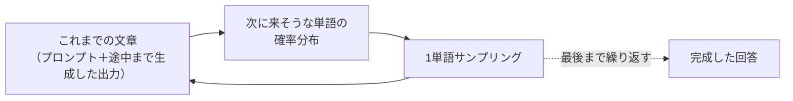
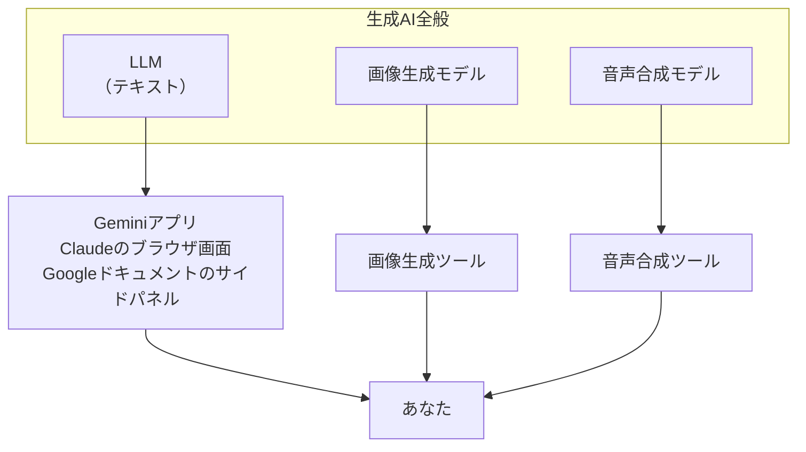
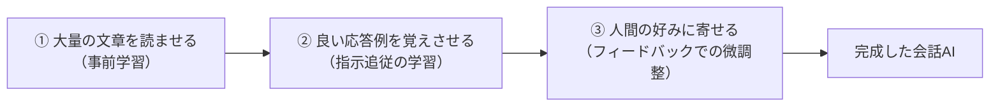

# 2. 生成AIとは何か

[1章](01-gemini-in-workspace.md)で、Geminiと30分ほど肩慣らしをしていただきました。ここからは、そこで触れた「やたら人間っぽく返事をしてくる画面」の中身を、ゆっくり解きほぐしていきます。結論を先に言うと、中にいるのは小人ではありません。かといって、映画のヒーローのような全能の人工知能でもありません。

本章は、その正体を平易な言葉でスケッチし、以降の章の地盤を作ることに専念します。細かいメカニズムは後続の章に譲るので、本章は全体像の輪郭線として読み流す程度で差し支えありません。

## 対象読者と前提

- [1章](01-gemini-in-workspace.md)でGeminiに触れてみた人
- 「LLM」「生成AI」という単語は耳にするが、中で何が起きているかはぼんやりしている人
- 数式やコードは出てこないほうが助かる人

単語の厳密な定義が気になったら、[6章（用語について）](06-terminology.md)を辞書代わりに開きながら読み進めてください。本章は輪郭、6章は辞書、という役割分担になっています。

## 一言で言うと、どういう機械なのか

生成AIの核にある大規模言語モデル（Large Language Model、略してLLM）の正体を、思い切って一文にまとめると、こうなります。

> **これまでの文章の流れから、次にどの単語が続きそうかを確率で選び、それを何千回も繰り返す機械**

「マーク・トウェインの最後の名言は、えー、」のあとに続きそうな単語を、何百万もの候補から確率で1個選ぶ。選んだ単語を末尾に足し、同じことをもう一度やる。これを根気強く繰り返した結果が、皆さんが画面で目にしている整った日本語、ということになります。

絵で見るとこんなイメージです。

突き詰めるとこれだけです。「そんな単純な仕組みで、あれだけ気の利いた返事が書けるのか？」と感じるかもしれません。その驚きは研究者のあいだでも共通していて、なぜここまでの挙動が出るのかは今も研究が続いている領域です。

## 「単語」ではなく「トークン」

正確を期すと、モデルが扱う最小単位は「単語」ではなく**トークン**という、もう少し細かい粒です。英単語1個が1トークン、日本語は2〜3文字で1トークン、くらいの解像度で押さえておけばおおむね当たります。

業務で触る範囲では、トークンの実数を数える場面はあまりありません。それでも「課金の単位」「コンテキストウィンドウ（一度に見られる文章量）の単位」としてあとで登場するので、名前だけ頭の片隅に入れておくと、以降の章を読み進めやすくなります。詳しくは[6章（用語について）](06-terminology.md)に譲ります。

## 「生成AI」「LLM」「チャット画面」の層構造

1章で触ったのは、正確には「Geminiというチャット画面」でした。では生成AIとは、LLMとは、どこが違うのか。言葉が3つ並ぶと、読者の脳内でも同じ場所に積まれがちですが、実際は階層が違います。

| 呼び方 | 指しているもの | ざっくりの例 |
| ---- | ---- | ---- |
| 生成AI | テキスト・画像・音声・動画など、**何かを新しく作り出す**AI全般の総称 | ChatGPT、Gemini、Claude、画像生成、音声合成 |
| LLM（大規模言語モデル） | そのうち**文章**の生成を担う中核の計算モデル | GPT-5、Gemini Pro、Claude Opus |
| チャット画面・アプリ | LLMに話しかけるための、あなたの目の前にある窓口 | `gemini.google.com`、Claudeのブラウザ画面 |

図にすると、こう並びます。

本ドキュメントが主に取り上げるのは、いちばん左のLLMと、そこに話しかけるチャット画面の組み合わせです。画像や音声は別立てで扱うべき分量があるので、本ドキュメントでは踏み込みません。

## 「確率で次の単語を選ぶ」の、直感的な含意

核の仕組みが分かると、1章で感じた「あれ？」の多くは、理屈の側から説明がつきます。

### 毎回答えが微妙に違う

同じ質問を2回投げても、まったく同じ文面は返ってきません。これは仕様で、**確率分布からサンプリングしている**以上、そうなるのが自然な挙動です。サイコロを2回振って同じ目が出るとは限らないのと同じ理屈です。

プロバイダによっては「温度（temperature）」という設定で、このランダムさを調整できます。低くすると回答は安定しますが、無難な文面に寄りやすくなります。チャット画面ではユーザー側で触れないことが多いので、「少し揺らぐ道具」という感覚で使っている分には差し支えありません。

### さっき話したことを「覚えている」ように振る舞う

1つのチャット内で、以前のやり取りを踏まえた返答をしてくれる。これは、モデルが記憶しているのではなく、**画面の裏で、過去の発話をまとめて毎回もう一度モデルに渡している**だけです。発話のたびに、それまでの会話ログを頭から読み直してから応答している、と思ってください。

一度に渡せる文章量には上限があり、これを**コンテキストウィンドウ**と呼びます。長大な資料を丸ごと投げ込むと、窓からはみ出した部分は**モデルに届きません**。この性質は[5章](05-hallucination-and-knowledge-literacy.md)・[6章](06-terminology.md)で再登場します。

### 新しいチャットを開くと、前の話を全部忘れている

毎回モデルに渡していた会話ログが、新しいチャットでは空になるからです。モデル本体には、あなたとの昨日の会話も、その前の1週間の打ち合わせも、一切焼き付いていません。**覚えてくれている主体は、モデルではなく、画面の裏で会話ログを溜めている仕組みのほう**です。

「では、メモを長期保存する仕組みはないのか」と聞かれれば、あります。各社の「メモリ機能」や「プロジェクト知識」がそれで、話は少し込み入ります。そのあたりは[4章（「学習」というキーワードの誤解）](04-misunderstanding-learning.md)で、「学習」という言葉との区別と合わせて扱います。

### もっともらしい嘘をつく（ハルシネーション）

「確率で自然な続きを選ぶ」目的と、「事実を正しく答える」目的は、実は別物です。一致する場面が多いから誤解されがちですが、モデルから見れば**空白を自然に埋めること**が主で、埋めた中身の真偽は直接の評価軸にはなっていません。

結果として、存在しない書籍を堂々と引用したり、実在の人物に架空の経歴を盛ったりする現象が起きます。この性質は業務利用の要になる論点なので、独立した章として[5章](05-hallucination-and-knowledge-literacy.md)で集中的に扱います。

## どうやって「人間っぽく」振る舞えるようになるのか

「次の単語を確率で選ぶだけ」なら、なぜあれだけ気の利いた返答になるのでしょうか。ここは、料理番組ふうに段階で見ると分かりやすくなります。

ざっくり3ステップです。

- **① 事前学習** — インターネット上の記事、書籍、コードなど、人間が書いた膨大な文章を読ませる。この段階で「自然な文章とはどう続くか」を統計的に体に染み込ませる
- **② 指示追従の学習** — 人間が「こう聞かれたらこう答えるのが望ましい」というお手本を用意し、追加で教え込む
- **③ 人間の好みでの微調整** — 2つの回答のどちらが好ましいかを人間に選ばせ、その好みでさらに寄せていく

本ドキュメントではこれ以上の深追いはしません。ただ、**中身は「魔法」ではなく「大量のお手本を読んで、人間の好みにチューニングされた確率の塊」**という感覚を持っておくと、以降の章が読み進めやすくなります。

ちなみに、「ここに自分の打った文章が混ざるのでは」という心配が湧いた人は、鋭い読者です。ただし業務利用での実情はかなり違います。[4章（「学習」というキーワードの誤解）](04-misunderstanding-learning.md)で、**あなたのチャット入力がモデル本体に焼き付くような現象は普段起きない**という話を、証拠と合わせて丁寧にほぐします。

## 得意なこと・苦手なこと（仕組みから直感で分かる範囲）

仕組みを軽く押さえた今なら、得意不得意はおおよそ想像がつきます。

| 性格 | 得意になりそうな仕事 | 苦手になりそうな仕事 |
| ---- | ---- | ---- |
| 自然な文章を作るのが本業 | 要約、言い換え、翻訳、ドラフト作成、トーン調整 | 厳密な四則演算、桁の多い計算 |
| 読んだ文章のパターンに強い | 定型的な議事録、報告書、スライド骨子の下書き | 誰も書いたことがない新規の事実の検証 |
| 確率で自然さを選ぶ | 複数案を出して比較検討する | 「これが唯一の正解」と言い切る場面 |
| 文脈を並列に受け取れる | 添付資料や対話履歴を踏まえた回答 | 外部の最新情報の取得（ツール連携が別途必要） |

「苦手そう」に並んでいる仕事を投げると、もっともらしい嘘が混ざりやすくなります。反対に「得意そう」に当たる仕事を任せると、短い時間で下書きが戻ってきます。

苦手分野に頼りたいときは、**外に助っ人を呼ぶ**という方法が用意されています。Webを検索させる、社内データベースを参照させる、計算器を叩かせる、といった仕組みです。この助っ人機構の全体像は[3章（外部システムとの接続）](03-external-system-integration.md)で扱います。

## テキスト以外の生成（マルチモーダル）もほぼ同じ流儀

画像や音声の生成AIも、土台の考え方は驚くほど似ています。

- 画像は「ピクセルの塊」、音声は「音の波形」を、文章と同じく**トークンに相当する単位**で扱う
- 確率的に次の要素を埋めていく、という流儀も共通
- 最近のモデルは、テキストと画像を一緒に扱える（いわゆる**マルチモーダル**と呼ばれる性質）

皆さんが1章でGeminiに画像ファイルをアップロードして「中身を説明して」と頼んだときも、画像は画像のまま入力として受け取られ、テキストの回答が生成されていました。裏側では、画像を**モデルが受け取れる形に変換してから**確率計算の土俵へ乗せています。細部は本ドキュメントの範囲外ですが、「全然別物の仕組み」ではない、という感覚は持っていると以降の説明が通りやすくなります。

## 次の章への橋渡し

本章で、生成AIの大まかな動作原理は押さえられたはずです。このあと、隣接する話題が章ごとに分かれて待っています。

- [3章（外部システムとの接続）](03-external-system-integration.md) — モデルが苦手な仕事を、外の道具に頼むための仕組み
- [4章（「学習」というキーワードの誤解）](04-misunderstanding-learning.md) — 自分の入力がモデルの学習に使われるのか、という不安を、証拠と合わせてほぐす
- [5章（ハルシネーションと「AIが知っていること」のリテラシー）](05-hallucination-and-knowledge-literacy.md) — もっともらしい嘘が出る仕組みと、実務での付き合い方
- [6章（用語について）](06-terminology.md) — 本章で顔を出した「トークン」「コンテキスト」などの辞書
- [7章（生成AIでできること 共通編）](07-common-capabilities.md) — 1章の体感と、ここまでの理屈を、具体的な機能マップに落とす章

本章の役割は、以降の章を読むための土台を先に敷いておくことです。細部は、必要になった章で取りに戻ってきていただければ大丈夫です。

## まとめ

- 生成AIの中核にあるLLMは、**これまでの文章から次のトークンを確率で選び続ける機械**である
- 「生成AI」はテキスト・画像・音声など広い総称、「LLM」はそのうちの文章担当、「チャット画面」はLLMへの窓口、と層で捉えると混乱が減る
- 「毎回答えが揺れる」「前の話を忘れている」「もっともらしい嘘が混じる」は、すべて中身の仕組みから素直に導かれる性質
- 苦手な仕事は、Web検索・社内データ参照・計算器などの**外の助っ人**に頼る道が用意されている（詳細は3章以降）

## 参考

- Anthropic「How Claude works」: <https://www.anthropic.com/research>（最終確認：2026-04-24）
- Google「About large language models」: <https://ai.google.dev/gemini-api/docs/models>（最終確認：2026-04-24）
- Google Cloud「What is Generative AI?」: <https://cloud.google.com/use-cases/generative-ai>（最終確認：2026-04-24）
