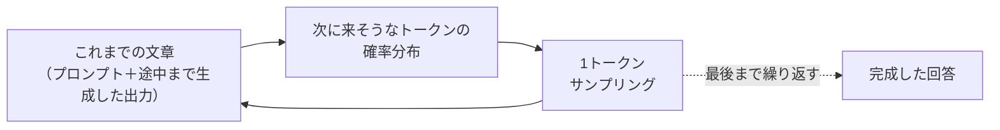
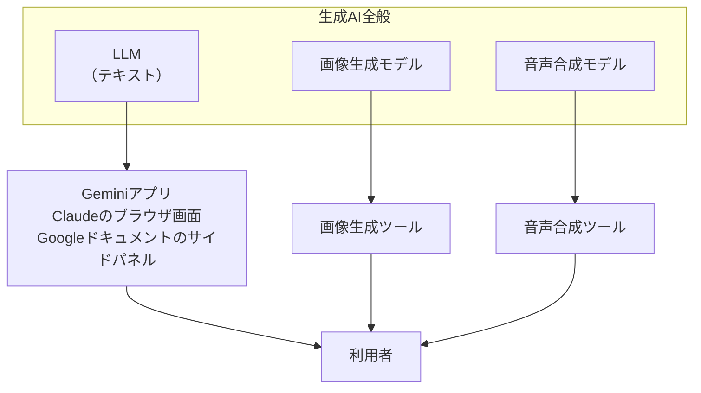
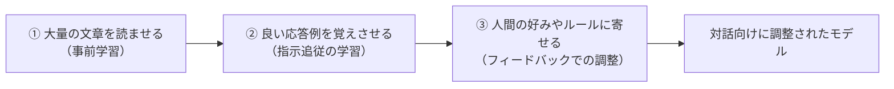

# 2. 生成AIとは何か

本章は、生成AIが内側で何を行っているのかを、「次のトークンを確率で選ぶ」という動作の中心と、その上に積まれた仕組みの両面から整理します。[1章](01-gemini-in-workspace.md)で観察した「毎回答えが違う」「前の話を覚えていない」「もっともらしい嘘が混じる」といった挙動は、この中心の動作から派生する性質です。細かいメカニズムは後続の章で扱うため、ここでは全体像の輪郭としてまとめます。

## 対象読者と前提

- [1章](01-gemini-in-workspace.md)でGeminiを実際に操作したことがある人
- 「LLM」「生成AI」という言葉に聞き覚えはあるが、内部で何が起きているかはまだ整理できていない人
- 数式やコードを使わない説明を求めている人

本章で初めて登場する用語の定義は、[7章（用語集）](07-terminology.md)に集約してあります。本章は輪郭、7章は用語の定義、という役割分担です。

## LLMの動作の中心は、次のトークンを確率で選ぶこと

生成AIの中核にあるのが、大規模言語モデル（Large Language Model、略してLLM）です。LLMは、画像や音声まで扱えるものを含めた**基盤モデル**（foundation model）と呼ばれる大規模AIモデル群の言語版にあたります。動作の中心を一文で言えば、これまでの文章の流れから、次に続くトークン（単語に相当する単位）の候補を確率分布として算出し、その分布から1つを選ぶ処理を繰り返します。

たとえば「マーク・トウェインの最後の名言は、」という途中までの文章を入力すると、続くトークンの候補に対して確率分布が出力され、そこから1つが選ばれます。選んだトークンを末尾に足し、同じ計算をもう一度行います。これを繰り返した結果が、画面に表示される整った日本語です。

処理の流れは次のとおりです。

動作の中心はこの繰り返しですが、LLMはこの計算を**Transformer**と呼ばれるニューラルネットワーク構造で行っています。Transformerは、入力された各トークンの間の関連性を**アテンション**（attention）と呼ばれる仕組みで重み付けし、文脈に応じた応答を組み立てます。チャット画面の応答が単純な文字列の継ぎ足しに見えないのは、この内部構造と、後述する3段階の学習の積み重ねの結果です。なぜこの仕組みから対話に近い応答が立ち上がるのか、内部で何が起きているかの完全な解明は、現在も研究が進んでいる領域です。

## モデルが扱う最小単位は「単語」ではなく「トークン」

モデルが扱う最小単位は単語ではなく**トークン**と呼ばれる単位です。文字より大きく、単語より細かい粒度で、英文なら1単語が1トークン前後、日本語ならおおむね1文字あたり1〜2トークン程度に変換されることが多い、という肌感覚で扱えます。トークン化の方式と粒度はモデルによって異なり、同じ文字列でもモデルが違えばトークン数は変わります。

日常の利用範囲では、トークン数を直接数える場面はそれほどありません。一方で、APIの課金単位や、一度にモデルへ渡せる文章量の上限（コンテキストウィンドウ）の単位として後の章で再登場するため、用語として押さえておきます。詳細は[7章（用語集）](07-terminology.md)を参照してください。

## 「生成AI」「LLM」「チャット画面」は3層で整理する

1章で操作したのは、正確には「Geminiというチャット画面」です。生成AI、LLM、チャット画面の3語は混同されがちですが、指している階層が違います。

| 呼び方 | 指しているもの | 具体例 |
| ---- | ---- | ---- |
| 生成AI | テキスト・画像・音声・動画など、何かを新しく作り出すAI全般の総称 | ChatGPT、Gemini、Claude、画像生成、音声合成 |
| LLM（大規模言語モデル） | そのうち文章の生成を担う中核の計算モデル | GPT-5、Gemini Pro、Claude Opus |
| チャット画面・アプリ | LLMに入力を渡し、応答を表示するアプリケーション | `gemini.google.com`、Claudeのブラウザ画面 |

図で表すと、次のように並びます。

本ドキュメントが主に扱うのは、図の左にあるLLMと、それを利用するチャット画面の組み合わせです。画像や音声の扱いは独立した章を設け、概要は[3章（マルチモーダル）](03-multimodal.md)で整理します。本章は文章生成の仕組みを軸に進めます。

## 「確率で次の単語を選ぶ」から、4つの挙動が直接導ける

ここまでの内容を踏まえると、1章で観察された4つの挙動は、それぞれ核の仕組みから説明できます。

### 毎回答えが微妙に違う

同じ質問を2回入力しても、まったく同じ文面は返ってきません。確率分布からサンプリングしている以上、毎回同じ単語列が選ばれるとは限らないためです。サイコロを2回振って同じ目が出るとは限らないのと同じ原理です。

プロバイダによっては「温度（temperature）」という設定で、このランダムさを調整できます。値を下げると回答は安定しますが、無難な文面に寄りやすくなります。チャット画面では利用者側から温度を変更できない場合が多く、応答にある程度の揺らぎがある前提で使うことになります。

### さっき話したことを「覚えている」ように振る舞う

同じチャット内では、過去のやり取りを踏まえた応答が得られます。これは、モデル本体が記憶しているのではなく、画面の裏で、過去の発話をまとめて毎回もう一度モデルに渡しているためです。発話のたびに、それまでの会話ログを頭から読み直したうえで応答が生成されています。

一度に渡せる文章量には上限があり、これを**コンテキストウィンドウ**と呼びます。長大な資料を丸ごと入力すると、上限を超えた部分はモデルに渡らず、応答にも反映されません。この性質は[6章](06-hallucination-and-knowledge-literacy.md)・[7章](07-terminology.md)で再登場します。

### 新しいチャットを開くと、前の話を全部忘れている

新しいチャットでは、毎回モデルに渡していた会話ログが空の状態から始まります。モデル本体には、昨日の会話も、その前の1週間の打ち合わせも保持されません。会話の連続性を維持しているのはモデル側ではなく、画面の裏で会話ログを保持しているアプリ側の仕組みです。

メモを長期保存する仕組みは別途用意されており、各社の「メモリ機能」や「プロジェクト知識」がそれにあたります。「学習」という言葉との混同が起きやすい領域のため、[5章（「学習」というキーワードの誤解）](05-misunderstanding-learning.md)で、両者の区別と合わせて扱います。

### もっともらしい嘘をつく（ハルシネーション）

LLMの事前学習の段階では、訓練の中心は「自然な続きを選ぶ」ことであって、「事実を正しく答える」ことそのものを評価軸にはしていません。後述する事後学習の段階では、事実性を高めたり、知らないと答える振る舞いを強めたりする調整も行われますが、出力の真偽そのものを直接的に検証する仕組みが組み込まれているわけではありません。

結果として、存在しない書籍を実在のように引用したり、実在の人物に架空の経歴を付与したりする現象が起きます。この性質は業務利用での要点となるため、独立した章として[6章](06-hallucination-and-knowledge-literacy.md)で集中的に扱います。

## 対話AIは事前学習と事後学習を積み重ねて作られる

トークンの確率を出すだけの仕組みが、対話で自然な応答に近づくのは、事前学習のあとに事後学習（post-training）と呼ばれる調整を重ねるためです。代表的な構成は次の3段階で、各社のモデルは段階の組み合わせや手法を入れ替えながら作られています。

各段階の役割は次のとおりです。

- **① 事前学習** — 公開・契約取得・合成などの経路で集めた大量の文章を読ませ、自然な文章がどう続くかを統計的に学習させる段階である
- **② 指示追従の学習（SFT）** — 望ましい応答のお手本を人間が用意し、追加で学習させる段階である。日本語では教師ありファインチューニングと呼ばれることもある
- **③ 好みやルールへの調整** — 2つの応答のどちらが好ましいかを人間（または別のAI）に選ばせ、その判断に応じて応答の傾向を調整する段階である。RLHF・DPO・Constitutional AIなど、複数の手法が併用される

近年のモデルでは、これらに加えて、数学やプログラムなど答えの正誤が機械的に判定できる課題で推論力を強化する訓練（reasoning training）も組み合わされる場合があります。Claudeの「Extended Thinking」やGeminiの長考モードは、こうした訓練を踏まえて、応答の前に内部で推論ステップを重ねる動作モードです。

本ドキュメントではこれ以上の深追いはしません。モデルの中身は魔法ではなく、大量の文章で訓練され、人間の好みやルールに合うよう調整された統計的なモデルです。以降の章はこの前提に立って書いてあります。

「ここに自分の入力した文章が混ざるのではないか」という疑問が浮かぶかもしれません。業務利用の経路では、入力した内容がモデル本体の重みに反映される現象は通常起きません。詳細と例外は[5章（「学習」というキーワードの誤解）](05-misunderstanding-learning.md)で扱います。

## 得意・苦手は仕組みから直接導ける

ここまでの内容を踏まえると、得意な作業と苦手な作業の傾向は、仕組みから直接導けます。

| 仕組み上の特徴 | 得意になりやすい作業 | 苦手になりやすい作業 |
| ---- | ---- | ---- |
| 自然な文章を生成する処理が中心 | 要約、言い換え、翻訳、ドラフト作成、トーン調整 | 厳密な四則演算、桁の多い計算 |
| 読み込んだ文章のパターンに沿って続きを選ぶ | 定型的な議事録、報告書、スライド骨子の下書き | 誰も書いたことがない新規の事実の検証 |
| 確率で自然な続きを選ぶ | 複数案を出して比較検討する | 「これが唯一の正解」と言い切る場面 |
| 入力された文脈をまとめて受け取れる | 添付資料や対話履歴を踏まえた回答 | 外部の最新情報の取得（ツール連携が別途必要） |

苦手側に並ぶ作業を任せた場合は、もっともらしい嘘が混ざりやすくなります。得意側に並ぶ作業であれば、下書きとして使える応答が返りやすくなります。

苦手分野を補う方法として、外部のシステムに接続する仕組みが用意されています。Webの検索、社内データベースの参照、計算機（コードインタプリタ）の呼び出し、といった経路です。この外部接続の全体像は[4章（外部システムとの接続）](04-external-system-integration.md)で扱います。

## 画像や音声もトークンに準じた表現に変換して扱う

画像や音声を扱う生成AIも、おおまかな考え方は文章の延長線にあります。入力側では、画像専用のニューラルネットワーク（**ビジョンエンコーダ**）が画像をベクトルに変換し、文章のトークンと並べてLLMに渡します。音声も同様に、音の波形をベクトル列に変換してから渡します。LLM側は、文章のトークンと画像由来のベクトルをひとつの入力列として扱い、応答（多くはテキスト）を組み立てます。1章でGeminiに画像を渡して説明を求めたときも、内側ではこの経路が動いていました。

出力側で画像や音声を生成する場合は、文章生成と同じ仕組みではなく、専用のモデルを呼び出すのが一般的です。画像生成では拡散モデル（diffusion model）と呼ばれる別系統のモデルが多く使われ、音声生成も独自のモデルが用意されています。「次の単位を確率で選ぶ」という発想は共通しますが、内部のアーキテクチャや学習方法はテキスト生成とは別物です。

入出力の組み合わせ方や、業務で押さえておきたい点は、独立した章にまとめてあります。詳しくは[3章（マルチモーダル）](03-multimodal.md)を参照してください。

## まとめ

- 生成AIの中核にあるLLMは、Transformerと呼ばれる構造の上で、これまでの文章から次のトークンの確率分布を出して1つを選ぶ処理を繰り返している
- 「生成AI」「LLM」「チャット画面」は層が違い、層で整理すると混同しにくい
- 「毎回答えが揺れる」「前の話を覚えていない」「もっともらしい嘘が混じる」は、いずれも確率計算と事後学習の組み合わせから導かれる性質である
- 苦手な作業は、Web検索・社内データ参照・計算機などの外部接続で補える（詳細は4章以降）

次は [3章（マルチモーダル）](03-multimodal.md) で、テキスト以外の入力と出力をひととおり眺めます。

## 参考

- Anthropic「How Claude works」: <https://www.anthropic.com/research>（最終確認：2026-04-24）
- Google「About large language models」: <https://ai.google.dev/gemini-api/docs/models>（最終確認：2026-04-24）
- Google Cloud「What is Generative AI?」: <https://cloud.google.com/use-cases/generative-ai>（最終確認：2026-04-24）
