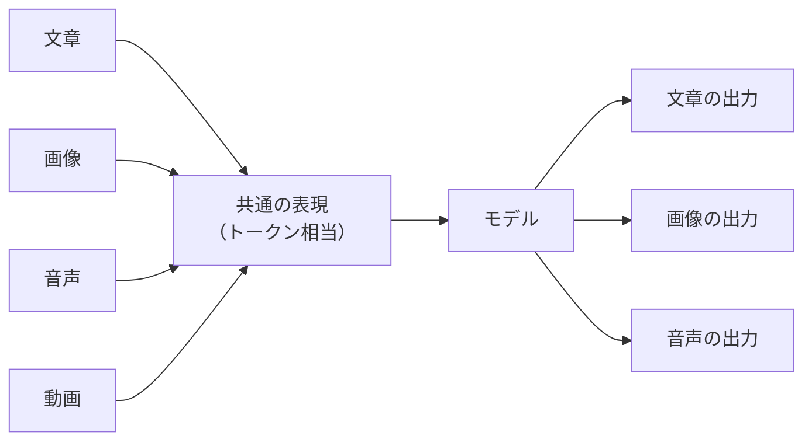

# 3. マルチモーダル: テキスト以外の入出力との付き合い方

[2章](02-what-is-generative-ai.md)で、生成AIの中核は「これまでの文章から次のトークンを確率で選び続ける機械」だ、という輪郭をなぞりました。本章はその延長線上にあり、画像・音声・動画・PDFといった**テキスト以外の入出力**を、同じ枠組みでどう扱っているかを眺めます。

「マルチモーダル」という言葉が並ぶと、別物の技術に見えますが、ふたを開けると2章で押さえた像と陸続きです。本章では深追いをせず、業務利用で踏み外しにくいだけの輪郭を共有します。各社の最新仕様や、画像・動画生成プロダクトの個別の使いこなしは、後続の章と一次ソースに譲ります。

## 対象読者と前提

- [2章（生成AIとは何か）](02-what-is-generative-ai.md)で、トークン・コンテキストの像を持った人
- スクリーンショットの貼り付けや、PDFの要約をチャットに頼んだことがある／頼んでみたい人
- 画像生成・音声対話などの新しい入出力で、何ができて何ができないのかを大まかに把握したい人

ここで取り上げるのは、業務でクライアントUIから触れる範囲の話です。画像や動画の生成プロダクトの個別比較や、音声合成の声質チューニングなど、踏み込んだ運用は本ドキュメントの守備範囲外としています。

## 「マルチモーダル」とは何を指す言葉か

マルチ（複数の）モーダル（様式）、つまり**テキスト・画像・音声・動画など、複数の様式の情報を一緒に扱える**性質のことです。2026年時点では、Claude・Gemini・ChatGPTのいずれも、文章のほかに画像やPDFを入力として受け取り、回答に組み込む使い方が標準のチャット画面で実用域に入っています。

仕組みは2章でなぞったとおりです。画像なら「ピクセルの塊」、音声なら「音の波形」を、それぞれモデルが受け取れる形（テキストのトークンに相当する単位）へ変換し、確率計算の土俵に乗せます。土俵に乗ってしまえば、続く処理は文章のときと同じです。

入口と出口の様式は別物に見えますが、内側で起きているのは「同じ表現に揃え、確率で次を選ぶ」という同じ流儀です。ここを押さえておくと、新しいプロダクトが出てきても、見え方を整理しやすくなります。

## 入力で扱える素材

業務で頻度の高い入力素材を並べておきます。手元の仕事のうち、テキスト以外でモデルに渡したい場面は、おおむねこの表のどれかに当てはまります。

| 素材 | 典型的な使い方 | 注意したい点 |
| ---- | ---- | ---- |
| 画像・スクリーンショット | 内容の説明、文字の抽出、表への変換、図の読み取り | 機微情報の写り込み、解像度に伴う精度差 |
| PDF・スキャン文書 | 要約、質問応答、論点抽出、複数文書の比較 | ページ数が多いとコンテキスト上限に近づく |
| 音声ファイル | 文字起こし、議事録の下書き、要約 | 対応形式・最大長に上限あり、話者の取り違い |
| 動画ファイル・動画リンク | シーン要約、台詞の抽出、内容の確認 | 対応モデルが限られる、長時間は分割が無難 |

3つだけ、業務利用の感覚をつかみやすくする補助線を置きます。

- **「画像のまま読み取れる」のは応用範囲が広い** — スクリーンショットを貼って「ここを表にして」と頼む手順は短いわりに、効きが大きい用途。OCRを別途回す手間を考えれば、まず試してみる価値がある
- **PDFは「全部投げる」より「要点だけ抜く」が安定** — コンテキストの上限を超えると、巨大なPDFは末尾から落ちることがある。章節を絞って渡す、見出しだけ先に渡す、といった段取りに切り替えるほうが、結果として手戻りが少ない
- **音声・動画は「対応モデル」と「対応サービス」が別** — モデルの側が対応していても、ブラウザのチャット画面に入口が用意されていないことがある。各社のヘルプで、いま使っているプランから何を入力できるかを確認するのが近道

入力時に共通で気にしたいのは、機微情報の取り扱いです。スクリーンショット1枚に映り込んだ顧客名や金額は、テキストのときと同じ重さで扱う必要があります。判断のフレームは[9章（セキュリティ 個人利用編）](09-security-individual.md)の入力チェックがそのまま使えます。

## 出力で得られるもの

出力側は、入力よりも各社の事情が出ます。生成プロダクトとして独立した名前が付くこともあるので、ブランドと機能をいったん分けて並べます。

| 種類 | 何が得られるか | 代表的な入口の例 |
| ---- | ---- | ---- |
| 画像生成 | テキスト指示から静止画を生成、生成済み画像の編集 | Geminiアプリ（Imagen系）、ChatGPT、画像生成専用ツール |
| 動画生成 | テキストや参照画像から短い動画クリップ | Geminiアプリ（Veo系）、ChatGPTのSora系、専用ツール |
| 音声合成 | 文章を音声にする、声質を選ぶ／指定する | 各社のテキスト読み上げ、専用サービス |
| 音声対話 | こちらの発話を聞き取り、音声で応答する | ChatGPTの音声モード、Geminiの音声対話など各社 |

ここでも深追いは避け、輪郭だけ確認します。

- **画像生成は「指示の精度がそのまま品質に出る」** — 構図、画角、ライティング、被写体のレイアウトといった具体性が、出力の品質を大きく左右する。1回で決めようとせず、骨子を固めてから細部を詰める進め方が結果として手戻りを減らす
- **動画生成はプロンプト設計の比重が大きい** — 場面の構図、カメラの動き、時間的な変化を具体的に書くほど、意図に近いものが返ってくる。短いクリップを束ねて編集する流れが、現状では現実的な使い方
- **音声対話は「リアルタイム性」が体験を変える** — ボタンを押して話しかけ、音声で応答が戻る体験は、文章のチャットと体感がだいぶ違う。会話の中断・再開や、音声と文字の併用の可否は、サービスごとに差がある
- **生成物の権利と表示** — 商用利用の可否や、AI生成物としての表示義務は、サービスとプランによって異なる。社外の制作物として配る前に、利用規約を一次ソースで確認すること。電子透かし（SynthIDなど）の扱いも、出力先の規定で要否が決まる

具体的な機能名や対応プランの最新情報は、[11章（あらためてGeminiを使いこなそう）](11-gemini-advanced.md)・[13章（Claudeを使いこなそう）](13-claude.md)、および各社の公式ドキュメントを参照してください。

## チャット画面の中での組み合わせ

実務で「マルチモーダルらしさ」を体感しやすいのは、**1回の依頼に複数の素材を同時に渡す**場面です。画像とテキスト、PDFと表、音声と文章、といった束ね方で、業務の段取りが少し短くなります。

たとえば、次のような流れです。

- 会議メモの写真とPDFの議題を一緒に渡し、「両方を踏まえて、決定事項と宿題を整理して」と頼む
- 画面のスクリーンショットと製品仕様PDFを渡し、「この画面の入力欄が、仕様のどの項目に対応するか」を確かめる
- 音声で議事を録音し、その文字起こしと配布資料を一緒に投げ、「事実関係に齟齬がないか」を点検してもらう

複数素材を渡せるようになるほど、コンテキストウィンドウの上限が早く近づきます。素材を増やすほど精度が上がるとは限らない、という前提で、まず要点だけ渡し、必要に応じて足していくのが現実的な進め方です（コンテキスト上限の話は[7章（用語集）](07-terminology.md)）。

## 何を本書で深追いしないか

業務でマルチモーダルを使い始めると、すぐに「もっと細かい話を知りたい」場面が出てきます。本書ではあえて深追いせず、次のような領域は別の場所に委ねます。

- **画像生成・動画生成プロダクトの細かな比較** — 仕様や価格は四半期単位で動く。各社の公式ページを一次ソースとして当たる
- **音声合成の声質チューニング、リアルタイム対話の実装** — エンジニアリング寄りの題材で、本書の想定読者の射程からは外れる
- **マルチモーダル前提のエージェント運用** — 入力経路の信頼性や、画像経由のプロンプトインジェクションなど、論点はエージェント時代のセキュリティに重なる。基本線は[10章（セキュリティ エージェント時代のガバナンス）](10-security-agent-era.md)を参照する

本書で押さえておきたいのは、入力と出力の様式が広がっても**根は2章のテキストの仕組みと同じ**だ、という像です。ここがぐらつかなければ、新しいプロダクトを前にしても、自分の業務に取り込んでよい範囲を冷静に判断できます。

## まとめ

- マルチモーダルは「複数の様式の情報を、共通の表現に揃えて確率計算の土俵に乗せる」仕組み。文章の生成と地続き
- 入力でよく使うのは画像・PDF・音声。スクリーンショットからの読み取りは、手軽なわりに業務での効きが見えやすい
- 出力は画像・動画・音声合成・音声対話などに広がっており、対応プランや権利・表示の扱いはサービスごとに異なる
- 1回の依頼に複数素材を束ねる使い方が、マルチモーダルらしい場面。コンテキスト上限を踏まえて、要点から渡す
- 詳細は[11章](11-gemini-advanced.md)（Gemini）・[13章](13-claude.md)（Claude）と各社の一次ソースに委ねる
- 次は [4章（外部システムとの接続）](04-external-system-integration.md) で、AIが外部の道具を呼び出す仕組みへ進む

## 参考

- Anthropic「Vision」: <https://docs.claude.com/en/docs/build-with-claude/vision>（最終確認：2026-04-25）
- Google「Gemini API: Vision and audio」: <https://ai.google.dev/gemini-api/docs/vision>（最終確認：2026-04-25）
- Google「Geminiで画像を生成する（Imagen）」: <https://support.google.com/gemini/answer/14590462>（最終確認：2026-04-25）
- Google「Veoによる動画生成」: <https://deepmind.google/technologies/veo/>（最終確認：2026-04-25）
- OpenAI「Vision」: <https://platform.openai.com/docs/guides/vision>（最終確認：2026-04-25）
