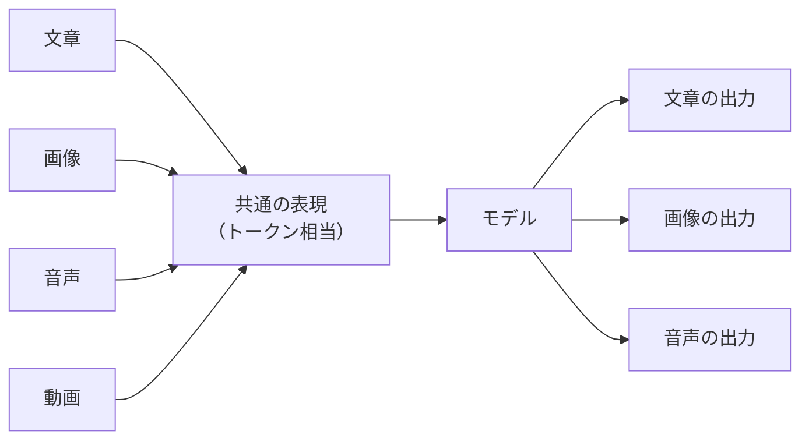

# 3. マルチモーダル: テキスト以外の入出力との付き合い方

本章は、生成AIに画像・音声・動画・PDFといったテキスト以外の素材を渡すとき、内側で何が起きているかを2章で押さえた仕組みの延長として整理します。マルチモーダル対応のチャット画面で扱える入力素材と、画像生成や音声合成といった出力の現状を眺め、業務での組み合わせ方と、本書では深追いしない領域を確認します。各社の最新仕様や個別プロダクトの使いこなしは、後続章と一次ソースに委ねます。

## 対象読者と前提

- [2章（生成AIとは何か）](02-what-is-generative-ai.md)で、トークン・コンテキストの像を持った人
- スクリーンショットの貼り付けや、PDFの要約をチャットに頼んだことがある／頼んでみたい人
- 画像生成・音声対話などの新しい入出力で、何ができて何ができないかを大まかに把握したい人

ここで取り上げるのは、業務でクライアントUIから扱える範囲の話です。画像や動画の生成プロダクトの個別比較や、音声合成の声質チューニングといったエンジニアリング寄りの題材は、本ドキュメントの守備範囲外としています。

## マルチモーダルは、複数の様式の情報を共通の表現に揃えて扱う性質

マルチ（複数の）モーダル（様式）、つまりテキスト・画像・音声・動画など、複数の様式の情報を一緒に扱える性質のことです。2026年時点では、Claude・Gemini・ChatGPTのいずれも、文章のほかに画像やPDFを入力として受け取り、回答に組み込む使い方が標準のチャット画面で実用域に入っています。

仕組みは2章でなぞったとおりです。画像ならピクセルの並び、音声なら音の波形を、それぞれモデルが受け取れる形（テキストのトークンに相当する単位）に変換します。変換が済めば、続く処理は文章のときと同じで、次のトークンを確率で選び続けます。

入口と出口の様式は別物に見えますが、内側では「共通の表現に揃え、確率で次を選ぶ」という同じ処理が動いています。新しいプロダクトを目にしたときも、この一点を確かめれば、2章で押さえた像の延長として位置づけられます。

## 入力で扱える素材は画像・PDF・音声・動画の4系統

業務で頻度の高い入力素材を並べておきます。手元の仕事のうち、テキスト以外でモデルに渡したい場面は、おおむねこの表のどれかに当てはまります。

| 素材 | 典型的な使い方 | 注意したい点 |
| ---- | ---- | ---- |
| 画像・スクリーンショット | 内容の説明、文字の抽出、表への変換、図の読み取り | 機微情報の写り込み、解像度に伴う精度差 |
| PDF・スキャン文書 | 要約、質問応答、論点抽出、複数文書の比較 | ページ数が多いとコンテキスト上限に近づく |
| 音声ファイル | 文字起こし、議事録の下書き、要約 | 対応形式・最大長に上限あり、話者の取り違い |
| 動画ファイル・動画リンク | シーン要約、台詞の抽出、内容の確認 | 対応モデルが限られる、長時間は分割が無難 |

業務利用での扱い方について、3点だけ補足します。

- 画像は、貼ったまま読み取れる範囲が広い素材である。スクリーンショットを貼って「ここを表にして」と頼む手順は短く、OCRを別途用意せずに済むため、まず試しやすい用途に当たる
- PDFは、全部を一度に渡すよりも、要点を抜いてから渡すほうが安定する。コンテキストの上限を超えると、長いPDFは末尾から落ちることがある。章節を絞って渡す、見出しだけ先に渡す、といった段取りに切り替えると、手戻りが起きにくい
- 音声と動画は、モデル側が対応していても、ブラウザのチャット画面に入口が用意されていないことがある。各社のヘルプで、いま使っているプランから何を入力できるかを確認してから素材を準備する

入力時に共通で気にしたいのは、機微情報の取り扱いです。スクリーンショット1枚に映り込んだ顧客名や金額は、テキストのときと同じ重さで扱う必要があります。判断のフレームは[9章（セキュリティ 個人利用編）](09-security-individual.md)の入力チェックがそのまま使えます。

## 出力は画像生成・動画生成・音声合成・音声対話の4系統に広がる

出力側は、入力側より各社の対応範囲や提供形態の違いがはっきり表れます。生成プロダクトとして独立した名前が付くこともあるので、ブランドと機能をいったん分けて並べます。

| 種類 | 何が得られるか | 代表的な入口の例 |
| ---- | ---- | ---- |
| 画像生成 | テキスト指示から静止画を生成、生成済み画像の編集 | Geminiアプリ（Imagen系）、ChatGPT、画像生成専用ツール |
| 動画生成 | テキストや参照画像から短い動画クリップ | Geminiアプリ（Veo系）、ChatGPTのSora系、専用ツール |
| 音声合成 | 文章を音声にする、声質を選ぶ／指定する | 各社のテキスト読み上げ、専用サービス |
| 音声対話 | こちらの発話を聞き取り、音声で応答する | ChatGPTの音声モード、Geminiの音声対話など各社 |

各系統について、業務利用の輪郭を補足します。

- 画像生成は、構図・画角・ライティング・被写体のレイアウトといった指示の具体性が、出力の品質に直接反映される。1回で決めようとせず、骨子を固めてから細部を詰める進め方のほうが、出力を意図に近づけやすい
- 動画生成は、場面の構図、カメラの動き、時間的な変化を具体的に書くほど、意図に近い出力が返ってくる。短いクリップを束ねて編集する流れが、現状で取りやすい使い方に当たる
- 音声対話は、ボタンを押して話しかけ、音声で応答が戻る形式である。文章のチャットと操作感が異なるため、会話の中断・再開や、音声と文字の併用の可否を、サービスごとに確認しておく
- 生成物の権利と表示は、サービスとプランによって異なる。商用利用の可否や、AI生成物としての表示義務、電子透かし（SynthIDなど）の扱いは、社外の制作物として配る前に利用規約を一次ソースで確認する

具体的な機能名や対応プランの最新情報は、[11章（Geminiを使いこなそう）](11-gemini-advanced.md)・[13章（Claudeを使いこなそう）](13-claude.md)、および各社の公式ドキュメントを参照してください。

## 1回の依頼に複数素材を束ねるのが、マルチモーダルらしい使い方

実務でマルチモーダルらしさが見える場面は、1回の依頼に複数の素材を同時に渡すときです。画像とテキスト、PDFと表、音声と文章、といった束ね方で、下書きや確認のひと手間を省ける場面が出てきます。

たとえば、次のような流れです。

- 会議メモの写真とPDFの議題を一緒に渡し、「両方を踏まえて、決定事項と宿題を整理して」と頼む
- 画面のスクリーンショットと製品仕様PDFを渡し、「この画面の入力欄が、仕様のどの項目に対応するか」を確かめる
- 音声で議事を録音し、その文字起こしと配布資料を一緒に渡し、「事実関係に齟齬がないか」を点検してもらう

複数素材を渡せるようになるほど、コンテキストウィンドウの上限が早く近づきます。素材を増やすほど精度が上がるとは限らないため、まず要点だけ渡し、必要に応じて足していく段取りが、調整の利く進め方になります（コンテキスト上限の話は[7章（用語集）](07-terminology.md)）。

## 本書で深追いしない領域は、外部の一次ソースと専用章に委ねる

業務でマルチモーダルを使い始めると、より細かな仕様や運用に踏み込みたい場面が出てきます。本書では、次のような領域には深追いせず、別の場所に委ねる立場をとります。

- 画像生成・動画生成プロダクトの細かな比較。仕様や価格は四半期単位で動くため、各社の公式ページを一次ソースとして当たる
- 音声合成の声質チューニング、リアルタイム対話の実装。エンジニアリング寄りの題材で、本書の想定読者の射程からは外れる
- マルチモーダル前提のエージェント運用。入力経路の信頼性や、画像経由のプロンプトインジェクションなど、論点はエージェント時代のセキュリティに重なる。基本線は[10章（セキュリティ エージェント時代のガバナンス）](10-security-agent-era.md)を参照する

本書で押さえたいのは、入力と出力の様式が広がっても、根の仕組みは2章のテキスト生成と変わらない、という像です。この前提が共有されていれば、新しいプロダクトを目にしたときも、自分の業務に取り込んでよい範囲を、テキスト生成のときと同じ枠組みで判断できます。

## まとめ

- マルチモーダルは、複数の様式の情報を共通の表現に揃え、文章生成と同じ確率計算で扱う仕組みである
- 入力は画像・PDF・音声・動画の4系統。スクリーンショットからの読み取りは、用途が広く試しやすい
- 出力は画像生成・動画生成・音声合成・音声対話に広がっており、対応プランと権利・表示の扱いはサービスごとに異なる
- 1回の依頼に複数素材を束ねる使い方では、コンテキスト上限を踏まえ、要点から渡して必要に応じて足す段取りで進める

次は [4章（外部システムとの接続）](04-external-system-integration.md) で、AIが外部の道具を呼び出す仕組みへ進みます。

## 参考

- Anthropic「Vision」: <https://docs.claude.com/en/docs/build-with-claude/vision>（最終確認：2026-04-25）
- Google「Gemini API: Vision and audio」: <https://ai.google.dev/gemini-api/docs/vision>（最終確認：2026-04-25）
- Google「Geminiで画像を生成する（Imagen）」: <https://support.google.com/gemini/answer/14590462>（最終確認：2026-04-25）
- Google「Veoによる動画生成」: <https://deepmind.google/technologies/veo/>（最終確認：2026-04-25）
- OpenAI「Vision」: <https://platform.openai.com/docs/guides/vision>（最終確認：2026-04-25）
