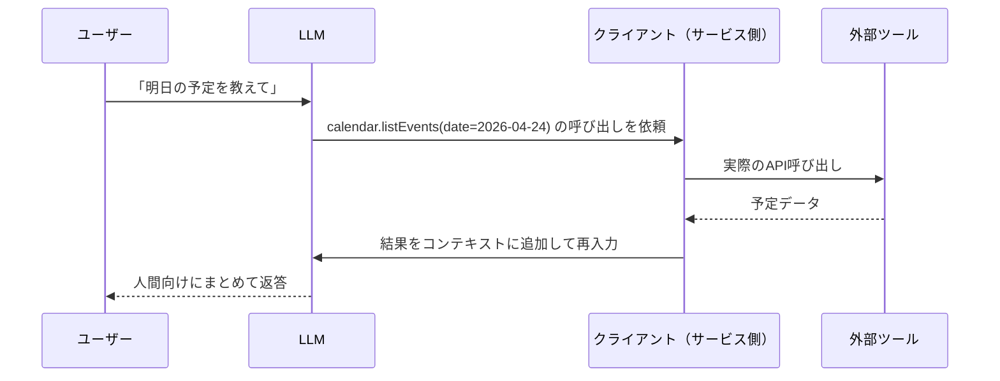
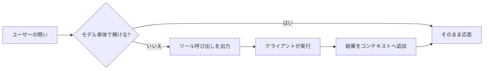

# 4. 外部システムとの接続: ツール呼び出しの仕組み

生成AIを業務で触っていると、どこかで「チャット欄しかないのに、なぜGmailを読んだりカレンダーを見たり社内文書を引っ張ってきたりできるのか」という疑問にぶつかります。映画の中のAIのように、画面の向こうから手が伸びてネットワークをかき回しているわけではありません。舞台裏では、もっと素朴で、仕組みとしても切り分けのはっきりした受け渡しが行われています。

本章では、AIがチャット以外の外部システムと繋がる仕組みを「**ツール呼び出し**」という一語に集約して解説します。これ以降の章で登場するコネクタ、MCP、エージェントといった単語は、すべてこの土台の上に乗っています。土台さえ分かれば、上物の建築様式が違うだけだという見え方になります。

## 対象読者と前提

- 1章でGeminiを触り、2章で生成AIの大まかな動作原理を読んだ人
- 「コネクタを有効にする」「APIで連携する」といった話が、なんとなくは分かるが仕組みは不明瞭な人

本章の結論を先に一行で言うと、「**AIは自分の手で外部システムを叩いているのではなく、依頼伝票を書いて外側のプログラムに渡しているだけ**」です。この像を頭の隅に置いてから読み進めてください。

### 本章で出てくる用語の下敷き

本文へ進む前に、以降繰り返し登場する語を一行ずつ置いておきます。厳密な定義や周辺知識は[7章（用語集）](07-terminology.md)で扱います。ここでは、**本章を読み進めるあいだ迷子にならない程度の目印**として眺めてください。

| 用語 | 本章での一行定義 |
| ---- | ---- |
| モデル | 文章を生成する本体。Claude Opus や Gemini Pro など |
| プロンプト | AIに渡す依頼文。ユーザーの発話そのもの |
| コンテキスト | AIがいま回答を作るために参照している情報の総体 |
| トークン | 文章の最小単位。課金とコンテキストの上限を測る物差し |
| エージェント | AIがツールを連続して呼び、目的まで自分で進めるモード |
| コネクタ／MCP | ツール呼び出しの入口（本章で詳述） |

読み進めていて「この語、もう少し広い文脈で押さえたい」と感じたら、7章をひらいて該当項目を読めば、そのまま本章に戻れます。

## チャットだけのAIに足りないもの

2章で見たとおり、生成AIの本体はあくまで文章生成の頭脳です。ユーザーの発話と、その場で与えられた資料（コンテキスト）を見て、次に出力すべき文字列を確率的に組み立てています。言い換えると、**コンテキストに載っていない情報は、どれだけ優秀なモデルでも参照できません**。

具体例で見てみましょう。読者がモデルに次のように頼んだとします。

- 「明日の会議の候補時間を空いている枠から3つ挙げて」
- 「最新のプレスリリースの要点を教えて」
- 「この議事録をSlackの #team-weeklyに投げておいて」

どれも、コンテキストの外側にある情報や操作を要求しています。カレンダーの中身、学習カットオフ以降のニュース、Slackへの書き込み権限、いずれもモデル本体は持っていません。持っていないものは答えられず、持っていない仕事はできない。ここまでは、当たり前の話です。

問題は、「AI自身がネットワークに出ていく」のではなく、「外側の誰かに動いてもらう」経路をどう用意するか、です。その経路の正体が、本章の主題である**ツール呼び出し**です。

## ツール呼び出しの基本

ツール呼び出しは、AIが外部の機能を使うための標準的な約束ごとです。仕組みは次の4ステップで回ります。

1. サービス側が、AIに対して**使える道具の一覧**を前もって渡す（道具の名前、何ができるか、必要な引数）
2. AIはユーザーの発話を見て、道具が必要だと判断したら「**この道具を、この引数で呼んでください**」という構造化された依頼文を出力する
3. AIの**外側**にいるプログラム（クライアント）が、その依頼文を読み取り、実際のAPIやコマンドを叩く
4. 結果をAIに戻すと、AIはそれを人間向けの日本語にまとめて応答する

ここで肝心なのは、**AI本体はネットワークに出ていっていない**ことです。AIは紙に依頼文を書いて窓口に差し出しているだけで、実際に動いているのは外側のプログラムです。レストランで厨房に直接行かず、店員さんにオーダー票を渡すような関係、と思っていただくと像が掴めます。

図にすると、こうなります。

同じ流れを、ツールを使わない従来のチャットと並べると、差が見えやすくなります。

ポイントは、**AIが「いつツールを使うか」を自分で判断する**部分です。事前に「このツールは何のためのもので、どんな引数が要るか」が教えられているので、ユーザーの発話とツールの説明を確率的に照合し、道具が要りそうだと判断したときだけ呼び出しを出力します。判断がズレることもあり、そこはプロンプトの書き方と、ツール側の説明文の質で結果が変わってきます。

## 典型的な3つの経路

「ツール呼び出し」という仕組み自体はひとつですが、現場で出会う**入口**は主に3種類あります。どの入口から入っても、内部で起きていることは同じです。

| 経路 | 誰が道具の一覧を用意するか | 読者が触るもの | 代表例 |
| ---- | ---- | ---- | ---- |
| UI上のコネクタ | サービス提供者（Anthropic／Google等） | チャット画面の設定スイッチ | Gemini側のGoogle Workspace連携、Claudeのコネクタ |
| API ＋ 自前ツール | 自社の開発者 | プログラムのコード | Claude API／Gemini APIの function calling |
| MCP（Model Context Protocol） | MCPサーバの提供者 | クライアントの設定ファイル | Claude Code、各種MCP対応クライアント |

### UI上のコネクタ

ブラウザ版のClaudeやGeminiで、「Googleカレンダーを繋ぐ」「Gmailを繋ぐ」といった設定を有効にするだけの経路です。道具の一覧も、認証も、呼び出し結果の整形も、サービス提供者側が全部用意してくれています。読者は**スイッチをひねるだけ**。お手軽ですが、使える道具はサービス提供者が用意した範囲に限定されます。

### API ＋ 自前ツール

自社プロダクトにClaude APIやGemini APIを組み込み、**自分たちのツール**をAIに教える経路です。ECサイトなら「在庫を引く」「注文を登録する」、社内なら「ナレッジを検索する」などを、各社のfunction calling仕様に沿って登録します。自由度は高いぶん、ツール定義の品質とエラーハンドリングは自分たちの責任です。本ドキュメントは非エンジニア向けなので深追いしませんが、社内で「AIチャットに独自機能を持たせたい」話が出たら、**その実体はおおむねこの経路です**。

### MCP（Model Context Protocol）

MCPは、ツール呼び出しを**共通のプロトコルとして標準化したもの**です。Anthropicが2024年に公開し、今では他社クライアントも対応が進んでいます。身近な家電でいえば、USB-Cの登場に近い立ち位置でしょう。以前は「このAIにはこの形のプラグ」を延々と自作していたのが、MCPという規格のおかげで、ひとつのMCPサーバを立てれば対応クライアントはどこからでも同じ作法で呼べるようになりました。

MCPの使いどころは、Appendix「Claude Code」で具体的に扱います。本章では「**ツール呼び出しに標準規格が生まれた**」という事実だけ押さえておけば、先の章は読み進められます。

## よくある誤解

ツール呼び出しの話は、なまじ「AIが動き回っている」絵が浮かぶぶん、誤解も生まれやすい領域です。代表的なものを先に並べておきます。

| 誤解 | 実際はどうか |
| ---- | ---- |
| AIが勝手にインターネットに飛び出していく | 外側のプログラムが、**事前に許可された道具しか実行しない**。AIは依頼文を書くだけ |
| 「ツール」というと画面を自動操作するやつのこと | 多くはAPI経由の素朴なデータ取得。画面操作型は別ジャンル（付録「デスクトップの自動化」参照） |
| 一度に1つのツールしか呼べない | モデルによっては並列・連鎖で複数呼べる。最近の主要モデルはたいてい対応している |
| ツールの結果がモデル本体に学習される | 結果はコンテキストに入るだけ。モデルの重みは変わらない（5章参照） |
| ツール経由のデータは安全 | 呼んだ先のサービスのセキュリティと、道具の設計次第。鍵は別途考える（9章・10章参照） |

2番目の誤解はとくに根強く、「AIエージェント＝画面をガチャガチャ動かすやつ」という像と紐付けて覚えている人もいます。実際の業務で頻度が高いのは、APIを叩いて構造化データを取って戻す素朴な呼び出しです。見た目こそ淡白ですが、想定外の事故も起きにくい作り方になっています。

## ツール呼び出しが切り拓くもの

この仕組みを押さえると、以降の章で出てくる3つの概念が、同じ根っこから生えたものだと見えてきます。

- **コネクタ** — サービス側が用意した「既製のツール群」。読者はスイッチで有効化するだけ
- **MCP** — ツール呼び出しを共通化した規格。連携先の増やし方が楽になる
- **エージェント** — 与えられた目的に対して計画を立て、途中結果を見て次の手を決め、最終的な成果物までたどり着くよう、ツール呼び出しを連続して行うシステム

コネクタはツールそのもの、MCPはツールを呼び出すための共通規格、エージェントはツール呼び出しを連ねて目的を達成する仕組み、というふうに整理しておけば混ざりにくくなります。いずれも土台にはツール呼び出しがあります。後続の章で、このどれかを扱うたびに、本章の仕組みを思い出してください。

## まとめ

- AIが外部システムと繋がる正体は、「道具を使ってください」という**依頼文をAIが出力し、外側のプログラムが実行する**仕組みである
- モデル本体はネットワークに出ていかない。呼ばれるのは、事前に登録・許可された道具だけ
- 現場で出会う経路は主に3つ（UIコネクタ／API＋自前ツール／MCP）あるが、**内部で起きていることは全部同じ**
- コネクタ・MCP・エージェントはいずれも、この土台の上に乗っている応用である

## 参考

- Anthropic「Tool use with Claude」: <https://docs.claude.com/en/docs/agents-and-tools/tool-use/overview>（最終確認：2026-04-24）
- Google「Function calling with the Gemini API」: <https://ai.google.dev/gemini-api/docs/function-calling>（最終確認：2026-04-24）
- Anthropic「Model Context Protocol」: <https://modelcontextprotocol.io/>（最終確認：2026-04-24）
