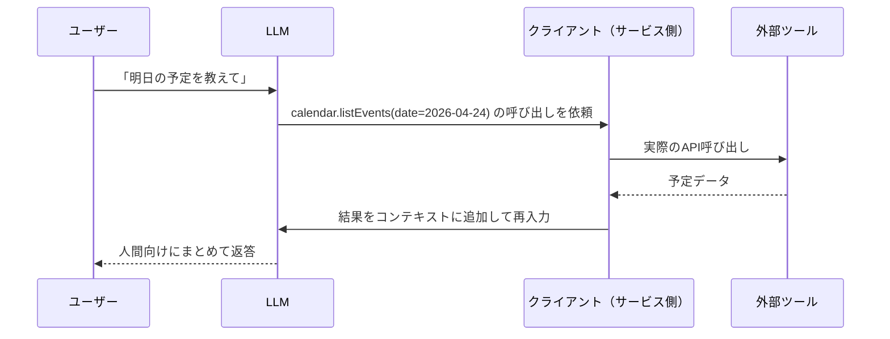
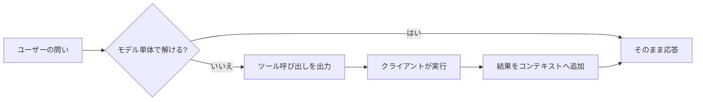

# 4. 外部システムとの接続: ツール呼び出しの仕組み

本章は、生成AIが外部システムと繋がる仕組みを、「**ツール呼び出し**」という1つの仕組みに集約して整理します。チャット欄しか持たないAIがGmailを読んだりカレンダーを参照したり社内文書を引いたりできるのは、AI本体がネットワークに出ているからではなく、外側のプログラムに依頼文を渡して動いてもらっているからです。以降の章で登場するコネクタ、MCP、エージェントといった用語は、いずれもこのツール呼び出しを前提に構成されます。

## 対象読者と前提

- [1章](01-gemini-in-workspace.md)でGeminiを操作し、[2章](02-what-is-generative-ai.md)で生成AIの動作原理の輪郭を読んだ人
- 「コネクタを有効にする」「APIで連携する」といった話の操作面は分かるが、内部で何が動いているかまでは追えていない人

## 本章で参照する用語の最小定義

本文へ進む前に、本章で繰り返し登場する語を一行ずつ示します。厳密な定義や周辺知識は[7章（用語集）](07-terminology.md)で扱います。

| 用語 | 本章での一行定義 |
| ---- | ---- |
| モデル | 文章を生成する本体。Claude Opus や Gemini Pro など |
| プロンプト | AIに渡す依頼文。ユーザーの発話そのもの |
| コンテキスト | AIがいま回答を作るために参照している情報の総体 |
| トークン | 文章の最小単位。課金とコンテキストの上限を測る物差し |
| エージェント | AIがツールを連続して呼び、目的まで自分で進めるモード |
| コネクタ／MCP | ツール呼び出しの経路（本章で詳述） |

語をより広い文脈で押さえたくなった場合は、7章の該当項目を参照すれば、そのまま本章に戻れます。

## モデル単体ではコンテキストに無い情報・操作は扱えない

[2章](02-what-is-generative-ai.md)で見たとおり、生成AIの本体は文章生成のモデルです。ユーザーの発話と、その場で与えられた資料（コンテキスト）を見て、次に出力すべき文字列を確率的に組み立てています。コンテキストに載っていない情報は、モデルがどれだけ高性能でも参照できません。

具体例で確認します。次のような依頼を考えます。

- 「明日の会議の候補時間を空いている枠から3つ挙げて」
- 「最新のプレスリリースの要点を教えて」
- 「この議事録をSlackの #team-weeklyに投稿しておいて」

どれも、コンテキストの外側にある情報や操作を要求しています。カレンダーの中身、学習カットオフ以降のニュース、Slackへの書き込み権限のいずれも、モデル本体は持っていません。持っていない情報は答えられず、持っていない権限の操作は実行できません。

ここから残るのは、「AI自身がネットワークに出ていく」のではなく「外側のプログラムに動いてもらう」経路をどう用意するか、という設計の問いです。その経路の正体が、本章の主題であるツール呼び出しです。

## ツール呼び出しは依頼文をAIが出力し、外側のプログラムが実行する仕組み

ツール呼び出しは、AIが外部の機能を使うための標準的な約束ごとです。仕組みは次の4ステップで動きます。

1. サービス側が、AIに対して使える道具の一覧（道具の名前、用途、必要な引数）を前もって渡す
2. AIはユーザーの発話を見て、道具が必要だと判断したら「この道具を、この引数で呼び出してください」という構造化された依頼文を出力する
3. AIの外側にいるプログラム（クライアント）が、その依頼文を読み取り、実際のAPIやコマンドを実行する
4. 結果をAIに戻すと、AIはそれを人間向けの日本語にまとめて応答する

押さえておきたいのは、AI本体はネットワークに出ていない点です。AIは依頼文を出力するだけで、実際にネットワークへ出ていくのは外側のプログラムです。客がレストランで厨房に直接行かず、店員にオーダー票を渡す関係に対応します。客がユーザー、店員がAI、オーダー票がツール呼び出しの依頼文、厨房が外部ツールにそれぞれ対応します。

図にすると、次のとおりです。

ツールを使わない従来のチャットと並べると、差が見えやすくなります。

「いつツールを使うか」は、AIが自分で判断します。事前に各ツールの用途と必要な引数が説明として渡されており、AIはユーザーの発話とツールの説明文を確率的に照合し、必要だと判断したときだけ呼び出しを出力します。判断がズレることもあり、結果はプロンプトの書き方とツール側の説明文の質に左右されます。

## 現場で出会う3つの経路は、内部の仕組みが共通している

ツール呼び出しという仕組み自体は1つですが、現場で出会う経路は主に3種類あります。どの経路から入っても、内部で起きていることは同じです。

| 経路 | 誰が道具の一覧を用意するか | 利用者が操作する対象 | 代表例 |
| ---- | ---- | ---- | ---- |
| UI上のコネクタ | サービス提供者（Anthropic／Google等） | チャット画面の設定スイッチ | Gemini側のGoogle Workspace連携、Claudeのコネクタ |
| API ＋ 自前ツール | 自社の開発者 | プログラムのコード | Claude API／Gemini APIの function calling |
| MCP（Model Context Protocol） | MCPサーバの提供者 | クライアントの設定ファイル | Claude Code、各種MCP対応クライアント |

### UI上のコネクタ

ブラウザ版のClaudeやGeminiで、「Googleカレンダーを繋ぐ」「Gmailを繋ぐ」といった設定を有効にするだけの経路です。道具の一覧、認証、呼び出し結果の整形は、サービス提供者側がすべて用意しています。利用者は設定画面で有効化するだけで使い始められますが、使える道具はサービス提供者が用意した範囲に限定されます。

### API ＋ 自前ツール

自社プロダクトにClaude APIやGemini APIを組み込み、自分たちのツールをAIに登録する経路です。ECサイトなら「在庫を引く」「注文を登録する」、社内なら「ナレッジを検索する」などを、各社のfunction calling仕様に沿って登録します。自由度は高いぶん、ツール定義の品質とエラーハンドリングは利用する組織の責任です。本ドキュメントは非エンジニア向けのため深追いはしませんが、社内で「AIチャットに独自機能を持たせたい」という話が出たとき、その実体はおおむねこの経路に該当します。

### MCP（Model Context Protocol）

MCPは、ツール呼び出しを共通プロトコルとして標準化した規格です。Anthropicが2024年に公開し、現在は他社クライアントの対応も進んでいます。位置づけはUSB-Cに近く、AIごとに異なる形のプラグを個別に自作していたところを、規格化によってひとつのMCPサーバを立てれば対応クライアントから同じ作法で呼べる形に変わりました。USB-Cがサーバ、各形のプラグがクライアントごとの個別連携に対応します。

MCPの具体的な使いどころは、Appendix「Claude Code」で扱います。本章ではツール呼び出しに標準規格が生まれた事実を押さえれば、先の章を読み進める前提として十分です。

## ツール呼び出しに関するよくある誤解

ツール呼び出しは、「AIが自ら動いて操作している」という像が想像と結びつきやすく、誤解も生まれやすい領域です。代表的なものを先に並べます。

| 誤解 | 実際はどうか |
| ---- | ---- |
| AIが勝手にインターネットに飛び出していく | 外側のプログラムが、事前に許可された道具しか実行しない。AIは依頼文を出力するだけ |
| 「ツール」は画面を自動操作するものを指す | 多くはAPI経由のデータ取得。画面操作型は別ジャンル（付録「デスクトップの自動化」参照） |
| 一度に1つのツールしか呼べない | モデルによっては並列・連鎖で複数呼べる。最近の主要モデルはおおむね対応している |
| ツールの結果がモデル本体に学習される | 結果はコンテキストに入るだけで、モデルの重みは変わらない（[5章](05-misunderstanding-learning.md)参照） |
| ツール経由のデータは安全 | 呼んだ先のサービスのセキュリティと、道具の設計次第。認証情報の取り扱いは別途検討する（[9章](09-security-individual.md)・[10章](10-security-agent-era.md)参照） |

2番目の誤解はとくに根強く、AIエージェントを画面操作の自動化と同義で受け取っている読者も少なくありません。実際の業務で頻度が高いのは、APIを呼び出して構造化データを取得し、結果を戻す素朴な処理です。見た目は淡白ですが、想定外の事故も起きにくい作り方になっています。

## コネクタ・MCP・エージェントはツール呼び出しの応用

この仕組みを押さえると、以降の章で登場する3つの概念が、同じ仕組みの応用として整理できます。

| 概念 | 位置づけ |
| ---- | ---- |
| コネクタ | サービス側が用意した既製のツール群。利用者は設定画面で有効化するだけで使える |
| MCP | ツール呼び出しを共通化した規格。連携先の追加が、規格に沿って進められる |
| エージェント | 与えられた目的に対して計画を立て、途中結果を見ながら次の手を決め、最終的な成果物までたどり着くよう、ツール呼び出しを連続して行うシステム |

コネクタはツールそのもの、MCPはツールを呼び出す共通規格、エージェントはツール呼び出しを連ねて目的の成果物にたどり着く仕組み、と分けておくと混同しにくくなります。いずれも基盤にはツール呼び出しがあります。後続の章でこれらの概念を扱う際は、本章の仕組みに立ち戻って整理できます。

## まとめ

- AIが外部システムと繋がる仕組みの実体は、ツール呼び出しの依頼をAIが出力し、外側のプログラムが実行し、結果をAIに戻す形である
- モデル本体はネットワークに出ない。実行されるのは、事前に登録・許可された道具だけである
- 現場で出会う経路は主に3つ（UIコネクタ／API＋自前ツール／MCP）あり、内部の仕組みは共通している
- コネクタ・MCP・エージェントはいずれも、ツール呼び出しを基盤とする応用である

次は[5章（「学習」というキーワードの誤解）](05-misunderstanding-learning.md)で、ツール呼び出しと混同されやすい「学習」という言葉の整理に進みます。

## 参考

- Anthropic「Tool use with Claude」: <https://docs.claude.com/en/docs/agents-and-tools/tool-use/overview>（最終確認：2026-04-24）
- Google「Function calling with the Gemini API」: <https://ai.google.dev/gemini-api/docs/function-calling>（最終確認：2026-04-24）
- Anthropic「Model Context Protocol」: <https://modelcontextprotocol.io/>（最終確認：2026-04-24）
