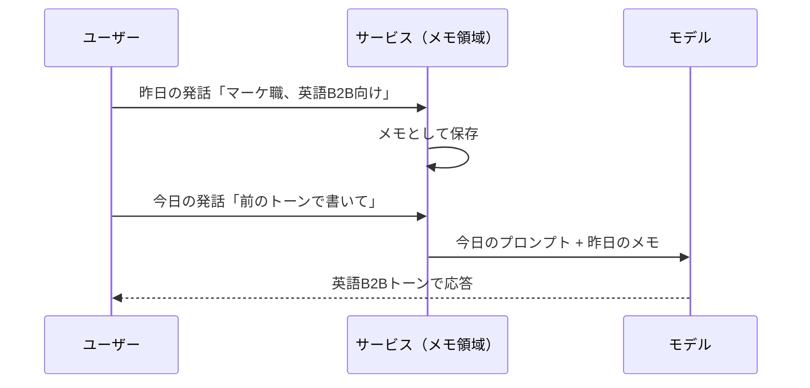

# 「学習」というキーワードの誤解

「AIにこれを入力したら学習されてしまうのでは」。業務でClaudeやGeminiを導入しようとすると、必ず誰かがこの一言を発します。気持ちはとてもよく分かるのですが、この「学習」という単語は、実のところ複数の別物を同じ名前で呼んでいる便利な毛布のようなものです。毛布の中身を一度広げて仕分けしてしまえば、現場の判断はずっと楽になります。

本章では、「学習」と呼ばれがちな3つの現象を分解し、そのうえで「入力データはどう扱われるのか」を、APIと消費者向けUIとで分けて整理します。

## 対象読者と前提

- 1章と2章で、生成AIを実際に触り、大まかな仕組みのイメージを持った人
- 3章で、AIが外部ツールを呼び出す流れをざっくり把握した人
- まだ読んでいない単語が出てきたら、6章（用語）に戻って確認できると思っていただいて構いません

本章の結論を先に一行で言うと、「**あなたが今日チャットに打った文章が、そのまま明日のモデル本体に焼き付く**」ような挙動は、ほとんどのケースで起きません。ただし例外はあり、そこを見分ける語彙を、これから身につけていきます。

## 「学習」と呼ばれる3つの別物

「AIが学習する」と言われたときに、実際に指されている可能性があるのは、以下の3つです。名前を分けてしまえば、混乱はだいぶ収まります。

| 呼び名 | 何が起きているか | 更新されるもの | 関与する人 |
| ---- | ---- | ---- | ---- |
| 事前学習（pretraining） | 大量の文章を読ませてモデル本体を一から作る | モデルの重み（本体） | プロバイダのみ |
| ファインチューニング | 既存モデルを追加データで微調整する | モデルの重み（派生版） | プロバイダ／一部は利用者 |
| コンテキスト／メモリ | 会話の中で情報を覚えているように振る舞う | モデルの外側の記憶領域のみ | 利用者とサービス |

上2つは「モデル本体を作り変える」話、いちばん下は「モデル本体には一切触らず、周りのメモにだけ書き込む」話です。日常の業務で気にする「学習されてしまうのでは」は、実はほとんどの場合、一番下を指しています。順に見ていきましょう。

### 事前学習（pretraining）

モデルをゼロから作るフェーズです。インターネット上の公開テキストや書籍、コードなどを大量に読み込ませ、文章の統計的なパターンを覚え込ませます。

- 実行するのはプロバイダ（Anthropic、Google、OpenAIなど）のみ
- 学習対象データは、プロバイダが選別した巨大なデータセット
- あなたが業務で打ったチャットが、翌日の事前学習データへ即座に混ざることは起きない

事前学習は、大学入学までの十数年にあたる総合教育のようなものです。金曜にあなたが一言つぶやいたからといって、月曜に教科書が差し替わるようなスケール感ではありません。

### ファインチューニング（fine-tuning）

既存のモデルに、追加の教材を読ませて微調整するフェーズです。

- 特定のドメイン（たとえば法務文書や医療文書）に強いモデルを作る用途で使われる
- プロバイダ側で行われることもあれば、利用者が自社データを使ってAPI経由で行うこともある
- **利用者が自分で意図的に始めない限り、勝手に始まることはない**

「学習されそうで怖い」という不安の正体が、ここまでの2つ（事前学習・ファインチューニング）であれば、業務利用の通常フローではまず該当しません。明示的に「ファインチューニングします」というメニューをクリックしない限り、モデル本体は動きません。

### コンテキストとメモリ（いちばんややこしいやつ）

現場で9割方、話題になるのはこちらです。モデル本体はまったく変わらないのに、**あたかも覚えているように振る舞う**現象を指します。

仕組みは3つに分解できます。

- **会話履歴** — いまのスレッド内で交わしたやり取りを、次の応答時にまとめてモデルに再投入している
- **システムプロンプト** — サービス側があらかじめ用意した前提条件や人格の指示
- **メモリ機能／プロジェクト知識** — ユーザーや仕事に関するメモを長期間保存し、次の会話でも参照できるようにする仕組み（例：Claudeの「Projects」に紐づく知識ベース、Geminiの保存済み情報やGemsのカスタム指示）

ここで押さえておきたいのは、**どれもモデルの重みには触らない**ということです。書き込まれるのは、モデルの外側にある記憶領域だけです。6章で紹介した「机の上の資料の山」の比喩で言えば、事前学習は脳そのものの発達、メモリは机に追加した付箋だと思ってください。

## なぜ「覚えている」ように見えるのか

具体例で見てみましょう。あなたが昨日、「私はマーケティング職で、主に英語圏のB2B向けメールを書いています」とAIに伝えたとします。今日、「前に言ったトーンで書いて」と頼むと、ちゃんと英語B2Bトーンで返ってくる。不思議に見えますが、実態は地味です。

モデル自身は昨日のことを覚えていません。**覚えているのは、モデルを呼び出す前に情報を詰めてくれるサービス側の仕組み**です。サービス側がメモを捨てれば、AIもきれいさっぱり忘れます。逆に言えば、メモの設定場所を知っておくと、明示的に消すことができるということです。

## APIと消費者向けUIでは、入力データの扱いが違う

ここからが、情シスや法務の方が本当に気にしているポイントです。入力した内容が「モデルの改善のために使われる」かどうかは、**どこ経由で使っているか**でルールが変わります。

| 経路 | 既定の扱い（一般的な傾向） | 利用者ができる操作 |
| ---- | ---- | ---- |
| 各社のAPI（企業向け） | 入力・出力ともモデル改善の学習に**使わない**ことが多い | 契約と設定で明示的に確認 |
| 各社のビジネス版UI（Google Workspace / Claude for Work など） | 同じく学習に**使わない**ことが多い | 管理者コンソールで設定を確認 |
| 無料／個人向けUI | 学習に使われる場合がある／設定でオプトアウトできることがある | 設定画面でオプトアウト |

あえて「多い」「場合がある」と歯切れの悪い書き方をしているのは、**ここが各社・各プランで、しかもバージョンによって変わる部分だから**です。うっかり断言するのがいちばん危険なので、社内で使う前には、必ず該当プランの公式ドキュメントを一次ソースとして確認してください。

そのうえで、実務上はこうなります。

- 個人のGeminiアカウントや無料Claudeで、社外秘情報をペーストする前に、最低でも一度は利用規約とデータ取り扱いページを確認する
- Google Workspaceのビジネスプランや、各社のエンタープライズ契約を使っているなら、**組織としての合意**がすでに結ばれている可能性が高い。情シスに確認する
- APIを自社プロダクトに組み込むときは、利用規約で「入力内容は学習に使わない」旨を確認し、かつログの保存期間も把握する

## 「学習される／されない」を判断するチェックリスト

社内で判断に迷ったら、次の4つの質問を順番に自問してください。

1. **どのプラン経由か？** 無料の個人プランか、ビジネス／エンタープライズプランか、それともAPIか
2. **そのプランの公式ドキュメントは、入力データの学習利用について何と書いているか？**
3. **オプトアウトできる設定項目があるか？ あるなら、組織の標準設定としてオフにできるか？**
4. **メモリや履歴など、「学習」とは別の保存領域に、意図せず機密情報が残っていないか？**

4つ目がいちばん見落とされがちです。学習利用がオフでも、会話履歴やメモは普通に残ります。使い終わったら適宜消す運用を、組織のルールとしてセットで決めておくと安心です。

## 用語の呼び分け早見表

議論のときに、同じ「学習」という言葉で互いに別の話をしているケースがよくあります。話の軸合わせに、この表を使ってみてください。

| よくある発言 | 実際に指している可能性が高いもの |
| ---- | ---- |
| 「会社の資料をアップしたら学習される？」 | 多くの場合は「ログ／履歴保存」の話（事前学習ではない） |
| 「独自のモデルを育てたい」 | ファインチューニング、またはプロジェクト知識の活用 |
| 「AIが前に言ったことを覚えてる」 | 会話履歴かメモリ機能（モデルの重みは不変） |
| 「モデルのバージョンアップで挙動が変わった」 | プロバイダによる事前学習／調整のやり直し |

## まとめ

- 「学習」には、事前学習・ファインチューニング・コンテキスト／メモリという**3つの別物**が詰め込まれている。まずはこれを分けて話す
- 普段の利用で気になるのは、たいてい3つ目（コンテキストやメモリ）。モデル本体は変わっていない
- 入力データが学習に使われるかどうかは、**どの経路（API／ビジネスUI／個人UI）を使うか**で既定値が違う。プランごとに公式ドキュメントを当たるしかない
- 「学習」の話と「履歴・メモリの保存」の話を、同じ箱に入れない。消すべきものが変わる

## 参考

- Anthropic「Privacy Policy」: <https://www.anthropic.com/legal/privacy>（最終確認：2026-04-23）
- Anthropic「Usage Policies」: <https://www.anthropic.com/legal/aup>（最終確認：2026-04-23）
- Google「Gemini Apps Privacy Hub」: <https://support.google.com/gemini/answer/13594961>（最終確認：2026-04-23）
- Google Cloud「Generative AI and data governance」: <https://cloud.google.com/vertex-ai/generative-ai/docs/data-governance>（最終確認：2026-04-23）
