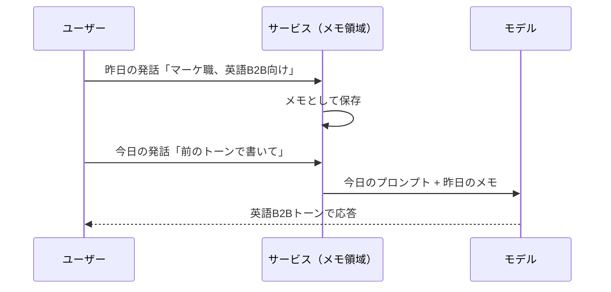

# 5. 「学習」というキーワードの誤解

「AIにこれを入力したら学習されてしまうのでは」。業務でClaudeやGeminiを導入しようとするとき、しばしば聞こえてくる懸念です。この「学習」という単語は、複数の別物を1つの名前でまとめて呼んでいます。そのため現場の議論がかみ合いにくくなります。

本章では、「学習」と呼ばれがちな3つの現象を分解し、そのうえで「入力データはどう扱われるのか」を、APIと消費者向けUIとで分けて整理します。[4章](04-external-system-integration.md)末尾でも触れたとおり、ツール呼び出しと「学習」を切り分けられると、実務の判断軸が定まります。

## 対象読者と前提

- [1章](01-gemini-in-workspace.md)・[2章](02-what-is-generative-ai.md)で、生成AIを実際に触り、大まかな仕組みのイメージを持った人
- [4章](04-external-system-integration.md)で、AIが外部ツールを呼び出す流れを把握した人
- 未習の用語が出てきた場合は、[7章（用語集）](07-terminology.md)から該当項目を引き直して構いません

業務で利用する経路においては、今日チャットに打った文章がそのまま翌日のモデル本体へ反映される挙動は、ほぼ該当しません。例外もあり、それを見分ける語彙を、以下の節で整理します。

## 「学習」と呼ばれる名前は3種類に分かれる

「AIが学習する」と言われたときに、実際に指されている可能性があるのは、以下の3つです。名前を分けて扱うと、議論の対象をそろえやすくなります。

| 呼び名 | 何が起きているか | 更新されるもの | 関与する人 |
| ---- | ---- | ---- | ---- |
| 事前学習（pretraining） | 大量の文章を読ませてモデル本体を一から作る | モデルの重み（本体） | プロバイダのみ |
| ファインチューニング | 既存モデルを追加データで微調整する | モデルの重み（派生版） | プロバイダ／一部は利用者 |
| コンテキスト／メモリ | 会話の中で情報を覚えているように振る舞う | モデルの外側の記憶領域のみ | 利用者とサービス |

上2つは「モデル本体を作り変える」話、3つ目は「モデル本体には一切触らず、周りの記憶領域にだけ書き込む」話です。日常の業務で意識される「学習されてしまうのでは」は、ほとんどの場合3つ目を指しています。以下、順に整理します。

### 事前学習（pretraining）

モデルをゼロから作るフェーズです。インターネット上の公開テキストや書籍、コードなどを大量に読み込ませ、文章の統計的なパターンを覚え込ませます。

- 実行するのはプロバイダ（Anthropic、Google、OpenAIなど）のみ
- 学習対象データは、プロバイダが選別した巨大なデータセット
- 業務で打ったチャットが、翌日の事前学習データへ即座に混ざることはない

事前学習は数か月から年単位で計算資源を投じて行われ、個々の利用者の発話1回や2回で土台側のモデルが入れ替わる作りにはなっていません。

### ファインチューニング（fine-tuning）

既存のモデルに、追加の教材を読ませて微調整するフェーズです。

- 特定のドメイン（たとえば法務文書や医療文書）に強いモデルを作る用途で使われる
- プロバイダ側で行われることもあれば、利用者が自社データを使ってAPI経由で行うこともある
- 利用者が自分で意図的に始めない限り、自動で始まることはない

ここまでの2つ（事前学習・ファインチューニング）は、業務利用の通常フローで自動的に発生することはありません。明示的に「ファインチューニングします」というメニューを選択しない限り、モデル本体は更新されません。

### コンテキストとメモリは、モデル本体ではなく外側に書き込む

実務で「学習されてしまうのでは」と話題になるのは、ほとんどの場合この領域です。モデル本体はまったく変わらないのに、覚えているように振る舞う現象を指します。

仕組みは3つに分解できます。

- **会話履歴** — いまのスレッド内で交わしたやり取りを、次の応答時にまとめてモデルに再投入する
- **システムプロンプト** — サービス側があらかじめ用意した前提条件や人格の指示
- **メモリ機能／プロジェクト知識** — ユーザーや仕事に関するメモを長期間保存し、次の会話でも参照できるようにする仕組み（例：Claudeの「Projects」に紐づく知識ベース、Geminiの保存済み情報やGemsのカスタム指示）

いずれも、モデルの重みには書き込みません。書き込まれるのはモデルの外側にある記憶領域だけです。[7章（用語集）](07-terminology.md)ではコンテキストを「机の上の資料の山」にたとえています。その対応関係に沿うと、事前学習は脳そのものの発達、メモリは机へ追加する付箋にあたります。

## 「覚えている」ように見えるのは、サービス側がメモを差し戻しているため

具体例で示します。昨日、「私はマーケティング職で、主に英語圏のB2B向けメールを書いています」とAIに伝えたとします。今日、「前に言ったトーンで書いて」と頼むと、英語B2Bトーンで応答が返ってきます。実態は次の流れです。

モデル自身は昨日のことを覚えていません。覚えているのは、モデルを呼び出す前にメモを差し込むサービス側です。サービス側がメモを破棄すれば、AIも参照先を失います。メモの保存場所を把握しておけば、必要なときに明示的に消去できます。

## APIと消費者向けUIでは、入力データの扱いが違う

ここからは、組織のデータ取り扱いを担当する役割（法務・セキュリティなど、組織により分担は異なります）の関心と直接重なる領域です。入力した内容が「モデルの改善のために使われる」かどうかは、どの経路で利用しているかで既定値が変わります。

| 経路 | 既定の扱い（一般的な傾向） | 利用者ができる操作 |
| ---- | ---- | ---- |
| 各社のAPI（企業向け） | 入力・出力ともモデル改善の学習に使わないことが多い | 契約と設定で明示的に確認 |
| 各社のビジネス版UI（Google Workspace / Claude for Work など） | 同じく学習に使わないことが多い | 管理者コンソールで設定を確認 |
| 無料／個人向けUI | 学習に使われる場合がある／設定でオプトアウトできることがある | 設定画面でオプトアウト |

「多い」「場合がある」とぼかして書いているのは、各社・各プランで扱いが分かれ、バージョンによっても変わる領域だからです。社内で利用する前には、該当プランの公式ドキュメントを一次ソースとして確認します。

実務上の対応は、経路ごとに次のように整理できます。

- 個人のGeminiアカウントや無料Claudeで社外秘情報を入力する前に、利用規約とデータ取り扱いページを確認する
- Google Workspaceのビジネスプランや、各社のエンタープライズ契約を使っている場合、組織としての合意がすでに結ばれている可能性が高い。契約・利用ルールを把握している担当（IT・法務・セキュリティなど）に確認する
- APIを自社プロダクトに組み込む場合は、利用規約で「入力内容は学習に使わない」旨を確認し、ログの保存期間も把握する

## 「学習される／されない」を判断するチェックリスト

社内で判断に迷う場合は、次の4つを順に確認します。

1. どのプラン経由か：無料の個人プランか、ビジネス／エンタープライズプランか、API経由か
2. そのプランの公式ドキュメントは、入力データの学習利用について何と書いているか
3. オプトアウトできる設定項目があるか。あるなら、組織の標準設定としてオフにできるか
4. メモリや履歴など、「学習」とは別の保存領域に、意図せず機密情報が残っていないか

見落としやすいのは4番目です。学習利用がオフでも、会話履歴やメモは通常どおり残ります。使い終わったら消すルールを組織の標準として決めておくと、扱いが定まります。

## 同じ「学習」で別の話をしているときは、語の対応を確認する

同じ「学習」という言葉で別々の現象を指しているケースは多くあります。発言の意図を本章の3区分に対応させると、議論の対象を固定できます。

| よくある発言 | 実際に指している可能性が高いもの |
| ---- | ---- |
| 「会社の資料をアップしたら学習される？」 | 多くの場合は「ログ／履歴保存」の話（事前学習ではない） |
| 「独自のモデルを育てたい」 | ファインチューニング、またはプロジェクト知識の活用 |
| 「AIが前に言ったことを覚えてる」 | 会話履歴かメモリ機能（モデルの重みは不変） |
| 「モデルのバージョンアップで挙動が変わった」 | プロバイダによる事前学習／調整のやり直し |

## まとめ

- 「学習」には、事前学習・ファインチューニング・コンテキスト／メモリの3種類が含まれる。まずはこれを分けて話す
- 普段の利用で気になるのは、ほとんどがコンテキストやメモリにあたる。モデル本体は変わっていない
- 入力データが学習に使われるかどうかは、API・ビジネスUI・個人UIのどの経路を使うかで既定値が違う。プランごとに公式ドキュメントを確認する
- 「学習」と「履歴・メモリの保存」は別問題として扱う。消去すべき対象が変わる

## 参考

- Anthropic「Privacy Policy」: <https://www.anthropic.com/legal/privacy>（最終確認：2026-04-24）
- Anthropic「Usage Policies」: <https://www.anthropic.com/legal/aup>（最終確認：2026-04-24）
- Google「Gemini Apps Privacy Hub」: <https://support.google.com/gemini/answer/13594961>（最終確認：2026-04-24）
- Google Cloud「Generative AI and data governance」: <https://cloud.google.com/vertex-ai/generative-ai/docs/data-governance>（最終確認：2026-04-24）
