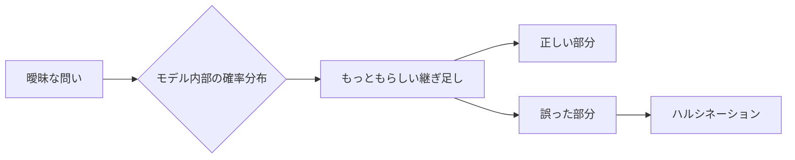
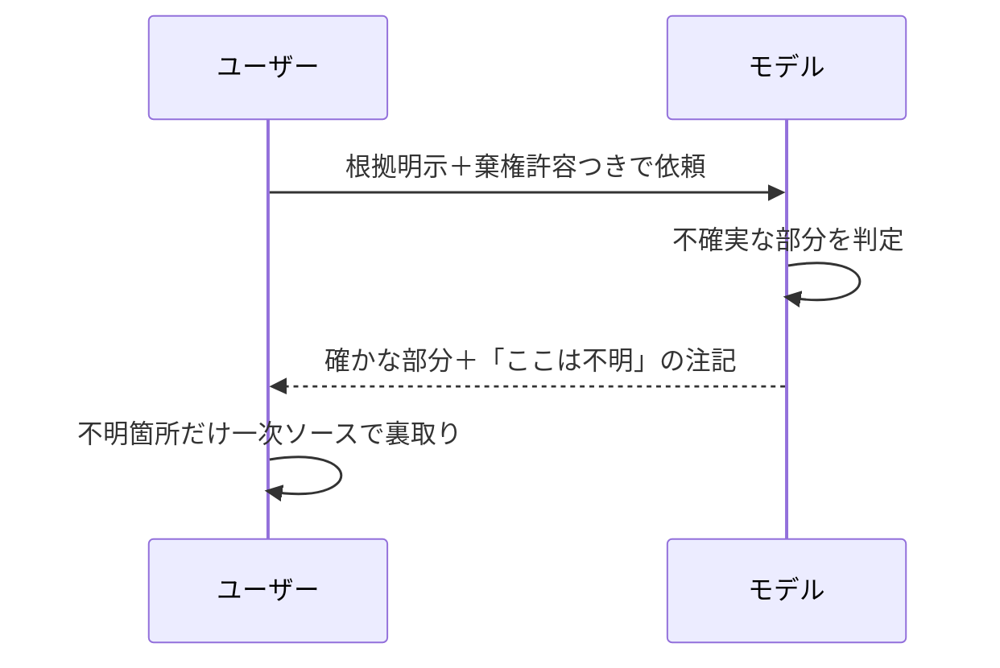

# 6. ハルシネーション: 「AIが知っていること」のリテラシー

AIに何かを尋ねると、文体としては自然な日本語のまま、事実誤認の混じった答えが返ってくることがあります。これが「ハルシネーション」と呼ばれる現象です。文面が整っていることと、内容が正しいことは別の事柄である、という前提で受け取る必要があります。

本章ではまず、ハルシネーションが起きる仕組みを4つの構造に分解します。次に「AIの知識はいつ時点の、どの範囲のものなのか」を整理します。そのうえで、業務で生成物を受け取ったときの裏取りの実務に話を進めます。

## 対象読者と前提

- [2章](02-what-is-generative-ai.md)で「生成AIはだいたい何をしているか」を読んだ人
- [5章](05-misunderstanding-learning.md)で「学習」の3区分（事前学習・ファインチューニング・コンテキスト／メモリ）を踏まえた人
- 用語で迷った場合は、[7章（用語集）](07-terminology.md)から該当項目を引き直して構いません

本章の着地点は、AIが「知らないことを知らないと答える」のが得意ではない、という性質の理由を理解し、それを補う段取りを利用者側で組めるようにすることです。

## 「もっともらしい嘘」が現象の核

ハルシネーションを日本語に置き換えると「もっともらしい嘘」です。重心は「もっともらしい」のほうにあり、文法・用語・文脈のいずれを取っても自然な日本語の中に事実誤認が混じる、という現象を指します。単なるでたらめではなく、読み手が疑いにくい体裁で出力される点が、扱いを難しくしています。

実務でよく出会う例を挙げます。

- 存在しない論文や書籍を、著者名と年号つきで引用する
- 実在する人物の経歴に、実在しないポジションを混ぜ込む
- 過去に有効だった仕様を、現行仕様として説明する
- APIに実在しない引数を、自然な使用例として書く

いずれも「意図して欺こうとしている」結果ではありません。次の節で見るとおり、自然に続く文として確率的にそう選ばれた結果です。動機を介さずに虚偽が混じるという形であるため、対策も「悪意を抑える」方向では立ちません。

## ハルシネーションは4つの構造から起きる

原因は1つに限らず、少なくとも次の4つが重なって発生します。一括して扱うと、対策の打ち分けができなくなります。

| 構造 | 何が起きているか | 現場での現れ方 |
| ---- | ---- | ---- |
| 目的のずれ | モデルは「自然に続く文」を選ぶ訓練を受けている | 知らないことでも、自然な体裁で埋めにくる |
| 棄権の訓練不足 | 「分かりません」と答える例を十分に学んでいない | 自信のある語調で誤答する |
| 文脈の揺らぎ | 長いやり取りで前提や制約が後ろに押しやられる | 途中から矛盾した回答に変わる |
| 曖昧な依頼 | 問いの範囲が広く、埋め方の自由度が高い | 同じ依頼でも回答が毎回ぶれる |

それぞれ順に整理します。

### 目的のずれ

[2章](02-what-is-generative-ai.md)で触れたとおり、大規模言語モデルの中核は「次に来るトークンを確率で選ぶ」仕組みです。事前学習の主目的は、自然な文章の続きを統計的に学ぶことであり、事実性そのものは直接の評価軸としては置かれていません。続く指示追従の学習や人間の好みに寄せる調整で事実性に関わる補正は加わりますが、確率で「自然な続き」を選ぶ土台の上で動く点は変わらないため、目的のずれは構造として残ります。

最適化の中心に置かれているのは「自然に続く文を選ぶこと」であり、その続きの真偽は最適化の対象として直接には測られていません。ここが第一のずれにあたります。

### 棄権の訓練不足

近年のモデルは、事後のチューニングで「分からないときは分からないと言う」振る舞いをかなり学んでいます。とはいえ、事実とごく近い誤りや、専門性の高い話題では、棄権より「それらしく答える」を選びがちです。

棄権は、明示的に許可されない限り選ばれにくい振る舞いです。経験的にも、利用者から棄権を許可されない設定では、「分かりません」で終える応答よりも「何かを答える」応答のほうへ偏りやすい傾向が観察されます。利用者の側で「分からないときは分からないと書いてよい」と明示すると、棄権の選択肢を取りやすくなります。

### 文脈の揺らぎ

長い会話になるほど、最初に与えた前提や制約は、会話履歴の後方に押しやられます。コンテキストウィンドウからはみ出した情報は、[7章（用語集）](07-terminology.md)で扱うとおり、参照対象から外れます。

この揺らぎは段階的に進みます。最初は前提を踏まえた回答だったのに、10往復目には前提を見失った回答に変わる、という形で現れます。モデルが嘘をついたのではなく、前提がコンテキストウィンドウから外れて、参照されなくなった状態にあたります。

### 曖昧な依頼

「いい感じに書いて」「詳しく教えて」のような依頼は、モデルに広い選択肢を与えます。選択肢が広いほど、埋め方のブレ幅は大きくなり、事実にあたる部分も一緒に揺れます。

「問いを詳しく書くと誤りが減る」という経験則は、この性質の裏返しです。指示の範囲を狭めると、確率分布も狭まり、結果として再現性が上がります。

## AIの「知識」には時点と範囲がある

ハルシネーションと並んで押さえておきたい前提が、AIが知っていることの時点と範囲です。ここを誤解すると、古い情報を新しいものとして受け取ってしまいます。

### 学習データのカットオフ

モデルは、ある日付までのデータで事前学習されています。この日付を**学習カットオフ**（knowledge cutoff）と呼びます。カットオフ以後に起きたこと、公開されたことは、モデルの中には入っていません。

カットオフはモデルごとに異なります。最新の値は公式ドキュメントを一次ソースとして確認してください。

| モデル側の情報源 | 例 |
| ---- | ---- |
| Anthropic | 各モデルのドキュメントに `Training data cutoff` として記載 |
| Google | Gemini APIドキュメントのモデル一覧に記載 |
| OpenAI | モデルのリファレンスに記載 |

ただし「最新モデルなら最新情報を持っている」とは限りません。カットオフ直前の出来事は、学習データ中で言及される量がまだ少なく、結果としてその時期の情報は手薄になる傾向があります。新しい話題ほど信頼度が下がりやすいという前提は、裏取りが必要になる場面を判断するときの目安になります。

### コンテキストで補えるもの／補えないもの

カットオフ以後の情報は、会話のコンテキストに入れれば参照できます。添付資料、Webコネクタの取得結果、RAG（検索拡張）で引いた文書などがこれにあたります。コンテキストに入れた情報は、モデルの重みを書き換えないまま、一時的な参照対象として扱われます。

| 補える | 補えない |
| ---- | ---- |
| 添付した社内資料やURL先のテキスト | モデル本体の思考パターンや常識 |
| コネクタで引いた検索結果、メール、カレンダー | 学習カットオフ以前の知識の「上書き」 |
| システムプロンプトによる役割の指示 | ネット全体のリアルタイム事情（検索しないかぎり） |

注意が必要なのは、コンテキストで渡した情報が常に優先される、とは限らない点です。応答の生成時には、与えられた資料や会話履歴と、訓練を通じて獲得した応答の傾向の双方が参照されます。両者に矛盾があるときに、必ず「与えられた資料を正」と判断するとは限りません。プロンプトで「この資料を優先してください」と明示するのが安全です。

## 出力の裏取りは利用者の責任である

ここからは、受け取った出力に対する実務の話です。出力の正しさを最終判定するのはAIではなく、使う側です。AIの出力は、確信のある語調で書かれた下書きとして扱い、最終確認は利用者が担当する、という分担で運用します。

### 裏取りはリスクの軽重で配分する

すべての出力に同じ熱量で裏を取る必要はありません。リスクの軽重で4段階に整理しておくと、配分の目安になります。

| 領域 | 裏取りの必要度 | 代表例 |
| ---- | ---- | ---- |
| 対外的に署名する文書 | 高（一次ソースまで遡る） | 契約書、IR資料、プレスリリース |
| 社内の意思決定資料 | 中〜高（事実系は必ず照合） | 企画書、調査レポート |
| 下書きや要約 | 中（重要な数字と固有名詞を確認） | 議事録、メール下書き |
| 発想や雑談 | 低（明らかな誤りだけ直す） | ブレスト、たとえ話 |

下の段ほど、誤りが混じったときの影響範囲が小さい領域にあたります。

### 裏取りの具体的なやり方

実務で取り入れやすい順に、手間の軽いものから重いものへ並べます。

- **自己照合** — モデル自身に「その情報源のURLを教えてください」と追加で聞く。出てきたURLを開いて到達ページを確認する
- **別モデルで再質問** — Claudeに聞いた事実をGeminiで照合する、あるいは逆。回答がそろわなければ、少なくとも一方、ときに両方が怪しい
- **一次ソース確認** — 公式ドキュメント、論文、法令、プレスリリースに直接当たる。手間はかかるが、対外資料では必須
- **検索結果との突き合わせ** — Web検索つきのモードで尋ね、引用URLをそのまま開く

自己照合だけでハルシネーションが消えるわけではありません。モデルは、存在しないURLや存在しない論文タイトルも自然な体裁で返します。URLが返ってきた時点で安心せず、必ずページを開き、本文に該当の記述があるかを自身で確認してください。

### 依頼の書き方で発生率を下げる

依頼の書き方だけで誤りをゼロにはできませんが、発生率は下げられます。観点は3つです。

- **根拠の明示を要求**。たとえば「出典があれば併記し、無ければ『出典なし』と明記してください」と書き添える
- **棄権の許容**。たとえば「分からないときは、推測せず『分かりません』と答えてください」と付け加える
- **範囲の限定**。たとえば「学習カットオフ以降の価格や仕様については推測せず、その旨を書いてください」のように、対象の期間や領域を絞る

3つのうち、棄権の許容は手数のわりに変化が現れやすい指示です。明示的に許可されるだけで、モデルが「分かりません」と答える選択肢を取りやすくなります。

## 受け取り時のチェックリスト

出力をそのまま使ってよいかを判断するときは、次の順で点検します。

1. その事実は、モデルの学習カットオフ以後のものではないか。以後なら、コンテキストで補えていなければ疑う
2. 固有名詞と数字は、一次ソースに当たれるか。当たれないなら、別モデルか検索で照合する
3. 同じ質問を別の聞き方でしたとき、答えは同じか。揺れるなら、その部分は確定情報ではない
4. この出力のリスク階層はどこか。対外署名なら一次ソースまで、発想用途なら軽く済ませる、と切り分ける

3番目は手数のわりに有効です。同じ事実を別の文脈で聞いたときに答えが一貫しないなら、モデル側も確信を持っていない部分にあたります。

## 状況別の対応早見表

| 状況 | 最初にすること |
| ---- | ---- |
| 数字や固有名詞が出てきた | 一次ソースのURLを要求し、ページを開いて確認する |
| 最近の話題を質問した | 学習カットオフと検索機能の有無を確認する |
| 長い会話で矛盾が出た | 前提を要約し、新しいスレッドで仕切り直す |
| 専門分野の助言が欲しい | 分野の専門用語で、根拠つきで返させる |

## まとめ

- ハルシネーションは「自然に続く文」を選ぶ仕組みの副作用として起き、目的のずれ・棄権の訓練不足・文脈の揺らぎ・曖昧な依頼の4構造が重なる
- AIの知識には学習カットオフがあり、それ以後の情報はコンテキストで補う必要がある
- 出力の裏取りは利用者の責任であり、対外署名・社内資料・下書き・発想の4階層で配分する
- 依頼に「根拠の明示／棄権の許容／範囲の限定」を加えると、誤りの発生率を下げられる

## 参考

- Anthropic「Claude models overview」: <https://docs.anthropic.com/en/docs/about-claude/models>（最終確認：2026-04-24）
- Google「Gemini models」: <https://ai.google.dev/gemini-api/docs/models>（最終確認：2026-04-24）
- OpenAI「Models」: <https://platform.openai.com/docs/models>（最終確認：2026-04-24）
- Ji, Ziwei et al.「Survey of Hallucination in Natural Language Generation」: <https://dl.acm.org/doi/10.1145/3571730>（最終確認：2026-04-24）
