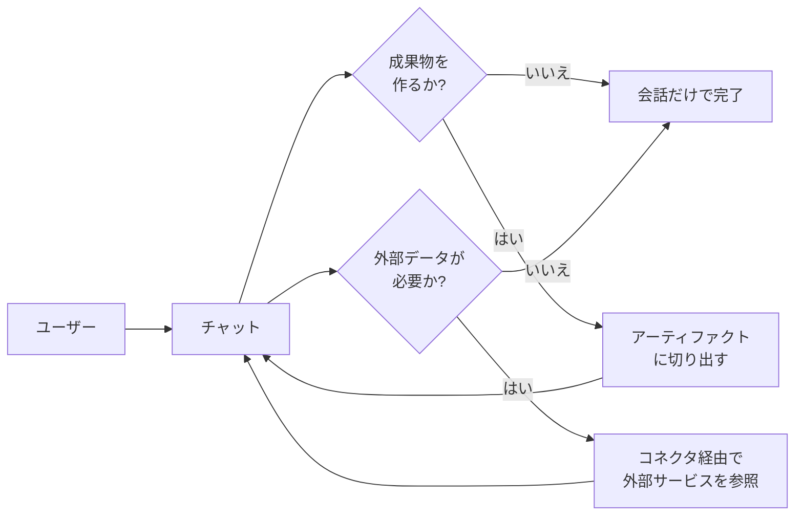
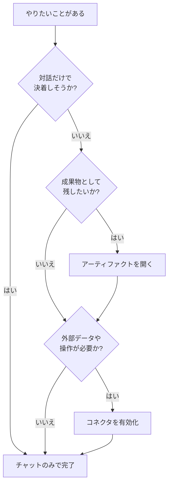

# 7. 生成AIでできること (共通編): チャット・アーティファクト・コネクタの3本柱

「ClaudeとGemini、結局どっちを使えばいいの？」という質問を、筆者はたぶん今月だけで30回は聞きました。切実な問いですが、返答を急ぐよりも、両者を並べて見比べられる共通の物差しを先に用意したいところです。本章では、**ClaudeとGeminiの両方でだいたい同じようにできること**を、3つの切り口で俯瞰します。

10章以降の「個別モデルの使いこなし」は、この章で整理した共通基盤の上に乗っている応用編です。ここでピンと来ない言葉があれば、10〜12章へ進むより先に戻ってきてください。

## 対象読者と前提

- 1章で実際にGeminiを触ったことがある人
- 3章（外部システムとの接続）と6章（用語）にざっと目を通している人
- Claude、Gemini、あるいは両方を業務で使い分けたいが、能力の全体像がまだぼんやりしている人

用語で詰まったら、6章の一覧表に戻るのが近道です。本章ではモデル名より先に「この能力は何者か」を押さえることを優先します。

## 共通で使える能力の3本柱

ブランド違いのサービスを触っていると、細かな画面の違いに目が行きがちですが、**コア機能の構成はすでに似通っています**。本ドキュメントでは以下の3つを共通の柱として扱います。

1. **チャット** — 対話形式で文章を生成・変換する、いちばん手前の能力
2. **アーティファクト** — 会話の外側に「成果物」を置いて編集する能力
3. **コネクタ経由の外部サービス利用** — メールやカレンダー、社内ナレッジなどに繋がる能力

3本柱の関係は、ざっくり次のように並べられます。

チャットがハブで、アーティファクトとコネクタが両脇に生えているイメージです。以下、それぞれを順番に見ていきます。

## チャット

チャットは、ClaudeとGeminiのどちらでも最初に出会う入口です。仕組みは6章で扱ったとおり、ユーザーの依頼文（プロンプト）と直前までのやり取り（コンテキスト）を材料に、次の応答を組み立てています。

共通でだいたいできることを並べると、以下のようになります。

| できること | 業務での例 |
| ---- | ---- |
| 文章の生成・要約・翻訳 | 議事録のドラフト、英文メールの下書き、長文資料の要点抽出 |
| 文体や形式の変換 | 社外向け文面へのトーン調整、箇条書きから表への変形 |
| 質問応答・相談相手 | 仕様の壁打ち、業界用語のかみ砕き、対案の洗い出し |
| 構造化データの生成 | 表、JSON、Markdownテーブルの雛形づくり |
| 画像・音声・PDFなどの読み取り | スクリーンショットからの文字起こし、PDFの要約 |

最後の行のように、最近はテキスト以外の入力もチャットの延長で扱えます。**マルチモーダル**と呼ばれる領域で、Claude・Geminiの双方が画像・PDF・音声の読み取りを標準でサポートしています（動画は対応が広がりつつある段階です）。たとえばスクリーンショットを貼って「ここの項目を表にして」と頼むような使い方は、手軽で効きやすい一例です。はまる場面は業務内容によって違うので、まずは手元の仕事で小さく試すのがおすすめです。

### チャットでつまずきやすいポイント

- **一度に渡す情報量** — コンテキストウィンドウの上限を超えた部分は黙って捨てられる（6章）。長大な資料は小分けが基本
- **履歴の扱い** — 同じセッション内の発言は参照されるが、別セッションには原則引き継がれない。メモリ機能は別枠の話になる
- **プロンプトの粒度** — 雑な依頼は雑な答えで返ってくる。目的・読者・出力形式の3点を書き添えると事故が減る

経験的には、「面倒だから一度に全部やらせよう」と長大な依頼文を投げる日のほうが、二度手間になりやすい傾向があります。チャットは対話です。対話らしく、段階を踏むほうが結果的に早道になります。

## アーティファクト

チャットは流れていく会話ですが、業務ではしばしば「成果物として手元に残したいもの」が生まれます。議事録、スライドの下書き、コードの断片、プレビューできるHTML、などです。これを**会話の外側に置いて、別ペインで繰り返し編集できるようにする仕組み**を、本ドキュメントでは**アーティファクト**と呼びます。

サービスごとの呼び名は微妙に違いますが、基本思想は共通です。

| サービス | 機能名 | ざっくりした位置づけ |
| ---- | ---- | ---- |
| Claude | Artifacts | チャットの隣に「プレビュー付きの作業エリア」が開く |
| Gemini | Canvas | チャットの隣に「文書・コードの編集エリア」が開く |

アーティファクトの何が嬉しいのかを一文で言うと、「**推敲サイクルを会話履歴から切り離せること**」です。会話の中で何度も「もう少し固く」「表に直して」と頼むうちに、履歴が長くなるほどモデルは過去の指示に引きずられがちになります。アーティファクトに切り出しておけば、成果物そのものを指し示して「ここを直して」と頼めるので、指示と対象の結びつきが崩れません。

### アーティファクトの使いどころ

- **文章の仕上げ** — プレスリリース、提案書、社内向けドキュメントのたたき台
- **動くプレビュー** — 簡単なHTML／JavaScriptの試作、グラフのイメージ出し
- **長めのコード断片** — GASのスクリプト、SQLの下書き、設定ファイルの雛形

逆に、短い質問応答や、会話しながら思考整理する場面では、アーティファクトを開く必要はありません。**成果物として外に出したい**ときだけ切り出す、くらいの使い分けで十分です。

### アーティファクトの注意点

- **外部公開の扱い** — 作ったものを他人にリンク共有できるサービスは多いが、社外秘の資料を公開設定のまま放置しないよう要注意
- **実行環境はあくまでプレビュー** — 本番利用を想定していない簡易サンドボックス。業務に乗せるなら、別途デプロイ先を用意する
- **バージョン管理は軽量** — 履歴をさかのぼれる機能はあるが、Gitほど堅牢ではない。重要な版は手元にも保存しておく

## コネクタ経由の外部サービス利用

3本目の柱は、チャットとアーティファクトだけでは届かない「外の情報・外の操作」に手を伸ばす機能です。仕組みは3章で扱ったツール呼び出しそのものですが、読者が普段触るのはたいてい**コネクタ**という形で抽象化された入口です。

Claudeにも、Geminiにも、代表的な外部サービスとのコネクタが用意されています。2026年4月時点の典型的な構成を並べてみます。

| 連携先カテゴリ | Claude側の例 | Gemini側の例 |
| ---- | ---- | ---- |
| メール・カレンダー・ドライブ | Gmail／Googleカレンダー／Googleドライブ（コネクタ） | Google Workspace統合（標準機能） |
| チャット・コラボツール | Slack、Notion、Linear など | Chat、Meet、Docs など（Workspace経由） |
| Web検索 | Web search（ベータ含む） | Google検索統合 |
| 社内ナレッジ | 企業プランでの独自コネクタ／MCP | Google Workspace上の社内文書 |

**使い分けの直感を一言でまとめると、「Workspaceの内側はGeminiが近道、Workspaceの外側や横断利用はClaudeが向いている」です**。ただし、コネクタの対応状況は月単位で変わるので、本ドキュメントを参照するときはかならず最新の公式情報を突き合わせてください。

### コネクタで起きることを誤解しないために

3章で扱ったとおり、コネクタは「AIが自力でネットに飛び出していく装置」ではありません。実際の流れは次のとおりです。

- サービス側が、接続済みアカウントの範囲で**呼べる道具**を用意する
- ユーザーの依頼を読んだモデルが「この道具を、こう呼ぶ」と判断する
- 外側のプログラムが実行し、**結果をコンテキストに戻す**
- モデルはそれを人間向けの文章にまとめて返す

この仕組みがわかっていると、セキュリティの感覚も自然に身につきます。「コネクタを1つ繋ぐ」とは、**その範囲の情報がAIのコンテキストに入る可能性を開くこと**です。情シス観点の整理は8章、エージェントまで踏み込んだ話は9章で扱います。

### コネクタを有効にするときのチェック

- **最小権限で繋ぐ** — 読み取りだけで済む用途に、書き込み権限まで渡していないか
- **個人データと業務データを混ぜない** — 個人アカウント経由で社内データが流れる事故は、いちばん起きがち
- **ログの残り方** — 誰が、どのコネクタで、何を参照したかが追えるか（企業プランでは監査ログが別途提供されていることが多い）

## 3本柱を組み合わせると何ができるか

柱ごとの説明を積んできましたが、実務で効くのは**複数の柱を自然につないだ作業**です。代表的な組み合わせを整理します。

| シナリオ | 使う柱 | 流れのイメージ |
| ---- | ---- | ---- |
| 週次レポートの下書きを自動化 | コネクタ ＋ アーティファクト | カレンダー・メール・ドキュメントから素材を集め、アーティファクトに下書きを吐く |
| 英文メール返信の推敲 | チャット ＋ コネクタ（Gmail） | 受信メールを読み込ませ、返信ドラフトを会話しながら調整 |
| 社内説明用の簡易ページ作成 | チャット ＋ アーティファクト | ドキュメントの要旨を伝え、HTMLプレビューで見せながら直す |
| 社内ナレッジの横断検索 | コネクタ（独自） ＋ チャット | ナレッジ検索コネクタで資料を引き、要約・比較をチャットで詰める |

1本で閉じようとするほど、プロンプトは過剰に複雑になりがちです。**「これはどの柱の仕事か」と分解するだけ**で、段取りの見通しが立てやすくなります。

## 選ぶときの判断フロー

初心者ほど「とりあえず全部有効化してから考える」をやりがちですが、そのコースは高確率で迷子になります。必要な柱から順に広げる判断フローを示します。

「まずチャット、必要ならアーティファクト、足りなければコネクタ」の順で拡張するのが、事故の起きにくい順序です。

## よくある失敗パターン

- **何でもチャット窓で片付けようとする** — 長文資料を履歴へ積み上げるほど、モデルは途中で迷子になる。成果物はアーティファクトへ、参照資料はコネクタへと役割を分ける
- **コネクタを入れっぱなしにする** — 役目を終えたコネクタは外す。連携を増やすほど、コンテキストへ入り得る情報が増える
- **サービス間で同じプロンプトを使い回す** — ClaudeとGeminiでは既定のシステムプロンプトや振る舞いが違う。「この書き方はClaudeでは効くがGeminiではブレる」といった差は、実際に触って確かめる
- **アーティファクトを本番環境代わりに使う** — あくまでプレビュー用途。実務で使い始める前に、本来のホスティング先へ必ず移す

## まとめ

- ClaudeとGeminiの共通能力は、**チャット／アーティファクト／コネクタ** の3本柱で整理できる
- チャットはハブ、アーティファクトは成果物の置き場、コネクタは外の世界への窓口
- どの柱も、内部では3章で学んだ**ツール呼び出しの原則**の上に乗っている
- 「どの柱の仕事か」を分解してから手を動かすと、プロンプトと段取りの両方が軽くなる
- 個別サービスの機能差や料金・制限は、10〜12章で詳しく扱う

## 参考

- Anthropic「Use Artifacts to share AI-powered apps」: <https://support.anthropic.com/en/articles/9487310-what-are-artifacts-and-how-do-i-use-them>（最終確認：2026-04-24）
- Anthropic「Connectors on Claude.ai」: <https://support.anthropic.com/en/articles/10168395-connectors-on-claude-ai>（最終確認：2026-04-24）
- Google「Gemini Canvas」: <https://support.google.com/gemini/answer/15286292>（最終確認：2026-04-24）
- Google「Gemini in Google Workspace」: <https://workspace.google.com/solutions/ai/>（最終確認：2026-04-24）
