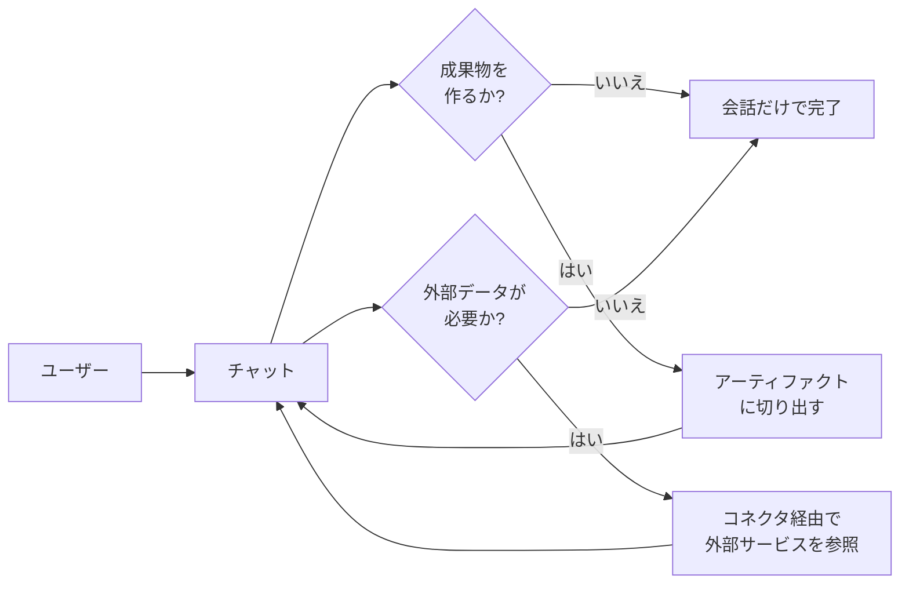
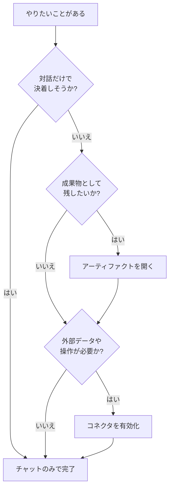

# 8. 生成AIでできること (共通編): チャット・アーティファクト・コネクタの3本柱

「ClaudeとGemini、結局どちらを使えばよいか」という問いは、2026年現在も社内外で繰り返し挙がっています。本章では、この問いに直接答える前段として、両者を並べて見比べるための共通の物差しをまず用意します。具体的には、ClaudeとGeminiが共通して提供する能力をチャット・アーティファクト・コネクタの3つへ分類し、それぞれの役割と使いどころを示します。

11章以降で扱う個別モデルの使いこなしは、本章で整理する共通基盤の応用にあたります。後の章で本章の用語が再登場したときに、参照点として戻れる位置づけです。

## 対象読者と前提

- 1章で実際にGeminiを触ったことがある人
- 4章（外部システムとの接続）と7章（用語）にざっと目を通している人
- Claude、Gemini、あるいは両方を業務で使い分けたいが、能力の全体像がまだ整理できていない人

用語で詰まった場合は、7章の一覧表もあわせて参照してください。本章ではモデル名や製品名より先に「この能力は何を指すか」を押さえることを優先します。

## 共通で使える能力の3本柱

ブランドごとの画面の違いに目が向きやすい一方で、コア機能の構成は両者で似通っています。本ドキュメントでは以下の3つを共通の能力として扱います。

1. **チャット** — 対話形式で文章を生成・変換する、最前面の能力
2. **アーティファクト** — 会話の外側に「成果物」を置いて編集する能力
3. **コネクタ経由の外部サービス利用** — メールやカレンダー、社内ナレッジなどへの接続を担う能力

3つの能力は、ユーザーの依頼を起点に次の流れで関係しています。

依頼を受け取る入口がチャットで、必要に応じてアーティファクトとコネクタが組み合わさる構成です。以降の節で、3つの能力を順に見ていきます。

## チャット

チャットは、ClaudeとGeminiのどちらでも最初に触れる画面です。仕組みは7章で扱ったとおり、ユーザーの依頼文（プロンプト）と直前までのやり取り（コンテキスト）を材料に、次の応答を組み立てています。

両者で共通して扱える代表的な依頼を並べると、以下のようになります。

| できること | 業務での例 |
| ---- | ---- |
| 文章の生成・要約・翻訳 | 議事録のドラフト、英文メールの下書き、長文資料の要点抽出 |
| 文体や形式の変換 | 社外向け文面へのトーン調整、箇条書きから表への変形 |
| 質問応答・相談相手 | 仕様の壁打ち、業界用語のかみ砕き、対案の洗い出し |
| 構造化データの生成 | 表、JSON、Markdownテーブルの雛形づくり |
| 画像・音声・PDFなどの読み取り | スクリーンショットからの文字起こし、PDFの要約 |

最後の行のように、テキスト以外の入力もチャットの延長で扱えます。3章で扱ったマルチモーダルにあたる領域で、Claude・Geminiの双方が画像・PDF・音声の読み取りを標準でサポートしています（動画は対応が広がりつつある段階です）。スクリーンショットを貼って「ここの項目を表にして」と頼むような依頼は、文章入力と同じ要領で扱える代表例です。どの場面で適用できるかは業務内容により異なるため、手元の仕事で小さく試して見極めることになります。

### チャットでつまずきやすいポイント

- 一度に渡す情報量 — コンテキストウィンドウの上限を超えた部分は黙って捨てられる（7章）。長大な資料は小分けにする
- 履歴の扱い — 同じセッション内の発言は参照されるが、別セッションには原則引き継がれない。メモリ機能は別枠の話になる
- プロンプトの粒度 — 雑な依頼は雑な答えで返ってくる。目的・読者・出力形式の3点を書き添えると意図のずれが起きにくい

長大な依頼文を一度に投げるよりも、依頼を段階に分けて応答を確認しながら進めるほうが、結果として修正の往復が少ない進め方になります。

## アーティファクト

チャットは応答が流れていく会話の場ですが、業務では「成果物として手元に残したいもの」が並行して生まれます。議事録、スライドの下書き、コードの断片、プレビューできるHTMLなどです。会話の外側に成果物を置いて、別ペインで繰り返し編集できるようにする仕組みを、本ドキュメントでは**アーティファクト**と呼びます。

サービスごとの呼び名は次のように分かれていますが、基本思想は共通です。

| サービス | 機能名 | 位置づけ |
| ---- | ---- | ---- |
| Claude | Artifacts | チャットの隣に「プレビュー付きの作業エリア」が開く |
| Gemini | Canvas | チャットの隣に「文書・コードの編集エリア」が開く |

アーティファクトを使う利点は、推敲のサイクルを会話履歴から切り離せる点にあります。会話の中で「もう少し固く」「表に直して」と何度も頼むうちに、履歴が長くなるほどモデルは過去の指示に引きずられやすくなります。成果物をアーティファクトに切り出しておけば、成果物そのものを指し示して「ここを直して」と頼めるため、指示と対象の対応がぶれにくくなります。

### アーティファクトの使いどころ

- 文章の仕上げ — プレスリリース、提案書、社内向けドキュメントのたたき台
- 動くプレビュー — 簡単なHTML／JavaScriptの試作、グラフのイメージ出し
- 長めのコード断片 — GASのスクリプト、SQLの下書き、設定ファイルの雛形

短い質問応答や、会話を続けながら考えを整理する場面では、アーティファクトを開く必要はありません。成果物として残したいものがある場合だけ切り出す、と整理できます。

### アーティファクトの注意点

- 外部公開の扱い — 作ったものを他人にリンク共有できるサービスは多いが、社外秘の資料を公開設定のまま残さないようにする
- 実行環境はプレビュー用途 — 本番利用を想定していない簡易サンドボックス。業務で常用する場合は別途デプロイ先を用意する
- バージョン管理は軽量 — 履歴をさかのぼれる機能はあるが、Gitほど厳密ではない。重要な版は手元にも保存しておく

## コネクタ経由の外部サービス利用

3つ目の能力は、チャットとアーティファクトだけでは扱えない外部情報や外部操作を取り込む機能です。仕組みは4章で扱ったツール呼び出しそのものです。利用者から見えるときは、**コネクタ**という名称に集約されています。

ClaudeとGeminiの双方に、代表的な外部サービスとのコネクタが用意されています。本章では両者の対応コネクタと使い分けの整理に集中し、個別サービスの詳細は11章・13章で扱います。

次の表は2026年4月時点の典型的な構成です（最終確認：2026-04-24）。

| 連携先カテゴリ | Claude側の例 | Gemini側の例 |
| ---- | ---- | ---- |
| メール・カレンダー・ドライブ | Gmail／Googleカレンダー／Googleドライブ（コネクタ） | Google Workspace統合（標準機能） |
| チャット・コラボツール | Slack、Notion、Linear など | Chat、Meet、Docs など（Workspace経由） |
| Web検索 | Web search（ベータ含む） | Google検索統合 |
| 社内ナレッジ | 企業プランでの独自コネクタ／MCP | Google Workspace上の社内文書 |

コネクタの一覧は月単位で入れ替わります。社内資料へ引用するときは、本ドキュメントを孫引きせず、必ず各社の公式ページで最新の対応状況を確認してください。

### 両社の使い分け早見表

おおまかな目安は、Workspaceの内側やブラウザで開いているWebページを材料にする作業はGemini、Workspace外のSaaS連携や独自ツールとのMCP連携はClaudeに寄せる、という二分です。もう少し粒度を上げると次のように並べられます（最終確認：2026-04-24）。

| 状況 | 向いているほう | 理由 |
| ---- | ---- | ---- |
| Docs・Gmailなど、Workspaceアプリの画面に居たまま手伝ってほしい | Gemini | サイドパネル統合により画面遷移なしで利用できる |
| 画像・音声・動画を混ぜた素材を一度に扱いたい | Gemini | マルチモーダルの対応幅が広い |
| Googleドキュメントに下書きをそのまま流し込みたい | Gemini | CanvasからDocsへのエクスポートが直結している |
| ブラウザで開いているWebページや複数タブを材料に調べ物・比較を進めたい | Gemini | Gemini in Chromeのサイドパネルから、現在のタブや指定した複数タブを横断して扱える |
| Slack・Notion・HubSpotなどWorkspace外のSaaSを材料にしたい | Claude | 標準コネクタの選択肢が広い |
| 社内の独自ツールにMCPで繋いで自動化したい | Claude | リモートMCPの登録自由度が高い |
| 動くプレビュー付きの試作を公開リンクで見せたい | Claude | Artifactsの公開リンクがそのまま使える |

この早見表は方向感を整理するための一次切り分けです。コネクタの提供状況は月単位で動くため、半年後には配置が変わっている前提で参照してください。Gemini側の具体像は[11章](11-gemini-advanced.md)、Claude側の具体像は[13章](13-claude.md)で扱います。

### コネクタで起きることを誤解しないために

4章で扱ったとおり、コネクタはモデルが自力でインターネットへアクセスする仕組みではありません。実際の流れは次の4段階です。

- サービス側が、接続済みアカウントの範囲で呼び出せる外部機能を用意する
- ユーザーの依頼を読んだモデルが、どの機能をどの引数で呼び出すかを判断する
- 外側のプログラムが実行し、結果をコンテキストに戻す
- モデルが、戻ってきた結果を人間向けの文章にまとめて返す

この流れを把握していれば、セキュリティ上の判断も同じ枠組みで進められます。コネクタを1つ有効にすることは、その範囲の情報がAIのコンテキストに入りうる経路を1つ増やすことを意味します。組織のルールと利用者の分担を観点ごとに並べる話は9章、エージェントまで踏み込んだ話は10章で扱います。

### コネクタを有効にするときのチェック

- 最小権限で繋ぐ — 読み取りだけで済む用途に、書き込み権限まで渡していないか
- 個人データと業務データを混ぜない — 個人アカウント経由で業務データが流れる経路は誤操作の影響範囲が大きい
- ログの残り方 — 利用者・コネクタ・参照対象を後から追跡できる仕組みの有無（企業プランでは監査ログを別途取得できることもある）

## 3つの能力を組み合わせると何ができるか

ここまで能力ごとの説明を積み上げてきましたが、実務では複数の能力を組み合わせる場面が中心になります。代表的な組み合わせを整理します。

| シナリオ | 使う能力 | 流れの整理 |
| ---- | ---- | ---- |
| 週次レポートの下書きを自動化 | コネクタ ＋ アーティファクト | カレンダー・メール・ドキュメントから素材を集め、アーティファクトに下書きを生成する |
| 英文メール返信の推敲 | チャット ＋ コネクタ（Gmail） | 受信メールを読み込ませ、返信ドラフトを会話しながら調整する |
| 社内説明用の簡易ページ作成 | チャット ＋ アーティファクト | ドキュメントの要旨を伝え、HTMLプレビューで見せながら直す |
| 社内ナレッジの横断検索 | コネクタ（独自） ＋ チャット | ナレッジ検索コネクタで資料を引き、要約・比較をチャットで詰める |

1つの能力だけで完結させようとするほど、プロンプトは複雑になりがちです。依頼を「どの能力で扱う作業か」に分解しておくと、段取りの見通しを立てやすくなります。

## 選ぶときの判断フロー

最初から全コネクタを有効化して進めると、コンテキストに入る情報源が増えすぎて意図したとおりの応答を得にくくなります。必要な能力から順に広げる判断フローを示します。

「まずチャット、必要ならアーティファクト、足りなければコネクタ」の順で拡張するのが、誤操作や情報の混入を起こしにくい順序です。

## よくある失敗パターン

- チャット内で完結させようとする — 長文資料を履歴に積み上げるほど、モデルは過去の指示と現在の依頼の対応を取りにくくなる。成果物はアーティファクトへ、参照資料はコネクタへと役割を分ける
- 使い終えたコネクタを有効化したまま残す — コネクタを増やすほど、コンテキストに入りうる情報の範囲が広がる。役割を終えた連携は無効化する
- サービス間で同じプロンプトを使い回す — ClaudeとGeminiでは既定のシステムプロンプトや応答の傾向が異なる。同じ依頼文でも応答が変わるため、サービスごとに調整する
- アーティファクトを本番環境の代用にする — 簡易サンドボックスという位置づけのため、業務で常用する前に本来のホスティング先へ移す

## まとめ

- ClaudeとGeminiが共通して提供する能力は、チャット・アーティファクト・コネクタの3つに整理できる
- チャットが依頼の起点、アーティファクトが推敲対象を切り出す場所、コネクタが外部情報・外部操作を取り込む経路、という役割分担になる
- いずれの能力も、4章で扱ったツール呼び出しを前提に組み立てられている
- どの能力で扱う依頼かを最初に切り分けておくと、プロンプトと段取りの両方を整理しやすくなる。個別サービスの機能差や料金・制限は10〜13章で扱う

## 参考

- Anthropic「Use Artifacts to share AI-powered apps」: <https://support.anthropic.com/en/articles/9487310-what-are-artifacts-and-how-do-i-use-them>（最終確認：2026-04-24）
- Anthropic「Connectors on Claude.ai」: <https://support.anthropic.com/en/articles/10168395-connectors-on-claude-ai>（最終確認：2026-04-24）
- Google「Gemini Canvas」: <https://support.google.com/gemini/answer/15286292>（最終確認：2026-04-24）
- Google「Gemini in Google Workspace」: <https://workspace.google.com/solutions/ai/>（最終確認：2026-04-24）
