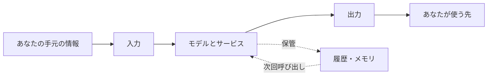
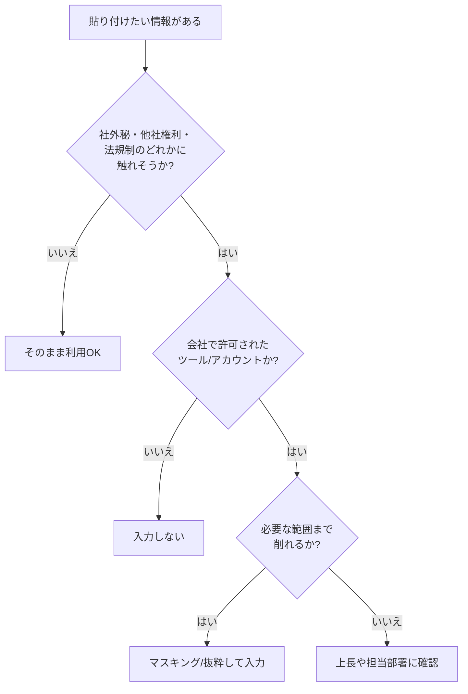

# 8. セキュリティ (個人利用編): 入出力・履歴の扱いと組織ルールの読み解き方

「これ、AIに貼っても大丈夫ですかね？」と、勤め先のチャットで誰かが尋ねる場面を、あなたも一度は見かけたことがあるはずです。ここまでの章で「学習」やハルシネーションといった怖がられがちな論点はかなりほぐしてきたので、本章ではもう一段、**普段の業務でツールを手に取るとき、自分の手元で何を気にすればよいか**を整理します。

本章の前提はシンプルです。読者は組織のガバナンスを設計する立場ではなく、ただ仕事を前に進めたい一人のユーザーです。「気をつけるべきことが多すぎて、結局何もできない」という状態にならないよう、論点を3つの箱に分けて、順に手渡していきます。

## 対象読者と前提

- [1章](01-gemini-in-workspace.md)や[7章](07-common-capabilities.md)で、ClaudeやGeminiを業務で触った経験がある人
- [4章（「学習」というキーワードの誤解）](04-misunderstanding-learning.md)で、入力データがモデル本体に焼き付くような挙動は普段起きない、という話に目を通した人
- 出力を受け取ったあとの裏取りは[5章（ハルシネーション）](05-hallucination-and-knowledge-literacy.md)で扱い済み。本章では「受け取ったあと、どう扱うか」に集中する

本章のゴールは、組織が一部の使い方にブレーキをかけるのはなぜか、その**仕組み側の理屈**を読者自身がたどれるようになることです。ルールを丸暗記するよりも、理屈で分かっていたほうが、現場で判断がつきやすくなります。

## まず、セキュリティの論点を3つの箱に分ける

「AIのセキュリティ」と言われて思い浮かぶものは、たいていこの3つに分類できます。

1. **入力** — 何を渡してよくて、何を渡すと困るのか
2. **出力** — 返ってきた文章や成果物を、どこまで信じて、どこに出してよいのか
3. **履歴とメモリ** — 一度渡したやり取りは、どこに、どれくらい残るのか

3つの関係は、時系列に沿うとすっきり見えます。

「入力と出力の事故」は目に見えますが、「履歴とメモリの事故」は静かに起きて、あとから発覚します。3つをひとまとめにすると判断がぶれるので、以降は1つずつ見ていきます。

## 入力: 何を渡してよくて、何を渡すと困るのか

生成AIは、渡した材料を元に回答を組み立てます。料理にたとえれば、冷蔵庫から出した食材以外のものは皿に乗りません。まずは**食材として冷蔵庫から出してよいもの／出してはいけないもの**を仕分けるのが第一歩です。

### 入力を仕分ける3つの切り口

個人が普段使うケースでは、入力判断の観点は3つに絞れます。

| 観点 | 具体的に気にするもの | 事故の形 |
| ---- | ---- | ---- |
| 機密度 | 顧客名、契約条件、未公開情報、個人情報、認証情報 | 社外秘が意図せず外の経路へ流れる |
| 第三者権利 | 他人の著作物、他社のソースコード、非公開の提供資料 | ライセンス違反や契約違反 |
| 法規制 | マイナンバー、医療情報、決済情報、海外の規制対象 | 法令違反、行政対応 |

3つのうち1つでも「うっすら引っかかる」なら、貼り付ける前に一呼吸置く合図だと思ってください。実務でよく事故るのは「機密度は大丈夫そうだが、他社の提供資料だった」というケースです。3つ全部を毎回意識すると、この種の取りこぼしを避けやすくなります。

### 具体例で感覚をあわせる

| 入力の例 | だいたいの目安 |
| ---- | ---- |
| 自分の手元の議事メモ（社名伏せ） | おおむね問題なし |
| 顧客名と契約金額が入った提案書 | 業務アカウントのみ、公式に許可された使い方であること |
| マイナンバーや保険証の画像 | NG。そもそも生成AIに渡す場面はない |
| 他社から受領したNDA付き資料 | 契約条件を確認。記載がなければ基本NG |
| 自社のソースコード | 社内ガイドラインに従う。許可済みのツール以外はNG |

「業務アカウントと個人アカウントを混同しない」のは、事故防止の効き目が大きい割に、誰でも今日からできる切り口です。[4章](04-misunderstanding-learning.md)で触れたとおり、無料／個人向けUIとビジネス向けUIで、入力データの既定の扱いに差があるためです。

### 迷ったときの判断フロー

機密を「そのままの姿で全部渡す」必要があるケースは、実はあまりありません。固有名詞を仮名に置き換える、金額の桁だけを残す、といった軽いマスキングで済む場面がほとんどです。**渡す情報を削ることは、セキュリティ面だけでなく、回答品質の面でも働きます**。余分な情報はモデルの注意を散らかすからです。

## 出力: 返ってきたものをどう扱うか

出力側で注意したい点は、[5章](05-hallucination-and-knowledge-literacy.md)で扱った「事実の裏取り」とは別レイヤーです。本章で扱うのは、**受け取った出力を、次にどこへ転記するか**の部分です。

### 成果物の「出口」を意識する

チャット画面に出てきた文章はそのまま社内チャットに貼られ、メールで社外に送られ、スライドの見出しになり、やがて議事録に混ざります。こうした連鎖は現場でよく起きます。いったん画面の外へ出てしまった文章は、あとで回収するのが難しくなります。

出口を3段階で分けると、判断しやすくなります。

| 出口 | 具体例 | 気にする度合い |
| ---- | ---- | ---- |
| 自分専用メモ | 個人のメモアプリ、手元のテキストファイル | 軽く確認すれば十分 |
| 社内向け | 社内チャット、社内wiki、議事録、社内メール | 事実とトーンの両方を確認 |
| 社外向け | 提案書、プレスリリース、SNS投稿、顧客メール | 一次ソースまで戻って検証 |

社外向けに出るものは、署名するのは人間です。「AIが書きました」で責任が減る場面はありません。

### 知財とコード片の扱い

生成AIが返してくるコード片や文章には、モデルが学習時に見た文章のパターンが反映されています。一字一句のコピーが混ざる場面は多くありませんが、業務として扱うときに押さえておきたい観点は2つです。

- **他人の権利を侵していないか** — 長い文字列や特徴的なコード片をそのまま世に出す場合、念のため検索してオリジナルの帰属を確認しておく
- **自社のライセンス要件に合うか** — ライセンス上、生成物を一定の条件で扱わなければならない場合もあるので、業務利用は会社の方針に従う

この領域は、業界ごとに判例・ガイドラインの整備が進んでいる最中です。断言調で固定するより、「社内で指針が更新されたら、その都度見にいく」くらいの姿勢がちょうどよい塩梅です。

### アーティファクトや共有リンクの公開範囲

[7章](07-common-capabilities.md)で触れたとおり、Claude ArtifactsやGemini Canvasでは、作った成果物に共有リンクを発行できます。便利ですが、**デフォルトの公開範囲と共有後の寿命**は、サービスごとに挙動が違います。

- 公開リンクを作ったら、URLが流出した瞬間に読める範囲まで広がるものと想定する
- 社外秘を含むアーティファクトは、共有リンクを発行しない。必要ならスクリーンショットと本文を、社内ツールに転記する
- 共有リンクを使った場合は、役目が終わった時点で削除する

「公開リンクにしないと共同作業ができない」場面では、**そもそもそのデータを渡してよいか**という入力側の問いに戻る必要があります。

## 履歴とメモリ: 一度渡したものは、どこにどれくらい残るか

3つ目の箱は、外から見えにくく、かつ事故が起きやすい領域です。AIは忘れてくれるとは限りません。**「モデルは忘れていても、サービスは覚えている」**が基本線だと思ってください。

### 残る場所は3つある

| 保存先 | 書き込む主体 | 消しかた |
| ---- | ---- | ---- |
| 会話履歴 | サービスが自動で記録 | スレッド削除・履歴オフ設定 |
| メモリ機能／プロジェクト知識 | ユーザーの指示または自動保存 | 個別の項目を削除／機能をオフ |
| サービス提供者側のログ | プロバイダ側が監査や安全対策のため保持 | 利用者から直接消せないことが多い |

[4章](04-misunderstanding-learning.md)で分解したとおり、この3つは**モデル本体の重みには触らない**領域です。その意味では「学習されていない」は正しいのですが、**自分のメモと会話が、サービス側に残っている**こと自体は変わりません。

### 個人でできる片付けの手順

重い装備は要りません。毎回やる必要もありません。節目だけ押さえておけば、それで大丈夫です。

- **スレッドを消す** — 機微情報を扱ったスレッドは、用が済んだら削除する
- **メモリを棚卸しする** — メモリ機能やプロジェクト知識に、古い案件の前提や個人情報が残っていないかを、ときどき見直す
- **アカウントを間違えない** — 業務は業務アカウント、私用は私用アカウント。設定の継承を避けるには、ブラウザのプロファイル自体を分けるのがてっとり早い

メモリの棚卸しは、部屋の片付けに似ています。年末の大掃除を1回するより、机の上を週1で5分片付けるほうが、結局はきれいに保てます。

### 「消したつもり」が怖い

いちばん見落とされやすいのは、「スレッドは消したが、メモリ機能には残っていた」という型のミスです。履歴とメモリは独立した保存領域で、画面上も別の場所にあります。消しにいくときは、両方を見にいくのを癖にしてください。

## 組織のルールと利用者の目線を、観点ごとに並べてみる

社内で「このツールは禁止」「この使い方だけ許可」というルールに出くわすと、利用者側からは窮屈に見える場面があります。「組織は何を気にしているのか」と、「自分の手元で何を気にすべきか」を**観点ごとに**並べておくと、社内ルールと折り合いをつけやすくなります。

観点を引き受ける担当は、組織によりIT・セキュリティ・法務・総務などに分かれます。本節では担当部署の名前ではなく、観点と分担で並べます。

| 観点 | 組織側が引き受けていること | 利用者の手元で気にすること |
| ---- | ---- | ---- |
| 契約・プラン | 利用するサービスの契約と、有効化されている機能の範囲を把握する | 業務で使ってよいツール／アカウントの枠の中で使う |
| データの取り扱い | 入力可否のラインや、データ所在地・保管期間を社内ルールで定める | 貼り付ける前に、機密度・第三者権利・法規制の3観点で確認する |
| アカウントと権限 | 業務アカウントの権限と、コネクタの有効化範囲を整える | 業務アカウントと私用アカウントを混ぜない。権限を超える操作を試みない |
| 監査・ログ | 誰がいつ何を入力したかをたどれる仕組みを残す | 履歴を改ざんしない。記録される前提で行動する |
| 法務・コンプライアンス | 利用規約・契約上の義務・法規制を読み込み、業務利用条件を定める | 自分が今扱っているデータが、その条件下にあるかを把握する |
| エスカレーション | 迷ったときの相談先を、担当部署や上長として明示しておく | 不明点は、貼り付ける前に相談先へ確認する |

この表は、片方の観点しか押さえないと、もう片方が崩れる、という関係になっています。組織が契約・データ・権限を整えても、利用者が業務と私用のアカウントを混ぜると意味が薄れます。逆に、利用者が手元で慎重に振る舞っても、組織側が契約条件を整理していなければ、そもそも使ってよい範囲が分かりません。**両側がそれぞれの観点を担っている**前提で、自分の側の観点だけを丁寧に確かめる、という姿勢が落としどころです。

組織側のルールが厳しめに見える場面では、上の表のどの観点が動機なのかを当てはめると、納得しやすくなります。止められているのは特定の人ではなく、**事故の起点になりやすい経路**です。理屈で掴んでおくと、「じゃあこの経路ならよいですか？」と、代替案を相談する話に持っていけます。

## 社内ガイドラインとの付き合い方

多くの会社では、生成AI向けの社内ガイドラインが整備されつつあります。読者の皆さんにお願いしたいのは、次の3つだけです。

- **ガイドラインは読む。1回でよい** — 業務で使い始める前に、最低1回は目を通す
- **不明点は、貼り付ける前に聞く** — 入力判断の迷いは、貼った後に聞くのでは手遅れ
- **ツールが増えるときは、先に相談する** — 個人で見つけた便利な新サービスを、そのまま業務に持ち込まない

ガイドラインは堅苦しい体裁で届きがちですが、ほとんどの会社で**利用者を守るための安全帯**として書かれています。ルールを把握しておくほうが、結果的に道具を踏み込んで使える場面が増えます。

## 判断チェックリスト

この章の内容を、日常の動線に落とし込むためのチェックリストです。プリントアウトして机に貼る必要はありません。頭の中で3秒もあれば回せる量に絞ってあります。

1. **入力前** — 貼ろうとしているのは、社外秘・他社権利・法規制のどれかに触れるか？
2. **入力前** — 今開いているのは、業務用アカウントか？　個人アカウントを間違えていないか？
3. **入力時** — 必要のない情報は削れたか？　固有名詞や金額は、仮置きでも通じるか？
4. **出力時** — これから出す先は、自分専用・社内・社外のどれか？　社外なら一次ソースまで戻ったか？
5. **後始末** — 機微情報を扱ったスレッドは消したか？　メモリにも残っていないか？

5つ目は、作業のたびに毎回やる必要はありません。機微情報を扱った日だけでも、習慣として定着させておくと効果が出ます。

## よくある失敗パターン

- **個人アカウントで社内資料を要約してしまう** — 業務アカウントとの切り替え忘れ。ブラウザのプロファイル自体を分けておくと、誤送信の経路をまるごと塞げる
- **共有リンクの公開範囲を確認しない** — アーティファクトや会話共有のURLが、社外に出てから気づく
- **メモリに古い案件が残り続ける** — 新案件の発話に、前案件の前提が混ざって出てくる
- **「AIが書きました」で署名を省く** — 出口が社外なら、署名する責任は人間に残る。AIに書き手や責任者の席はない
- **禁止ツールを抜け道で使う** — 一度でも事故が起きると、社内の生成AI利用そのものが止まる。許可されたツールの枠内で工夫する

最後の項目は、個人のふるまいに見えて、実は会社全体への影響が大きい部分です。「自分一人くらいなら」の油断が、同僚の武装解除につながります。

## まとめ

- 個人利用のセキュリティは、**入力・出力・履歴とメモリ**の3つに分けて考えると迷いが減る
- 入力は、機密度・第三者権利・法規制の3観点で仕分け、迷ったら削るかマスキングしてから渡す
- 出力は、自分専用・社内・社外の出口別に扱いを変える。社外に出す成果物は、署名するのは人間
- 履歴とメモリは、モデル本体に学習されなくてもサービス側には残る。節目で棚卸しをする
- 組織のルールは、利用者を縛るためでなく**事故経路を塞ぐため**にある。観点（契約・データ・権限・監査・法務・相談先）に分けて理屈で納得してから付き合う
- エージェント時代に増える論点は [9章（セキュリティ エージェント時代のガバナンス）](09-security-agent-era.md) で扱う

## 参考

- Anthropic「Privacy Policy」: <https://www.anthropic.com/legal/privacy>（最終確認：2026-04-24）
- Anthropic「Usage Policies」: <https://www.anthropic.com/legal/aup>（最終確認：2026-04-24）
- Google「Gemini Apps Privacy Hub」: <https://support.google.com/gemini/answer/13594961>（最終確認：2026-04-24）
- Google Workspace「Generative AIとGoogle Workspaceデータ」: <https://support.google.com/a/answer/15706919>（最終確認：2026-04-24）
- 個人情報保護委員会「生成AIサービスの利用に関する注意喚起等」: <https://www.ppc.go.jp/news/press/2023/230602_AI_utilize_alert/>（最終確認：2026-04-24）
