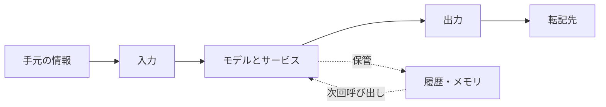
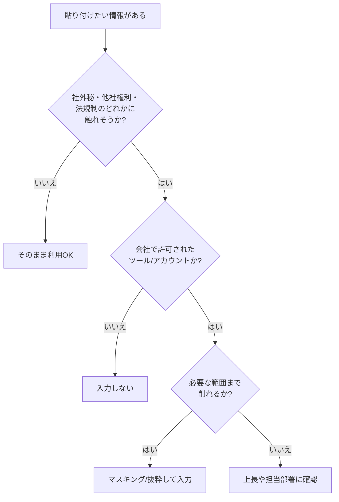

# 9. セキュリティ (個人利用編): 入出力と履歴の扱い方

「これ、AIに貼っても大丈夫ですかね」という問いは、多くの職場で日常的に交わされています。本章では、生成AIを業務で利用する側の視点に立ち、自分の手元で何を確認しておけばよいかを整理します。「学習」やハルシネーションといった、よく取り上げられる論点は[5章](05-misunderstanding-learning.md)・[6章](06-hallucination-and-knowledge-literacy.md)で扱い済みなので、本章ではそれらと重ならない領域に絞ります。

論点は入力・出力・履歴の3つに分けて順に扱います。組織側がなぜルールを敷くのかという背景と、エージェント時代に追加で気にする論点は、続く[10章](10-security-agent-era.md)の冒頭で扱います。

## 対象読者と前提

- [1章](01-gemini-in-workspace.md)や[8章](08-common-capabilities.md)で、ClaudeやGeminiを業務で利用した経験がある人
- [5章（「学習」というキーワードの誤解）](05-misunderstanding-learning.md)で、入力データがモデル本体に焼き付くような挙動は普段起きない、という整理に目を通した人
- 出力の裏取りは[6章（ハルシネーション）](06-hallucination-and-knowledge-literacy.md)で扱い済み。本章では「受け取った出力を、次にどこへ転記するか」に集中する

本章のゴールは、入力・出力・履歴の3領域それぞれで何が起きうるかを構造として把握し、迷ったときの判断基準として使える状態になることです。

## セキュリティの論点は入力・出力・履歴の3つに分かれる

個人利用で押さえておきたい論点は、次の3つに分類できます。本ドキュメントでは以降、この区分で整理します。

1. **入力** — 何を渡してよくて、何を渡すと困るのか
2. **出力** — 返ってきた文章や成果物を、どこまで信じて、どこに出してよいのか
3. **履歴とメモリ** — 一度渡したやり取りは、どこに、どれくらい残るのか

3つの関係は、時系列に沿うと次のように並びます。

入力と出力で起きるトラブルは画面の上で見えますが、履歴とメモリ側のトラブルは画面に出ず、あとから気づく形になります。3つをひとまとめにすると判断がぶれるため、以降は1つずつ見ていきます。

## 入力: 渡してよいものと渡すと困るものを仕分ける

生成AIは、渡された情報を材料に回答を組み立てます。最初の論点は、何を材料として渡してよいかを切り分けることです。組織のガイドラインがある場合はそれが優先されますが、ガイドラインを読み解く軸も同じものを使えます。

### 入力判断の観点は機密度・第三者権利・法規制の3つ

個人利用の場面では、入力判断の観点は次の3つに絞れます。

| 観点 | 具体的に気にするもの | 起きうる結果 |
| ---- | ---- | ---- |
| 機密度 | 顧客名、契約条件、未公開情報、個人情報、認証情報 | 社外秘が意図せず外の経路へ流れる |
| 第三者権利 | 他人の著作物、他社のソースコード、非公開の提供資料 | ライセンス違反や契約違反 |
| 法規制 | マイナンバー、医療情報、決済情報、海外の規制対象 | 法令違反、行政対応 |

3つのうち1つでも引っかかる箇所があれば、貼り付ける前に確認の手順を挟みます。実務で見落とされやすいのは「機密度は社外公開と同等だが、他社の提供資料だった」という型です。3つの観点を毎回並べて確認すると、こうした取りこぼしが減らせます。

### 入力例で目安をあわせる

| 入力の例 | 目安 |
| ---- | ---- |
| 手元の議事メモ（社名伏せ） | おおむね問題なし |
| 顧客名と契約金額が入った提案書 | 業務アカウントのみ、公式に許可された使い方であること |
| マイナンバーや保険証の画像 | 渡さない。生成AIに渡して進める作業ではない |
| 他社から受領したNDA付き資料 | 契約条件を確認。記載がなければ渡さない |
| 自社のソースコード | 社内ガイドラインに従う。許可済みのツール以外には渡さない |

業務アカウントと個人アカウントを混同しないことは、誤送信の経路を一本減らす効果が大きい運用です。[5章](05-misunderstanding-learning.md)で触れたとおり、無料／個人向けUIとビジネス向けUIで、入力データの既定の扱いに差があります。

### 迷ったときの判断フロー

機密情報をそのままの形で全部渡す必要がある場面は、実際にはあまりありません。固有名詞を仮名に置き換える、金額の桁だけを残す、といった軽いマスキングで済む場面がほとんどです。渡す情報を削る方針は、機密が外へ流れる経路を狭めるだけでなく、応答の品質にも作用します。余分な情報が混ざるほどモデルが依頼の主旨を取りにくくなるためです。

## 出力: 受け取ったものを次にどこへ転記するか

出力側で注意したい点は、[6章](06-hallucination-and-knowledge-literacy.md)で扱った「事実の裏取り」とは別レイヤーです。本章で扱うのは、受け取った出力を次にどの場所へ転記するかという観点です。

### 出口は自分専用・社内・社外の3段階で扱いを変える

チャット画面に出てきた文章は、社内チャットへの貼り付け、社外宛のメール、スライドの見出し、議事録への組み込みといった経路で次々に転記されます。連鎖が始まると、画面の外へ出た文章を後から回収するのは難しくなります。最初の転記先によって、確認の深さを変えます。

| 出口 | 具体例 | 確認の深さ |
| ---- | ---- | ---- |
| 自分専用メモ | 個人のメモアプリ、手元のテキストファイル | 軽い確認で十分 |
| 社内向け | 社内チャット、社内wiki、議事録、社内メール | 事実とトーンの両方を確認 |
| 社外向け | 提案書、プレスリリース、SNS投稿、顧客メール | 一次ソースまで戻って検証 |

社外向けの成果物は、署名するのも責任を負うのも人間です。「AIが書きました」と添えても、書き手としての責任は移りません。

### 知財とコード片の扱いは「権利確認」と「ライセンス整合」の2点

生成AIが返す文章やコード片には、モデルが学習時に取り込んだ文章のパターンが反映されています。一字一句のコピーが混じる場面は多くありませんが、業務利用では次の2点を押さえておきます。

- 他人の権利を侵していないか — 長い文字列や特徴的なコード片をそのまま世に出す場合、念のため検索してオリジナルの帰属を確認する
- 自社のライセンス要件に合うか — ライセンス上、生成物を一定の条件で扱う必要がある場合もある。業務利用は会社の方針に従う

この領域は、業界ごとに判例・ガイドラインの整備が進んでいる段階です。本ドキュメントの記述を断言として固定せず、社内の指針が更新されたら都度参照し直してください。

### アーティファクトと共有リンクは公開範囲と保持期間を確認する

[8章](08-common-capabilities.md)で触れたとおり、Claude ArtifactsやGemini Canvasでは作った成果物に共有リンクを発行できます。サービスごとに、共有リンクの既定の公開範囲と、リンク発行後の保持期間が違います。

- 公開リンクを作った時点で、URLが流出すれば中身が読める範囲まで広がるものと想定する
- 社外秘を含むアーティファクトには、共有リンクを発行しない。必要ならスクリーンショットと本文を社内ツールに転記する
- 共有リンクを使った場合は、役目が終わった時点で削除する

公開リンクにしないと共同作業ができない場面では、そのデータを共有先に渡してよいかという入力側の問いに戻ります。

## 履歴とメモリ: 一度渡した内容は複数の場所に残る

履歴とメモリは、画面に出ない領域でデータが保管されるため、入力・出力に比べて気づきにくい論点です。モデル本体の重みに残らなくても、サービス側のデータベースには記録が残ります。「学習されない」と「消える」は別物として扱います。

### 残る場所は会話履歴・メモリ機能・サービス提供者側ログの3つ

| 保存先 | 書き込む主体 | 消しかた |
| ---- | ---- | ---- |
| 会話履歴 | サービスが自動で記録 | スレッド削除・履歴オフ設定 |
| メモリ機能／プロジェクト知識 | ユーザーの指示または自動保存 | 個別の項目を削除／機能をオフ |
| サービス提供者側のログ | プロバイダが監査や安全対策のため保持 | 利用者から直接消せないことが多い |

[5章](05-misunderstanding-learning.md)で整理したとおり、この3つはいずれもモデル本体の重みには反映されません。その意味で「学習されていない」は正しい説明ですが、自分が渡したメモと会話がサービス側に残ること自体は変わりません。

### 節目で実施する3つの手順

毎回点検する必要はありません。次の3つを節目で実施しておけば、残ったまま放置される時間を短くできます。

- スレッドを削除する — 機微情報を扱ったスレッドは、用が済んだら削除する
- メモリを見直す — メモリ機能やプロジェクト知識に、古い案件の前提や個人情報が残っていないかを定期的に確認する
- アカウントを取り違えない — 業務は業務アカウント、私用は私用アカウント。設定の継承を避けるには、ブラウザのプロファイルそのものを分けておく

メモリの見直しは、案件が終わったタイミングや四半期末など、自分の業務サイクルにそろえると忘れにくくなります。

### 履歴とメモリは独立した領域として消す

見落とされやすいのは、スレッドを消したからといって、メモリ機能側に書き込まれた前提までは消えない、という型です。履歴とメモリは独立した保存領域で、画面上も別の場所に並んでいます。消すときは両方を確認します。

## 判断チェックリスト

ここまでの内容を、日常の手順に落とし込むためのチェックリストです。短く回せるように、5項目に絞っています。

1. 入力前 — 貼ろうとしているのは、社外秘・他社権利・法規制のどれかに触れるか
2. 入力前 — 開いているのは業務用アカウントか。個人アカウントを取り違えていないか
3. 入力時 — 必要のない情報は削れたか。固有名詞や金額は、仮置きでも依頼が通じるか
4. 出力時 — これから出す先は、自分専用・社内・社外のどれか。社外なら一次ソースまで戻ったか
5. 後始末 — 機微情報を扱ったスレッドは削除したか。メモリにも残っていないか

5番目を毎回実施する必要はありません。機微情報を扱った日だけでも済ませておくと、残存期間を短く保てます。

## よくある失敗パターン

- 個人アカウントで社内資料を要約してしまう — 業務アカウントとの切り替え忘れ。ブラウザのプロファイル自体を分けておくと、取り違えの経路を1つ塞げる
- 共有リンクの公開範囲を確認しない — アーティファクトや会話共有のURLが、社外に出てから気づく型のミス
- メモリに古い案件の情報が残り続ける — 新案件の応答に、前案件の前提が混ざって出力される
- 「AIが書きました」で署名を省略する — 出口が社外の場合、署名と責任を引き受けるのは人間のままである
- 許可されていないツールを抜け道で使う — 1件の漏えいや誤公開が、組織内の生成AI利用そのものを止める判断につながる。許可されたツールの枠内で工夫する

最後の項目は個人のふるまいに見えますが、結果として組織全体の選択肢を狭める影響を持ちます。

## まとめ

- 個人利用のセキュリティは、入力・出力・履歴とメモリの3領域に分けて整理する
- 入力は、機密度・第三者権利・法規制の3観点で仕分け、迷ったら削るかマスキングしてから渡す
- 出力は、自分専用・社内・社外の出口別に確認の深さを変える。社外向けの署名と責任は人間側に残る
- 履歴とメモリは、モデル本体に学習されなくてもサービス側に残る。節目でスレッドとメモリの両方を見直す

組織側がなぜルールを敷くのかという背景と、エージェント時代に追加で気にする論点は[10章](10-security-agent-era.md)で扱います。

## 参考

- Anthropic「Privacy Policy」: <https://www.anthropic.com/legal/privacy>（最終確認：2026-04-24）
- Anthropic「Usage Policies」: <https://www.anthropic.com/legal/aup>（最終確認：2026-04-24）
- Google「Gemini Apps Privacy Hub」: <https://support.google.com/gemini/answer/13594961>（最終確認：2026-04-24）
- Google Workspace「Generative AIとGoogle Workspaceデータ」: <https://support.google.com/a/answer/15706919>（最終確認：2026-04-24）
- 個人情報保護委員会「生成AIサービスの利用に関する注意喚起等」: <https://www.ppc.go.jp/news/press/2023/230602_AI_utilize_alert/>（最終確認：2026-04-24）
