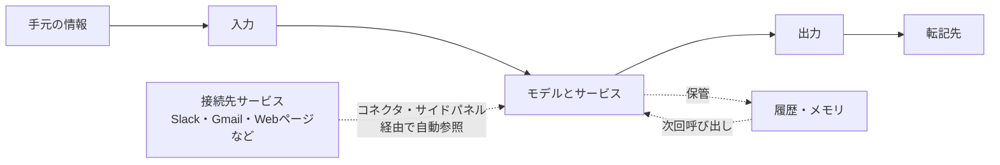
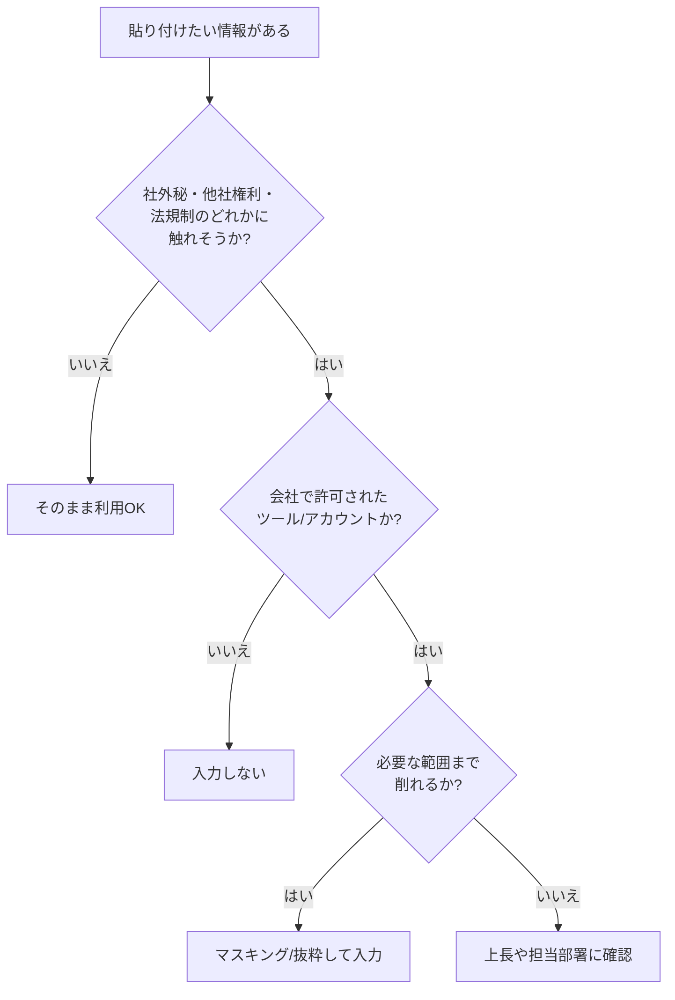

# 9. セキュリティ (個人利用編): 入出力と履歴の扱い方

「これ、AIに貼っても大丈夫ですかね」という問いは、多くの職場で日常的に交わされています。本章では、生成AIを業務で利用する側の視点に立ち、自分の手元で何を確認しておけばよいかを考えます。「学習」やハルシネーションといった、よく取り上げられる論点は[5章](05-misunderstanding-learning.md)・[6章](06-hallucination-and-knowledge-literacy.md)で扱い済みなので、本章ではそれらと重ならない領域に絞ります。

論点は入力・出力・履歴の3つに分けて順に扱います。組織側がなぜルールを敷くのかという背景と、エージェント時代に追加で気にする論点は、続く[10章](10-security-agent-era.md)の冒頭で扱います。

## 対象読者と前提

- [1章](01-gemini-in-workspace.md)や[8章](08-common-capabilities.md)で、ClaudeやGeminiを業務で利用した経験がある人
- [5章（「学習」というキーワードの誤解）](05-misunderstanding-learning.md)で、入力データがモデル本体に焼き付くような挙動は普段起きない、という説明に目を通した人
- 出力の裏取りは[6章（ハルシネーション）](06-hallucination-and-knowledge-literacy.md)で扱い済み。本章では「受け取った出力を、次にどこへ転記するか」に集中する

本章のゴールは、入力・出力・履歴の3領域それぞれで何が起きうるかを構造として把握し、迷ったときの判断基準として使える状態になることです。

## セキュリティの論点は入力・出力・履歴の3つに分かれる

個人利用で確認しておきたい論点は、次の3つに分類できます。本ドキュメントでは以降、この区分で整理します。

1. **入力** — 何を渡してよくて、何を渡すと困るのか
2. **出力** — 返ってきた文章や成果物を、どこまで信じて、どこに出してよいのか
3. **履歴とメモリ** — 一度渡したやり取りは、どこに、どれくらい残るのか

3つの関係は、時系列に沿うと次のように並びます。

図には2種類の経路があります。利用者が手動で貼り付ける経路と、接続先サービスからAIが自動的に参照する経路です。後者はコネクタやサイドパネルを有効にした時点から開かれ、利用者の貼り付け操作を経由しません。入力と出力のトラブルは画面の上で見えますが、履歴とメモリ側のトラブルは画面に出ず、あとから気づく形になります。3つをひとまとめにすると判断がぶれるため、以降は1つずつ見ていきます。

## 入力: 渡してよいものと渡すと困るものを仕分ける

生成AIは、渡された情報を材料に回答を組み立てます。最初の論点は、何を材料として渡してよいかを切り分けることです。組織のガイドラインがある場合はそれが優先されますが、ここで示す観点は、個人での判断と、組織のガイドラインを読み解くときの両方で使えます。

### 入力判断の観点は機密度・第三者権利・法規制の3つ

個人利用の場面では、入力判断の観点は次の3つに絞れます。

| 観点 | 具体的に気にするもの | 起きうる結果 |
| ---- | ---- | ---- |
| 機密度 | 顧客名、契約条件、未公開情報、個人情報、認証情報 | 社外秘が意図せず外の経路へ流れる |
| 第三者権利 | 他人の著作物、他社のソースコード、非公開の提供資料 | ライセンス違反や契約違反 |
| 法規制 | マイナンバー、医療情報、決済情報、海外の規制対象 | 法令違反、行政対応 |

3つのうち1つでも引っかかる箇所があれば、貼り付ける前に確認の手順を挟みます。実務で見落とされやすいのは「機密度の観点では問題ないように見えるが、他社の提供資料だった」という型です。3つの観点を毎回並べて確認しておくと、こうした取りこぼしに気づきやすくなります。画像・PDF・音声・動画などテキスト以外の素材も同じ3観点で判断できます。素材ごとの留意点は、[3章（マルチモーダル）](03-multimodal.md)で扱います。

### 入力例で目安をあわせる

| 入力の例 | 目安 |
| ---- | ---- |
| 手元の議事メモ（社名伏せ） | おおむね問題なし |
| 顧客名と契約金額が入った提案書 | 業務アカウントのみ、公式に許可された使い方であること |
| マイナンバーや保険証の画像 | 渡さない。生成AIに渡して進める作業ではない |
| 他社から受領したNDA付き資料 | 契約条件を確認。記載がなければ渡さない |
| 自社のソースコード | 社内ガイドラインに従う。許可済みのツール以外には渡さない |

業務アカウントと個人アカウントを混同しないだけで、誤送信の経路が一本減ります。[5章](05-misunderstanding-learning.md)で触れたとおり、無料／個人向けUIとビジネス向けUIで、入力データの既定の扱いに差があります。

### 手動入力だけでなく、AIが接続先から自動で参照する経路もある

ここまでの説明は、利用者がチャット欄に情報を貼り付ける経路を前提にしていました。2026年5月時点では、AIが接続先サービスから自動的にデータを取得する経路も広がっています。利用者が貼り付け操作をしていなくても、コネクタやサイドパネルを通じて会話に外部の情報が取り込まれます。

主な経路を表にまとめます。

| 接続箇所 | 自動参照されうるデータ | 詳しくは |
| ---- | ---- | ---- |
| Claudeのコネクタ（Slack・Gmail・HubSpotなど） | 有効化した接続先のメッセージ・メール・レコード | [13章](13-claude.md) |
| ClaudeのリモートMCPサーバ | 登録したサーバが公開するデータ | [13章](13-claude.md) |
| Gemini in Chromeのサイドパネル | 現在のタブや指定した複数タブのページ内容 | [11章](11-gemini-advanced.md) |
| Workspace Intelligence | Gmail・Docs・Drive・Meetをまたぐ情報 | [12章](12-google-workspace-and-gemini.md) |
| Workspaceアプリのサイドパネル | 開いているドキュメント・メール・スプレッドシートの内容 | [12章](12-google-workspace-and-gemini.md) |

手動入力との違いは、利用者が「何を渡したか」を意識しにくい点にあります。コネクタを有効にした状態で「先週のSlackのやり取りをまとめて」と依頼すると、AIは該当チャンネルのメッセージを自動的に取得します。取得される範囲には、依頼者自身の発言だけでなく、他のメンバーの発言や共有されたファイルの内容も含まれ得ます。

利用者として確認しておきたいのは次の3点です。

- どのコネクタ・接続先が有効になっているかを把握する。使い終わった接続は外しておくと、意図しない参照の経路がそのぶん閉じる
- Gemini in Chromeのサイドパネルを呼び出すときは、タブに表示されている内容がAIに渡される前提で扱う。社外秘が表示されたタブでサイドパネルを開くと、その内容がGeminiの会話に取り込まれる
- コネクタ経由で取り込まれた情報も、前節の3観点（機密度・第三者権利・法規制）で同じように判断する。手動で貼り付けていなくても、AIの会話に入った時点で経路に乗る事実は変わらない

### 迷ったときの判断フロー

機密情報をそのままの形で全部渡す必要がある場面は、実際にはあまりありません。固有名詞を仮名に置き換える、金額の桁だけを残す、といった軽いマスキングで済む場面がほとんどです。渡す情報を削る方針は、機密が外へ流れる経路を狭めるだけでなく、応答の品質にも作用します。余分な情報が混ざるほどモデルが依頼の主旨を取りにくくなるためです。マスキングや抜粋を依頼文へどう組み込むかは、[Appendix: プロンプトの組み立て方](appendix-prompting.md)の「プロンプトに渡す情報の判断基準」節で扱っています。

## 出力: 受け取ったものを次にどこへ転記するか

出力側で注意したい点は、[6章](06-hallucination-and-knowledge-literacy.md)で扱った「事実の裏取り」とは別レイヤーです。本章で扱うのは、受け取った出力を次にどの場所へ転記するかという観点です。

### 出口は自分専用・社内・社外の3段階で扱いを変える

チャット画面に出てきた文章は、社内チャットへの貼り付け、社外宛のメール、スライドの見出し、議事録への組み込みなど、複数の経路で次々に転記されていきます。連鎖が始まると、画面の外へ出た文章を後から回収するのは難しくなります。最初の転記先によって、確認の深さを変えます。

| 出口 | 具体例 | 確認の深さ |
| ---- | ---- | ---- |
| 自分専用メモ | 個人のメモアプリ、手元のテキストファイル | 軽い確認で十分 |
| 社内向け | 社内チャット、社内wiki、議事録、社内メール | 事実とトーンの両方を確認 |
| 社外向け | 提案書、プレスリリース、SNS投稿、顧客メール | 一次ソースまで戻って検証 |

社外向けの成果物は、署名するのも責任を負うのも人間です。「AIが書きました」と添えても、書き手としての責任は移りません。

### 知財とコード片の扱いは「権利確認」と「ライセンス整合」の2点

生成AIが返す文章やコード片には、モデルが学習時に取り込んだ文章のパターンが反映されています。一字一句のコピーが混じる場面は多くありませんが、業務利用では次の2点を押さえておきます。

- 他人の権利を侵していないか — 長い文字列や特徴的なコード片をそのまま世に出す場合、念のため検索してオリジナルの帰属を確認する
- 自社のライセンス要件に合うか — ライセンス上、生成物を一定の条件で扱う必要がある場合もある。業務利用は会社の方針に従う

この領域は、業界ごとに判例・ガイドラインの整備が進んでいる段階です。本ドキュメントの記述を断言として固定せず、社内の指針が更新されたら都度参照し直してください。

### アーティファクトと共有リンクは公開範囲と保持期間を確認する

[8章](08-common-capabilities.md)で触れたとおり、Claude ArtifactsやGemini Canvasでは作った成果物に共有リンクを発行できます。サービスごとに、共有リンクの既定の公開範囲と、リンク発行後の保持期間が違います。

- 公開リンクを作った時点で、URLが流出すれば中身が読める範囲まで広がるものと想定する
- 社外秘を含むアーティファクトには、共有リンクを発行しない。必要ならスクリーンショットと本文を社内ツールに転記する
- 共有リンクを使った場合は、役目が終わった時点で削除する

公開リンクにしないと共同作業ができない場面では、そのデータを共有先に渡してよいかという入力側の問いに戻ります。

## 履歴とメモリ: 一度渡した内容は複数の場所に残る

履歴とメモリは、画面に出ない領域でデータが保管されるため、入力・出力に比べて気づきにくい論点です。モデル本体の重みに残らなくても、サービス側のデータベースには記録が残ります。「学習されない」と「消える」は別物として扱います。

### 残る場所は会話履歴・メモリ機能・サービス提供者側ログの3つ

| 保存先 | 書き込む主体 | 消しかた |
| ---- | ---- | ---- |
| 会話履歴 | サービスが自動で記録 | スレッド削除・履歴オフ設定 |
| メモリ機能／プロジェクト知識 | ユーザーの指示または自動保存 | 個別の項目を削除／機能をオフ |
| サービス提供者側のログ | プロバイダが監査や安全対策のため保持 | 利用者から直接消せないことが多い |

[5章](05-misunderstanding-learning.md)で整理したとおり、この3つはいずれもモデル本体の重みには反映されません。その意味で「学習されていない」は正しい説明ですが、自分が渡したメモと会話がサービス側に残ること自体は変わりません。

3行目の「サービス提供者側のログ」は、保持期間の既定値自体が固定ではない領域です。プロバイダの規約改定で変わるほか（5章で扱った2025年のAnthropicの例では、学習利用への同意の有無で保持期間が30日と最大5年に分かれます）、法的手続きで動く場合もあります。2025年には、OpenAIが著作権訴訟に伴う裁判所命令により、削除済みの会話を含むログの保持を一時的に義務づけられた事例がありました（同年9月に通常の運用へ復帰。最終確認：2026-06-11）。利用者が画面上で削除しても、提供者側のログが同じタイミングで消えるとは限らない、という表の整理の具体的な背景です。

### 節目で実施する3つの手順

毎回点検する必要はありません。次の3つを節目で実施しておけば、残ったまま放置される時間を短くできます。

- スレッドを削除する — 機微情報を扱ったスレッドは、用が済んだら削除する
- メモリを見直す — メモリ機能やプロジェクト知識に、古い案件の前提や個人情報が残っていないかを定期的に確認する
- アカウントを取り違えない — 業務は業務アカウント、私用は私用アカウント。設定の継承を避けるには、ブラウザのプロファイルそのものを分けておく

メモリの見直しは、案件が終わったタイミングや四半期末など、自分の業務サイクルにそろえると忘れにくくなります。

### 履歴とメモリは独立した領域として消す

見落とされやすいのは、スレッドを消したからといって、メモリ機能側に書き込まれた前提までは消えない、という型です。履歴とメモリは独立した保存領域で、画面上も別の場所に並んでいます。消すときは両方を確認します。メモリ機能の利用方法や棚卸しの考え方は[13章（Claude）](13-claude.md)で扱っています。

## 判断チェックリスト

ここまでの内容を、日常の手順に落とし込むためのチェックリストです。短く回せるように、7項目に絞っています。

1. 入力前 — 貼ろうとしているのは、社外秘・他社権利・法規制のどれかに触れるか
2. 入力前 — 開いているのは業務用アカウントか。個人アカウントを取り違えていないか
3. 入力前 — 有効になっているコネクタや接続先を把握しているか。不要な接続が残っていないか
4. 入力時 — 必要のない情報は削れたか。固有名詞や金額は、仮置きでも依頼が通じるか
5. 出力時 — これから出す先は、自分専用・社内・社外のどれか。社外なら一次ソースまで戻ったか
6. 後始末 — 機微情報を扱ったスレッドは削除したか。メモリにも残っていないか
7. 事故直後 — 情報が広がる経路を止めたか。影響範囲を把握し、必要なら相談先へ報告したか

6番目と7番目を毎回実施する必要はありません。6番目は機微情報を扱った日だけ、7番目は事故に気づいたときだけ参照してください。

## よくある失敗パターン

- 個人アカウントで社内資料を要約してしまう — 業務アカウントとの切り替え忘れ。ブラウザのプロファイル自体を分けておくと、取り違えの経路を1つ塞げる
- 共有リンクの公開範囲を確認しない — アーティファクトや会話共有のURLが、社外に出てから気づく型のミス
- メモリに古い案件の情報が残り続ける — 新案件の応答に、前案件の前提が混ざって出力される
- 「AIが書きました」で署名を省略する — 出口が社外の場合、署名と責任を引き受けるのは人間のままである
- コネクタ経由で意図しない情報が会話に入る — Slackコネクタを有効にしたままチャンネルの要約を頼んだところ、他部署の機微情報を含むスレッドまで参照された、という型。使い終わったコネクタは外しておく
- 許可されていないツールを許可の範囲外で使う — 1件の漏えいや誤公開が、組織内の生成AI利用そのものを止める判断につながる。許可されたツールの枠内で工夫する

最後の項目は個人のふるまいに見えますが、結果として組織全体の選択肢を狭める影響を持ちます。

## 事故が起きたあとの初動は「止める・把握する・報告する」の3段階

前節の失敗パターンは、予防を意識していても起きることがあります。気づいた時点での初動が、影響の広がりを左右します。初動は次の3段階に分けられます。

1. 経路を止める — 情報が広がり続ける経路を、まず遮断する
2. 影響範囲を把握する — 何が、どこまで渡ったかを確認する
3. 相談先に報告する — 自分の手で対処しきれない場合、上長や担当部署に伝える

1を先に済ませてから2と3に進むのが原則です。影響範囲を調べている間にも経路が開いたままでは、情報の到達先が増え続けます。

### 失敗パターンごとの初動例

前節で挙げた失敗パターンのうち、頻度の高い4件について、3段階の初動を具体的に並べます。

| 失敗パターン | 止める | 把握する | 報告する |
| ---- | ---- | ---- | ---- |
| 個人アカウントで社内資料を要約した | 該当スレッドを削除する。メモリにも残っていないか確認する | 渡した情報に機密度・第三者権利・法規制の引っかかりがあるか特定する | 機微情報が含まれていた場合は、上長や社内の相談窓口に経緯を伝える |
| 共有リンクを社外に出してしまった | 共有リンクを無効化する（「非公開」への切り替えまたはリンクの削除） | リンクの送付先と、リンク経由で閲覧された可能性のある内容を確認する | 社外秘が含まれていた場合は、送付先への削除依頼とあわせて社内へ報告する |
| コネクタ経由で機微情報が会話に入った | 該当コネクタを解除する。会話スレッドも削除する | どの接続先から、どの範囲の情報が取り込まれたかを確認する | 他部署や他社の情報が含まれていた場合は、関係者と相談窓口に伝える |
| メモリに古い案件の前提が残っていた | メモリの設定画面から該当項目を削除する | 古い前提が混ざった出力を、社内外へ転記していないか確認する | 転記先で誤情報が残っている場合は、転記先の修正を先に済ませる |

表に載せていない2件（署名の省略、許可外ツールの利用）でも、同じ3段階がそのまま当てはまります。署名の省略は出力の転記先を特定して訂正する初動、許可外ツールの利用は利用を停止したうえで社内へ報告する初動です。

### 初動のあとは既存のチェックリストに戻る

初動で経路を止めたあとの再発防止は、本章の判断チェックリスト（前掲）をそのまま使えます。事故の起点が入力・出力・履歴のどこにあったかを特定し、該当する項目の確認を重点的に習慣へ組み込みます。

組織側の報告フローやエスカレーション先の決め方は[10章](10-security-agent-era.md)で扱っています。事後であっても、早めに相談先へ連絡するほうが、影響範囲が広がってから報告するより対処の選択肢が多く残ります。

## まとめ

- 個人利用のセキュリティは、入力・出力・履歴とメモリの3領域に分けて押さえる
- 入力は、機密度・第三者権利・法規制の3観点で仕分け、迷ったら削るかマスキングしてから渡す。コネクタやサイドパネル経由でAIが自動参照するデータにも同じ観点が当てはまる
- 出力は、自分専用・社内・社外の出口別に確認の深さを変える。社外向けの署名と責任は人間側に残る
- 履歴とメモリは、モデル本体に学習されなくてもサービス側に残るため、節目でスレッドとメモリの両方を見直す。事故時の初動（経路を止める → 影響範囲を把握する → 相談先に報告する）の3段階は本章後段の節で扱った

組織側がなぜルールを敷くのかという背景と、エージェント時代に追加で気にする論点は[10章](10-security-agent-era.md)で扱います。提供事業者のクラウドそのものを経由しない経路の選択肢は、[Appendix: ローカルLLM](appendix-local-llm.md)で別立てに取り上げます。

本章で示した判断結果を、実際の依頼文に落とし込む書き方は、[Appendix: プロンプトの組み立て方](appendix-prompting.md)を参照してください。固有名詞の仮名化や、具体値を伏せて構造だけを渡すなど、機密情報を含む業務でAIを活用するパターンがまとまっています。

## 参考

- Anthropic「Privacy Policy」: <https://www.anthropic.com/legal/privacy>（最終確認：2026-04-24）
- Anthropic「Usage Policies」: <https://www.anthropic.com/legal/aup>（最終確認：2026-04-24）
- Anthropic「Updates to Consumer Terms and Privacy Policy」: <https://www.anthropic.com/news/updates-to-our-consumer-terms>（最終確認：2026-06-11）
- OpenAI「Response to NYT data demands」: <https://openai.com/index/response-to-nyt-data-demands/>（最終確認：2026-06-11）
- Google「Gemini Apps Privacy Hub」: <https://support.google.com/gemini/answer/13594961>（最終確認：2026-04-24）
- Google Workspace「Generative AIとGoogle Workspaceデータ」: <https://support.google.com/a/answer/15706919>（最終確認：2026-04-24）
- 個人情報保護委員会「生成AIサービスの利用に関する注意喚起等」: <https://www.ppc.go.jp/news/press/2023/230602_AI_utilize_alert/>（最終確認：2026-04-24）
