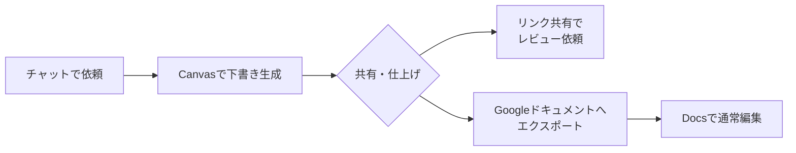

# 10. あらためてGeminiを使いこなそう

[1章](01-gemini-in-workspace.md)でGeminiの入口を体験し、[7章](07-common-capabilities.md)でチャット・アーティファクト・コネクタという共通の骨格を学びました。本章はその続きで、「Gemini固有の手ざわり」だけを取り上げます。Claudeと並べると際立つGeminiの個性、知っておきたい現時点の制約、Geminiに寄せたい場面、の3点を軸に進めます。

Google Workspaceとの統合の詳細（Docs・Sheets・Gmail・Meetでの具体的な使いどころなど）は[11章](11-google-workspace-and-gemini.md)が担当します。本章と11章の棲み分けは「Gemini単体の深掘り」が10章、「Workspaceアプリ側からの眺め」が11章、と覚えてください。

## 対象読者と前提

- [1章](01-gemini-in-workspace.md)でGeminiに触れ、[7章](07-common-capabilities.md)を一読した人
- Geminiをすでに試してみて、「もう少し使いこなしたい」と感じている人
- Claudeとの違いが気になり始めた人

各機能の仕様・料金・プランによる利用可否は、四半期単位で変わります。本章では方針と感覚をお伝えし、最新の詳細は各参考URLで確認してください。

## Gems: 自分専用のGeminiを設計する

Geminiアプリには、**Gems**（ジェムズ）と呼ばれる機能があります。チャットのたびにゼロから「君はXXのエキスパートで…」と打ち込む手間を省けるプリセット、とイメージしてください。

Gemを作ると、次の3つを事前に仕込んでおけます。

| 設定項目 | 何ができるか | 例 |
| ---- | ---- | ---- |
| カスタム指示 | 役割・口調・出力形式の初期値 | 「マーケター向けの平易な日本語で要約する」 |
| ナレッジ（参照ファイル） | 毎回の会話で参照させる社内文書や辞典 | 社内用語集、製品仕様書 |
| 名前とアイコン | 用途が一目でわかるラベル | 「英文メール添削」「議事録整形」 |

作ったGemは、アプリの左側メニューや検索から呼び出せます。「今日のミーティングメモをこのGemに入れてください」と頼むだけで、あとは仕込んだ指示どおりに動いてくれます。

### Gemを作るときのコツ

- 役割を1つに絞る。用途を広げすぎると、特定のタスクにおける振る舞いが安定しにくい
- 口調の指定を忘れずに。読者層（社内向け/社外向け）と文体（です・ます/箇条書き中心など）を書いておくと出力がそろう
- ナレッジファイルは小さく保つ。詰め込みすぎるとコンテキストウィンドウを圧迫し、精度に影響することがある

プランによっては、作ったGemをチーム内で共有できます。共有の可否と手順は、参考欄のGemのURLを確認してください。

## Canvas: 成果物を仕上げる作業台

[7章](07-common-capabilities.md)でアーティファクトの概念を扱いました。GeminiにおけるアーティファクトがCanvasです。チャット画面の横に作業ペインが開き、文書やコードを「対話しながら磨く」ことができます。

### Canvasの起動と基本

Canvasを使いたいときは、依頼文に「Canvasで」と書く、または生成後に「Canvasに移して」と伝えるだけです。日本語の長文、プレゼン骨子、マークダウン文書、簡単なコードのどれでも受け付けます。

Canvasのペインで直接文章を選択して「このパラグラフをより簡潔に」と頼むと、選択箇所だけが書き直されます。チャット履歴が長くなっても、成果物の対象が明確に保たれるのがポイントです（7章で触れた「履歴が長くなると前提が揺らぐ」問題への対策になります）。

### 共有：Canvasが特に光る場面

Canvasにはリンクで共有する機能があり、社内外のメンバーにプレビューを見せることができます。Googleドキュメントへのエクスポートも可能なので、「Geminiで下書きしてドキュメントへ移す」という流れがワンストップで完結します。

ただし、共有リンクは設定次第で社外からも閲覧できます。社外秘の内容を含む場合は公開範囲の設定を必ず確認してから共有してください（詳細は[8章](08-security-individual.md)）。

## マルチモーダルで素材を増やす

Geminiはテキスト以外の入力に力を入れており、2026年時点では以下が実用的に使えます。

| 素材の種類 | できること | 注意点 |
| ---- | ---- | ---- |
| 画像・スクリーンショット | 内容の説明、テキスト抽出、表への変換 | 機密情報が映り込んでいないか確認 |
| PDF・ドキュメント | 要約、質問応答、比較 | ページ数が多いと一部が省略される場合がある |
| 音声ファイル | 文字起こし、要約 | 対応フォーマットと長さに上限あり |
| 動画・YouTubeリンク | 内容の要約、特定シーンの説明 | 著作権のある映像は利用規約を確認 |

複数の素材を組み合わせることもできます。「この契約書PDFとこの会議メモ画像をもとに、論点を整理して」という依頼が1回で出せます。素材が多いほど文脈が豊かになる一方、コンテキストウィンドウの上限（[6章](06-terminology.md)）に近づくまでが早くなります。全部まとめて投げる前に、まず要点だけ渡して様子を見る、という進め方が結果としては安定しやすくなります。

## 画像と動画を生成する

Geminiは、テキスト入力から画像や動画を生成する機能もGeminiアプリ内から呼び出せます。

### 画像生成（Imagen）

Googleの画像生成モデル**Imagen**は、Geminiアプリ上で「〇〇の画像を作って」と頼むと呼び出されます。写真風からイラスト風まで幅広いスタイルが選べ、生成後にチャットで「もう少し明るく」「別の角度で」と調整を続けることもできます。

生成した画像には電子透かし（SynthID）が埋め込まれており、AI生成物であることが識別できる仕組みになっています。商用利用の可否はプランと利用規約次第ですので、社外向けの制作物に使う前には必ず確認してください。

### 動画生成（Veo）

Googleの動画生成モデル**Veo**は、テキスト指示や参照画像から数秒の動画クリップを生成します。2026年時点ではGemini上位プランから利用でき、対応状況はプランにより異なります。

動画生成はプロンプトの精度がそのまま品質に出やすい領域です。場面の構図・カメラの動き・時間的な変化を具体的に書くほど、意図に近いものが返ってきます。

## 2026年春時点のGeminiの制約

Geminiを積極的に使い始めると、「あれ、できないの？」と感じる場面がいくつかあります。代表的な制約を先に知っておくと、行き当たりばったりの試行錯誤を避けやすくなります。

### メール送信はまだ手動

GmailのサイドパネルからGeminiに返信下書きを作らせることはできますが、**送信ボタンを押すのは人間の仕事**です。現時点では、Geminiがユーザーの意図を読んで自動的にメールを送り出す経路は標準では用意されていません。

「あとは任せた」と退席するのではなく、「下書き → 確認 → 送信」の3段階をそのまま踏む手順が、現時点では素直な使い方です。

### 外部のMCPには直接繋がらない

[3章](03-external-system-integration.md)で紹介したModel Context Protocol（MCP）は、Claude側では積極的に採用されています。一方Geminiは、2026年4月時点では、任意のMCPサーバを自前でセットアップして自由に繋ぐ、という形の利用は標準的なチャット画面からは難しい状況です。Google製のコネクタ（Gmail・Drive・カレンダーなど）は豊富ですが、「社内独自ツールをMCPサーバとして立ててGeminiに繋ぐ」のような使い方はClaudeのほうが柔軟です。

### Google Workspaceとの深い結合はプラン依存

Geminiの真価が出る機能（サイドパネル統合・Drive検索連携・Meet議事録連動など）の多くは、Google Workspaceの有料プランに紐づいています。プランの名称は「Gemini for Google Workspace」です。個人のGoogleアカウントで試した感触と、会社のWorkspaceアカウントで使った体験は別物になることがあります。プランと有効化状況は情シス部門への確認が確実です。

## Geminiに寄せたい場面

ClaudeとGeminiの使い分け早見表は[7章](07-common-capabilities.md)にまとめてあるので、本章では**Gemini側に寄せたほうが素直に進む場面**だけを短く補足します。

- **Workspaceアプリの画面に居たいとき** — Docs・Sheets・Gmail・Meetを開いたまま、サイドパネル統合が距離ゼロで動く
- **マルチモーダルの素材を束ねたいとき** — 画像・音声・動画・PDFなどを1回の依頼で一緒に扱える
- **反復作業の起点を短く保ちたいとき** — Gemsに役割と参照ファイルを仕込んでおける
- **Googleドキュメントにそのまま流したいとき** — Canvasから直接Docsへエクスポートできる

逆に、Workspaceの外側のSaaSを材料にしたいときや、社内の独自ツールをMCPで繋ぎたいときは[12章](12-claude.md)のClaude側の節を参照してください。早見表の全体像は[7章](07-common-capabilities.md)に置いてあります。

## まとめ

- **Gems**を使うと、役割・口調・参照ファイルをプリセットに仕込んで繰り返し呼び出せる
- **Canvas**は成果物を育てる作業台。共有リンクとGoogleドキュメントへのエクスポートが実用の要
- Geminiのマルチモーダルは画像・PDF・音声・動画・YouTubeリンクを組み合わせて渡せる
- 画像生成（Imagen）と動画生成（Veo）もGeminiアプリから呼び出せるが、商用利用は利用規約を確認
- **メール送信は手動**・外部MCPへの自由な接続は現時点では限定的、という制約は把握しておく
- Google Workspaceの内側での作業はGeminiが距離ゼロ。外部ツールへのMCP連携はClaudeが得意
- 次は [11章（Google WorkspaceとGemini）](11-google-workspace-and-gemini.md) で、Docs・Sheets・Gmail・Meetの各アプリ側から見たGemini統合へ進む

## 参考

- Google「GeminiアプリのカスタムGemを作成する」: <https://support.google.com/gemini/answer/15235060>（最終確認：2026-04-24）
- Google「Gemini Canvasについて」: <https://support.google.com/gemini/answer/15286292>（最終確認：2026-04-24）
- Google「Geminiで画像を生成する（Imagen）」: <https://support.google.com/gemini/answer/14590462>（最終確認：2026-04-24）
- Google「Veoによる動画生成」: <https://deepmind.google/technologies/veo/>（最終確認：2026-04-24）
- Google「Gemini for Google Workspace」: <https://workspace.google.com/solutions/ai/>（最終確認：2026-04-24）
