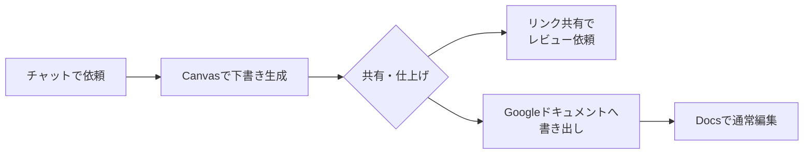

# 11. Geminiを使いこなそう

本章は、Gemini固有の機能と、2026年春時点で利用者が押さえておきたい制約、Gemini側に寄せたほうが進めやすい場面の3点を扱います。取り上げる機能は、Gems、保存済み情報、Canvas、マルチモーダル入力、画像生成（Imagen）、動画生成（Veo）、Deep Research、Gemini Liveの8つです。加えて、Chromeブラウザに組み込まれた呼び出し口であるGemini in Chromeも扱います。[8章](08-common-capabilities.md)で整理した「チャット／アーティファクト／コネクタ」の共通骨格に対する、Gemini側の具体像にあたる位置づけです。

Google Workspaceの各アプリ（Docs・Sheets・Gmail・Meet・Slides）から呼び出すGemini統合は[12章](12-google-workspace-and-gemini.md)で別立てに扱います。本章はGeminiアプリ（`gemini.google.com`）、Workspaceアプリ右上のサイドパネル、およびChromeブラウザに組み込まれたGemini in Chromeから呼び出すGemini単体を対象にします。

## 対象読者と前提

- [1章](01-gemini-in-workspace.md)でGeminiを一度は試し、[8章](08-common-capabilities.md)で「チャット／アーティファクト／コネクタ」の3つの能力に目を通している人
- Geminiを業務で何度か利用しており、機能ごとの使い分けの軸を整理したい人
- ClaudeとGeminiの違いを、機能と制約の両面から把握したい人

各機能の仕様・料金・プランによる利用可否は、四半期単位で変わります。本章では機能の位置づけと使い分けに集中し、最新の詳細は各参考URLで確認してください。

## Gemsはチャットの初期設定をプリセット化する仕組み

Geminiアプリには、**Gems**（ジェムズ）と呼ばれる機能があります。Geminiに役割と参照ファイルを毎回ゼロから指示する代わりに、よく使う初期設定をひとまとめにして名前を付けておく仕組みです。

Gemには、次の3つを事前に登録できます。

| 設定項目 | 何ができるか | 例 |
| ---- | ---- | ---- |
| カスタム指示 | 役割・口調・出力形式の初期値 | 「マーケター向けの平易な日本語で要約する」 |
| ナレッジ（参照ファイル） | 毎回の会話で参照させる社内文書や辞典 | 社内用語集、製品仕様書 |
| 名前とアイコン | 用途が一目でわかるラベル | 「英文メール添削」「議事録整形」 |

作ったGemは、アプリの左側メニューや検索から呼び出します。チャット開始時に登録済みのカスタム指示とナレッジが自動で前提として渡され、利用者は本題の依頼だけを書けばよくなります。

### Gemを構成するときの方針

- 役割を1つに絞る。用途を広げると、特定のタスクでの振る舞いが安定しにくくなる
- 口調を都度指定する。読者層（社内向け／社外向け）と文体（です・ます／箇条書き中心など）を書いておくと、出力のばらつきが小さくなる
- ナレッジファイルは絞り込む。詰め込みすぎるとコンテキストウィンドウを圧迫し、回答品質に影響する場合がある（仕組みの背景は[7章](07-terminology.md)）

カスタム指示の具体的な組み立てパターンとテンプレートは[Appendix: プロンプトの組み立て方](appendix-prompting.md)にまとめてあります。

参照させたい資料が数十本以上の規模になると、Gemsのナレッジでは手動の管理が難しくなります。その場合はRAG（検索拡張生成）と呼ばれる仕組みが選択肢に入ります。RAGの概念と用語の整理は[Appendix: 拡張検索と埋め込み検索](appendix-retrieval-and-embeddings.md)で扱っています。

プランによっては、作成したGemをチーム内で共有できます。共有の可否と手順は、参考欄のGemのURLで確認してください。

## 保存済み情報は会話をまたいで利用者の好みや文脈を保持する仕組み

Gemsが特定の用途ごとに切り替えるプリセットであるのに対し、**保存済み情報**（Saved Info）は、すべての会話で自動的に参照される個人の文脈です。利用者の名前、職業、好みの応答スタイルなどを登録しておくと、Geminiは新しい会話を始めるたびにその情報を踏まえて応答を組み立てます。

[13章](13-claude.md)で扱うClaudeのメモリ機能と役割が近く、どちらも「毎回同じ前提を伝え直す手間」を省くための仕組みです。[5章](05-misunderstanding-learning.md)で整理したとおり、これはモデル自体が学習しているのではなく、保存された情報を毎回コンテキストに添えて渡す設計です。

### 保存される内容の典型例

保存済み情報には、おもに次の3種類が登録されます。

| 種類 | 例 |
| ---- | ---- |
| 利用者に関する事実 | 名前、勤務先、担当領域、居住地 |
| 応答スタイルの好み | 「回答は日本語で」「箇条書き形式で返して」「敬語は不要」 |
| 業務上の前提 | 「自社のプロダクト名はXXX」「チームは5人構成」 |

登録方法は2つあります。Geminiアプリの設定画面（「保存済み情報」メニュー）から直接入力する方法と、会話中に「これを覚えておいて」と伝える方法です。後者の場合、Geminiが保存候補として提示し、利用者が承認すると保存されます。

### 保存済み情報は全会話共通、Gemsは用途別に切り替える

Gemsと保存済み情報は、適用範囲と明示性が異なります。[13章](13-claude.md)で扱うClaudeのProjectsとの対比もあわせて整理します。

| 観点 | 保存済み情報 | Gems | Projects（Claude） |
| ---- | ---- | ---- | ---- |
| 適用範囲 | すべての会話で自動参照 | 該当Gemを選んだ会話だけ | 該当Projectを開いた会話だけ |
| 登録の粒度 | 個々の好み・事実単位 | 役割＋参照ファイル＋名前の一式 | 指示＋ファイル＋履歴の一式 |
| 共有 | 個人に紐づく | チーム共有可（プラン依存） | メンバーに共有可 |

保存済み情報は「案件を問わず自分の会話すべてに適用したい前提」に向きます。特定のタスクに絞った前提はGemsで管理するほうが、文脈の混在を避けられます。

### 保存済み情報の管理は設定画面で行う

Geminiアプリの設定メニューから保存済み情報の一覧を確認できます。個別の項目を編集・削除する操作も同じ画面で行います。

利用上の留意点は次の2点です。

- 異動や担当変更のタイミングで、古い業務文脈が残っていないかを確認する。古い前提が新しい会話の応答に混ざる場合は、該当する項目を削除する
- セキュリティ上の注意（意図しない情報の残留、機微情報の確認手順）は[9章](09-security-individual.md)を参照する

### Workspace管理下では管理者の設定に従う

Google Workspaceの管理対象アカウントでは、保存済み情報の利用可否が管理者の設定に従います。管理者がGemini Apps Activityを無効にしている場合、保存済み情報の機能自体は利用できません。設定メニューに該当項目が表示されない場合は、組織のWorkspace管理者による機能制限にあたります（最終確認：2026-05-25）。

## CanvasはGemini側のアーティファクトで対話と並行して文書・コードを編集できる

[8章](08-common-capabilities.md)でアーティファクトの概念を扱いました。Geminiにおけるアーティファクトが**Canvas**です。チャット画面の横に作業ペインが開き、文書やコードを対話と並行して編集できます。

### Canvasの起動と編集の基本

Canvasを使う場合は、依頼文に「Canvasで」と書く、または生成後に「Canvasに移して」と伝えます。日本語の長文、プレゼンの骨子、Markdown文書、簡単なコードのいずれも対象になります。

Canvasのペインで文章の一部を選択して「このパラグラフを簡潔に」と依頼すると、選択範囲だけが書き直されます。チャット履歴が長くなっても、書き直しの対象が選択範囲に限定されるため、編集の対象が明確に保たれます（[8章](08-common-capabilities.md)で扱った「履歴が長くなると前提が揺らぐ」場面への対策になります）。

### Canvasの共有はリンクとGoogleドキュメント書き出しの2経路

Canvasにはリンクで共有する機能があり、社内外のメンバーにプレビューを見せられます。Googleドキュメントへの書き出しも可能で、Geminiで下書きしたあとにDocsで通常編集へ移す経路がそろっています。

共有リンクは設定次第で社外からも閲覧できます。社外秘の内容を含む場合は、共有前に公開範囲の設定を確認してください（詳細は[9章](09-security-individual.md)）。

Geminiのチャットでも、CSVファイルなどのデータを添付して集計やグラフ作成を依頼すると、内部でコードを自動実行して結果を返す機能を利用できます。利用者がコードを書く必要はなく、「月別に集計してグラフにして」のような依頼で使えます。テキストだけで数値を処理させる場合と比べ、計算の正確さが上がります。この能力の共通的な位置づけは[8章](08-common-capabilities.md)の「コード実行によるデータ分析」で整理しています（最終確認：2026-05-27）。

## マルチモーダルは画像・PDF・音声・動画・YouTubeリンクを混在させて渡せる

Geminiは2026年時点で、テキスト以外の入力として以下が実用的に使えます。テキスト以外の入力を業務で扱う枠組み（4系統の素材の整理と注意点）は[3章（マルチモーダル）](03-multimodal.md)で整理しています。本節は、その枠組みに対するGemini側の具体像にあたります。

| 素材の種類 | できること | 注意点 |
| ---- | ---- | ---- |
| 画像・スクリーンショット | 内容の説明、テキスト抽出、表への変換 | 機密情報が映り込んでいないか確認 |
| PDF・ドキュメント | 要約、質問応答、比較 | ページ数が多いと一部が省略される場合がある |
| 音声ファイル | 文字起こし、要約 | 対応フォーマットと長さに上限あり |
| 動画・YouTubeリンク | 内容の要約、特定シーンの説明 | 著作権のある映像は利用規約を確認 |

複数の素材を組み合わせて1回の依頼に渡せます。「この契約書PDFとこの会議メモ画像をもとに、論点を整理して」のような依頼が一度で出せます。素材が多いほど文脈が豊かになる一方、コンテキストウィンドウの上限（[7章](07-terminology.md)）に近づくまでが早くなります。全部まとめて渡す前に、まず要点だけ渡して様子を見る進め方が、結果として安定します。

## 画像生成（Imagen）と動画生成（Veo）はGeminiアプリ内から呼び出せる

Geminiアプリのチャットからは、テキスト入力での画像生成と動画生成をそのまま呼び出します。

### 画像生成（Imagen）

Googleの画像生成モデル**Imagen**は、Geminiアプリで「〇〇の画像を作って」と依頼すると呼び出されます。写真風からイラスト風まで複数のスタイルに対応し、生成後にチャットで「明るく」「別の角度で」と段階的に調整できます。

生成した画像には電子透かし（SynthID）が埋め込まれ、AI生成物であることが識別できる仕組みです。商用利用の可否はプランと利用規約により異なるため、社外向けの制作物に使う場合は、利用規約の該当条項を確認してください。

### 動画生成（Veo）

Googleの動画生成モデル**Veo**は、テキスト指示や参照画像から数秒の動画クリップを生成します。2026年時点ではGeminiの上位プランから利用でき、対応状況はプランにより異なります。

動画生成は、プロンプトの具体性が出力品質に直接反映される領域です。場面の構図・カメラの動き・時間的な変化を細かく書くほど、意図に近い結果が返ってきやすくなります。

## Deep Researchは調査テーマから複数ソースを探索してレポートにまとめる機能

**Deep Research**は、調査テーマを渡すと、Geminiが複数のWebソースを段階的に探索し、結果を1本のレポートに統合して返す機能です。通常のチャットが1回の依頼に対して即座に応答するのに対し、Deep Researchは数分から十数分をかけて情報を集め、引用元つきの構造化されたレポートを生成します。

### 通常のチャットとの違い

Deep Researchと通常のチャットは、入口は同じGeminiアプリですが、動きの構造が異なります。

| 観点 | 通常のチャット | Deep Research |
| ---- | ---- | ---- |
| 応答時間 | 数秒〜十数秒 | 数分〜十数分 |
| 情報源 | モデルの学習済み知識＋コンテキスト | Web上の複数ソースを動的に探索 |
| 出力形式 | 会話形式の応答 | 見出し・引用元つきの構造化レポート |
| 途中経過 | なし | 調査計画の提示→承認→段階的な探索の進捗表示 |

依頼を送ると、Geminiはまず調査計画（どの方向から情報を集めるか）を提示します。計画を確認したうえで進行を指示すると、複数のWebページを順に参照しながら情報を統合し、最終的にレポートとして出力します。レポートはGoogleドキュメントへ書き出せるため、そこから通常の共同編集に移る流れがつながります。

### 向いている場面と向いていない場面

| 向いている場面 | 向いていない場面 |
| ---- | ---- |
| 業界動向の調査・競合比較 | 社内の非公開情報を使った分析 |
| 技術選定の下調べ・選択肢の洗い出し | 即座に答えがほしい単発の質問 |
| 公開情報をもとにしたレポートの下書き | 最新のニュース速報（探索時点の索引に依存） |
| 複数の製品・サービスの条件比較 | 数値の正確性が最優先の財務分析 |

Deep Researchの出力には、参照したWebページへのリンクが付きます。ただし、リンクが付いていることと内容の正確性は別の問題です。引用元の記述が古い、誤っている、文脈から切り離されている場合があるため、業務で使う前に一次ソースを開いて裏取りを行う手順は、通常のチャットと同じです（裏取りの考え方は[6章](06-hallucination-and-knowledge-literacy.md)で整理しています）。

公開情報をもとにした調査レポートという用途では、Claude側にも同じ位置づけの機能としてResearchがあります（[13章](13-claude.md)）。Deep Researchが公開Webの情報を素材にするのに対し、ClaudeのResearchはGoogle Workspaceアカウントを接続すれば社内のメール・ドキュメント・カレンダーも調査対象に含められる点が、両者の主な違いです。応答時間の目安や対比表は13章にまとめてあります。

### 利用条件

Deep Researchは、個人向けの**Google AI Ultra**サブスク、および**Google One AI Premium**で利用できます。Workspaceの標準プランでは利用できない場合があります。利用可否はプランにより異なるため、参考欄のヘルプで確認してください（最終確認：2026-05-25）。

## Pro／Flashの並びの中でDeep Thinkを選べる

[8章](08-common-capabilities.md)では、両サービスに共通する軽量・標準・重量級の3段構造を整理しました。Geminiでは現時点で、応答までの時間が短いFlash系と、難問の精度を引き上げるPro系という形でモデルが並びます。さらに、回答前に内部で長めに考える**Deep Think**を選択できる場面が用意されています。2026年2月にリリースされた **Gemini 3 Deep Think** がDeep Thinkの現行世代にあたり、Pro／Flashと並ぶ形で、思考量を多めに取る選択肢として加わります。Gemini 3 Deep Thinkは個人向けの **Google AI Ultra** サブスクで利用できます。Workspaceの標準プランで扱えるGemini Pro／Flash系統とは、利用範囲が分かれています（最終確認：2026-05-16）。多段の数学・コード生成・厳密な手順の組み立てといった題材で精度が上がりやすい一方、応答時間と費用は通常の応答より増えます（推論モード／思考モードの位置づけは[2章](02-what-is-generative-ai.md)・[7章](07-terminology.md)を参照してください）。利用可否はプランやUIによって異なるため、参考欄の公式ヘルプで都度確認してください。

## Gemini Liveは音声で会話を進める対話モード

**Gemini Live**は、テキスト入力の代わりに音声で会話を進めるモードです。利用者が話しかけると、Geminiが音声で応答を返します。テキストチャットと同じモデルが動いており、質問・要約・壁打ちといった依頼をハンズフリーで進められます。

### 利用できる入口

Gemini Liveは複数の入口から起動できます。入口によって、会話に渡せる材料が異なります。

| 入口 | 起動方法 | 会話に渡せる材料 |
| ---- | ---- | ---- |
| Geminiアプリ（Web） | `gemini.google.com` のチャット画面でLiveアイコンを選択 | テキストで渡した前提情報 |
| モバイルアプリ | Google Geminiアプリでマイクアイコンをタップ | カメラ映像、画面共有、テキストで渡した前提情報 |
| Gemini in Chrome | Chromeサイドパネル内のLiveボタン | 現在開いているタブの内容 |

モバイルアプリでは、カメラを向けながら「これは何ですか」と聞く使い方や、画面に表示されている内容について音声で質問する使い方ができます。Gemini in Chromeでは、開いているWebページの内容を材料にしながら音声で会話を続けられます（Gemini in Chromeの詳細は次節）。

### 業務での利用場面

- 移動中や作業中に手が離せないとき — キーボードを使わずに情報の確認や整理ができる
- アイデアの壁打ち — 口頭で考えを話しながら、Geminiに整理や反論の観点を求める
- 資料を見ながらの質問 — モバイルアプリのカメラ入力やChrome上のタブを材料にして、音声で掘り下げる

### テキストチャットとの使い分け

| 観点 | テキストチャット | Gemini Live |
| ---- | ---- | ---- |
| 記録の残り方 | 会話履歴にテキストとして残る | 音声のやり取りはテキスト化されて残るが、細かなニュアンスは落ちる |
| 依頼の精度 | 複雑な条件や構造を正確に伝えやすい | 短い依頼や方向性の確認に向く |
| 出力の扱い | コピー＆ペーストでそのまま転記できる | テキスト出力に切り替えてから転記する手順が入る |
| 向く場面 | 成果物の作成、細かな書式指定、長文の要約 | 壁打ち、方針の確認、移動中の情報アクセス |

成果物を直接作る作業はテキストチャットが順当です。Gemini Liveは、成果物を作る前の段階（方向性の確認、論点の洗い出し、素材の下見）に向きます。Liveで方針を固めてから、テキストチャットで成果物を仕上げる流れが、組み合わせとして使いやすい形です。音声での依頼の組み立てパターン（テキストとの違い、実用的な使い方の例）は[付録「プロンプトの組み立て方」](appendix-prompting.md)で扱っています。

利用可否はプランにより異なります。最新の対応状況は参考欄のヘルプで確認してください（最終確認：2026-05-27）。

## Gemini in Chromeはブラウザのサイドパネルから現在のタブと会話できる

2026年4月に日本でも提供が始まった**Gemini in Chrome**は、Chromeブラウザに直接組み込まれたGeminiです。Geminiアプリやサイドパネルへ移動せず、いま開いているタブをそのまま材料として会話できます。Geminiアプリ／Workspaceアプリのサイドパネル／Gemini in Chromeの3つは同じGeminiを呼び出す入口で、向く場面が異なります。

### 起動と現在のタブの渡し方

Chromeのウィンドウ右上にある星形の「Geminiに相談」ボタンを押すと、ブラウザの右側にサイドパネルが開きます。アドレスバーに `@gemini` と入力してTabキーを押す経路でも呼び出せます。新しい会話を始めたとき、現在のタブは既定でGeminiと共有された状態になります。共有を外したい場合は、入力欄上部の共有タブ表示から個別に解除できます。

入力欄で `@` 記号を打つと、開いている別のタブをメンションで指定できます。1回の依頼で最大10タブまで横断して渡せるため、複数の商品ページや記事を並べて比較する用途に向きます。

### Google各サービスとの連携と複数タブの比較

Gemini in Chromeは、Gmail・Googleカレンダー・Googleマップ・YouTube・Googleドキュメント・Googleドライブなどと連携します。次のような依頼を、タブを行き来せずに済ませられます。

- 開いている記事を読みながらGmailの返信下書きを作る
- 会議の予定をGoogleカレンダーへ追加する
- YouTubeの動画を要約させる
- Googleマップで開いている店舗の情報を補足する

複数タブを材料にする場合は、たとえば「タブAとタブBの料金プランを比較表にして」のように依頼します。サイドパネルからは前節で扱ったGemini Liveも起動でき、タブの内容を材料にしながら音声で会話を続けられます。Chrome内でNano Bananaを使った画像生成・編集にも対応します。

### Auto browseは複数ステップを自動化するモード

**Auto browse**（自動ブラウジング）は、目的を伝えるとGeminiが複数のページを横断して情報収集や入力を進める動作モードです。旅行プランの比較、フォーム入力、定期購入の整理などが対象に挙げられます。購入確定や投稿のような確認の必要な操作の前では、Geminiが利用者に確認を求めて停止する動作になっています。2026年4月時点では米国のGoogle AI Pro／Ultra加入者に対するプレビュー提供で、日本での提供時期は未定です。最新状況は参考欄のヘルプで確認してください。

エージェントによる外部操作の一般論は[10章](10-security-agent-era.md)で扱いました。Auto browseは利用者のChrome上で動くため、ログイン中のCookieや拡張機能の権限がそのまま動作の前提になります。業務環境で試す場合は、ブラウザのプロファイルを業務／私用で分ける使い方とあわせて検討してください。

### 個人アカウントとWorkspaceで挙動と規約が分かれる

Gemini in Chromeの利用条件とデータの取り扱いは、Chromeにログインしているアカウントの種類によって変わります。次の整理は2026年4月時点の概略です。

| アカウントの種類 | 利用条件 | データの扱い |
| ---- | ---- | ---- |
| 個人のGoogleアカウント | 18歳以上で、Chromeにログインしていることが条件。シークレットモードでは動作しない | Gemini Apps Activityがオンの場合、会話と共有したファイルが保存される。一部のサンプルが人間によるレビューやモデル改善に利用される場合がある |
| 仕事用／学校用（Google Workspace） | 管理者がGeminiアプリ設定とChromeのGeminiSettingsポリシーを有効化していることが条件 | エンタープライズ級の保護が適用され、ドメイン外での人間レビューやモデル学習には許可なく利用されない |

Workspaceで利用する場合、Geminiアプリ設定そのものが無効化されていると、Chrome側のサイドパネル自体が出てこないことがあります。会社のChromeで「Geminiに相談」ボタンが見当たらないときは、利用しているアプリの不具合ではなく、組織の管理ポリシーで無効化されている、もしくは個別の有効化設定が反映されていない場合が多くあります。プランと有効化状況は、組織のWorkspace管理者または契約・プランの担当窓口に確認してください。

対応プラットフォームは2026年4月時点でWindows、macOS、ChromeOS（Chromebook Plus）です。日本ではモバイル版Chrome（iOS）への展開は始まっていません。Androidの場合は、Chrome内の専用サイドパネルではなく、システムに統合されたGeminiから画面の内容を渡す形になります。

## 2026年春時点で押さえておきたい3つの制約

2026年4月時点でGeminiが標準では対応していない論点を3点挙げます。Geminiは月単位で機能更新が進むため、業務へ組み込む前に、参考欄のリンクで最新状況を確認してください。

### メール送信はGeminiから自動では発信されない

GmailのサイドパネルからGeminiに返信下書きを作らせることはできますが、送信ボタンを押す操作は利用者の手元に残ります。2026年4月時点では、Geminiが利用者の意図を読み取って自動でメールを送信する経路は、標準では用意されていません。

下書きの作成までをGeminiに任せ、確認と送信は利用者が行う「下書き → 確認 → 送信」の3段階が、現時点での標準的な使い方です。

### 外部のMCPサーバへ標準のチャット画面からは接続できない

[4章](04-external-system-integration.md)で扱ったModel Context Protocol（MCP）は、Claude側で公式に採用されています。Geminiは2026年4月時点で、任意のMCPサーバを自前でセットアップして標準のチャット画面から接続する手段が公開されていません。Google製のコネクタ（Gmail・Drive・カレンダーなど）は数が多く、Workspace内のサービス連携はGeminiが順当です。社内独自ツールをMCPサーバとして公開して接続する用途は、Claude側のほうが柔軟です（[13章](13-claude.md)の「リモートMCPサーバ」節）。

### Google Workspaceとの統合はプランによって有効化範囲が異なる

サイドパネル統合・Drive検索連携・Meet議事録連動などのGoogle Workspaceとの統合機能は、Google Workspaceの有料プランに紐づいています。プラン名は「Gemini for Google Workspace」です。個人のGoogleアカウントと会社のWorkspaceアカウントでは、利用できる機能が異なります。プランと有効化状況は、組織のWorkspace管理者または契約・プランの担当窓口（組織により部署は異なります）に確認してください。

## Geminiに寄せたほうが進めやすい場面

ClaudeとGeminiの使い分け早見表は[8章](08-common-capabilities.md)に集約してあります。本章ではGemini側に寄せたほうが進めやすい場面だけを補足します。

- Workspaceアプリの画面で作業したい場合 — Docs・Sheets・Gmail・Meetを開いたまま、サイドパネルから呼び出せる
- Webブラウジングの調査・比較を進めたい場合 — Chromeのサイドパネルから、現在のタブや指定した複数タブをまたいで質問・要約・比較ができる
- 公開情報をもとにした調査レポートを作りたい場合 — Deep Researchが複数のWebソースを段階的に探索し、引用元つきのレポートにまとめる
- マルチモーダル素材を組み合わせたい場合 — 画像・音声・動画・PDFなどを1回の依頼に混在させて渡せる
- 音声で壁打ちや方針確認を進めたい場合 — Gemini Liveがアプリ・モバイル・Chromeの3入口から音声対話を提供する
- 反復作業の起点を短く保ちたい場合 — Gemsに役割と参照ファイルを登録しておける
- Googleドキュメントへ続きの編集を移したい場合 — Canvasから直接Docsへ書き出せる

逆に、Workspaceの外側のSaaSを材料にしたい場合や、社内の独自ツールをMCPで連携させたい場合は[13章](13-claude.md)のClaude側の節を参照してください。

## まとめ

- Gemsはカスタム指示・ナレッジ・名前を1つの単位にまとめ、チャットの初期設定をプリセットとして繰り返し呼び出せる。保存済み情報はすべての会話で自動参照される個人の文脈で、Gemsが用途別のプリセットなのに対し、利用者共通の好みや事実を保持する
- Canvasは対話と並行して文書・コードを編集する作業ペインで、リンク共有とGoogleドキュメント書き出しの2経路で外部に渡せる
- マルチモーダルは画像・PDF・音声・動画を混在させて渡せる。画像生成（Imagen）・動画生成（Veo）に加え、Deep Researchは複数のWebソースを段階的に探索して引用元つきのレポートにまとめる。Deep Researchの出力は下書き扱いで、一次ソースでの裏取りが前提になる
- Gemini LiveはGeminiアプリ・モバイルアプリ・Gemini in Chromeの3入口から起動できる音声対話モードで、壁打ちや方針確認に向く。Gemini in Chromeは現在のタブを材料に呼び出せる入口で、複数タブの比較・Auto browse（米国でプレビュー）まで含む。自動メール送信・任意のMCPサーバへの直接接続・Workspace統合のプラン依存の3点は、2026年春時点の境界として残る

Workspace外部のSaaS連携やMCPの自由な追加については、[13章（Claudeを使いこなそう）](13-claude.md)のClaude側を参照してください。

次は[12章（Google WorkspaceとGemini）](12-google-workspace-and-gemini.md)で、Docs・Sheets・Gmail・Meetの各アプリ側から見たGemini統合へ進みます。

## 参考

- Google「Geminiアプリで保存済み情報を管理する」: <https://support.google.com/gemini/answer/14816461>（最終確認：2026-05-25）
- Google「GeminiアプリのカスタムGemを作成する」: <https://support.google.com/gemini/answer/15235060>（最終確認：2026-04-24）
- Google「Gemini Canvasについて」: <https://support.google.com/gemini/answer/15286292>（最終確認：2026-04-24）
- Google「Geminiで画像を生成する（Imagen）」: <https://support.google.com/gemini/answer/14590462>（最終確認：2026-04-24）
- Google「Veoによる動画生成」: <https://deepmind.google/technologies/veo/>（最終確認：2026-04-24）
- Google「Deep Researchで調査する」: <https://support.google.com/gemini/answer/15286834>（最終確認：2026-05-25）
- Google「Gemini Liveで音声会話する」: <https://support.google.com/gemini/answer/15044042>（最終確認：2026-05-27）
- Google「Gemini for Google Workspace」: <https://workspace.google.com/solutions/ai/>（最終確認：2026-04-24）
- Google「Gemini in Chrome：ブラウザに直接組み込まれたAIアシスタント」: <https://gemini.google/jp/overview/gemini-in-chrome/?hl=ja>（最終確認：2026-05-01）
- Google Japan「ブラウザでGeminiがもっと身近に。Gemini in Chromeを提供開始」: <https://blog.google/intl/ja-jp/products/android-chrome-play/gemini-in-chrome/>（最終確認：2026-05-01）
- Google「Gemini in Chromeを使用する」: <https://support.google.com/chrome/answer/16283624?hl=ja>（最終確認：2026-05-01）
- Google「Gemini in ChromeでLiveを開始する」: <https://support.google.com/chrome/answer/16363185?hl=ja>（最終確認：2026-05-01）
- Google「自動ブラウジングを利用してタスク完了をGemini in Chromeに依頼する」: <https://support.google.com/chrome/answer/16821166?hl=ja>（最終確認：2026-05-01）
- Google「Gemini in Chrome（Chrome Enterprise and Educationヘルプ）」: <https://support.google.com/chrome/a/answer/16291696?hl=ja>（最終確認：2026-05-01）
- Google Workspace Updates「Gemini in Chrome expands to more countries and languages」: <https://workspaceupdates.googleblog.com/2026/03/gemini-in-chrome-expands-to-more-countries-and-languages.html>（最終確認：2026-05-01）
- Google Blog「Gemini 3 Deep Think: Advancing science, research and engineering」: <https://blog.google/innovation-and-ai/models-and-research/gemini-models/gemini-3-deep-think/>（最終確認：2026-05-16）
- Google DeepMind「Gemini 3.1 Deep Think」: <https://deepmind.google/models/gemini/deep-think/>（最終確認：2026-05-16）
