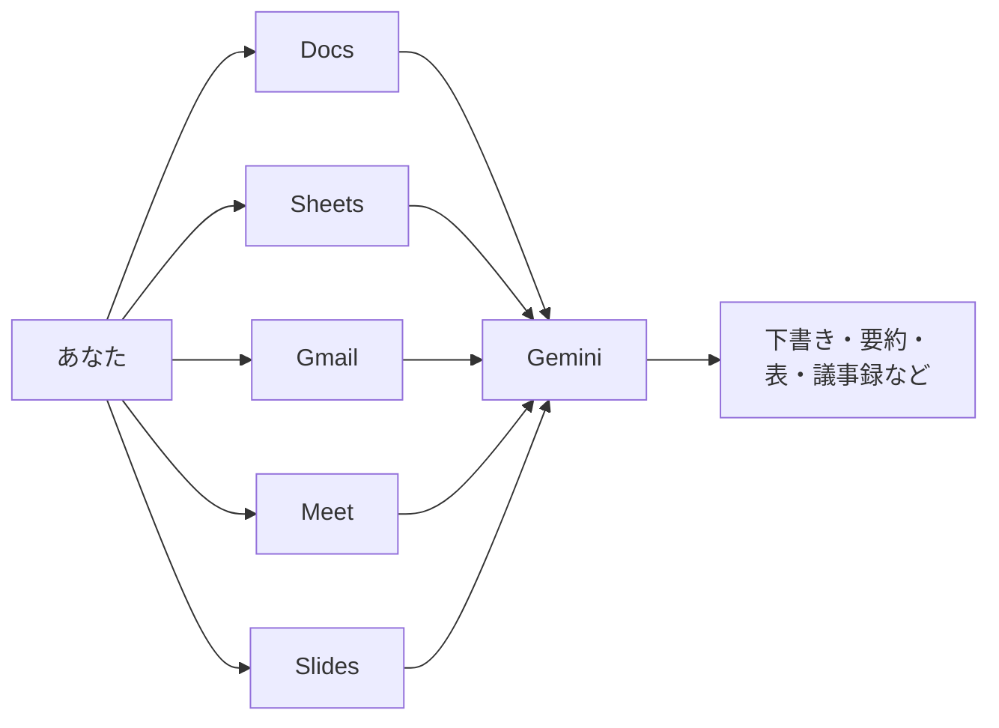

# 12. Google WorkspaceとGemini

[11章](11-gemini-advanced.md)ではGeminiアプリそのものを掘り下げました。本章の舞台はその反対側、**Google Workspaceのアプリを開いたまま、右側から顔を出すGemini**です。11章と12章の関係は、同じGeminiを「スタンドアローンで見るか」「Workspace越しに見るか」の違いだと思ってください。Workspaceの内側に立つと、同じ道具の見え方がだいぶ変わってきます。

## 対象読者と前提

- [1章](01-gemini-in-workspace.md)のハンズオンで、Docs／Gmailのサイドパネルを一度は触った人
- [8章](08-common-capabilities.md)の「チャット／アーティファクト／コネクタ」の3本柱と、[11章](11-gemini-advanced.md)のGemini固有機能にざっと目を通した人
- Google Workspaceを業務で普段使いしているが、Gemini連携の全体像はまだ断片的にしか触っていない人

Workspaceの各アプリは月単位でUIが更新されます。本章では**どこに何があるか**ではなく、**どの場面で呼ぶと効くか**に重心を置きます。ボタンの位置が動いても、使いどころの勘どころは大きく変わりません。

## Workspaceの中にGeminiがいる、という見取り図

Workspaceアプリの右上には、星のかたちをしたGeminiアイコンが座っています。クリックするとサイドパネルが開き、「いま開いているファイルやメール」を材料に会話が始まります。アプリごとに入口が分散しているように見えますが、内部のGeminiは同じ1体です。

同じ星型アイコンでも、入口が違えば**材料にできるもの**も変わります。Docsなら本文、Gmailなら受信スレッド、Meetなら会議音声、という具合に、それぞれのアプリで扱う素材がそのまま会話の前提になります。Workspaceサイドパネル最大の利点は、この「開いているものを自動で材料に回してくれる」点に尽きます。

## Docs: 下書きから仕上げまで

Googleドキュメントのサイドパネルは、本章でいちばん出番が多い相棒です。依頼の粒度を3段に分けてみると、使いどころがはっきりします。

| 依頼の粒度 | 例 | 出力の受け取り方 |
| ---- | ---- | ---- |
| まっさらからの下書き | 「社内向けの勉強会告知を200字で」 | 「ドキュメントに挿入」で本文へ流し込む |
| 既存文章の変換 | 「この段落をですます調に」「3行に短く」 | 本文で範囲選択してからサイドパネルへ依頼 |
| 構成の整理 | 「この文書の目次を提案して」「抜けている観点は？」 | サイドパネル上で読んでから、必要な部分だけ反映 |

「選択範囲を材料にする」動きは、Docsで特に覚えておく価値があります。本文で気になる段落をハイライトしてからサイドパネルで指示すると、その部分にだけ焦点が当たります。全文を渡してしまうと、モデルの注意が散らかり、意図と外れた書き換えが返ってきやすくなります。

### Docsで覚えておきたい合言葉

- 「です・ます調に整える」「である調でそろえる」：文体を都度指定しないと、既定のトーンに流れてしまう
- 「段落ごとに」：出力を受け取ったあとに手を入れる際、区切りが見える
- 「このドキュメントの用語に合わせて」：社内文書特有の言い回しを優先させる合図になる

## Sheets: 表を「読む」「作る」「直す」

SheetsのGeminiサイドパネルは、表を前にしたときのもやもやを言語化する場面で効きます。

| 場面 | 頼み方の例 |
| ---- | ---- |
| 表の要約が欲しい | 「この表の上位5件と、目立つ傾向を3行で」 |
| 列の意味を推測してほしい | 「この列の名前からすると、どんなデータが入っていそう？」 |
| 計算式を組み立てたい | 「B列が『済』の行だけ、C列の合計を出す数式」 |
| 表の形を変えたい | 「この縦長の表を、月別に横持ちに直す数式」 |

「こういう計算がしたい」を自然文で投げると、Geminiは近い数式を提案してきます。提案された数式は、**そのまま採用する前に1行で試す**のが安全です。関数名の綴りや引数順が微妙に違うことが、いまのところは珍しくありません。数式の確認をGemini任せにすると、[6章（ハルシネーション）](06-hallucination-and-knowledge-literacy.md)で扱った「もっともらしい嘘」の典型的な出方をそのまま踏むことになります。

機密情報が含まれる表の場合は、[9章](09-security-individual.md)の入力チェックをここでも通してください。Sheetsの表は数字が並んでいるので一見おとなしく見えますが、顧客名や金額が素のまま並んでいるケースのほうがむしろ多いものです。

## Gmail: 下書き、要約、整理

GmailのGeminiは、下書き生成と受信整理の2方向で働きます。

### 返信の下書き

1章のハンズオンで触れたとおり、返信フォームの「Geminiで下書き」ボタンで骨格が出てきます。短めの合言葉（「柔らかく断る」「来週水曜まで回答を保留」「見積もり依頼に一次返答」）だけ渡すのが、経験則として安定しやすい頼み方です。依頼文を長く書くほど、かえって不要なニュアンスが返信に混ざりがちです。

### 受信スレッドの要約

長大なスレッドを開いたときは、サイドパネルから「このスレッドを3行で」と頼むと、論点の入口がつかめます。**相手の質問で返信待ちになっている箇所だけ挙げて**のような追いかけ方もできるので、返信しそびれの発掘にも使えます。

### 検索の下書き

「先月の◯◯さんからの添付付きメール」のような条件を自然文で投げると、Gmailの検索演算子に整えてくれます。複雑な検索条件を覚えていなくても、ふだんの言葉で近いものを引き出せます。

## Meet: 議事録と要約

Google MeetのGemini連携は、会議中ではなく**会議後**に効きが出る機能です。

| 機能 | ひと言で言うと | 気にする点 |
| ---- | ---- | ---- |
| 議事録の自動生成（Take notes for me） | 会議中の発話を要約し、終了後にDocsで共有 | 事前に主催者が有効化する必要がある |
| 字幕・翻訳字幕 | 発話を逐次テキスト化・他言語に翻訳 | 参加者ごとに表示言語を切り替えられる |
| 会議の要約通知 | 会議後に主催者へメールで要点送付 | 不参加の同僚へ要点共有が速い |

議事録は下書きとして受け取るのが前提で、**固有名詞や数字の確認は人間の仕事**として残ります。特に社外の会議名・金額・日時は誤記のまま配布されないよう、公開前にいちど目を通してください。録音・録画と同様に、議事録機能を有効にする際は参加者に告知するのが通例です。社外参加者がいる会議では、地域や契約によって事前同意が法的に求められる場合があります。自動で配布される議事録や要約が増える段階では、人の確認を経由しない経路で情報が動く場面も現れます。このあたりの境界管理は[10章](10-security-agent-era.md)で整理します。

## Slides: たたき台とビジュアル

GoogleスライドのGemini連携は、**たたき台と装飾**の2方向に効きます。

- **構成のたたき台**：「このDocsの内容から、5枚構成のスライドを」のように頼むと、スライド単位の骨子が返る
- **画像生成**：スライドに挿絵として入れる画像を、プロンプトから生成できる（[11章](11-gemini-advanced.md)のImagenと同じ流れ）
- **箇条書きの整形**：詰め込み気味のテキストを、1枚に収まるボリュームへ短縮してもらう

スライドは出力の揺れが目で見てわかりやすい媒体です。最初の生成で全部決めようとせず、**骨子 → 見出し → 挿絵**と段階を分けて育てていくほうが、結果として手戻りを少なくまとめやすくなります。

## Workspace周辺のAIソリューション

Workspaceアプリの中のサイドパネルだけがGeminiの入口ではありません。同じGoogleアカウントから飛べる周辺サービスに、毛色の違うAIツールがいくつかあります。本ドキュメントで覚えておいてほしいのは2つです。

### NotebookLM: 自分の資料の上に立つ研究助手

NotebookLMは、手元の資料（PDF、Googleドキュメント、Webページ、音声ファイルなど）をアップロードして、**その資料の中からだけ**質問に答えさせるサービスです。Webの一般知識まで使って答える通常のチャットとは逆向きで、投入した素材だけで回答を組み立てる設計になっています。

| こんなときに | NotebookLMの向き・不向き |
| ---- | ---- |
| 会議資料一式を読み込んだうえで質問応答したい | 向いている（資料側に根拠リンクが付く） |
| 汎用的な知識で雑談したい | 向いていない（資料外の情報は基本的に扱わない） |
| 長い資料の音声要約を作りたい | 向いている（音声サマリ機能で車中学習にも使える） |

URLは`https://notebooklm.google.com/`です。個人アカウントからも試せますが、業務資料を扱う場合は**ログインするアカウントを業務用に合わせる**ことを忘れないでください。要領は[9章](09-security-individual.md)の入力チェックとまったく同じです。

### Google Vids: AI支援の動画エディタ

Google Vids（`https://studio.workspace.google.com/`および`https://vids.google.com/`が主な入口）は、Workspaceプランから利用できる動画作成サービスです。テキストの筋書きから、スライド風の動画のたたき台を作成し、ナレーション・字幕・BGMを重ねられます。本ドキュメントではカタログ的な深掘りはしませんが、「社内向けの短い説明動画を、スライドより速く作りたい」ときの選択肢として名前だけ覚えておくと役に立ちます。

これら周辺サービスは、Workspaceプランによって使えたり使えなかったりします。見当たらない場合は、まずはプラン側の確認から始めるのが順当です。Workspace単体で閉じない自動化（ZapierやMakeなどとの組み合わせ）を検討する段階の選択肢は、[Appendix: ワークフローツール](appendix-workflow-tools.md)にまとめています。

## プランと見え方のおさらい

GeminiをWorkspaceで使うときにいちばんつまずきやすいのは、**機能がプランに紐づいている**という事実です。同じGoogleアカウントでも、個人プランと会社プランではサイドパネルに見える機能が違いますし、会社プランの中でもエディション次第で利用可否が分かれます。

次の整理は2026年4月時点のざっくりした位置づけです（最終確認：2026-04-24）。

| 種類 | ざっくりした位置づけ |
| ---- | ---- |
| 個人のGoogleアカウント | Geminiアプリの基本機能は使える。Workspace統合はDocs／Gmail等のサイドパネルが中心 |
| `Gemini for Google Workspace` | 会社のWorkspaceプランから使うGemini。議事録生成やMeetの追加機能などはこの枠 |
| Workspace Business／Enterpriseの上位エディション | 監査ログやデータ保持の細かな制御が可能。詳しくは組織のWorkspace管理者へ |

「個人では動いた機能が会社アカウントで見当たらない」「逆に、会社では使える機能が個人アカウントにはない」という見え方のズレは、アプリの不具合ではなく、**プラン設計の違い**から生じるものです。個人で先に触って覚えた手順が、会社の環境ではそのまま機能しないこともある、くらいの予防線を張っておくと余計な焦りが出にくくなります。

## よくある失敗パターン

Workspace越しにGeminiを使い始めると、アプリの内側ならではの落とし穴があります。代表的なものを先回りして挙げておきます。

- **アカウントの取り違え** — 個人アカウントのGmailで業務メールを下書きしてしまう。ブラウザのプロファイルを業務／私用で完全に分けるのが確実
- **共有設定の勘違い** — Docsの下書きを「リンクを知っている全員」のまま共有したまま放置する。[9章](09-security-individual.md)で触れた共有範囲のチェックをここでも通す
- **サイドパネルに全部任せる癖** — 長大な文書を開いたまま「要約して」と頼み、出力がぼんやりする。選択範囲を絞る／章ごとに分けて頼む、の2手で大半は解決
- **議事録の自動配布を鵜呑み** — 固有名詞と数字の誤記が混ざったまま関係者に届くと、後日「訂正のお知らせ」を再送する作業が発生する
- **プラン差を踏まえない手順書** — 社内手順書に特定プラン限定の操作をそのまま書くと、別プランの同僚が詰まる。プラン名を明記するか、依存しない代替手順を併記する

どれも目に見える事故というよりは、気づきにくい形で効率を削るタイプのつまずきです。最初に一度ひっかかっておくと、以降は自分で避けられるようになります。

## まとめ

- Workspaceの各アプリは、右上のGeminiアイコンから**開いているものを材料にした会話**へ踏み出せる
- Docsは下書き／変換／構成、Sheetsは要約／数式／変形、Gmailは下書き／要約／検索が当たりどころ
- Meetの議事録は「下書きとして受け取る」前提。固有名詞と数字の確認は人間の仕事
- 周辺サービスのNotebookLMは、**手元の資料に閉じた質問応答**が得意。Google Vidsは動画のたたき台を作る選択肢
- 機能の見え方はプランで変わる。個人と業務で挙動が違うのは、不具合ではなくプラン設計上の差
- 次は [13章（Claude）](13-claude.md) で、比較対象のClaude側の使いこなし（Projects・Artifacts・コネクタ・MCP）へ進む

## 参考

- Google「Gemini for Google Workspace」: <https://workspace.google.com/solutions/ai/>（最終確認：2026-04-24）
- Google「GmailでGeminiを使う」: <https://support.google.com/mail/answer/14200580>（最終確認：2026-04-24）
- Google「GoogleドキュメントでGeminiを使う」: <https://support.google.com/docs/answer/14206696>（最終確認：2026-04-24）
- Google「GoogleスプレッドシートでGeminiを使う」: <https://support.google.com/docs/answer/14356494>（最終確認：2026-04-24）
- Google「Google Meetで議事録を自動作成する」: <https://support.google.com/meet/answer/14754931>（最終確認：2026-04-24）
- NotebookLM: <https://notebooklm.google.com/>（最終確認：2026-04-24）
- Google Vids: <https://workspace.google.com/products/vids/>（最終確認：2026-04-24）
