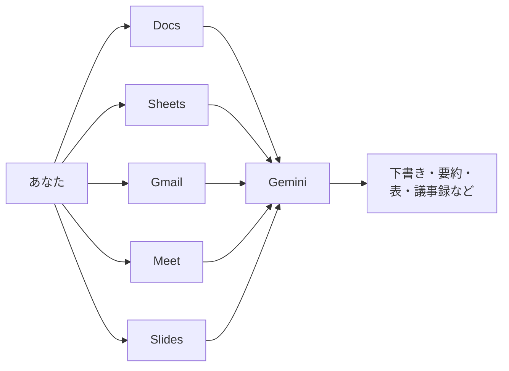

# 12. Google WorkspaceとGemini

本章では、Google WorkspaceのDocs、Gmail、Sheets、Meet、Slidesから呼び出すGeminiの使いどころを扱います。スタンドアローン版のGeminiと同じモデルを使いますが、入口がアプリ側にあるため、開いている文書・メール・会議音声がそのまま会話の前提になります。アプリごとに依頼の組み立て方が変わるため、場面別に整理していきます。

## 対象読者と前提

- [1章](01-gemini-in-workspace.md)のハンズオンで、Docs／Gmailのサイドパネルを一度は触ったことがある
- [8章](08-common-capabilities.md)の「チャット／アーティファクト／コネクタ」の3本柱と、[11章](11-gemini-advanced.md)で扱ったGemini固有機能（Gems・Canvas・マルチモーダル入力・画像生成・動画生成）にざっと目を通している
- Google Workspaceを業務で普段使いしているが、Gemini連携の全体像はまだ断片的にしか触っていない

Workspaceの各アプリは月単位でUIが更新されます。本章では画面のどこに何があるかをマニュアル的に並べるのではなく、どの場面で呼び出すと作業が進めやすいかを軸に整理します。ボタンの位置が動いても、場面ごとの使い分けそのものは大きく変わりません。

## サイドパネルから呼び出すGeminiの全体像

Workspaceアプリの右上には、星形のGeminiアイコンが配置されています。クリックするとサイドパネルが開き、いま開いているファイルやメールを材料として会話を始められます。アプリごとに入口が分かれていますが、呼び出されるモデルは同じGeminiです。

同じ星形アイコンでも、入口が違えば会話の材料にできる対象も変わります。Docsなら本文、Gmailなら受信スレッド、Meetなら会議音声、という具合に、アプリで扱う素材がそのまま会話の前提になります。Workspaceサイドパネルの中心的な利点は、開いているファイルをコピー＆ペーストせずそのまま会話の材料として渡せる点です。

## Docs: 下書きから仕上げまで

Googleドキュメントのサイドパネルは、本章で扱う5つのアプリの中で利用頻度が高い部類に入ります。依頼の粒度を3段に分けて整理すると、使いどころが追いやすくなります。

| 依頼の粒度 | 例 | 出力の受け取り方 |
| ---- | ---- | ---- |
| まっさらからの下書き | 「社内向けの勉強会告知を200字で」 | 「ドキュメントに挿入」で本文へ流し込む |
| 既存文章の変換 | 「この段落をですます調に」「3行に短く」 | 本文で範囲選択してからサイドパネルへ依頼 |
| 構成の整理 | 「この文書の目次を提案して」「抜けている観点は？」 | サイドパネル上で読んでから、必要な部分だけ反映 |

選択範囲を材料にする動きは、Docsで特に覚えておく価値があります。本文で気になる段落をハイライトしてからサイドパネルで指示すると、その範囲だけが会話の対象になります。全文を渡すと、モデルが本文全体を均等に扱うため、意図と外れた書き換えが返ってきやすくなります。

### Docsの依頼に添えておきたい指示

- 「です・ます調に整える」「である調でそろえる」：文体を都度指定しないと、既定のトーンに流れる
- 「段落ごとに」：出力を受け取ったあとに手を入れる際、区切りが見える
- 「このドキュメントの用語に合わせて」：社内文書特有の言い回しを優先する手がかりになる

## Sheets: 表を「読む」「作る」「直す」

SheetsのGeminiサイドパネルは、表を前にして言語化しきれていない論点を整理する場面に向きます。

| 場面 | 頼み方の例 |
| ---- | ---- |
| 表の要約が欲しい | 「この表の上位5件と、目立つ傾向を3行で」 |
| 列の意味を推測してほしい | 「この列の名前からすると、どんなデータが入っていそう？」 |
| 計算式を組み立てたい | 「B列が『済』の行だけ、C列の合計を出す数式」 |
| 表の形を変えたい | 「この縦長の表を、月別に横持ちに直す数式」 |

「こういう計算がしたい」を自然文で投げると、Geminiは近い数式を提案します。提案された数式は、本番のセルへ反映する前にダミー行で1度試す手順をはさむのが安全です。関数名の綴りや引数順がわずかに異なる例は、現時点では珍しくありません。数式の検証までGeminiに委ねると、[6章（ハルシネーション）](06-hallucination-and-knowledge-literacy.md)で扱った「もっともらしい嘘」が典型的な形で現れます。

機密情報を含む表の場合は、[9章](09-security-individual.md)の入力チェックをここでも通してください。数字中心の表は機微情報が少なく見えがちですが、顧客名・金額・取引先名がそのまま並んでいる例は多くあります。

## Gmail: 下書き、要約、整理

GmailのGeminiは、下書き生成と受信整理の2方向で利用できます。

### 返信の下書き

1章のハンズオンで触れたとおり、返信フォームの「Geminiで下書き」ボタンで骨格が出力されます。短めの補助指示（「柔らかく断る」「来週水曜まで回答を保留」「見積もり依頼に一次返答」）だけ渡すのが、経験則として扱いやすい頼み方です。依頼文を長く書くほど、不要なニュアンスが返信に混ざりやすくなります。

### 受信スレッドの要約

長大なスレッドを開いたときは、サイドパネルから「このスレッドを3行で」と頼むと、論点の入口がつかめます。「相手の質問で返信待ちになっている箇所だけ挙げて」のような追いかけ方も指定できるため、返信しそびれの洗い出しにも使えます。

### 検索の下書き

「先月の◯◯さんからの添付付きメール」のような条件を自然文で投げると、Gmailの検索演算子に整形した結果が返ります。検索演算子の構文を覚えていなくても、日常語に近い表現から該当メールを呼び出せます。

## Meet: 議事録と要約

Google MeetのGemini連携は、会議中ではなく会議の終了後に出力が生成される機能です。

| 機能 | ひと言で言うと | 気にする点 |
| ---- | ---- | ---- |
| 議事録の自動生成（Take notes for me） | 会議中の発話を要約し、終了後にDocsで共有 | 事前に主催者が有効化する必要がある |
| 字幕・翻訳字幕 | 発話を逐次テキスト化・他言語に翻訳 | 参加者ごとに表示言語を切り替えられる |
| 会議の要約通知 | 会議後に主催者へメールで要点送付 | 不参加の同僚へ要点共有が速い |

議事録は下書きとして受け取るのが前提で、固有名詞や数字の確認は人の手で行う作業として残ります。特に社外の会議名・金額・日時は誤記のまま配布されないよう、公開前に通読してください。録音・録画と同様に、議事録機能を有効にする際は参加者に告知するのが通例です。社外参加者がいる会議では、地域や契約によって事前同意が法的に求められる場合があります。自動配布の議事録や要約が増えると、人の確認を経由しない経路で情報が動く場面も現れます。このあたりの境界管理は[10章](10-security-agent-era.md)で整理します。

## Slides: たたき台とビジュアル

GoogleスライドのGemini連携は、構成のたたき台、挿絵の生成、箇条書きの整形の3つの場面で利用できます。

- 構成のたたき台：「このDocsの内容から、5枚構成のスライドを」のように頼むと、スライド単位の骨子が返る
- 挿絵の生成：スライドに入れる画像をプロンプトから生成できる（[11章](11-gemini-advanced.md)のImagenと同じ流れ）
- 箇条書きの整形：詰め込み気味のテキストを、1枚に収まるボリュームへ短縮する

スライドは出力の揺れが視覚的に把握しやすい媒体です。最初の生成で全部決めようとせず、骨子・見出し・挿絵の3段に分けて段階的に手を入れていくほうが、結果として手戻りの少ない形でまとめやすくなります。

## Workspace周辺のAIソリューション

Workspaceアプリ内のサイドパネルだけがGeminiの入口ではありません。同じGoogleアカウントから利用できる周辺サービスに、用途の異なるAIツールがいくつかあります。本ドキュメントで取り上げるのは次の2つです。

### NotebookLM: 投入した資料の中だけで回答するサービス

NotebookLMは、手元の資料（PDF、Googleドキュメント、Webページ、音声ファイルなど）をアップロードし、その資料の範囲内で質問に答えさせるサービスです。Webの一般知識まで参照して答える通常のチャットとは逆向きで、投入した素材の範囲内で回答を生成する設計になっています。

| こんなときに | NotebookLMの向き・不向き |
| ---- | ---- |
| 会議資料一式を読み込んだうえで質問応答したい | 向いている（資料側に根拠リンクが付く） |
| 汎用的な知識で雑談したい | 向いていない（資料外の情報は基本的に扱わない） |
| 長い資料の音声要約を作りたい | 向いている（音声サマリ機能で車中学習にも使える） |

URLは`https://notebooklm.google.com/`です。個人アカウントからも試せますが、業務資料を扱う場合はログインしているアカウントが業務用であることを確認してください。確認の手順は[9章](09-security-individual.md)の入力チェックと同じです。

### Google Vids: AI支援の動画エディタ

Google Vids（`https://studio.workspace.google.com/`および`https://vids.google.com/`が主な入口）は、Workspaceプランから利用できる動画作成サービスです。テキストの筋書きから、スライド風の動画のたたき台を作成し、ナレーション・字幕・BGMを重ねられます。本ドキュメントでは深掘りしませんが、社内向けの短い説明動画をスライドより速く作りたい場面の選択肢として、名称だけ押さえておきます。

これら周辺サービスは、Workspaceプランによって利用可否が異なります。見当たらない場合は、プラン側の確認から始めるのが順当です。Workspace単体で閉じない自動化（ZapierやMakeなどとの組み合わせ）を検討する段階の選択肢は、[Appendix: ワークフローツール](appendix-workflow-tools.md)にまとめています。

## プランによって使える機能が変わる

同じGoogleアカウントでも、個人プランと会社プランではサイドパネルに表示される機能が異なります。会社プランの中でもエディションによって利用可否が分かれるため、自分の画面と他の人の画面が同じ機能を備えているとは限りません。

次の整理は2026年4月時点のざっくりした位置づけです（最終確認：2026-04-24）。

| 種類 | ざっくりした位置づけ |
| ---- | ---- |
| 個人のGoogleアカウント | Geminiアプリの基本機能は使える。Workspace統合はDocs／Gmail等のサイドパネルが中心 |
| `Gemini for Google Workspace` | 会社のWorkspaceプランから使うGemini。議事録生成やMeetの追加機能などはこの枠 |
| Workspace Business／Enterpriseの上位エディション | 監査ログやデータ保持の細かな制御が可能。詳しくは組織のWorkspace管理者へ |

「個人では動いた機能が会社アカウントで見当たらない」「逆に、会社では使える機能が個人アカウントにはない」という見え方のズレは、アプリの不具合ではなく、プラン設計の違いから生じます。個人で先に触って覚えた手順が、会社の環境ではそのまま機能しない場合がある、という前提をあらかじめ共有しておきます。

## よくある失敗パターン

Workspace越しにGeminiを使い始めると、アプリの内側ならではの典型的なつまずきがあります。代表的なものを先に並べておきます。

- アカウントの取り違え：個人アカウントのGmailで業務メールを下書きしてしまう。ブラウザのプロファイルを業務／私用で分けて運用すると取り違えを抑えやすい
- 共有設定の確認漏れ：Docsの下書きを「リンクを知っている全員」のまま放置する。[9章](09-security-individual.md)で扱った共有範囲のチェックをここでも通す
- サイドパネルへの一括依頼：長大な文書を開いたまま「要約して」と頼み、出力の論点がぼやける。選択範囲を絞る、節ごとに分けて頼む、の2手で多くは解消する
- 議事録の自動配布の取り扱い：固有名詞と数字の誤記が混ざったまま関係者に届くと、後日に訂正の再送が発生する
- プラン差を踏まえない手順書：社内手順書に特定プラン限定の操作をそのまま記すと、別プランの同僚が同じ手順を再現できない。プラン名を明記するか、プランに依存しない代替手順を併記する

いずれも、目に見える事故というよりは、気づきにくい形で作業効率を落とすタイプのつまずきです。一度経験しておくと、以降は自分で避けられるようになります。

## まとめ

- Workspaceの各アプリは、サイドパネルから開いている文書・メール・会議音声などを会話の材料として呼び出せる
- Docsは下書き／変換／構成、Sheetsは要約／数式／変形、Gmailは下書き／要約／検索、Meetは議事録、Slidesはたたき台に向く
- Meetの議事録とNotebookLMの回答は下書き扱いで、固有名詞・数字・出典の確認は人の手で行う
- 機能の利用可否はWorkspaceプランごとに異なる。個人と業務で挙動が違う場合は、プラン側の確認から始める

次は[13章（Claude）](13-claude.md)で、Claude側の使いこなし（Projects・Artifacts・コネクタ・MCP）へ進みます。

## 参考

- Google「Gemini for Google Workspace」: <https://workspace.google.com/solutions/ai/>（最終確認：2026-04-24）
- Google「GmailでGeminiを使う」: <https://support.google.com/mail/answer/14200580>（最終確認：2026-04-24）
- Google「GoogleドキュメントでGeminiを使う」: <https://support.google.com/docs/answer/14206696>（最終確認：2026-04-24）
- Google「GoogleスプレッドシートでGeminiを使う」: <https://support.google.com/docs/answer/14356494>（最終確認：2026-04-24）
- Google「Google Meetで議事録を自動作成する」: <https://support.google.com/meet/answer/14754931>（最終確認：2026-04-24）
- NotebookLM: <https://notebooklm.google.com/>（最終確認：2026-04-24）
- Google Vids: <https://workspace.google.com/products/vids/>（最終確認：2026-04-24）
