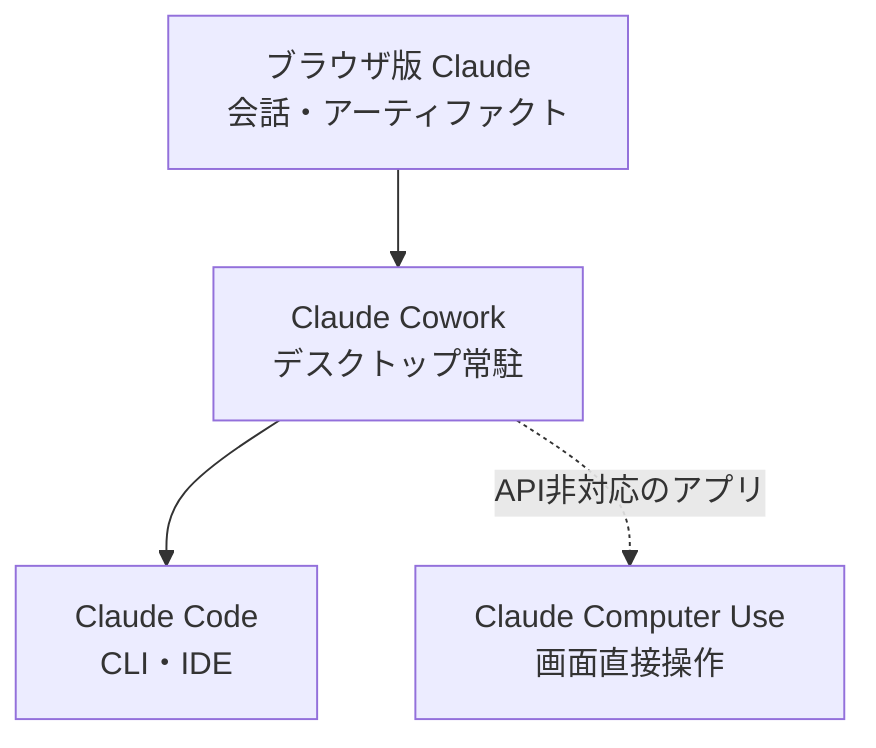
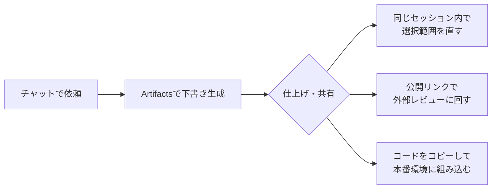
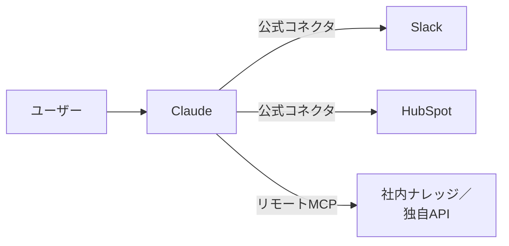

# 13. Claudeを使いこなそう

本章は、Claude固有の機能と、2026年4月時点で利用者が押さえておきたい論点、Claude側に寄せたほうが進めやすい場面の3点を扱います。取り上げる機能は、Projects、Artifacts、コネクタ、Web検索、Research、リモートMCPサーバ、Claude Cowork、メモリ、スタイルの9つです。[8章](08-common-capabilities.md)で整理した「チャット／アーティファクト／コネクタ」の共通骨格に対する、Claude側の具体像にあたる位置づけです。

Claude Code（自分のPCで動くClaude）の詳細は[Appendix: Claude Code](appendix-claude-code.md)で別立てに扱います。本章は、ブラウザの`https://claude.ai`とデスクトップアプリ（チャット機能）から呼び出すClaudeを対象にします。

## 対象読者と前提

- [8章](08-common-capabilities.md)の3つの能力（チャット・アーティファクト・コネクタ）に目を通している人
- Claudeを業務で使い始めており、使い分けの軸を整理したい人。まだ使ったことがない場合は、次節の手順で最初の会話を試してから読み進める
- 直前に[11章](11-gemini-advanced.md)・[12章](12-google-workspace-and-gemini.md)でGemini側を読んでいる場合、両者の対比が頭に入っている

各機能の利用可否は、Free／Pro／Max／Team／Enterpriseのプランで変わります。本章では方針と全体像に集中し、最新の詳細は各参考URLで確認してください。

## Claudeを初めて使うときは、ブラウザでアカウントを作って会話を試す

[1章](01-gemini-in-workspace.md)ではGeminiを入口としてハンズオンを進めました。Claudeをまだ使っていない場合は、本章の機能解説へ入る前に、同じ要領で短い会話を数回試しておきます。

手順は次のとおりです。

1. ブラウザで`https://claude.ai`を開く
2. メールアドレスまたはGoogleアカウントでサインアップする。Freeプラン（無料）で本章の内容は一通り確認できる
3. チャット画面が開いたら、[1章](01-gemini-in-workspace.md)で試したのと同じ種類の依頼を入力する

[1章](01-gemini-in-workspace.md)と同じお題で構いません。たとえば次のような依頼です。

```text
明日の営業会議のアジェンダを、15分・30分・60分の3パターンで箇条書きにして
```

GeminiとClaudeの両方で同じ依頼を試すと、応答の文体や構成の違いが見えてきます。どちらが正しいという話ではなく、モデルごとに応答の傾向が異なるという[2章](02-what-is-generative-ai.md)の前提を、自分の手元で確かめる機会になります。

会社としてClaudeを導入済みの場合は、個人アカウントではなく会社のTeam／Enterpriseプランを利用します。どちらのアカウントで操作しているかの確認は、[9章](09-security-individual.md)で扱った入力チェックと同じ要領です。

ここまで試したら、以降の節へ進んでください。

## Claudeの主な4製品はブラウザ版とPC上で動く3つ

Claudeには、同じモデルを呼び出すための製品が4つあります。利用頻度が高いのはブラウザ版で、そのほかに自分のPC上で動くCowork／Computer Use／Claude Codeの3つがあります。本章の本題（ブラウザ版の機能）へ進む前に、4つの違いを整理します。

| 製品 | 主な利用場面 | 動作環境 | 人の確認ポイント | 詳しくは |
| ---- | ---- | ---- | ---- | ---- |
| ブラウザ版Claude | チャットとアーティファクトの会話 | `https://claude.ai`／デスクトップアプリ（チャット機能） | 送信時と、Artifactsの公開リンク設定 | 本章 |
| Claude Cowork | 自分のPC上の作業（複数アプリ横断） | デスクトップアプリの常駐エージェント | ファイル書き込みとアプリ起動の許可ダイアログ | 本章の「Claude Cowork」節 |
| Claude Computer Use | APIや連携が公開されていないアプリの画面操作 | 画面を見てマウス・キーボードを動かす | 送信や削除など取り消せない操作の直前 | [Appendix: デスクトップの自動化](appendix-desktop-automation.md) |
| Claude Code | 開発寄りの一連作業（ファイル＋コマンド） | CLI／IDE拡張／デスクトップアプリ | ファイルの書き込みとコマンド実行の許可 | [Appendix: Claude Code](appendix-claude-code.md) |

使い始める順序は、表の上から下へ進むのが順当です。ブラウザ版で普段のClaudeに慣れたら、Coworkで自分のPC上の作業に広げ、必要に応じてClaude Codeで開発寄りの作業に進みます。Computer Useは、APIや連携機能のないアプリを画面越しに操作したい場面で選びます。



4製品が呼び出すモデルは同じで、回答の品質そのものに差はありません。違うのは利用者のPCに対する操作権限の範囲で、表の下に進むほど、読み書きできるファイルや実行できる操作の幅が広がります。習得にかかる時間と、想定外の操作が起きたときの影響範囲も同じ順序で大きくなるため、選ぶときは「どこまで任せたいか」を先に決めると、判断の軸が揃います。

## Projectsはカスタム指示・ナレッジ・会話を1つの単位にまとめて共有できる

Claude.aiには**Projects**（プロジェクト）という機能があります。同じ前提と同じ資料を毎回参照する状態でチャットを始められる単位で、[11章](11-gemini-advanced.md)で扱ったGeminiのGemsと役割が近いものです。違いは、カスタム指示・参照ファイル・会話履歴の3つを1つにまとめ、メンバーで共有できる点にあります。

1つのProjectには、次のものを置けます。

| 置けるもの | 何のためか |
| ---- | ---- |
| カスタム指示 | 役割・口調・出力形式の初期値（「社内向けの平易な日本語で要約」など） |
| プロジェクトナレッジ | 毎回参照させたい資料（PDF、Markdown、コードなど） |
| 会話のスレッド | プロジェクト内で行った過去のチャット履歴 |
| 共有メンバー | 同じProjectを参照できる人と、その閲覧／編集権限 |

特徴は最後の2行にあります。会話と資料をひとまとめにしたうえで、そのままメンバーへ共有できる構造が、個人のチャット履歴とProjectsとの違いです。

### Projectsを適用しやすい場面

- 反復のある作業 — 週次レポートの下書き、英文メールの推敲、議事録の整形
- 共通前提が重い領域 — 製品仕様、社内用語集、過去の意思決定ログを参照しながら進める作業
- 小規模なチーム共有 — 同僚と同じ前提で進める下書き、ナレッジ整理

### Projectsを作るときの構成方針

- 役割を1つに絞る。用途を広げると、特定のタスクでの振る舞いが安定しにくくなる
- ナレッジは絞り込む。参照頻度の高い数本に限定したほうが、回答のばらつきが小さくなる
- 共有権限は最小から始める。`Can view`で開始し、必要に応じて`Can edit`へ広げる順序にすると、想定外の編集や閲覧が起きにくい

カスタム指示に盛り込む役割・背景・出力形式のパターンは[Appendix: プロンプトの組み立て方](appendix-prompting.md)にまとめてあります。

ナレッジの内容は、4章で扱った[ツール呼び出し](04-external-system-integration.md)とは別経路で、毎回モデルのコンテキストに添えて渡されます。詰め込みすぎるとコンテキストウィンドウを圧迫し、回答品質に影響します（仕組みの背景は[7章](07-terminology.md)）。

## Artifactsは動くプレビューと公開リンクが特徴

[8章](08-common-capabilities.md)でアーティファクトの概念を扱いました。Claudeのアーティファクトが**Artifacts**で、チャット画面の右側に作業ペインが開き、文書・コード・HTML・図を対話と並行して編集できます。

GeminiのCanvasと役割は重なりますが、Claude側に次の2点の違いがあります。

| 観点 | Claude Artifacts |
| ---- | ---- |
| 動くプレビュー | HTML／JavaScript／Reactの小さなアプリをArtifacts内で生成し、その場で実行・確認できる |
| 共有手段 | 仕上げたArtifactを`https://claude.ai/public/...`の公開リンクで共有し、相手はClaudeアカウントなしで開ける |



選択範囲を指して「この段落だけ短く」「ここの色をもう少し落ち着かせて」と依頼できる点はCanvasと同様で、長くなった会話履歴の影響を受けにくくなります。

### Artifactsを利用する前に確認したい3項目

- 公開リンクの公開範囲 — 共有リンクはURLを知っている人なら誰でも閲覧できる。社外秘の素材を含むArtifactで公開設定を有効にしない（[9章](09-security-individual.md)）
- 試作と本番の切り分け — 動くプレビューは試作用途で、継続利用には別途ホスティングを用意してそちらへ移す
- 版管理の限界 — Artifactsの履歴はGitのような堅牢な版管理ではない。重要な版は手元にも保存する

リンクを開いた時点で動くデモを参照できる共有形態は、文章中心の説明より相手側の理解につながりやすい場面があります。提案、社内勉強会、採用説明など、相手に動作を見せて反応を得る局面が、Artifactsを適用しやすい用途に当たります。

## コネクタ経由でWorkspace外のSaaSも直接参照できる

Claudeから有効化できるコネクタの一覧と、両社の使い分け早見表は[8章](08-common-capabilities.md)に集約してあります。本章では、代表的なサービスごとにClaude側で参照できる範囲を補足します。

- Slack — 指定チャンネルやスレッドの検索、メンションのキャッチアップ
- Gmail／Googleドライブ／Googleカレンダー — スレッド要約、関連資料の参照、空き枠の確認
- Zoom — 録画・文字起こしを材料にした要約・タスク抽出
- HubSpot — 取引先・案件・活動履歴の検索と整形
- Notion／Linear／Jira — ページ・チケットの参照、横断検索

「Workspaceの内側はGeminiが近道、Workspaceの外側や横断利用はClaude」という[8章](08-common-capabilities.md)の整理が、この並びにそのまま現れます。SlackやHubSpot、Zoomなど、Workspaceに隣接して使われるSaaSが標準コネクタに揃うのがClaude側の特徴です。

仕組みそのものは4章で扱った[ツール呼び出し](04-external-system-integration.md)にあたり、ClaudeはMCP（Model Context Protocol）経由でこれらを参照しています。利用者の操作はコネクタを有効化するだけですが、裏側では4章のツール呼び出しの流れがそのまま動きます。出力が想定と異なるときの切り分けは、4章の流れをたどると進みます。

### コネクタを有効化するときの最小チェック

- 用途が読み取りで完結するなら、書き込み権限は渡さない。書き込み権限の付与は誤った変更が起きたときの影響範囲が大きい
- 個人アカウントと業務アカウントを混在させない。業務データを個人アカウント経由のClaudeへ取り込ませる動線は、想定外の情報共有が起きやすい
- 利用しなくなったコネクタは外す。有効化したまま残すと、コンテキストへ入り得る情報の範囲が広がり続ける

詳細は8章のチェックリストと、個人利用視点の[9章](09-security-individual.md)で扱った内容がそのまま当てはまります。

## Web検索で会話中にインターネットの情報を参照できる

Claudeには**Web検索**機能があります。会話の途中でインターネット上の公開情報を検索し、検索結果を参照したうえで回答を組み立てる仕組みです。コネクタが特定のSaaS（Slack・HubSpotなど）との接続を担うのに対し、Web検索は公開Webページ全般を対象にします。

Web検索が有効な場合、Claudeは依頼の内容に応じて自動的に検索します。「最新の〜を調べて」「現在の〜は」のように時事性のある依頼を出すと検索が発動しやすくなりますが、利用者が毎回「検索して」と明示する必要はありません。検索結果にはソースURLが付くため、どのページの情報を参照したかを利用者側で確認できます。

### 向いている場面と注意点

| 場面 | Web検索の位置づけ |
| ---- | ---- |
| 最新の仕様・料金・リリース情報の確認 | 向いている。モデルの学習データより新しい情報を取得できる |
| 競合調査・市場動向の概要把握 | 向いている。複数のソースを並べて比較の材料にできる |
| 応答に含まれる事実の裏取り | 補助として有効。ただしWeb上の情報自体の正確性は保証されないため、一次ソースへの最終確認は利用者が行う |
| 社内の非公開情報の検索 | 向いていない。公開Webのみが対象で、社内ナレッジにはコネクタやMCPを使う |

[6章](06-hallucination-and-knowledge-literacy.md)で整理したとおり、生成AIの応答には事実誤認が混ざり得ます。Web検索を有効にすると、回答の根拠としてURLが提示されるため、裏取りの出発点が得られます。ただし、検索結果として取得した情報が正確であるとは限りません。最終的な事実確認は、6章で示した手順に沿って利用者が一次ソースを開いて行います。

Web検索はチャット画面の設定から有効化できます。利用可否はプランにより異なるため、参考欄の公式ヘルプで確認してください（最終確認：2026-05-25）。

## Researchはテーマを渡して調査レポートを得る機能

Web検索が会話の流れの中でその都度情報を補う仕組みであるのに対し、**Research**はテーマを渡すとClaude側が数分から数十分をかけて自律的にWebを探索し、引用元つきの構造化されたレポートを返す機能です。[11章](11-gemini-advanced.md)で扱ったGeminiのDeep Researchと同じ位置づけにあたります。

### 利用者から見える流れ

Researchを起動すると、内部では複数のエージェントが並列に動き、それぞれ異なる角度からWebを探索します。利用者から見える流れは次のとおりです。

1. 調査テーマを入力する
2. Claudeがテーマを分析し、調査計画を組み立てる
3. 計画に沿って複数の経路でWebを並列に検索・探索する
4. 集まった情報を統合し、引用元つきのレポートにまとめて返す

通常のチャットが即座に応答を返すのに対し、Researchは調査の深さに応じて数分から数十分を要します。その代わり、複数ソースの横断的な整理と引用元の明示が標準で含まれます。

### Google Workspaceとの連携

Google Workspaceアカウントを接続すると、ResearchはWeb上の公開情報に加えて、Gmail・Googleカレンダー・Googleドキュメントの内容も調査素材として参照できます。たとえば「直近1か月の社内メールとドキュメントから、プロジェクトXの進捗を整理して」といった依頼に対して、公開情報と社内素材の双方を組み合わせたレポートを生成できます。

接続するWorkspaceアカウントの範囲がそのまま調査対象の範囲になるため、どのアカウントで接続しているかの確認は、[9章](09-security-individual.md)で扱った入力チェックと同じ手順です。

### Web検索・Research・Deep Researchの対比

Claudeの中でのWeb検索とResearchの関係、およびGeminiのDeep Researchとの対比を整理します。

| 観点 | ClaudeのWeb検索 | ClaudeのResearch | GeminiのDeep Research |
| ---- | ---- | ---- | ---- |
| 応答時間 | 通常の会話とほぼ同じ | 数分〜数十分 | 数分〜十数分 |
| 出力の形 | 会話の応答にソースURLが付く | 構造化されたレポート（引用元つき） | 構造化されたレポート（引用元つき） |
| 探索の仕組み | 依頼に応じて都度検索 | マルチエージェントが並列に探索 | 段階的に複数ソースを探索 |
| 社内素材の参照 | 不可（公開Webのみ） | Google Workspace接続時に可能 | Workspace統合により参照可能 |
| 向く場面 | 会話の途中で最新情報を補いたいとき | まとまった調査レポートを得たいとき | まとまった調査レポートを得たいとき |

Web検索は日常のチャットに組み込む軽量な情報補完として、Researchは調査テーマに対する本格的なレポート生成として、それぞれ位置づけが分かれています。

ResearchはPro・Max・Team・Enterpriseの有料プランで利用できます。利用可否や呼び出し方はプランやUIによって異なるため、参考欄の公式ヘルプで確認してください（最終確認：2026-05-27）。

## リモートMCPサーバを自分で登録できる自由度がClaudeの特徴

公式コネクタの一覧には、自社の独自ツールや社内ナレッジ基盤は含まれません。Claudeは、ここに利用者が自分で**リモートMCPサーバ**を登録できる仕組みを用意しています。

[4章](04-external-system-integration.md)で触れたMCPの仕組みを、利用者側から呼び出す形で、公式コネクタの一覧に自分で構築した、または提供されたMCPサーバを追加できます。



[11章](11-gemini-advanced.md)で触れたとおり、Geminiは2026年4月時点で、任意のMCPサーバを標準のチャット画面から登録する手段が公開されていません。利用者が連携先を追加できる範囲は、現時点でClaude側のほうが広い状態です。

自由度が高い分、登録時に確認しておきたい項目もあります。

- MCPサーバの提供元を確認する。提供元が不明なサーバを登録すると、その通信経路を経由して会話の一部が外部に渡る
- 送信される情報の範囲を登録前に把握する。リモートMCPサーバは、登録した時点から該当する会話の一部を読み取れる
- 自前で構築する場合は読み取り専用から始める。書き込みや実行系の操作は、利用が安定してから追加する

組織として本格的に使い始める場合は、エージェント時代のガバナンスを扱った[10章](10-security-agent-era.md)を先に参照してください。なお、ClaudeのコネクタやMCPだけでは届かないSaaS同士の連携は、ZapierやMakeなどのワークフローツールの範囲になります。選択肢の俯瞰は[Appendix: ワークフローツール](appendix-workflow-tools.md)で扱います。

## Claude Coworkはデスクトップ常駐で複数アプリを横断する

2026年に一般提供が始まった**Claude Cowork**は、Claudeのデスクトップアプリ（macOS／Windows）に常駐し、ローカルのファイル・フォルダ・アプリを横断しながら依頼された作業を進める機能です。ブラウザ版のClaudeが提供するのは会話の中で完結する応答ですが、Coworkは利用者のPC上での読み書きとアプリ操作までを担当します。

有料プランで利用できます（対象プランは参考欄のAnthropic公式ページで確認してください）。エージェント用のスレッドは起動したまま維持でき、別のデバイスから進捗の確認や指示の追加が可能です。

### Coworkに向く作業

- 朝の時点で未読メールとカレンダーを照合し、その日の段取りメモを作る
- ダウンロードフォルダのPDFを内容で仕分け、関連ファイルと突き合わせて要約する
- 複数のローカル資料を横断して、社内向けの下書きドキュメントに整理する

複数のアプリと複数のファイルを行き来し、最後に1つのアウトプットへまとめる作業に向きます。1ファイル単位の細かな推敲や短い質問応答は、ブラウザ版で完結させたほうが応答までの時間が短く済みます。

Coworkと他3製品の比較は、本章冒頭の「Claudeの主な4製品はブラウザ版とPC上で動く3つ」節の表と図にまとめてあります。

## メモリ機能は会話をまたいで好みや文脈を保持する

Claudeには**メモリ**（Memory）機能があります。利用者の好み・作業パターン・事実情報などを、会話をまたいで長期的に保持する仕組みです。[5章](05-misunderstanding-learning.md)で整理した「コンテキストとメモリ」のうち、メモリの実際の使い方を本節で扱います。

### Projectsとの違い: 明示的に組み立てるか、暗黙に蓄積されるか

本章で扱ったProjectsと、メモリ機能は、どちらも「会話をまたいで参照できる情報」を扱います。ただし、蓄積の方法と共有範囲が異なります。

| 観点 | Projects | メモリ機能 |
| ---- | ---- | ---- |
| 蓄積の方法 | 利用者が明示的にファイルや指示を配置する | 会話の中で自動的に、または利用者の指示で保存される |
| 対象の粒度 | 案件・業務領域ごとにまとめた一式 | 個々の好み・事実・パターン単位 |
| 共有範囲 | メンバーに共有できる | 個人に紐づく。他の利用者には共有されない |
| 適用のされ方 | 該当Projectを開いた会話にだけ適用される | すべての新しい会話で自動的に参照される |

使い分けは次のように整理できます。Projectsは「この案件ではこの前提で進めてほしい」という仕事単位の文脈を明示的に組み立てる用途に向きます。メモリは「日本語で答えてほしい」「要約は箇条書き形式が好み」のような、案件を問わず適用される個人の文脈に向きます。

### 保存される内容の典型例

メモリに保存される内容は、おもに次の4種類です。

- 言語や出力スタイルの好み（「回答は日本語で」「箇条書き形式」「敬語は不要」など）
- 利用者に関する事実情報（名前、所属、担当領域など、利用者が会話中に伝えた内容）
- 作業パターン（「週次レポートはこの構成で」「コードレビューではセキュリティ観点を先に」など）
- 過去の会話から得た文脈（進行中のプロジェクトの前提、以前の指示の方針など）

利用者から「これを覚えておいて」と明示的に指示できるほか、会話の流れからClaudeが自動的に保存する場合もあります。自動保存された内容は設定画面から確認できます。

### メモリの管理は設定画面で行う

Claude.aiの設定画面からメモリの一覧を確認できます。個別の項目を削除したり、メモリ機能そのものをオフにしたりする操作も、同じ画面で行います。

利用上の留意点は次の2点です。

- 案件の切り替わりや担当変更のタイミングで、古い前提が残っていないかを確認する。古い案件の情報が新しい会話の応答に混ざる場合は、該当するメモリ項目を削除する
- メモリの保存と削除にかかわるセキュリティ上の注意は、[9章](09-security-individual.md)の「履歴とメモリ」節を参照する。機微情報が意図せず保存されていないかの確認手順も同節にある

メモリ機能は、保存内容を利用者が確認・管理できることを前提とした設計です。定期的に設定画面を開いて棚卸しする手順が、意図しない情報の残留を防ぐ基本になります（最終確認：2026-05-25）。

## スタイル機能は応答のトーンと形式を切り替える

Claudeには**スタイル**（Styles）機能があります。応答のトーンや形式を、利用者が明示的に選択できる仕組みです。チャット画面のモデル選択の隣にあるスタイル選択メニューから切り替えます。

あらかじめ用意されたプリセットと、利用者が自分で定義するカスタムスタイルの2種類があります。

### プリセットスタイルから選ぶ

代表的なプリセットは次のとおりです。

| プリセット名 | 応答の傾向 |
| ---- | ---- |
| Normal（標準） | スタイルを意識せず使いたいときの初期値 |
| Concise（簡潔） | 短く要点だけを返す。確認や事実の問い合わせに向く |
| Explanatory（説明的） | 背景と理由を含めて丁寧に説明する。仕組みの理解や社内共有資料の下書きに向く |
| Formal（フォーマル） | ビジネス文書寄りの文体。社外向けメールや提案書の下書きに向く |

プリセットの並びや名称は更新される可能性があるため、最新の一覧はClaude.aiの設定画面で確認してください。

### カスタムスタイルは業務に合わせて定義できる

プリセットでは合わない場面には、カスタムスタイルを作成できます。作成画面で、応答の口調・形式・長さなどを自由文で指示します。

カスタムスタイルの例を2つ挙げます。

- 社内Slackの投稿用 — 箇条書き中心、敬語なし、結論を冒頭の1行に置く
- お客様向けの提案メール用 — です・ます調で丁寧に、3段落以内に収める

作成したカスタムスタイルは設定画面から管理でき、不要になったら削除できます。

### Projects・メモリとの使い分け

本章で扱ったProjectsとメモリは、どちらも会話をまたぐカスタマイズの仕組みです。スタイルはこれらとは別の軸にあたります。

| 観点 | Projects | メモリ | スタイル |
| ---- | ---- | ---- | ---- |
| 何をカスタマイズするか | 案件ごとの前提・資料・指示 | 個人の好み・事実・作業パターン | 応答のトーン・形式・文体 |
| 設定の方法 | 利用者が明示的に構成する | 会話中に自動または指示で蓄積 | プリセットから選択、または独自に定義 |
| 適用の範囲 | 該当Projectの会話のみ | すべての新しい会話 | 選択中の全会話に適用 |
| 典型的な使い方 | この案件ではこの仕様書を参照して | 回答はいつも日本語で | 社外向けメールはフォーマルに |

3つは競合せず、同時に使えます。Projectで案件の前提を設定し、メモリで個人の好みを蓄積しつつ、スタイルで応答の文体を切り替える組み合わせが自然です。

[11章](11-gemini-advanced.md)で扱ったGeminiのGemsでは、カスタム指示の中に応答のトーンや形式の指定も含められます。ClaudeではProjectsのカスタム指示とスタイル機能が分かれている点が構造上の違いです。用途に応じてスタイルを切り替えたい場面では、Projectsの指示を書き換えなくてもスタイルの選択だけで済みます（最終確認：2026-05-27）。

## 2026年春時点で押さえておきたい3つの論点

Claudeは半年単位で機能が追加される道具です。2026年4月時点で、ドキュメントの表面には現れにくく、利用時に気づきやすい論点を3点挙げます。

### プラン差はGeminiより明確に現れる

Free／Pro／Max／Team／Enterpriseのプラン差は、Claudeでは利用可否の境界として明確に現れます。代表的な差は次のとおりです。

- Projectsの作成数と、ナレッジに置けるファイルの上限
- 利用できるモデル（最上位モデルや、長コンテキスト版の解放）
- リモートMCPサーバの登録可否、Coworkや一部コネクタの利用可否
- 会話履歴の保持・組織への共有設定

個人プランで利用できた機能が会社プランの画面に表示されない、または会社プランでだけメニューが追加表示される、といった現象は、アプリの不具合ではなくプラン設計の差にあたります。プラン名と利用可否は、参考欄の公式ヘルプで都度確認してください。

### 対応コネクタは月単位で更新される

公式コネクタは、2026年4月時点で50を超える勢いで追加が続いています。[8章](08-common-capabilities.md)の一覧表と本章の補足は執筆時点のスナップショットです。3か月後にはアプリの並びが入れ替わっている可能性があります。社内向けの案内や手順書を作成する場合は、本ドキュメントを孫引きせず、公式ページを都度参照してください。

### モデルはOpus／Sonnet／Haikuの3系統が並ぶ

[8章](08-common-capabilities.md)では、両サービスに共通する軽量・標準・重量級の3段構造を整理しました。Claudeは現時点で、Opus／Sonnet／Haikuの3系統のモデルが並びます。重い推論はOpus、日常的な利用はSonnet、軽量で件数の多い処理はHaiku、というおおまかな住み分けです。2026年4月には **Opus 4.7** が一般提供（GA）に至り、Opus系統の現行版にあたります（最終確認：2026-05-16）。Projectsやコネクタの裏側でも、状況に応じてモデルが切り替わる場面もあります。同じ質問への回答の傾向が以前と異なる場合は、モデル選択の指定欄を確認してください。

OpusやSonnetでは、回答前に内部で長めに考える `extended thinking` を選べます（推論モード／思考モードの位置づけは[2章](02-what-is-generative-ai.md)・[7章](07-terminology.md)を参照してください）。多段の数学やコード生成、厳密な手順を組み立てる場面で精度が上がりやすい一方、応答までの時間と費用は通常モードより増えます。Opus 4.7では、依頼の複雑さに応じて思考量を自動で調整する `adaptive thinking` の方式に切り替わり、思考量レベルとして `xhigh` も加わりました（最終確認：2026-05-16）。利用可否や呼び出し方はプランやUIによって異なるため、参考欄の公式ヘルプで確認してください。

## Claudeに寄せたほうが進めやすい場面

ClaudeとGeminiの使い分け早見表は[8章](08-common-capabilities.md)に集約してあります。本章では、Claude側に寄せたほうが進めやすい場面だけを補足します。

- 会話の途中でWeb上の最新情報を補いたい場合 — Web検索が会話の流れの中でその都度検索結果を参照し、ソースURL付きで応答する
- テーマを決めて調査レポートをまとめたい場合 — Researchがマルチエージェント構成でWebを並列探索し、引用元つきのレポートを生成する。Google Workspace接続時は社内素材も調査対象に含められる
- Workspaceの外側のSaaSを材料にしたい場合 — Slack・Notion・HubSpotなど、本章で挙げた公式コネクタが利用できる
- 社内の独自ツールを連携させたい場合 — 本章で扱ったリモートMCPサーバを自前で登録できる
- 動くプレビューを外部に見せたい場合 — Artifactsの公開リンクをそのまま共有手段として使える
- 自分のPC上で複数アプリを横断する作業を任せたい場合 — Claude CoworkやClaude Codeといったデスクトップ寄りの選択肢が揃う

Workspaceアプリの画面で作業したい場合や、マルチモーダル素材を組み合わせたい場合は、[11章](11-gemini-advanced.md)のGemini側の節を参照してください。

## まとめ

- Projectsはカスタム指示・参照ファイル・会話履歴を1つの単位にまとめ、メンバーで共有できる。メモリは個人の好みや文脈を会話をまたいで保持し、スタイルは応答のトーンと形式を切り替える。3つは別軸のカスタマイズで、同時に使える
- Artifactsは動くプレビューと公開リンクの2点でCanvasと違いがある。提案や勉強会など、相手に動作を見せる局面で適用しやすい
- 公式コネクタはSlack・HubSpot・Zoom・Google Workspaceなど、Workspace外のSaaSまで揃う。Web検索は会話中の情報補完、Researchはマルチエージェント構成による本格的な調査レポート生成と、用途に応じて使い分けられる。リモートMCPサーバの登録自由度はClaude側で明確に異なり、提供元と権限の確認が前提になる
- プラン差・コネクタの鮮度・モデル選択（Opus／Sonnet／Haiku）は、半年単位で内容が変わる前提で扱う

Claude Codeやデスクトップ自動化までの拡張は、[Appendix: Claude Code](appendix-claude-code.md)・[Appendix: デスクトップの自動化](appendix-desktop-automation.md)を参照してください。

## 参考

- Anthropic「What are projects?」: <https://support.claude.com/en/articles/9517075-what-are-projects>（最終確認：2026-04-24）
- Anthropic「Use Artifacts to share AI-powered apps」: <https://support.anthropic.com/en/articles/9487310-what-are-artifacts-and-how-do-i-use-them>（最終確認：2026-04-24）
- Anthropic「Connectors on Claude.ai」: <https://support.anthropic.com/en/articles/10168395-connectors-on-claude-ai>（最終確認：2026-04-24）
- Anthropic「Web search」: <https://support.anthropic.com/en/articles/11361121-how-does-web-search-work>（最終確認：2026-05-25）
- Anthropic「Using Research on Claude」: <https://support.anthropic.com/en/articles/11088861-using-research-on-claude-ai>（最終確認：2026-05-27）
- Anthropic「Claude takes research to new places」: <https://www.anthropic.com/news/research>（最終確認：2026-05-27）
- Anthropic「Memory」: <https://support.anthropic.com/en/articles/10091580-how-does-memory-work>（最終確認：2026-05-25）
- Anthropic「Choose a style for Claude's responses」: <https://support.anthropic.com/en/articles/11096378-choose-a-style-for-claude-s-responses>（最終確認：2026-05-27）
- Anthropic「Claude Cowork」: <https://www.anthropic.com/product/claude-cowork>（最終確認：2026-04-24）
- Anthropic「Models overview」: <https://docs.claude.com/en/docs/about-claude/models/overview>（最終確認：2026-05-16）
- Anthropic「Adaptive thinking」: <https://docs.claude.com/en/docs/build-with-claude/adaptive-thinking>（最終確認：2026-05-16）
- Anthropic「Getting started with Claude in Slack」: <https://support.claude.com/en/articles/11506255-getting-started-with-claude-in-slack>（最終確認：2026-04-24）
- HubSpot「Set up and use the HubSpot connector for Claude」: <https://knowledge.hubspot.com/integrations/set-up-and-use-the-hubspot-connector-for-claude>（最終確認：2026-04-24）
- Model Context Protocol: <https://modelcontextprotocol.io/>（最終確認：2026-04-24）
