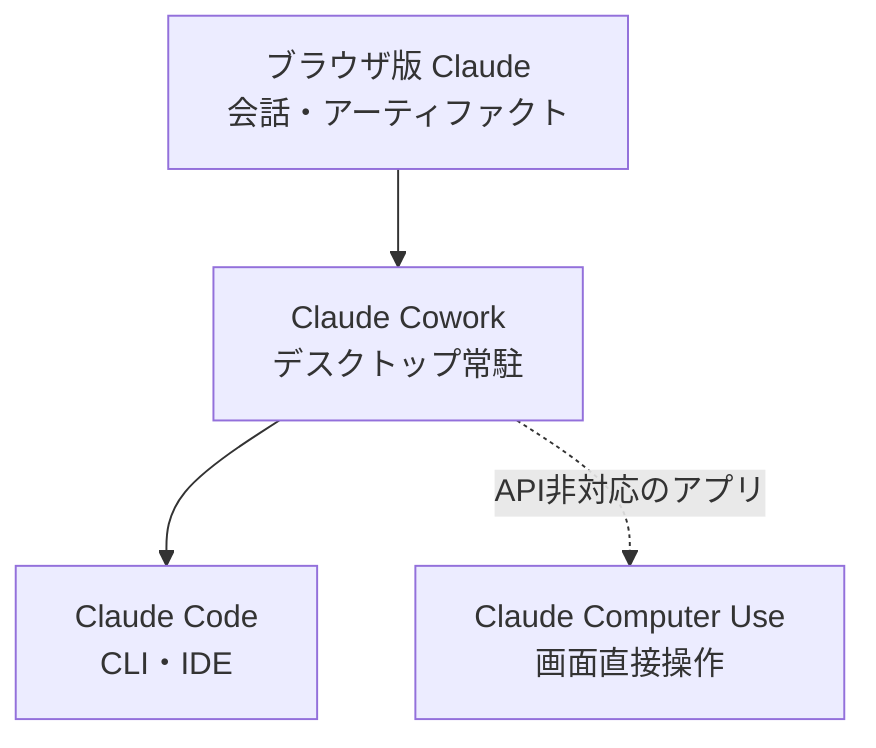
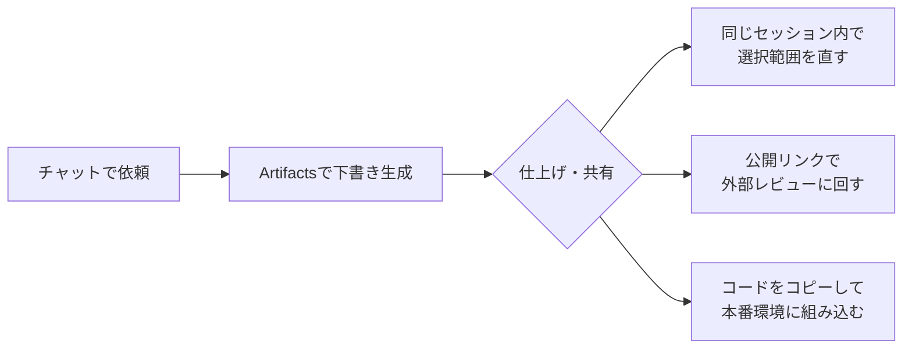
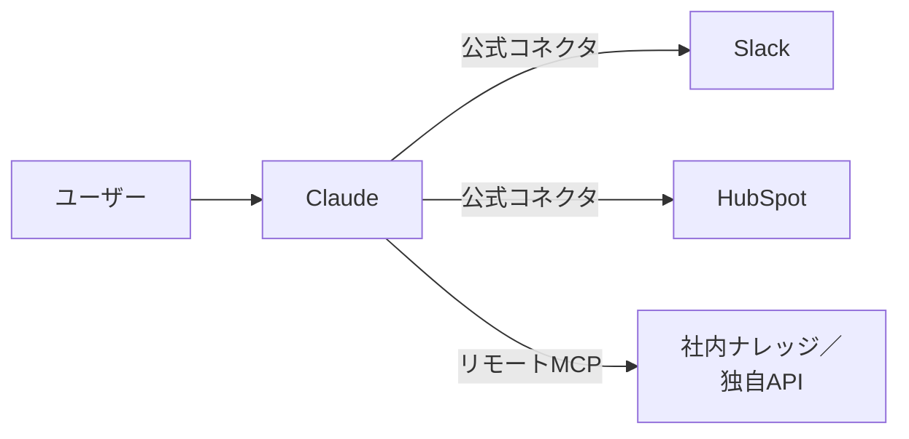

# 13. Claudeを使いこなそう

[8章](08-common-capabilities.md)で「チャット／アーティファクト／コネクタ」という共通の骨格を学び、[11章](11-gemini-advanced.md)・[12章](12-google-workspace-and-gemini.md)でGemini側の手ざわりを見てきました。本章はその対になる位置で、**Claude固有の使いこなし**だけを取り上げます。Geminiと並べたときに際立つClaudeの個性、知っておきたい現時点の制約、Claudeに寄せたい場面、の3点を軸に進めます。

Claude Code（自分のPCで動くClaude）については、本ドキュメントでは[Appendix: Claude Code](appendix-claude-code.md)で別立てに扱います。本章はあくまでブラウザの`https://claude.ai`とデスクトップアプリから始める使いこなしを中心に据えます。

## 対象読者と前提

- [8章](08-common-capabilities.md)の3本柱（チャット・アーティファクト・コネクタ）に目を通した人
- Claudeをすでに何度か触っており、「もう一段、業務に効かせたい」と感じている人
- Geminiと比較したときの選びどころが気になり始めた人

各機能の利用可否は、Free／Pro／Max／Team／Enterpriseのプランで微妙に変わります。本章では方針と感覚に集中し、最新の詳細は各参考URLで確認してください。

## Claudeの主な4製品: ブラウザ版と、PC上で動く3つ

Claudeには、同じモデルを利用するための製品が複数あります。いちばんよく使われるのはブラウザ版のClaudeですが、そのほかに自分のPC上で動く3つ（Cowork／Computer Use／Claude Code）があり、非エンジニアの読者がよく混同するのはこの3つとブラウザ版の区別です。本章の本題（ブラウザ版の使いこなし）へ進む前に、4つの違いを整理します。

| 製品 | 主に使う場面 | 動作環境 | 人の確認ポイント | 詳しくは |
| ---- | ---- | ---- | ---- | ---- |
| ブラウザ版Claude | チャットとアーティファクトの会話 | `https://claude.ai`／デスクトップアプリ（チャット機能） | 送信時と、Artifactsの公開リンク設定 | 本章 |
| Claude Cowork | 自分のPC上の日々の作業（複数アプリ横断） | デスクトップアプリの常駐エージェント | ファイル書き込みとアプリ起動の許可ダイアログ | 本章の「Claude Cowork」節 |
| Claude Computer Use | APIや連携が塞がれた画面の操作 | 画面を見てマウス・キーボードを動かす | 送信や削除など取り消せない操作の直前 | [Appendix: デスクトップの自動化](appendix-desktop-automation.md) |
| Claude Code | 開発寄りの一連作業（ファイル＋コマンド） | CLI／IDE拡張／デスクトップアプリ | ファイルの書き込みとコマンド実行の許可 | [Appendix: Claude Code](appendix-claude-code.md) |

使い始める順番は、表の上から下へ進むのが穏当です。ブラウザ版で普段のClaudeに慣れたら、Coworkで自分のPC上の作業に広げ、必要があればClaude Codeで開発寄りの仕事に進みます。Computer Useは、**API・連携機能のないアプリを画面越しに操作したい場面**で選びます。

4つとも呼び出しているモデル自体は同じで、回答の質そのものに差があるわけではありません。違うのは**ユーザーのPCに対してどこまで操作を許すか**で、表の下に進むほど、読み書きできるファイルや実行できる操作の範囲が広がります。学習コストと事故の影響範囲も同じ順序で大きくなるため、選ぶときは「どこまで任せたいか」を先に決めると迷いにくくなります。

## Projects: 共通の前提を持ち回す作業場

Claude.aiには**Projects**（プロジェクト）という単位があります。「同じ前提・同じ資料を毎回背負って始まるチャット部屋」とイメージしてください。11章で扱ったGeminiのGemsと役割は近いのですが、Projectsの肝は、**会話履歴・参照ファイル・カスタム指示を1つの箱としてまとめておける**ところです。

1つのProjectには、おおむね次のものを置いておけます。

| 置けるもの | 何のためか |
| ---- | ---- |
| カスタム指示 | 役割・口調・出力形式の初期値（「社内向けの平易な日本語で要約」など） |
| プロジェクトナレッジ | 毎回参照させたい資料（PDF、Markdown、コードなど） |
| 会話のスレッド | プロジェクト内で行った過去のチャット履歴 |
| 共有メンバー | 同じ箱を覗ける人と、その閲覧／編集権限 |

Projectsの肝は最後の2行です。**会話と資料を1つの箱に閉じ込めたうえで、メンバーで共有できる**ところが、個人のチャット履歴とは違う使い心地を生みます。

### Projectsが効く場面

- 反復のある作業 — 週次レポートの下書き、英文メールの推敲、議事録の整形
- 共通前提が重い領域 — 製品仕様、社内用語集、過去の意思決定ログを背負わせたい仕事
- 小規模なチーム共有 — 同僚と同じ前提で叩き続けたい下書き、ナレッジ整理

### Projectsを作るときのコツ

- 役割を1つに絞る。用途を広げすぎると、特定のタスクにおける振る舞いが安定しにくい
- ナレッジは盛りすぎない。資料を全部突っ込むより、**よく参照する数本**に絞ったほうが回答の揺れが抑えられる
- 共有権限は最小から。`Can view`から始めて、必要になってから`Can edit`へ広げる順が事故を呼びにくい

ナレッジの中身は4章で扱った[ツール呼び出し](04-external-system-integration.md)とは別経路で、**毎回モデルのコンテキストに添えられる**形で渡されます。詰め込みすぎるとコンテキストウィンドウを圧迫し、回答品質を落としかねない点だけは覚えておいてください（仕組みの背景は[7章](07-terminology.md)）。

## Artifacts: チャットの隣に成果物を置く

[8章](08-common-capabilities.md)でアーティファクトの概念を扱いました。Claudeにおけるアーティファクトが**Artifacts**です。チャット画面の右側に作業ペインが開き、文書・コード・HTML・図などを「対話しながら磨く」ことができます。

GeminiのCanvasと役割は同じですが、Claudeの個性として次の2点が目立ちます。

- **動くプレビューに踏み込みやすい** — HTML／JavaScript／Reactの小さなアプリを書いてもらい、その場で動かして確認、という流れがArtifacts内で完結する
- **公開リンクで外に出せる** — 仕上げたArtifactを`https://claude.ai/public/...`の公開リンクで共有でき、相手はClaudeアカウントなしで開ける

選択範囲を指して「この段落だけ短く」「ここの色をもう少し落ち着かせて」と頼めるのもCanvas同様で、長くなった会話履歴に振り回されにくいのは大きな利点です。

### Artifactsを使うときの注意

- **公開リンクは「公開」** — 共有リンクは原則「URLを知っている人」なら誰でも開ける。社外秘の素材を貼ったまま公開のチェックを入れたままにしない（[9章](09-security-individual.md)）
- **本番代わりにしない** — 動くプレビューはあくまで試作の場。普段使いに乗せるなら、別途ホスティングを用意してそちらへ移す
- **バージョン管理は軽量** — Artifactsにも履歴は残るが、Gitほど堅牢ではない。重要な版は手元にも保存しておく

「相手がリンクを開けば、即座に動くデモが立ち上がる」という体験は、文章中心の説明よりも相手の理解が一段進みます。提案・社内勉強会・採用説明など、**人に見せて反応をもらう局面**でArtifactsの持ち味が出ます。

## コネクタ: 外のサービスを直接呼ぶ

Claudeから有効化できるコネクタの一覧と、両社の使い分け早見表は[8章](08-common-capabilities.md)にまとめてあります。本章では、Claude側で**実際に何ができるのか**を、代表的なサービスごとに短く補足します。

- **Slack** — 指定チャンネルやスレッドの検索、メンションのキャッチアップ
- **Gmail／Googleドライブ／Googleカレンダー** — スレッド要約、関連資料の参照、空き枠の把握
- **Zoom** — 録画・文字起こしを材料にした要約・タスク抽出
- **HubSpot** — 取引先・案件・活動履歴の検索と整形
- **Notion／Linear／Jira** — ページ・チケットの参照、横断検索

「Workspaceの内側はGeminiが近道、Workspaceの外側や横断利用はClaude」という8章の整理は、この並びにもそのまま出ています。SlackやHubSpot、Zoomといった**Workspaceの隣にあるSaaS**が標準コネクタに並ぶのが、Claude側の見え方です。

仕組み自体は4章で扱った[ツール呼び出し](04-external-system-integration.md)そのものであり、Claudeは内部的にMCP（Model Context Protocol）経由でこれらを呼んでいます。読者の感覚としては「ボタンを押して有効化するだけ」ですが、裏では4章の流れがそのまま走っている、という補助線を引いておくと、出力がおかしいときの当たりが付けやすくなります。

### コネクタを有効にするときの最小チェック

- **読み取りで足りるなら書き込みを渡さない** — 用途が読み取りで完結するのに書き込み権限を渡してしまう、が一番事故りやすい
- **個人アカウントと業務アカウントを混ぜない** — 業務データを個人アカウント経由のClaudeに通してしまう事故は、発生頻度の高い型として挙がり続ける
- **使わなくなったら外す** — 連携を残したままにすると、コンテキストへ入り得る情報の総量だけ静かに増える

詳細は8章のチェックリストと、個人利用視点の[9章](09-security-individual.md)で扱った内容がそのまま当てはまります。

## リモートMCPサーバ: 自分で繋ぎ口を増やす

公式コネクタの一覧を見ても、自社の独自ツールや社内ナレッジ基盤までは入っていない、というのが現実です。Claudeは、ここで**リモートMCPサーバ**を自分で登録できる、という抜け道を用意しています。

[4章](04-external-system-integration.md)で触れたMCPの仕組みをそのまま利用者側から使う形で、公式コネクタの一覧に**自分で立てた（あるいは提供された）繋ぎ口を追加できる**、という構図になります。

11章で触れたとおり、Geminiは2026年4月時点で「任意のMCPサーバを自由に挿す」使い方が標準のチャット画面からは難しい状況です。**コネクタの自由度の高さは、現時点でのClaudeの分かりやすい強み**だと言えます。

ただし、自由度の高い道具ほど、扱いにも相応の注意が求められます。

- **MCPサーバの出所を確かめる** — 身元のわからないサーバは、コネクタというより「素性不明の業者を社内会議に呼んでしまう」のに近い行為
- **送られる情報の範囲を都度確かめる** — リモートMCPサーバは、繋いだ瞬間からあなたの会話の一部を読み取れる
- **自前で立てるならまず読み取り専用から** — 書き込みや実行系の操作は、使い方が落ち着いてから足すほうが安全

このあたりはエージェントの話と地続きなので、組織で本格的に使い始めるときは[10章](10-security-agent-era.md)を先に通しておくことをおすすめします。なお、ClaudeのコネクタやMCPだけでは届かないSaaS同士の橋渡しは、ZapierやMakeなどのワークフローツールの守備範囲になります。選択肢の俯瞰は[Appendix: ワークフローツール](appendix-workflow-tools.md)で扱います。

## Claude Cowork: デスクトップで「やっておく」を頼む

2026年に入って一般提供が始まった**Claude Cowork**は、ブラウザの中の会話を一歩外に連れ出す機能です。Claudeのデスクトップアプリ（macOS／Windows）に常駐し、**ローカルのファイル・フォルダ・アプリを横断しながら、頼まれた仕事を最後まで持っていく**役割を担います。

ブラウザ版のClaudeが「向こう側で考える相棒」だとすれば、Coworkは「自分のPCの上で実際に手を動かしてくれる相棒」です。有料プランで利用でき（対象プランは参考欄のAnthropic公式ページで確認してください）、エージェント用のスレッドは立ち上げたまま維持できるので、別のデバイスから進捗を見たり、指示を追加したりもできます。

### Coworkでやらせやすい仕事

- 朝イチで未読メールとカレンダーを照合し、その日の段取りメモを作る
- ダウンロードフォルダのPDFを内容で仕分け、関連ファイルと突き合わせて要約する
- 複数のローカル資料を横断して、社内向けの叩き台ドキュメントに整える

「複数のアプリと複数のファイルを行ったり来たりして、最後にひとまとめのアウトプットを出す」種類の作業に向きます。逆に、**1ファイルだけの細かな推敲**や**短い質問応答**は、ブラウザ版で完結したほうが速いです。

Coworkと他の3製品の比較は、本章冒頭の「Claudeの主な4製品」節で表と図にまとめました。

## 2026年春時点で押さえておきたいこと

Claudeは半年単位で機能が増えていく道具です。2026年4月時点で、表に出にくいものの実際につまずきやすい論点をいくつか先回りで挙げておきます。

### プラン差はGeminiよりはっきり出る

Free／Pro／Max／Team／Enterpriseのプラン差は、Claudeでは**できる／できない**の境目として比較的くっきり現れます。代表的な差は次のあたりです。

- Projectsの作成数や、ナレッジに置けるファイルの上限
- 利用できるモデル（最上位モデルや、長コンテキスト版の解放）
- リモートMCPサーバの登録可否、Coworkや一部コネクタの利用可否
- 会話履歴の保持・組織への共有設定

「個人プランでは動いた機能が会社プランで見当たらない」「逆に会社プランでだけ出てくるメニューがある」のは、アプリの不具合ではなく**プラン設計の差**です。プラン名と利用可否は、参考欄の公式ヘルプで都度確認してください。

### 対応コネクタは月単位で変わる

公式コネクタは、2026年4月時点で50を超える勢いで増えています。[8章](08-common-capabilities.md)の一覧表と本章の補足は執筆時点のスナップショットに過ぎません。3か月後に見たら並んでいるアプリが入れ替わっていても驚かないでください。社内への案内や手順書を書くときは、本ドキュメントを孫引きせず公式ページを都度確認してください。

### Claudeのモデルは複数ある

Claudeは現時点で、**Opus／Sonnet／Haiku**の3系統が並びます。重い推論はOpus、日常使いはSonnet、軽量・大量さばきはHaiku、というおおまかな住み分けです。Projectsやコネクタの裏でも、状況に応じてモデルが切り替わる場合もあります。「同じ質問なのに昨日と回答の手触りが違う」と感じたら、モデル選択の指定欄を覗いてみてください。

## Claudeに寄せたい場面

ClaudeとGeminiの使い分け早見表は[8章](08-common-capabilities.md)にまとめてあるので、本章では**Claude側に寄せたほうが進めやすい場面**だけを短く補足します。

- **Workspace外のSaaSを材料にしたいとき** — Slack・Notion・HubSpotなどに、本章で挙げた公式コネクタがそのまま使える
- **社内の独自ツールを繋ぎたいとき** — 本章で扱ったリモートMCPサーバを自前で登録できる自由度が高い
- **動くプレビューを外部に見せたいとき** — Artifactsの公開リンクがそのまま共有手段として使える
- **自分のPCでの横断作業を任せたいとき** — Claude Cowork／Claude Codeといったデスクトップ寄りの選択肢が揃う

Workspaceアプリの画面に居たいとき、あるいはマルチモーダル素材を混ぜたいときは[11章](11-gemini-advanced.md)のGemini側の節を参照してください。

## まとめ

- **Projects**は、カスタム指示・参照ファイル・会話履歴を1つの箱に閉じ込めて、メンバーで共有できる作業場
- **Artifacts**は動くプレビューと公開リンクが特徴。「人に見せて反応をもらう局面」で真価が出る
- 公式コネクタはSlack／HubSpot／Zoom／Google Workspaceなど、**Workspaceの外側のSaaS**まで厚い
- **リモートMCPサーバ**を自由に挿せるのが、現時点で分かりやすい強み。ただし出所と権限は要吟味
- **Claude Cowork**はデスクトップアプリの常駐エージェント。複数アプリ横断の「やっておく」系の仕事に向く
- プラン差・コネクタの鮮度・モデル選択は、半年単位で動く前提のもと付き合う
- さらに踏み込むときは、[Appendix: Claude Code](appendix-claude-code.md) や [Appendix: デスクトップの自動化](appendix-desktop-automation.md) が具体像の入口となる

## 参考

- Anthropic「What are projects?」: <https://support.claude.com/en/articles/9517075-what-are-projects>（最終確認：2026-04-24）
- Anthropic「Use Artifacts to share AI-powered apps」: <https://support.anthropic.com/en/articles/9487310-what-are-artifacts-and-how-do-i-use-them>（最終確認：2026-04-24）
- Anthropic「Connectors on Claude.ai」: <https://support.anthropic.com/en/articles/10168395-connectors-on-claude-ai>（最終確認：2026-04-24）
- Anthropic「Claude Cowork」: <https://www.anthropic.com/product/claude-cowork>（最終確認：2026-04-24）
- Anthropic「Getting started with Claude in Slack」: <https://support.claude.com/en/articles/11506255-getting-started-with-claude-in-slack>（最終確認：2026-04-24）
- HubSpot「Set up and use the HubSpot connector for Claude」: <https://knowledge.hubspot.com/integrations/set-up-and-use-the-hubspot-connector-for-claude>（最終確認：2026-04-24）
- Model Context Protocol: <https://modelcontextprotocol.io/>（最終確認：2026-04-24）
