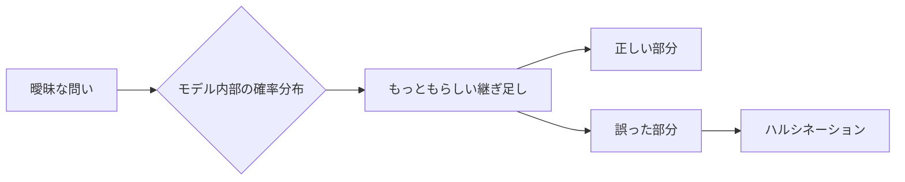
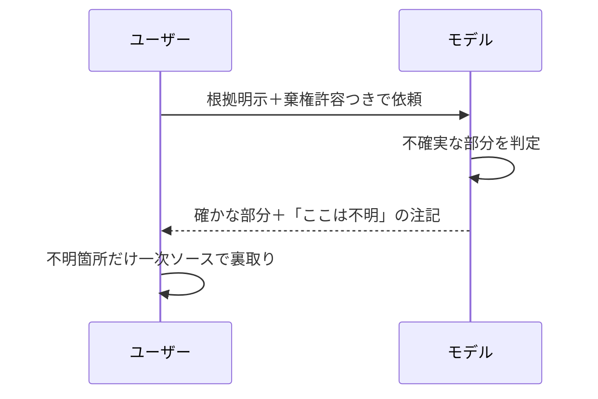

# ハルシネーションと「AIが知っていること」のリテラシー

AIに何かを尋ねると、ごく自然な日本語で、堂々と、しかも完全な自信をもって間違いを返してくることがあります。これが「ハルシネーション」と呼ばれる現象です。人間の世界でたとえるなら、会議室のいちばん声の大きい人が、いちばん詳しいとは限らないのと同じ構図です。

本章ではまず、ハルシネーションがなぜ起きるのかを仕組みの側から分解します。次に「AIの知識はいつ時点の、どの範囲のものなのか」を整理します。そのうえで、業務で生成物を受け取ったときにどこまで裏取りすべきかという実務の話に落とします。

## 対象読者と前提

- 2章で「生成AIはだいたい何をしているか」を読んだ人
- 4章で「学習」の分類を踏まえた人（事前学習・ファインチューニング・コンテキスト／メモリ）
- 用語で詰まったら、6章（モデル、コンテキスト、トークンなど）に戻ってください

本章の結論を先に一行で言うと、「**AIは知らないことを知らないと言うのが苦手**」ということです。苦手な理由を理解し、苦手をカバーする運用をこちらで作る、というのが本章の着地点です。

## ハルシネーションとは何か

ハルシネーションは、日本語に置き換えると「もっともらしい嘘」です。ポイントは**もっともらしい**の部分で、単なるでたらめではありません。文法・用語・文脈のどれを取っても自然で、読み手が疑いにくい形で出力されます。

実務でよく出会う例はこんなところです。

- 存在しない論文や書籍を、著者名と年号つきで引用してくる
- 実在する人物の経歴に、実在しないポジションを混ぜ込んでくる
- 去年まで有効だった仕様を、現行仕様として説明する
- APIに実在しない引数を、堂々と使用例に書く

どれも「悪意をもって騙そうとしている」わけではありません。次の節で見るように、**そう答えるのが自然だと判断した結果**なのです。動機はないけれど結果として嘘、というのがいちばん厄介なタイプだと言えます。

## なぜ起きるのか

ハルシネーションの原因は、1つではありません。少なくとも4つの構造が重なって発生します。4つをまとめて「AIのうっかり」で済ませると、対策が打てなくなります。

| 構造 | 何が起きているか | 現場での現れ方 |
| ---- | ---- | ---- |
| 目的のずれ | モデルは「自然に続く文」を選ぶ訓練を受けている | 知らないことでも、もっともらしく埋めにくる |
| 棄権の訓練不足 | 「分かりません」と答える例を十分に学んでいない | 自信満々で誤答する |
| 文脈の揺らぎ | 長いやり取りで前提や制約がかすむ | 途中から矛盾した回答に変わる |
| 曖昧な依頼 | 問いの範囲が広すぎて埋め方の自由度が高い | 毎回違う答えが返ってくる |

上から順に見ていきましょう。

### 目的のずれ

2章で触れたとおり、大規模言語モデルの中核は「次に来る単語（トークン）を確率で選ぶ」仕組みです。訓練の目標は「事実を正しく答えること」ではなく、「人間が書きそうな続きを選ぶこと」にあります。**この2つは一致する場面が多いだけで、本来は別物**です。

つまりモデルにとって、空白を埋めないことはコスト（不自然な文）なのに対し、埋め方の真偽はコストとして直接測られていません。ここが第一のずれです。

### 棄権の訓練不足

最近のモデルは、事後のチューニングで「分からないときは分からないと言う」振る舞いをかなり学んでいます。とはいえ、事実とごく近い誤りや、専門性の高い話題では、棄権より「それらしく答えるほう」を選びがちです。

棄権の訓練は、学校のテストで言えば「白紙答案もOKだよ」と学ぶ練習に似ています。日本の受験文化と同じで、AIも白紙を嫌いがちだと思っておくと実務感覚に合います。

### 文脈の揺らぎ

長い会話になればなるほど、会話の最初に与えた前提や制約は、文脈の端っこに押しやられます。コンテキストウィンドウからはみ出した情報は、6章で触れたとおり**単純に無視**されます。

この「揺らぎ」は静かに進みます。最初の回答は正しかったのに、10往復目で急に別人のことを話し始めた、という経験がある人もいるはずです。モデルが嘘をついたのではなく、**前提を忘れさせられた**状態に近いと考えてください。

### 曖昧な依頼

「いい感じに書いて」「詳しく教えて」という依頼は、モデルに広い選択肢を与えます。選択肢が広いほど、埋め方のブレ幅は大きくなり、事実にあたる部分も一緒に揺れます。

「問いを詳しく書くとハルシネーションが減る」のは精神論ではなく、こうした確率的な性質の裏返しです。

## AIの「知識」はいつ時点の・どの範囲か

ハルシネーションと地続きで、もう1つ大事なのが「AIが知っていることの時点と範囲」です。ここを誤解すると、正しい情報を求めているのに、古い情報を新しいものとして受け取ってしまいます。

### 学習データのカットオフ

モデルは、ある日付までのデータで事前学習されています。この日付を**学習カットオフ**（knowledge cutoff）と呼びます。カットオフ以後に起きたこと、公開されたことは、モデルの中には入っていません。

カットオフは、モデルごとにそれぞれ異なります。公式ドキュメントに記載されているはずなので、最新の値は一次ソースで確認してください。

| モデル側の情報源 | 例 |
| ---- | ---- |
| Anthropic | 各モデルのドキュメントに `Training data cutoff` として記載 |
| Google | Gemini APIドキュメントのモデル一覧に記載 |
| OpenAI | モデルのリファレンスに記載 |

「じゃあ最新モデルに乗り換えれば最新情報が分かるのか」と思うかもしれませんが、そう単純でもありません。カットオフが近い日付でも、**その直前の出来事は学習データ中で十分に書かれていないことが多く、結果としてモデルは弱い**傾向があります。新しい話題ほど信頼度が下がる、と覚えておくと実害が減ります。

### コンテキストで補えるもの／補えないもの

カットオフ以後の情報は、会話のコンテキストに**入れてあげれば**使えます。添付資料、Webコネクタの取得結果、RAG（検索拡張）で引いた文書などがこれにあたります。コンテキストに入れた情報は、モデルの重みを書き換えないまま、一時的に参照できる知識として使われます。

| 補える | 補えない |
| ---- | ---- |
| 添付した社内資料やURL先のテキスト | モデル本体の思考パターンや常識 |
| コネクタで引いた検索結果、メール、カレンダー | 学習カットオフ以前の知識の「上書き」 |
| システムプロンプトによる役割の指示 | ネット全体のリアルタイム事情（検索しないかぎり） |

ここで勘違いしやすいのは、**コンテキストで渡した情報のほうが強い、とは限らない**点です。モデルは会話履歴と学習済みの常識を両方ながめており、矛盾があるときに必ず「与えられた資料が正」と判断するわけではありません。プロンプトで明示的に「この資料を優先してください」と指示するのが安全です。

## 業務での検証責任と裏取りの実務

ここからは、受け取った出力を前にしたときの実務の話です。結論から言えば、**裏取りの責任はAIではなく使う側にある**、の一言に尽きます。AIの出力は「自信満々な新人の下書き」であり、署名するのはあなたです。

### 裏取りが必須の領域／甘くてよい領域

すべての出力に同じ熱量で裏を取る必要はありません。リスクの軽重で二段構えにすると現実的に運用できます。

| 領域 | 裏取りの必要度 | 代表例 |
| ---- | ---- | ---- |
| 対外的に署名する文書 | 高（一次ソースまで遡る） | 契約書、IR資料、プレスリリース |
| 社内の意思決定資料 | 中〜高（事実系は必ず照合） | 企画書、調査レポート |
| 下書きや要約 | 中（重要な数字と固有名詞を確認） | 議事録、メール下書き |
| 発想や雑談 | 低（明らかな誤りだけ直す） | ブレスト、たとえ話 |

下に行くほど「嘘が混じっても実害が小さい」ということでもあります。

### 裏取りの具体的なやり方

実務で回しやすい、軽い順から重い順までのやり方です。

- **自己照合** — モデル自身に「その情報源のURLを教えてください」と追加で聞く。出てくれば踏む、踏めなければ要警戒
- **別モデルで再質問** — Claudeに聞いた事実をGeminiで確認する、あるいは逆。両者が違えばどちらか（両方のことも）が怪しい
- **一次ソース当たり** — 公式ドキュメント、論文、法令、プレスリリースに直接当たる。手間はかかるが、対外資料なら必須
- **検索結果との突き合わせ** — Web検索機能つきのモードで尋ね、引用URLをそのまま踏む

自己照合は、正直に言うとハルシネーション対策としては**気休めに近い**ものです。モデルは、存在しないURLや存在しない論文タイトルも、もっともらしく返します。必ずリンクを踏み、到達ページの中身まで目視で確認してください。

### 現場で効く依頼の書き方

「書き方」だけでハルシネーションをゼロにはできませんが、発生率はかなり下げられます。効く依頼のコツは3つです。

- **根拠の明示を要求**。たとえば「出典があれば併記し、無ければ『出典なし』と明記してください」と書き添える
- **棄権の許容**。たとえば「分からないときは、推測せず『分かりません』と答えてください」と付け加える
- **範囲の限定**。たとえば「2024年以降の情報は判断せず、その旨を書いてください」のように、対象期間を明示する

棄権の許容は意外と効きます。モデルは、明示的に許可されると、素直に白旗をあげてくれる場面が増えます。

## 判断のチェックリスト

受け取った出力を見て「これはそのまま使ってよいか」を判断するときに、次の順で自問してみてください。

1. **その事実は、モデルの学習カットオフ以後のものではないか？** 以後なら、コンテキストで補えていなければ疑う
2. **固有名詞と数字は、一次ソースに当たれるか？** 当たれないなら、他モデルか検索で照合する
3. **同じ質問をもう一度、別の聞き方でしたとき、答えは同じか？** 揺れるなら、少なくともその部分は確定情報ではない
4. **この出力のリスク階層は？** 対外署名なら一次ソースまで、発想用途なら軽く済ませる、の判断を明示する

3番目の「揺らぎテスト」は軽いわりに効きます。同じ事実を別の文脈で聞いたときに答えが一貫しない情報は、モデル自身も確信を持っていないサインです。

## 思考の型の早見表

| 状況 | 最初にすること |
| ---- | ---- |
| 数字や固有名詞が出てきた | 一次ソースのURLを要求し、踏む |
| 最近の話題を質問した | 学習カットオフと検索機能の有無を確認 |
| 長い会話で矛盾が出た | 前提を要約し、新しいスレッドで仕切り直す |
| 専門分野の助言が欲しい | 分野の専門用語で、根拠つきで返させる |

## まとめ

- ハルシネーションは「悪意ある嘘」ではなく、**自然な続きを選ぶ**仕組みの副作用として起きる
- AIの知識には**学習カットオフ**があり、それ以後の情報は原則として持っていない。コンテキストで補う発想が必要
- 出力の裏取りはAIではなく人の責任。**リスク階層で軽重をつけ**、対外資料は一次ソースまで遡る
- 依頼のときに「根拠を示す／分からないなら分からないと言う」を明示するだけでも、事故は目に見えて減る

## 参考

- Anthropic「Claude models overview」：<https://docs.anthropic.com/en/docs/about-claude/models>（最終確認：2026-04-23）
- Google「Gemini models」：<https://ai.google.dev/gemini-api/docs/models>（最終確認：2026-04-23）
- OpenAI「Models」：<https://platform.openai.com/docs/models>（最終確認：2026-04-23）
- Ji, Ziwei et al.「Survey of Hallucination in Natural Language Generation」：<https://dl.acm.org/doi/10.1145/3571730>（最終確認：2026-04-23）
