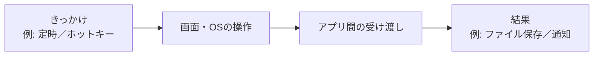
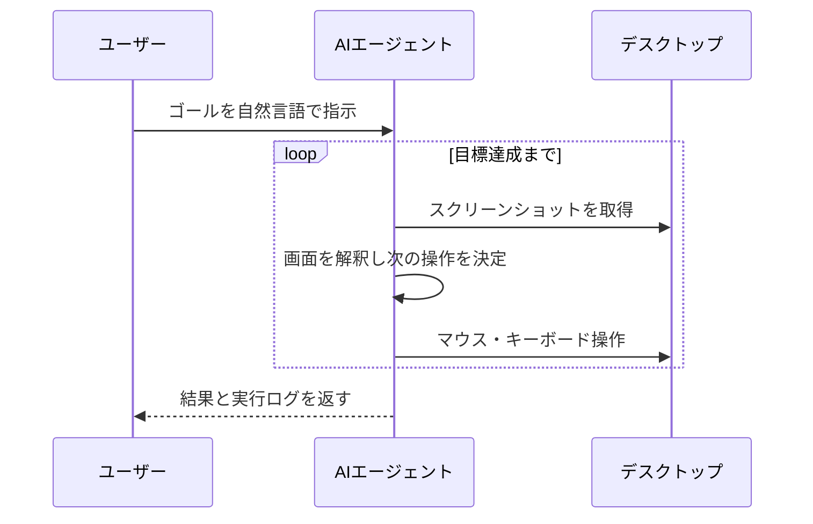
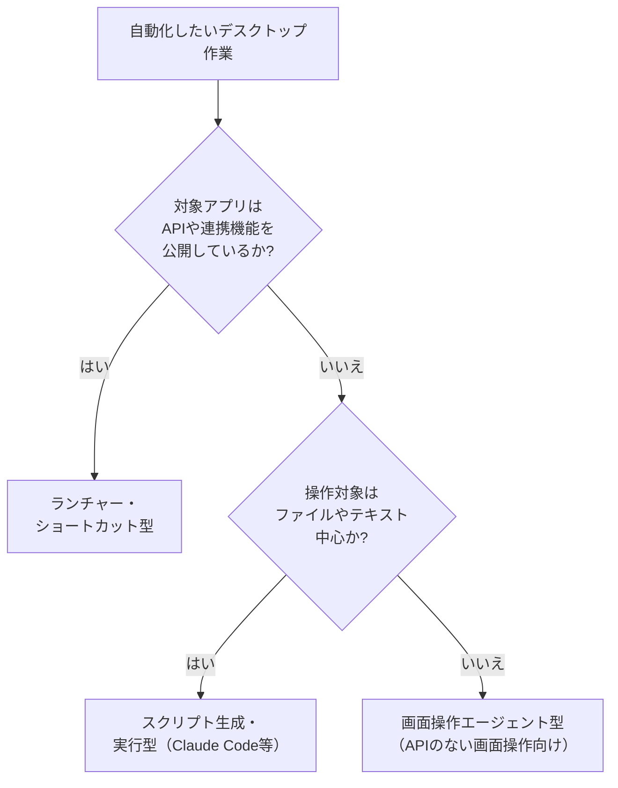

# Appendix: デスクトップの自動化

「毎朝、10個のアプリをだいたい同じ順番で開く」「週次で5枚のスクリーンショットをリサイズして1枚のスライドに貼る」——自分のPCで繰り返している手作業を、あらためて眺めてみると、思ったより時間を食っていることに気づきます。本付録は、こうした**自分のデスクトップ（＝自分のPC）上の繰り返し作業**を、生成AIの力を借りてどこまで自動化できるのかを整理する地図です。

隣接するAppendix「ワークフローツール」がSaaSとSaaSのあいだをつなぐ話だったのに対し、こちらの主役は**あなたのPCという物理的な箱**です。画面、キーボード、ファイル、アプリ。生成AIが**画面を読み、マウスやキーボードを操作できる**ようになると、ここも自動化の射程に入ってきます。

## 対象読者と前提

- 7章で「エージェント」の語をひととおり抑えた人
- 8章で生成AIの共通的な使い方を把握した人
- ワークフローツール付録で「SaaS同士の自動化」の輪郭をつかみ、次は手元のPCも動かしてみたい人

本付録はエンジニア向けではありません。自分でスクリプトを書かなくても、「どの道具なら自分の事情に合いそうか」を判断できるところまでを目標にします。

## 「デスクトップの自動化」とはどの範囲か

言葉の解像度を先に合わせておきます。ここで言うデスクトップの自動化は、次の3つが重なった領域を指します。

- **GUI操作**: マウス・キーボードでアプリの画面を操作する
- **OSの機能**: ファイル操作、通知、クリップボード、ショートカットキー
- **アプリ同士の橋渡し**: 片方のアプリで得た結果を、別のアプリに渡す

狭義のRPAが扱ってきた領域に、生成AIが「画面を見て判断する役」と「自然言語で指示を受け取る役」を持ち込んできた、というふうに捉えると輪郭が掴みやすくなります。ルールだけでは書き切れなかった判断を、AIが引き受けてくれる余地が生まれました。

## 3つのアプローチ

「デスクトップの自動化に生成AIを使う」と言ったとき、中身は実はかなり違う3つの道に分かれます。道を取り違えると、作業量や費用だけがかさんで成果が出にくい組み方になりますので、最初に切り分けておきます。

| アプローチ | 一言で | 代表例 |
| ---- | ---- | ---- |
| ランチャー・ショートカット型 | 既存の自動化レールにAIを1ノードとして挿す | macOSショートカット、Raycast、Alfred、Power Automate Desktop |
| 画面操作エージェント型 | AIが実際にマウス・キーボードを動かす | Anthropic「Computer Use」、OpenAI「Operator」、Microsoft Copilot Actions |
| スクリプト生成・実行型 | AIにスクリプトを書かせ、自分のPCで動かす | Claude Code、ローカルLLM＋シェル、`pyautogui`系の生成 |

どれも「自動化」と呼ばれますが、**誰が手を動かしているか**がまるで違います。ここを押さえると、次に選ぶ道具も自然に決まります。

### ランチャー・ショートカット型

macOSの「ショートカット」アプリや、Windowsの「Power Automate Desktop」、ランチャー系の「Raycast」「Alfred」など、OS付属か近い位置にいる自動化の道具に、生成AIのノードを差し込むパターンです。もともとのレールは人が敷き、**1ステップだけ**LLMに任せます。たとえば次のような形です。

- ホットキー → 選択したテキストをClaudeで要約 → クリップボードへ戻す
- 定時トリガー → Gmailの未読をGeminiで分類 → カレンダーに下書き予定を入れる
- スクリーンショット撮影 → Claudeで画像内テキストを抽出 → Notionに保存

入出力がはっきりしており、事故の範囲も限定的です。**まずはここから始める**のが、全体としてつまずきにくい順序です。

### 画面操作エージェント型

ここ1〜2年で急速に存在感を増しているのが、AIが実際に画面を見て、マウスを動かし、キーボードを叩いてくれる**画面操作エージェント**です。Anthropicの「Computer Use」、OpenAIの「Operator」、Microsoftの「Copilot Actions」などが代表例でしょう。それぞれ思想は異なりますが、**AIに人間と同じ入力装置を貸す**という方向性は共通しています。

期待はできますが、現状は**遅い・高い・壊れやすい**の三拍子が揃っています。**APIや連携機能が公開されていないアプリを画面越しに操作したい場面**で選ぶ道具だ、と位置づけておくのが実情に合っています。

AnthropicのComputer Useは、Claudeの製品群のうち画面操作エージェントにあたるものです。他の製品との位置付けと使い分けは[13章の「Claudeの主な4製品」節](13-claude.md)の表と図にまとまっているので、あわせて参照してください。

### スクリプト生成・実行型

Claude CodeのようにAIがスクリプトを書き、あなたのPC上で実行まで引き受けるパターンです。画面を直接触るのではなく、シェルやPythonといった**OSが一番得意なインターフェース**を経由してデスクトップを動かします。

- ダウンロードフォルダのPDFを、内容に応じて自動でリネーム・仕分け
- 複数アプリの設定ファイル（YAML、JSON）をまとめて書き換える
- スクリーンショット群を一括トリミングし、日付別フォルダに整理

Claude Codeの詳細はAppendix「Claude Code」で扱いますので、ここでは「**画面越しではなくファイル越しに触るほうが結果的に速い**」という住み分けだけ覚えてください。

## どのアプローチを選ぶか

選び方の目安です。迷ったら、矢印を上から辿ってください。

「いきなり画面操作エージェントから入る」経路を意図的に細くしているのは、**事故の総量が段違い**だからです。**他のアプローチでは組めないと確認してから**選んでも、遅くはありません。

## 画面操作エージェントの注意点

期待の大きい道具ではあるのですが、2026年4月時点で「明日から本番で使えます」と断言できる完成度には至っていません。以下のクセを先に知っておくと、いきなり実害を出す場面を減らせます。

- **遅い** — 画面を撮って、考えて、動かすという往復だけで秒単位が積もる。1分で終わる作業でもエージェントに頼むと10分かかることがある
- **高い** — スクリーンショットを毎ターン読み込むため、トークン消費は通常のチャットと比べて桁違いになる。月末の請求額で初めて気づくパターンが多い
- **壊れやすい** — UIが少し変わっただけで、手順全体が動かなくなる。ボタンの配置替えや色の変更のように、人間なら一目で追従できる差分でも、エージェントは操作の手がかりを失って途中で止まりやすい
- **誤操作の影響が取り返せない** — テストのつもりで送信ボタンを押したメールは、2度と戻ってこない

裏を返せば、「速度や費用より、APIのないアプリを操作できる点に価値がある」ときに選ぶ道具です。**得意分野の外で使うと、コストだけが高く速度の出ないチャットとして機能します**。

## 現実的な使いどころ

いま、非エンジニアが無理なく恩恵を受けられる領域は、だいたい次の3つに集約されます。

| 用途カテゴリ | 具体例 | 向いているアプローチ |
| ---- | ---- | ---- |
| テキスト加工 | 選択範囲の要約、翻訳、言い換え、タグ付け | ランチャー・ショートカット型 |
| ファイル整理 | ダウンロードフォルダの分類、画像の一括リネーム | スクリプト生成・実行型 |
| 画面越しの操作 | レガシーなWebアプリ、APIのないSaaSへの入力 | 画面操作エージェント型 |

「毎朝3分で終わる作業を90秒にする」ためにエージェントを呼ぶと、多くのケースで費用が手間の削減量を上回ります。**週に1回以上発生し、5分以上かかり、手順がある程度決まっている**作業を候補にすると、費用対効果の条件に当てはめやすくなります。

## 事故を防ぐ小さな手順

デスクトップの自動化は、SaaS上のワークフローよりも**実害が速く顕在化する**領域です。自分のPCの中には、送信を取り消せないメールや、上書き保存されたら困るファイルが同居しているからです。次の点を押さえれば、事故の大半は回避できます。

- **書き込み系の操作はドライラン** — まずは「何をするつもりか」をログに出すだけに留め、実行を別承認に分ける
- **作業フォルダを分ける** — 本番のデスクトップではなく、専用のサンドボックス用フォルダで練習する
- **バージョン管理かスナップショットを挟む** — ファイル整理は、Time MachineやGit、`rsync` でのバックアップが事前にあるかを確認してから
- **画面操作エージェントには小さな箱を与える** — 仮想デスクトップや別ユーザーアカウントで動かし、本番環境から物理的に隔離する
- **最初の数回は画面を見届ける** — 実行中は別の作業に移らず、どのアプリをどう触ったかを目で追う

10章「エージェント時代のガバナンス」で扱うサンドボックスや操作ログの話は、このデスクトップの文脈でもそのまま当てはまります。むしろ、SaaSの話よりも切実です。

## 始め方

いざ最初の1本を作るときの手順です。

- 週に1回以上発生し、**5分以上かかる**定型作業を1つ選ぶ
- その作業を紙の上で手順化する（トリガー／入力／判断／出力）
- まずランチャー・ショートカット型で組めないか検討する
- ファイル中心の作業なら、Claude Codeにスクリプト下書きを頼む
- APIのないアプリ相手に詰まったときだけ、画面操作エージェントを呼び出す
- 最初の2週間は**動作ログを人が目で追う**。想定外の挙動がなければ徐々に手を離す

「全自動」を最初から狙うと、途中でつまずきやすくなります。**半自動で回しつつ、人の目を徐々に減らす**段取りで進めるほうが、結果としては速く安定運用にたどり着けます。

## まとめ

- デスクトップの自動化は、**ランチャー／画面操作エージェント／スクリプト生成**の3アプローチで大別すると迷わない
- 画面操作エージェントは目立つ働きができる反面、**遅い・高い・壊れやすい**の三重苦。APIや連携機能が公開されていないアプリを操作したい場面に向く
- 非エンジニアの費用対効果は、**テキスト加工とファイル整理**の目立たない領域にまとまっている
- 自分のPCは、送信を取り消せない操作が同居する場所。**作業フォルダの分離と人の確認**の2点は省略しない

## 参考

- Apple「ショートカット ユーザガイド」: <https://support.apple.com/ja-jp/guide/shortcuts/welcome/ios>（最終確認：2026-04-24）
- Microsoft「Power Automate Desktopの概要」: <https://learn.microsoft.com/ja-jp/power-automate/desktop-flows/introduction>（最終確認：2026-04-24）
- Raycast「AI features」: <https://www.raycast.com/ai>（最終確認：2026-04-24）
- Anthropic「Computer use」: <https://docs.claude.com/en/docs/build-with-claude/computer-use>（最終確認：2026-04-24）
- OpenAI「Introducing Operator」: <https://openai.com/index/introducing-operator/>（最終確認：2026-04-24）
- Microsoft「Copilot Actions」: <https://learn.microsoft.com/ja-jp/copilot/microsoft-365/copilot-actions>（最終確認：2026-04-24）
