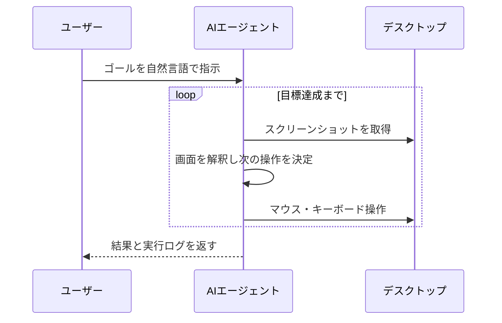
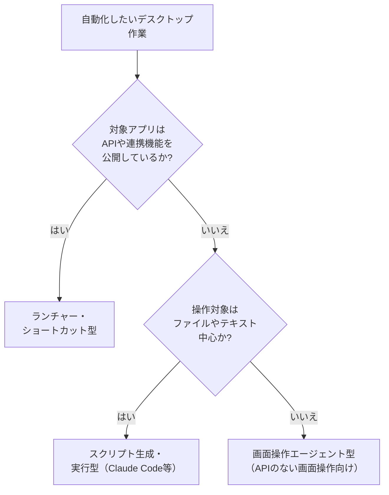

# Appendix: デスクトップの自動化

本付録は、自分のPC上で繰り返している手作業（毎朝決まった順序でアプリを開く、定例業務でスクリーンショットを集めて1枚の資料へまとめるなど）を、生成AIで自動化する方法を整理します。隣接する[Appendix: ワークフローツール](appendix-workflow-tools.md)がSaaS同士の連携を扱うのに対し、本付録の対象は自分のPC上で完結する操作（画面・キーボード・ファイル・ローカルのアプリ）です。生成AIに画面の解釈と自然言語の指示の取り込みが加わったことで、ルールベースでは書きにくかった範囲まで自動化の対象が広がっています。

## 対象読者と前提

- [7章](07-terminology.md)で「エージェント」の用語に目を通している人
- [8章](08-common-capabilities.md)で生成AIの共通的な使い方を把握している人
- [Appendix: ワークフローツール](appendix-workflow-tools.md)でSaaS連携の輪郭を確認し、自分のPC上の作業にも広げたい人

本付録はエンジニア向けではありません。自分でスクリプトを書かない立場で、選択肢ごとの向き不向きを判断できるところまでを目標にします。

## デスクトップの自動化はGUI・OS・アプリ間連携の3層から成る

本付録で扱うデスクトップの自動化は、次の3つの層が重なった領域を指します。

- GUI操作 — マウス・キーボードによるアプリ画面の操作
- OSの機能 — ファイル操作、通知、クリップボード、ショートカットキー
- アプリ間の受け渡し — 片方のアプリの出力を、別のアプリの入力に渡す

この領域は従来RPA（Robotic Process Automation）が扱ってきましたが、ルールベースで書ききれない判断（画面の内容の解釈、自由文の入力の分類など）が残るために用途が限定されがちでした。生成AIで画面解釈と自然言語の指示処理が扱えるようになったことで、ルール記述では書ききれなかった部分まで自動化の対象に入ります。

## デスクトップ自動化への生成AIの組み込み方は3アプローチに分かれる

生成AIをデスクトップ自動化に組み込む方式は、AIが担当する範囲の違いで3つに分かれます。アプローチを取り違えると、作業量や費用が用途と釣り合わなくなりやすいため、最初に整理します。

| アプローチ | 生成AIが担う範囲 | 代表例 |
| ---- | ---- | ---- |
| ランチャー・ショートカット型 | 既存の自動化フローの一部のステップ | macOSショートカット、Raycast、Alfred、Power Automate Desktop |
| 画面操作エージェント型 | 画面解釈とマウス・キーボード操作の全体 | Anthropic「Computer Use」、OpenAI「Operator」、Microsoft「Copilot Actions」 |
| スクリプト生成・実行型 | スクリプトの作成と、PC上での実行 | Claude Code、ローカルLLM＋シェル、`pyautogui`系の生成 |

3者の違いは、自動化フローを組み立てる主体（人かAI）と、操作経路（画面の直接操作 / ファイルやコマンド経由）の2軸に整理できます。次節以降で、それぞれの中身と向き不向きを順に見ていきます。

### ランチャー・ショートカット型は既存フローの一部に生成AIを差す

対象となるのは、macOSの「ショートカット」、Windowsの「Power Automate Desktop」、ランチャー系の「Raycast」「Alfred」のような、OS付属または近い位置にある自動化ツールです。これらのフローに生成AIによる処理を1ステップだけ加えます。フロー全体の組み立ては人が行い、生成AIの役割はその中の特定ステップに限定されます。

- ホットキー → 選択したテキストをClaudeで要約 → クリップボードへ戻す
- 定時トリガー → Gmailの未読をGeminiで分類 → カレンダーに下書き予定を入れる
- スクリーンショット撮影 → Claudeで画像内テキストを抽出 → Notionに保存

入力と出力の範囲がフロー定義の段階で決まるため、想定外の操作が発生しにくい構成です。3アプローチでは最初の検討候補に向きます。

### 画面操作エージェント型はAIが画面を直接操作する

画面操作エージェントは、生成AIが画面のスクリーンショットを取得・解釈し、マウスとキーボードの操作を決定して実行します。Anthropicの「Computer Use」、OpenAIの「Operator」、Microsoftの「Copilot Actions」が代表例です。製品ごとの設計思想は異なりますが、AIにスクリーンショットの解釈と入力デバイスの操作を委ねる構成は共通しています。

2026年4月時点の特性は、実行速度の遅さ、トークン消費の多さ、UI変更による動作停止の起こりやすさの3点です。APIや連携機能が公開されていないアプリを画面越しに操作したい場面で選ぶ道具と位置づけると、用途が定まります。

AnthropicのComputer UseはClaudeの製品群の1つです。Claude Cowork・Claude Codeとの位置付けと使い分けは[13章の「Claudeの主な4製品」節](13-claude.md)の表と図に整理されているので、あわせて参照してください。

### スクリプト生成・実行型はAIにスクリプトを書かせて自分のPCで動かす

Claude Codeに代表される、生成AIがスクリプトを作成し、自分のPC上で実行まで担当するパターンです。画面ではなく、シェルやPythonなどファイル・コマンド単位のインターフェースを経由して操作するため、OSが標準で扱える対象に限れば効率がよく、動作も安定します。

- ダウンロードフォルダのPDFを、内容に応じて自動でリネーム・仕分け
- 複数アプリの設定ファイル（YAML、JSON）をまとめて書き換える
- スクリーンショット群を一括トリミングし、日付別フォルダに整理

Claude Codeの詳細は[Appendix: Claude Code](appendix-claude-code.md)で扱います。本付録では、ファイルやコマンドで完結する作業は画面操作よりこちらが向く、という住み分けだけ確認しておきます。

## アプローチの選択は対象アプリのAPI公開状況から判定する

選び方の目安をフローチャートで示します。

画面操作エージェント型を最後に置いているのは、画面の解釈と入力操作の往復が含まれる分、誤操作の影響範囲がほかの2方式よりも大きくなりやすいためです。ランチャー型・スクリプト生成型でフローを組めるかをまず確認し、組めないと分かった範囲に画面操作エージェントを当てる順序が、用途と費用の釣り合いをとりやすくなります。

## 画面操作エージェントは速度・費用・UI変更耐性に2026年4月時点の制約がある

画面操作エージェントを採用する前に、2026年4月時点で残っている特性を整理しておきます。

- 速度 — 画面取得・解釈・操作の1往復に秒単位の処理時間がかかる。手作業なら1分の作業に10分前後を要する場合がある
- 費用 — 操作のたびにスクリーンショットを画像入力として読み込むため、トークン消費は通常のチャット利用の数倍から1桁多い水準になる
- UI変更耐性 — ボタンの配置や色の変更といった軽微なUI差分でも、操作の手がかりを失って手順が途中で止まりやすい
- 取り消しの可否 — メールの送信、ファイルの削除、決済ボタンなど、実行後に取り消せない操作の誤操作が、人手の場合と同じ重みで残る

画面操作エージェントの主な用途は、APIや連携機能が公開されていないアプリを画面越しに操作する場面です。それ以外の用途でランチャー型・スクリプト生成型と比較した場合、速度と費用の面では劣後します。

## 非エンジニアの用途は3カテゴリに集約される

2026年4月時点で、非エンジニアが業務で組み込みやすい用途は、次の3カテゴリに整理できます。

| 用途カテゴリ | 具体例 | 向いているアプローチ |
| ---- | ---- | ---- |
| テキスト加工 | 選択範囲の要約、翻訳、言い換え、タグ付け | ランチャー・ショートカット型 |
| ファイル整理 | ダウンロードフォルダの分類、画像の一括リネーム | スクリプト生成・実行型 |
| 画面越しの操作 | 連携機能が公開されていないWebアプリやSaaSへの入力 | 画面操作エージェント型 |

費用対効果の目安としては、頻度が週1回以上、所要時間が1回あたり5分以上、手順の構造がほぼ固定されている作業が候補に向きます。1回数分で終わる作業に画面操作エージェントを当てる組み方は、トークン費用が削減量を上回りやすくなります。

## 影響範囲の限定と人の確認で誤操作の波及を抑える

デスクトップ自動化は、SaaS上のワークフローと比べると、誤操作の影響が即時に自分のPC内のファイルや送信操作に及びます。送信を取り消せないメールや、上書き保存で失われるファイルが同じPC上に同居しているためです。次の対策で影響範囲を限定できます。

- 書き込み系操作のドライラン — 初期の試行では実行内容をログに出すだけに留め、実際の書き込みは別承認のステップに分ける
- 作業フォルダの分離 — 普段使うフォルダではなく、自動化検証用のサンドボックスフォルダ内でのみ動作させる
- 事前のバックアップ確認 — ファイル整理を任せる前に、Time MachineやGit、`rsync` などで対象が復元可能な状態にあることを確認する
- 画面操作エージェントの実行環境分離 — 仮想デスクトップや別ユーザーアカウント、もしくは別マシン上で動作させ、業務環境から切り離す
- 初期実行時の人の確認 — 最初の数回は実行中の操作を目視で追い、どのアプリにどの操作が発生したかを記録する

[10章「セキュリティ（エージェント時代のガバナンス）」](10-security-agent-era.md)で扱うサンドボックスと操作ログの考え方は、デスクトップ自動化でも同じ枠組みで適用できます。SaaS上の自動化と比べると、誤操作の影響が自分のPCに直接及ぶため、適用の優先度はより高くなります。

## 1本目の組み立てはランチャー型から段階的に進める

最初の1本を組み立てる手順を、選定から運用までの順に並べます。

- 週1回以上発生し、1回あたり5分以上かかる定型作業を1つ選ぶ
- その作業を紙の上で手順化する（トリガー／入力／判断／出力の4要素に分解）
- ランチャー・ショートカット型で組めるかを最初に検討する
- ファイル中心の作業の場合は、Claude Codeにスクリプトの下書きを依頼する
- APIや連携機能が公開されておらず、画面越しの操作しか手段がない範囲に限り、画面操作エージェント型に切り替える
- 最初の2週間は動作ログを目視で確認し、想定外の挙動が出ない範囲で確認の頻度を下げる

最初から人の確認を挟まない構成を前提に組むと、想定外の入力に対する分岐の作り込みが先行して、組み立てが進みにくくなります。実行のたびに人の確認を挟む構成から始め、確認頻度を段階的に下げる進め方が、検証コストを抑えつつ実運用に移しやすい順序です。

## まとめ

- デスクトップ自動化への生成AIの組み込みは、ランチャー・ショートカット型／画面操作エージェント型／スクリプト生成・実行型の3アプローチに整理できる
- 画面操作エージェントは、APIや連携機能が公開されていないアプリの画面操作に主な価値があり、速度・トークン費用・UI変更耐性に2026年4月時点の制約が残る
- 非エンジニアの費用対効果は、テキスト加工とファイル整理の用途で先に立ちやすく、画面越しの操作はAPIが公開されていない範囲に絞ると条件に合わせやすい
- 自分のPC上には取り消せない操作が同居するため、作業フォルダの分離と初期実行時の人の確認は省略しない

## 参考

- Apple「ショートカット ユーザガイド」: <https://support.apple.com/ja-jp/guide/shortcuts/welcome/ios>（最終確認：2026-04-24）
- Microsoft「Power Automate Desktopの概要」: <https://learn.microsoft.com/ja-jp/power-automate/desktop-flows/introduction>（最終確認：2026-04-24）
- Raycast「AI features」: <https://www.raycast.com/ai>（最終確認：2026-04-24）
- Anthropic「Computer use」: <https://docs.claude.com/en/docs/build-with-claude/computer-use>（最終確認：2026-04-24）
- OpenAI「Introducing Operator」: <https://openai.com/index/introducing-operator/>（最終確認：2026-04-24）
- Microsoft「Copilot Actions」: <https://learn.microsoft.com/ja-jp/copilot/microsoft-365/copilot-actions>（最終確認：2026-04-24）
