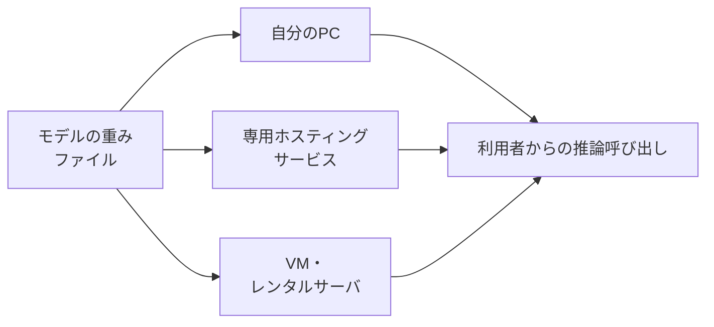

# Appendix: ローカルLLM

本付録は、**外部のクラウドサービスに頼らず、自分の管理下で生成AIを動かす**選択肢を整理する地図です。ChatGPT・Gemini・Claudeを業務に取り入れた先で、次のような関心が出てきた読者を想定しています。

- 外部に出せない情報を扱いたい
- 特定の用途に合わせたモデルを呼び出したい
- サブスクリプション型のサービス以外の選択肢も知っておきたい

ここで扱うのは、ツールカタログそのものというより、**目的・ツール・動かす場所**の3点を結び付ける考え方です。製品名や対応モデルは数か月単位で入れ替わるため、賞味期限の長い分け方を中心に置きます。

## 対象読者と前提

- [8章](08-common-capabilities.md)で生成AIの共通的な使い方を把握した人
- [9章「個人利用編」](09-security-individual.md)と[10章「エージェント時代のガバナンス」](10-security-agent-era.md)で、入力データの扱いとガバナンスの観点を確認した人
- ChatGPT・Gemini・Claudeなどのクラウド型サービスを一通り触ったうえで、別解の存在も知っておきたい人

本付録はエンジニア向けではありません。自分でモデルを訓練したり、推論サーバを構築したりはしませんが、**選択肢として何があるのかを把握し、社内の検討で会話に参加できる**ところまでを目標にします。

## 「ローカルLLM」と呼ぶときの範囲

文脈によって、「ローカル」が指すものはぶれがちです。本付録では、次の2点を満たすものをまとめてローカルLLMと呼びます。

- 推論を担うコンピュータが、ChatGPT・Gemini・Claudeなどの提供事業者のクラウドではなく、**利用者か利用者の組織が選んだ場所**にあること
- 動かすモデルの重み（学習結果のデータ）を、**ファイルとして取得・配置できる**こと

この定義に含まれるのは、自分のPCで動かす場合だけではありません。GPUを借りて動かす構成や、社内のVMに置く構成も含みます。逆に、提供事業者のサーバ上でモデルを呼び出すAPI型のサービスは、たとえ呼び出し側のコードが手元にあってもローカルLLMには含めません。

利用者の側で決めるのは、**どのモデルを**、**どの場所で**動かすかの2軸です。次節以降では、ローカルLLMを選ぶ動機を整理したうえで、この2軸（ツールと環境）を順に見ていきます。

## 自分でホストする5つの動機

ローカルLLMを検討する動機は、業務の文脈によって異なります。代表的なものを並べます。

| 動機 | 何を解きたいのか |
| ---- | ---- |
| 機密データを外部に送信しない | 顧客情報・契約条件・設計資料など、第三者のサーバに渡したくないデータを扱いたい |
| 外部サービスへの依存を分散する | 提供事業者の障害・規約変更・値上げに対する代替経路を持っておきたい |
| ネットワーク非依存で動かす | オフライン環境や、外部接続が制限された拠点でも生成AIを利用したい |
| トークン課金から外れる | 従量課金ではなく、ハードウェアの固定費として費用を見積もりたい |
| 用途特化のモデルを動かす | クラウドの汎用モデルにはない、特定業務向けに調整されたモデルを使いたい |

5つ目の「用途特化」に近い文脈として、**クラウドサービスのガードレール下では難しい処理**——たとえば成人向け表現、医療相談、犯罪捜査の資料整理など、規約上クラウド側で制限される領域を扱うために選ばれることもあります。動機が正当であっても、利用者側でガードレールを設計し直す必要が出てきます。詳しくは[10章](10-security-agent-era.md)で触れているガバナンスの観点を参照してください。

これら5つの動機は、複数が同時に当てはまる場面も普通にあります。「機密データの扱いと費用見積もりの両方が動機」という構成も珍しくありません。最初に**主たる動機を1つに絞っておく**と、後の選択がぶれにくくなります。

## ツールのオーバービュー

ローカルで動かす対象は、テキストモデルだけではありません。生成AI全般を視野に入れると、3つのカテゴリに分けて眺めるのが扱いやすくなります。

| カテゴリ | 代表的なツール | 主な用途 |
| ---- | ---- | ---- |
| テキスト系 | Ollama、LM Studio、Jan、Open WebUI | チャット、要約、翻訳、コード補助 |
| 画像生成系 | AUTOMATIC1111、ComfyUI、Fooocus | 画像生成、スタイル変換、画像編集 |
| 音声・音楽系 | Whisper（faster-whisper含む）、Bark、StableAudio Open、RVC | 文字起こし、音声合成、楽曲生成 |

各ツールは「モデルを呼び出すためのアプリ」であり、モデル自体は別途取得します。**Hugging Face**などのモデル配布サイトから、用途に合わせて重みファイルをダウンロードして使う流れが基本形です。

### テキスト系

非エンジニアの読者にとって、最初の入口になりやすいのは次の2本です。

- **Ollama**: コマンドラインから1行でモデルを取得・実行できる軽量な仕組み。デスクトップアプリもあり、APIサーバとして他のアプリから呼び出す用途にも対応する
- **LM Studio**: GUI中心で、モデルの検索・取得・チャット・APIサーバ起動までが1画面で完結する。ChatGPTのチャット画面に近い感覚で扱える

GUI重視ならLM Studio、組み込みやすさ重視ならOllama、というのが現状の使い分けです。両者ともOpenAI互換のAPIエンドポイントを公開する機能を備え、別のアプリから呼び出すときのつなぎ込みは比較的そろっています。

このほか、ブラウザベースの**Open WebUI**（Ollamaなどをバックエンドに使うチャットUI）や、Electron製の**Jan**（オフライン優先のチャットアプリ）も選択肢に入ります。社内で複数人が同じ推論サーバにアクセスする構成では、Open WebUIを選ぶ場面が増えました。

### 画像生成系

画像生成の領域は、ローカル実行が早くから一般化しました。代表的なのはStable Diffusion系のモデルを動かすUI群です。

- **AUTOMATIC1111 WebUI**: もっとも普及しているWebUI。拡張機能（プラグイン）が豊富で、機能の選択肢が広い
- **ComfyUI**: 処理の流れをノードグラフで組み立てるタイプ。複雑な構成を再現可能な形で残したい場面に向く
- **Fooocus**: 設定項目を絞り、初期設定のままでも実用的な画像が出せる構成を採用したUI。最初の1枚を出すまでの距離が短い

3者とも、モデル重み（チェックポイント）と追加学習データ（LoRAなど）を別々に管理する考え方を共有しています。クラウドの画像生成サービスがブラックボックスに近いのに対し、ローカル側は**生成過程の各段階を細かく差し替えられる**性質を持ちます。

### 音声・音楽系

音声・音楽系は、用途別にツールを使い分けます。

- **文字起こし**: OpenAIが公開した**Whisper**と、その高速実装である**faster-whisper**が定番。会議音声や音声メモのテキスト化を、ネットワーク非依存で行いたい場面に向く
- **音声合成（TTS）**: **Bark**、**XTTS**、**OpenVoice**などのモデルが公開されている。音声のクローン生成が可能なものも含まれるため、本人同意や法令との関係を踏まえて利用範囲を慎重に検討する
- **楽曲生成**: **StableAudio Open**、**MusicGen**などが公開されている。クラウド型の音楽生成サービスと比べると品質や長さに差はあるが、外部に音源を出さずに試作したい用途で選ばれる

文字起こしを除くと、音声・音楽系のローカル実行は**まだ実験的な性格が強い**領域です。当面は専用の有料サービスと併用する構成が現実的でしょう。

## 動かす環境の3分類

モデルとツールが決まると、次は**どこで動かすか**です。費用感とセットアップの手間が大きく異なるため、3つの軸で整理しておきます。

| 環境 | 向いている規模 | 費用の性質 | 主な制約 |
| ---- | ---- | ---- | ---- |
| ローカルPC | 1人で試す、少人数で共用する | 初期投資（GPU・メモリ）と電気代 | PCのスペック上限、起動中のみ動作 |
| 専用ホスティングサービス | 短時間試す、用途別に切り替える | 利用時間に応じた従量課金 | サービス事業者依存、データ取扱の規約確認が必要 |
| VM・レンタルサーバ | 24時間動かす、社内で共有する | 月額固定（GPU付きVMは高め） | 構築・運用の手間、GPU在庫の制約 |

### ローカルPC

最初の選択肢として有力なのは、**手元のPC**です。Apple Silicon搭載のMacや、ゲーミング向けのGPU（NVIDIA GeForce RTXシリーズなど）を積んだWindows・Linux機が、現実的なラインです。

- メモリ（あるいはVRAM）の容量が、扱えるモデルサイズの上限を決める。**16GBで小型モデル、32〜64GBで中型モデル、それ以上で大型モデル**という対応が目安
- 同じ性能のクラウドGPUを借り続けるよりも、長期的には費用対効果が見えやすい
- PCの電源が入っているあいだだけ動く構成のため、24時間稼働させたい用途には向かない

実行速度と扱えるモデルサイズを左右するのは、CPUよりGPU（あるいはGPUを内蔵したSoC）です。執筆時点で現実的な選択肢は3系統に分かれ、**対応するツールの広さ・モデル用メモリの取り方・電力／騒音**に違いがあります。

| 系統 | 主な実行基盤 | モデル用メモリの考え方 | 押さえておきたい点 |
| ---- | ---- | ---- | ---- |
| NVIDIA GeForce RTX系 | CUDA（NVIDIA独自） | カードに載るVRAMが上限。8GB／12GB／16GB／24GBが代表的 | 主要ツールはCUDA前提で書かれていることが多く、対応の心配が少ない。動作確認の情報量も多い。上位カードは消費電力・騒音・価格が大きくなる |
| AMD Radeon系 | ROCm（AMD公式）／Vulkan | カードに載るVRAMが上限。同価格帯ではNVIDIAより多めに積めるモデルがある | 主要ツールもAMDに対応するが、機種・OS・ドライバの組み合わせで動作可否が変わる。導入前に該当ツールの公式情報で対応状況を確認する |
| Apple Silicon搭載Mac | Metal（Apple独自）／MLX | CPUとGPUがメインメモリを共有する**ユニファイドメモリ**。本体のRAMがそのままモデル用メモリになる | 64〜128GB搭載機では、同価格帯のWindows GPU機より大きなモデルが乗せやすい。生成速度は同価格帯のNVIDIA上位カードに及ばない場面が多い。MacBookやMac mini単体で完結する点が利点 |

非エンジニアの読者の判断軸としてまとめると、次の3点に集約できます。

- **ツールの選択肢と情報量で困りたくない**ならNVIDIA系
- **MacBookやMac miniで静かに、低消費電力で中〜大型モデルまで触りたい**ならApple Silicon系
- **価格に対するVRAM容量を重視する**ならAMD Radeon系。導入前に対応ツールの公式情報を確認する

Intel ArcのGPUや、Copilot+ PCに搭載されるNPU（推論専用プロセッサ）も新しい選択肢として広がりつつあります。本付録の執筆時点では対応するローカルLLMツールが上記3系統より限られるため、当面は実績の多い3系統を選ぶほうが、ツール側の情報量で助けられる場面が多くなります。

「個人で試して感触を掴む」「機密ファイルの要約を1人ですませる」段階であれば、ローカルPCで足りるケースが多いです。

### 専用ホスティングサービス

オープンなモデルを呼び出せるホスティング型のサービスが、ここ数年で広がりました。代表的なものを挙げます。

- **Replicate**: モデルごとにAPI化されており、利用時間に応じて課金される。試したいモデルが見つけやすい
- **Hugging Face Inference Endpoints**: モデル配布サイトのHugging Face自体が提供する推論サービス。専有エンドポイントを立てて使う形になる
- **Together AI / Fireworks AI / Groq / Modal**: オープンモデルを高速・低レイテンシで呼び出せるサービス群。モデルの選択肢と推論速度のバランスで選ぶ

これらは「自分でサーバを立てない」点ではクラウド型の生成AIサービスと似ていますが、**呼び出すモデルをユーザー側で選ぶ**点が異なります。データ取扱の規約や保管期間は事業者ごとに異なるため、機密情報を扱う前に**プライバシーポリシーとデータ保管に関する設定**を必ず確認してください。

### VM・レンタルサーバ

社内で複数人が継続的に利用する構成では、GPU付きのVMやレンタルサーバを使う形が選ばれます。**RunPod**、**Vast.ai**、**Lambda Cloud**、**Paperspace**などのGPU特化型サービスのほか、AWS・Azure・GCP・OCIなどの汎用クラウドのGPUインスタンスも候補に入ります。

- 24時間稼働では、GPU付きVMの月額は数万円〜数十万円規模になる。利用率が低いと費用対効果が出にくい
- 構築・更新・障害対応の負担が、ホスティング型より重い。継続運用には専任の担当者を立てる前提となる
- 複数人で共有する前提では、Open WebUIなどのUI層と、社内認証の仕組みを別途整える必要がある

「社内の特定業務向けに、利用者数十人規模で動かす」段階になってから検討対象に入ります。**最初の検証はローカルPCか専用ホスティングで行い、利用が定着してからVMへ移す**順で進めると、費用と運用の両面で見通しを立てやすくなります。

## クラウド事業者のカスタムモデルホスティング

Google CloudのVertex AIや、AWSのBedrockには、**任意のオープンモデルを自分のクラウド環境にデプロイする**機能があります。`Bedrock custom model import`、`Vertex AI Model Garden`などが該当します。

これらは「自社のクラウド契約の中にモデルを置く」という意味でローカルLLMの隣接領域です。一方で、構築・運用・課金体系の理解には、本ドキュメントの想定読者層を超えるエンジニアリングの負担がかかります。**社内に基盤を扱うエンジニアチームがいる場合の選択肢**として、名前を頭の片隅に置いておく程度で十分です。

## オープンモデルとライセンスの留意点

ローカルLLMで使うモデルは「オープンウェイト」と呼ばれることが多いですが、**ライセンス条件はモデルごとに異なります**。代表的な観点を並べます。

- **商用利用の可否**: 個人利用は認められても、商用利用に別途条件が付くものもある
- **モデル名・派生物の扱い**: ファインチューニング後のモデル名やクレジット表記に条件を設けているものがある
- **利用目的の制限**: 違法行為や差別的用途を禁じる利用規約（責任ある利用の規約）が付与されているものが一般的
- **学習データの再配布**: 一部のモデルでは、学習データに第三者の権利が含まれる可能性も指摘されている

業務利用の前に、各モデルの公式ページに記載されたライセンスと利用規約を**実際に開いて読む**ことが前提になります。Hugging Face上のモデルカードに、ライセンス名（Apache-2.0、MIT、Llama Community License、Gemma Terms of Useなど）が併記されています。

## 始め方

最初の1本を試すときの段取りです。まずはテキスト系から入る経路を想定しています。

- 主たる動機を1つ決める（機密データの非送信、コスト見積もり、依存分散など）
- 動機に対して、ローカルPCで完結するか、専用ホスティングで足りるか、VMが必要かを判断する
- ローカルPCで試すなら、Ollama／LM Studioのいずれかを入れ、**手元のメモリで動く小型モデル**から始める
- 業務データで試す前に、**ダミーデータでひととおり動作確認**する
- 動機が満たせそうなら、対象データの範囲を広げて社内で試行する
- 利用が広がる段階で、専用ホスティングやVMへの移行を検討する

「いきなり全社で使えるよう構築する」よりも、**個人または小チームで主たる動機が満たせるかを確認してから広げる**順序が、結果として遠回りになりにくい段取りです。

## まとめ

- ローカルLLMは、**外部クラウドの推論サーバを使わず、利用者の管理下で生成AIを動かす**選択肢の総称
- 動機は機密データの非送信、依存分散、オフライン動作、固定費化、用途特化の5つに大別できる
- ツールはテキスト・画像・音声の3カテゴリに分かれ、テキストではOllamaとLM Studioが入口として扱いやすい
- 動かす環境はローカルPC・専用ホスティング・VMの3つで整理し、規模と費用の対応で選ぶ
- ローカルPCで動かす場合のGPUはNVIDIA系・AMD系・Apple Silicon系の3系統に分かれ、対応ツールの広さとモデル用メモリの取り方で違いが出る
- Vertex AIやBedrockのカスタムモデルホスティングは、エンジニアチームがいる場合の選択肢として位置付ける
- モデルごとのライセンスと利用規約は、業務利用の前に一次ソースで確認する

## 参考

- Ollama: <https://ollama.com/>（最終確認：2026-04-25）
- LM Studio: <https://lmstudio.ai/>（最終確認：2026-04-25）
- Open WebUI: <https://openwebui.com/>（最終確認：2026-04-25）
- Hugging Face「Models」: <https://huggingface.co/models>（最終確認：2026-04-25）
- Replicate: <https://replicate.com/>（最終確認：2026-04-25）
- Hugging Face「Inference Endpoints」: <https://huggingface.co/inference-endpoints>（最終確認：2026-04-25）
- AWS「Amazon Bedrock Custom Model Import」: <https://docs.aws.amazon.com/bedrock/latest/userguide/model-customization-import-model.html>（最終確認：2026-04-25）
- Google Cloud「Vertex AI Model Garden」: <https://cloud.google.com/model-garden>（最終確認：2026-04-25）
