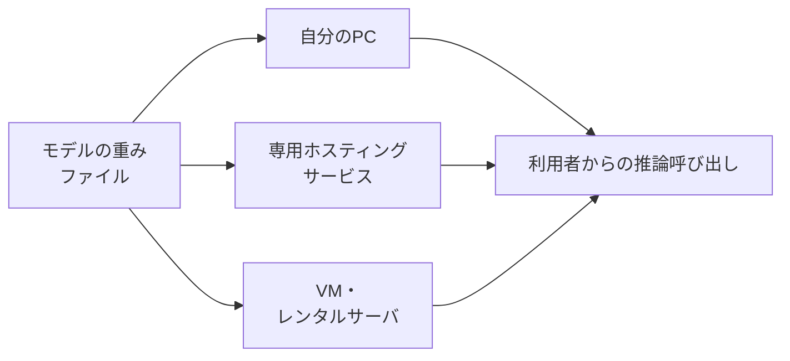

# Appendix: ローカルLLM

本付録は、提供事業者のクラウドではなく、利用者または利用者の組織が選んだ場所で生成AIを動かす選択肢を整理します。ChatGPT・Gemini・Claudeを業務に取り入れた先で、次のような関心が出てきた読者を想定しています。

- 外部に出せない情報を扱いたい
- 特定の用途に合わせたモデルを呼び出したい
- サブスクリプション型以外の選択肢も把握しておきたい

製品名や対応モデルは数か月単位で入れ替わるため、本付録では個別のツールカタログよりも、目的・ツール・動かす場所の3つの軸を組み合わせる考え方を中心に置きます。最初に「ローカルLLM」という呼び方の範囲を定め、次に検討の動機を5つに整理し、その後にツールと動かす環境を順に見ていきます。

## 対象読者と前提

- [8章](08-common-capabilities.md)で生成AIの共通的な使い方を把握した人
- [9章「個人利用編」](09-security-individual.md)と[10章「エージェント時代のガバナンス」](10-security-agent-era.md)で、入力データの扱いとガバナンスの観点を確認した人
- ChatGPT・Gemini・Claudeなどのクラウド型サービスを一通り使ったうえで、別の選択肢の存在も知っておきたい人

本付録はエンジニア向けではありません。自分でモデルを訓練したり、推論サーバを構築したりはしませんが、選択肢として何があるのかを把握し、社内の検討で議論に加われるところまでを目標にします。

## ローカルLLMの範囲は推論場所と重みの取得可否で線引きする

「ローカル」という語は文脈で揺れがちです。本付録では、次の2点をともに満たすものをまとめてローカルLLMと呼びます。

- 推論を担うコンピュータが、ChatGPT・Gemini・Claudeなどの提供事業者のクラウドではなく、利用者または利用者の組織が選んだ場所にあること
- 動かすモデルの重み（学習結果のデータ）を、ファイルとして取得・配置できること

この定義に含まれるのは、自分のPCで動かす場合だけではありません。GPUを借りて動かす構成や、社内のVMに置く構成も含みます。逆に、提供事業者のサーバ上でモデルを呼び出すAPI型のサービスは、呼び出し側のコードが手元にあってもローカルLLMには含めません。

利用者の側で決めるのは、どのモデルを選ぶか、どの場所で動かすか、の2軸です。次節以降では、検討の動機を整理したうえで、この2軸（ツールと環境）を順に見ていきます。

## 検討の動機は5つに整理できる

ローカルLLMを検討する動機は業務の文脈によって異なりますが、代表的なものを並べると次の5つに整理できます。

| 動機 | 何を解きたいのか |
| ---- | ---- |
| 機密データを外部に送信しない | 顧客情報・契約条件・設計資料など、第三者のサーバに渡したくないデータを扱いたい |
| 外部サービスへの依存を分散する | 提供事業者の障害・規約変更・値上げに対する代替経路を持っておきたい |
| ネットワーク非依存で動かす | オフライン環境や、外部接続が制限された拠点でも生成AIを利用したい |
| トークン課金から外れる | 従量課金ではなく、ハードウェアの固定費として費用を見積もりたい |
| 用途特化のモデルを動かす | クラウドの汎用モデルにはない、特定業務向けに調整されたモデルを使いたい |

5つ目の「用途特化」に近い文脈として、クラウド側の規約で制限される領域を扱うために選ばれる場合もあります。たとえば成人向け表現、医療相談、犯罪捜査の資料整理などです。動機が正当であっても、クラウド側に備わっていた利用規約上の制限が外れる以上、扱える範囲の線引きは利用者の側で設計し直すことになります。詳しくは[10章](10-security-agent-era.md)で触れているガバナンスの観点を参照してください。

これら5つの動機は、複数が同時に当てはまる場面も普通にあります。たとえば「機密データの扱いと費用見積もりの両方が動機」という構成は珍しくありません。最初に主たる動機を1つに絞っておくと、その後のツール選びと環境選びが揺れにくくなります。

## ツールはテキスト・画像生成・音声音楽の3カテゴリに分かれる

ローカルで動かす対象は、テキストモデルだけではありません。生成AI全般は、テキスト・画像生成・音声音楽の3カテゴリに分かれており、それぞれにローカルで動かせるツールが出そろっています。

| カテゴリ | 代表的なツール | 主な用途 |
| ---- | ---- | ---- |
| テキスト系 | Ollama、LM Studio、Jan、Open WebUI | チャット、要約、翻訳、コード補助 |
| 画像生成系 | AUTOMATIC1111、ComfyUI、Fooocus | 画像生成、スタイル変換、画像編集 |
| 音声・音楽系 | Whisper（faster-whisper含む）、Bark、StableAudio Open、RVC | 文字起こし、音声合成、楽曲生成 |

これらのツールはいずれも「モデルを呼び出すためのアプリ」であり、モデル自体は別途取得します。Hugging Faceなどのモデル配布サイトから、用途に合わせて重みファイル（学習結果のデータ）をダウンロードして使うのが基本の流れです。

### テキスト系

非エンジニアの読者が最初に試しやすいのは、次の2本です。

- Ollama：コマンドラインから1行でモデルを取得・実行できる軽量な実行環境。デスクトップアプリもあり、APIサーバとして他のアプリから呼び出す用途にも対応する
- LM Studio：GUI中心で、モデルの検索・取得・チャット・APIサーバ起動までが1画面でそろう。ChatGPTのチャット画面に近い感覚で扱える

GUIの操作性で選ぶならLM Studio、他のアプリへの組み込みやすさで選ぶならOllama、というのが現状の使い分けです。どちらもOpenAI互換のAPIエンドポイントを公開する機能を備えており、別のアプリから呼び出すときの接続は揃っています。

このほか、ブラウザベースのOpen WebUI（Ollamaなどをバックエンドに使うチャットUI）や、Electron製のJan（オフライン優先のチャットアプリ）も選択肢に入ります。社内の複数人で同じ推論サーバを共有する構成では、Open WebUIを選ぶ場面が増えました。

### 画像生成系

画像生成の領域は、ローカル実行が早くから一般化しました。Stable Diffusion系のモデルを動かすUI群が代表です。

- AUTOMATIC1111 WebUI：もっとも普及しているWebUI。拡張機能（プラグイン）が豊富で、機能の選択肢が広い
- ComfyUI：処理の流れをノードグラフで組み立てるタイプ。複雑な構成を再現可能な形で残したい場面に向く
- Fooocus：設定項目を絞り、初期設定のままでも実用的な画像が出るよう構成されたUI。最初の1枚を出すまでの手順が少ない

いずれも、モデル重み（チェックポイント）と追加学習データ（LoRAなど）を別々に管理する考え方を共有しています。クラウドの画像生成サービスは生成過程が外から見えにくい一方、ローカル側はモデル・追加学習データ・サンプリング設定など、生成過程の各段階を個別に差し替えられます。生成結果を再現したい場合や、特定のスタイルを継続的に当てたい場合に向く性質です。

### 音声・音楽系

音声・音楽系は、用途別にツールを使い分けます。

- 文字起こし：OpenAIが公開したWhisperと、その高速実装であるfaster-whisperが定番。会議音声や音声メモのテキスト化を、ネットワーク非依存で行いたい場面に向く
- 音声合成（TTS）：Bark、XTTS、OpenVoiceなどのモデルが公開されている。音声のクローン生成ができるものも含まれるため、本人同意や法令との関係を踏まえて利用範囲を判断する
- 楽曲生成：StableAudio Open、MusicGenなどが公開されている。クラウド型の音楽生成サービスと比べると品質や長さに差があるものの、外部に音源を出さずに試作したい用途で選ばれる

文字起こしを除くと、音声・音楽系のローカル実行は精度・速度・安定性の点でクラウド型サービスに及ばない場面がまだ多く、用途を限定して試す段階にあります。当面は専用の有料サービスと併用する構成が現実的です。

## 動かす環境はローカルPC・専用ホスティング・VMの3つで整理する

モデルとツールが決まると、次は動かす場所の選択です。費用感とセットアップの手間が大きく異なるため、ローカルPC・専用ホスティングサービス・VM／レンタルサーバの3つに分けて整理します。

| 環境 | 向いている規模 | 費用の性質 | 主な制約 |
| ---- | ---- | ---- | ---- |
| ローカルPC | 1人で試す、少人数で共用する | 初期投資（GPU・メモリ）と電気代 | PCのスペック上限、起動中のみ動作 |
| 専用ホスティングサービス | 短時間試す、用途別に切り替える | 利用時間に応じた従量課金 | サービス事業者依存、データ取扱の規約確認が必要 |
| VM・レンタルサーバ | 24時間動かす、社内で共有する | 月額固定（GPU付きVMは高め） | 構築・運用の手間、GPU在庫の制約 |

### ローカルPC

最初に検討しやすいのは手元のPCで動かす構成です。Apple Silicon搭載のMacや、ゲーミング向けのGPU（NVIDIA GeForce RTXシリーズなど）を積んだWindows・Linux機が現実的な範囲に入ります。

- メモリ（あるいはVRAM）の容量が、扱えるモデルサイズの上限を決める。16GBで小型モデル、32〜64GBで中型モデル、それ以上で大型モデル、というのが目安
- 同じ性能のクラウドGPUを借り続ける場合と比べて、長期的には費用対効果を見積もりやすい
- PCの電源が入っているあいだだけ動く構成のため、24時間稼働させたい用途には向かない

実行速度と扱えるモデルサイズを左右するのは、CPUよりもGPU（あるいはGPUを内蔵したSoC）です。執筆時点で現実的な選択肢は3系統に分かれ、対応ツールの広さ、モデル用メモリの取り方、電力と騒音の3点で性質が異なります。

| 系統 | 主な実行基盤 | モデル用メモリの考え方 | 押さえておきたい点 |
| ---- | ---- | ---- | ---- |
| NVIDIA GeForce RTX系 | CUDA（NVIDIA独自） | カードに載るVRAMが上限。8GB／12GB／16GB／24GBが代表的 | 主要ツールはCUDA前提で書かれていることが多く、互換性で詰まる場面が少ない。動作確認の情報や利用例も豊富。上位カードは消費電力・騒音・価格が大きくなる |
| AMD Radeon系 | ROCm（AMD公式）／Vulkan | カードに載るVRAMが上限。同価格帯ではNVIDIAより多めに積めるモデルがある | 主要ツールもAMDに対応するが、機種・OS・ドライバの組み合わせで動作可否が変わる。導入前に該当ツールの公式情報で対応状況を確認する |
| Apple Silicon搭載Mac | Metal（Apple独自）／MLX | CPUとGPUがメインメモリを共有する**ユニファイドメモリ**。本体のRAMがそのままモデル用メモリになる | 64〜128GB搭載機では、同価格帯のWindows GPU機より大きなモデルが乗せやすい。生成速度は同価格帯のNVIDIA上位カードに及ばない場面が多い。MacBookやMac mini単体で完結する点が利点 |

非エンジニアの読者が判断する軸としてまとめると、次の3点に集約できます。

- ツールの選択肢の広さや動作情報の量を優先する場合はNVIDIA系
- MacBookやMac miniで静かに、低消費電力で中〜大型モデルまで動かしたい場合はApple Silicon系
- 価格に対するVRAM容量を重視する場合はAMD Radeon系。導入前に対応ツールの公式情報を確認する

Intel ArcのGPUや、Copilot+ PCに搭載されるNPU（推論専用プロセッサ）も新しい選択肢として広がりつつあります。執筆時点では対応するローカルLLMツールが上記3系統よりも限られるため、当面は実績の多い3系統のほうが対応情報や利用例を見つけやすい状況です。

個人で動作を確認する段階や、機密ファイルの要約を1人で完結させる段階であれば、ローカルPCで足りる場面が多くなります。

### 専用ホスティングサービス

オープンなモデルを呼び出せるホスティング型のサービスが、ここ数年で広がりました。代表的なものを並べます。

- Replicate：モデルごとにAPI化されており、利用時間に応じて課金される。試したいモデルが見つけやすい
- Hugging Face Inference Endpoints：モデル配布サイトのHugging Face自体が提供する推論サービス。専有エンドポイントを立てて使う形になる
- Together AI／Fireworks AI／Groq／Modal：オープンモデルを高速・低レイテンシで呼び出せるサービス群。モデルの選択肢と推論速度のバランスで選ぶ

これらは「自分でサーバを立てない」点ではクラウド型の生成AIサービスと共通しますが、呼び出すモデルを利用者側で選ぶ点が違います。データ取扱の規約や保管期間は事業者ごとに異なるため、機密情報を扱う前に、プライバシーポリシーとデータ保管に関する設定を必ず確認してください。

### VM・レンタルサーバ

社内で複数人が継続的に利用する構成では、GPU付きのVMやレンタルサーバを使う形が選ばれます。RunPod、Vast.ai、Lambda Cloud、PaperspaceなどのGPU特化型サービスのほか、AWS・Azure・GCP・OCIなどの汎用クラウドのGPUインスタンスも候補に入ります。

- 24時間稼働では、GPU付きVMの月額は数万円〜数十万円規模になる。利用率が低いと費用対効果が出にくい
- 構築・更新・障害対応の負担が、ホスティング型より重い。継続運用には担当者を立てる前提になる
- 複数人で共有する場合、Open WebUIなどのUI層と、社内認証の仕組みを別途整える必要がある

社内の特定業務向けに、利用者数十人規模で動かす段階になってから検討の対象に入ります。最初の検証はローカルPCか専用ホスティングで行い、利用が定着してからVMへ移す順で進めると、費用と運用の両面で見通しを立てやすくなります。

## クラウド事業者のカスタムモデルホスティングは隣接領域に位置する

Google CloudのVertex AIや、AWSのBedrockには、任意のオープンモデルを自社のクラウド環境にデプロイする機能があります。`Bedrock custom model import`、`Vertex AI Model Garden`などが該当します。

これらは「自社のクラウド契約の中にモデルを置く」という意味で、本付録のローカルLLMと隣接した位置づけです。ただし、構築・運用・課金体系の理解には、本ドキュメントの想定読者層を超えるエンジニアリングの負担がかかります。社内に基盤を扱うエンジニアチームがいる場合の選択肢として、本付録では名前と性質の紹介に留めます。

## オープンモデルのライセンスは業務利用の前に一次ソースで確認する

ローカルLLMで使うモデルは「オープンウェイト」と呼ばれることが多いものの、ライセンス条件はモデルごとに異なります。代表的な観点を並べます。

- 商用利用の可否：個人利用は認められても、商用利用に別途の条件を課しているものがある
- モデル名・派生物の扱い：ファインチューニング後のモデル名やクレジット表記に条件を設けているものがある
- 利用目的の制限：違法行為や差別的用途を禁じる利用規約（責任ある利用の規約）が付与されているものが一般的
- 学習データの再配布：一部のモデルでは、学習データに第三者の権利が含まれる可能性も指摘されている

業務利用に先立って、各モデルの公式ページに記載されたライセンスと利用規約を、実際に開いて確認することが前提になります。Hugging Face上のモデルカードには、ライセンス名（Apache-2.0、MIT、Llama Community License、Gemma Terms of Useなど）が併記されています。

## 最初の1本は、主たる動機を絞ってから動かす

最初の1本を試すときの段取りです。テキスト系から入る経路を想定しています。

- 主たる動機を1つ決める（機密データの非送信、コスト見積もり、依存分散など）
- 動機に照らして、ローカルPCで完結するか、専用ホスティングで足りるか、VMが必要かを判断する
- ローカルPCで試す場合は、OllamaまたはLM Studioを入れ、手元のメモリで動く小型モデルから始める
- 業務データで試す前に、ダミーデータでひととおり動作確認する
- 主たる動機を満たせる見込みが立った段階で、対象データの範囲を広げて社内で試行する
- 利用が広がる段階で、専用ホスティングやVMへの移行を検討する

いきなり全社で使える形を構築するよりも、個人または小チームで主たる動機を満たせるかどうかを先に確認してから広げる順序のほうが、結果として手戻りを抑えやすくなります。

## まとめ

- ローカルLLMは、提供事業者のクラウドではなく、利用者または利用者の組織が選んだ場所で生成AIを動かす選択肢の総称
- 検討の動機は、機密データの非送信・依存分散・オフライン動作・固定費化・用途特化の5つに整理でき、最初に主たる動機を1つに絞ると後の選択が揺れにくい
- ツールはテキスト・画像・音声の3カテゴリに分かれ、動かす環境はローカルPC・専用ホスティング・VMの3つで整理する
- ローカルPCのGPUはNVIDIA系・AMD系・Apple Silicon系の3系統に分かれ、対応ツール・モデル用メモリ・電力／騒音の観点で性質が異なる

## 参考

- Ollama: <https://ollama.com/>（最終確認：2026-04-25）
- LM Studio: <https://lmstudio.ai/>（最終確認：2026-04-25）
- Open WebUI: <https://openwebui.com/>（最終確認：2026-04-25）
- Hugging Face「Models」: <https://huggingface.co/models>（最終確認：2026-04-25）
- Replicate: <https://replicate.com/>（最終確認：2026-04-25）
- Hugging Face「Inference Endpoints」: <https://huggingface.co/inference-endpoints>（最終確認：2026-04-25）
- AWS「Amazon Bedrock Custom Model Import」: <https://docs.aws.amazon.com/bedrock/latest/userguide/model-customization-import-model.html>（最終確認：2026-04-25）
- Google Cloud「Vertex AI Model Garden」: <https://cloud.google.com/model-garden>（最終確認：2026-04-25）
