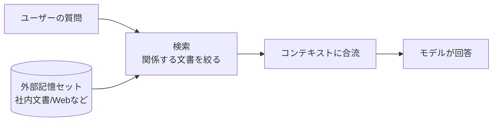
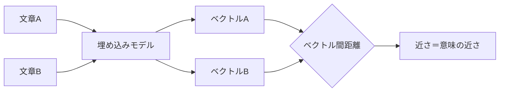
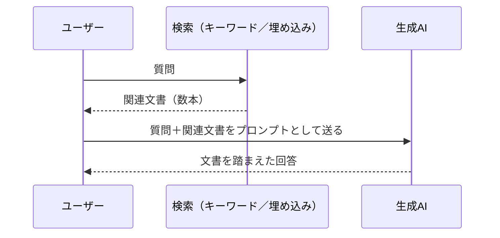
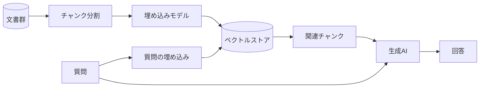

# Appendix: 拡張検索と埋め込み検索

「RAG」「Embedding」「ベクトル検索」「グラウンディング」といった語は、いずれも生成AIに「自前で持っていない知識」を参照させる仕組みを、別々の角度から指しています。語ごとに対象が違うのか、同じものを呼び替えているのかを利用者の側で整理しておくと、製品の説明文やベンダーの提案を読むときの参照軸になります。

本付録は、この4語を順に整理します。最初に仕組みの骨格（外部記憶セット）を置き、次に検索の2系統（キーワード検索／埋め込み検索）を並べ、最後にRAGとグラウンディングの呼び方の違いに触れます。

## 対象読者と前提

- [6章](06-hallucination-and-knowledge-literacy.md)で「学習カットオフ」と「コンテキストで補える情報」の関係を読んだ人
- [8章](08-common-capabilities.md)でコネクタの仕組み（外部の情報を会話に持ち込む経路）を把握した人
- 業務で生成AIに社内文書や資料を参照させたい、もしくはRAGという単語を見かけて意味を整理したい人

エンジニア向けの実装ガイドではありません。仕組みを「会話と意思決定の語彙」として共有し、社内議論やベンダー提案の読み解きで使える形に整えることを目標にします。

## 外部記憶セット: 後からコンテキストへ差し込む知識のかたまり

[6章](06-hallucination-and-knowledge-literacy.md)で確認したとおり、生成AIが学習時点で持っている知識には、学習カットオフという時間的な区切りがあります。社内文書のように、そもそもモデルの学習データに含まれていない情報も同じ扱いになります。これらをモデルに参照させるには、会話のコンテキストに後から差し込む経路を取る以外にありません。

差し込む経路自体は、ユーザーが資料を貼り付ける、コネクタが取得結果を流し込む、といった形で実現できます。ただ、社内に資料が10万本あるような状況では、毎回すべてを貼り付けるわけにはいきません。コンテキストウィンドウには上限があり、入れ過ぎても精度が落ちます。

そこで、質問のたびに「関係しそうな数本」だけを取り出して渡す仕組みが必要になります。

図の中央にある「検索」をどう作るかが、本付録のテーマです。検索の方式によって、得意な質問と苦手な質問は明確に分かれます。

## キーワード検索と埋め込み検索の2系統で検索を組む

検索の方式は大きく2系統に分かれます。古くから業務システムで使われているキーワード検索と、生成AIの普及とともに実用化が進んだ埋め込み検索です。それぞれの性質を表で並べてから、順に見ていきます。

| 観点 | キーワード検索 | 埋め込み検索 |
| ---- | ---- | ---- |
| 一致の基準 | 文字列の一致（語彙ベース） | 意味の近さ（ベクトル間の距離） |
| 強い場面 | 製品名・型番・固有の語など、表記が一致する問い | 言い換え・同義語・概念レベルでの問い |
| 弱い場面 | 表記揺れ、同義語、概念的な問い合わせ | 固有名詞や型番のピンポイント検索 |
| 事前準備 | 転置インデックスの作成 | 文書の埋め込み計算とベクトル保存 |
| 計算コスト | 軽い | 埋め込み生成のぶんだけ重い |

### キーワード検索

`Salesforce 契約書 改訂` のように、書かれている語そのものを手がかりに探す方式です。Webの検索エンジン、社内の全文検索、データベースの`LIKE`検索などが該当します。代表的な実装としては、転置インデックスを使うElasticsearchやOpenSearch、ライブラリ層でのBM25などが挙げられます。

書かれている語と問いの語が一致していれば強い反面、表現が少しでもずれると取りこぼします。「契約書を改訂したい」と「契約条項を改めたい」は、人が読めば同じ話に対応しますが、語彙のうえでは別物として扱われます。

### 埋め込み検索

文章を高次元のベクトル（数百〜数千個の数字の並び）に変換し、ベクトル同士の距離が近いものを「意味が近い」とみなす方式です。文章をベクトルに変換するモデルを**埋め込みモデル（Embedding model）**と呼び、変換結果のベクトルを**埋め込み（Embedding）**と呼びます。

埋め込みは、意味の似た文章を似た位置に配置する性質を持ちます。「契約書を改訂したい」と「契約条項を改めたい」は、語彙としては別ですが、ベクトル上の位置としては近い場所に配置されます。結果として、同義語や言い換えにも反応する検索が成り立ちます。

一方、固有名詞や型番のピンポイント検索は苦手です。「voyage-3.5」のような固有のトークンは、ベクトル上では意味的に近い語（他の埋め込みモデル名など）が並びやすく、文字列としての一致を期待した結果からはずれることがあります。

### ハイブリッド検索

実務では、2つを組み合わせるハイブリッド検索が一般的です。キーワード検索の結果と埋め込み検索の結果を、それぞれの順位やスコアで統合します。固有名詞のピンポイント性と、言い換えへの寛容さを両方確保する狙いです。製品名つきの社内ドキュメント検索や、ナレッジベースのQA用途では、この構成を前提にした製品が多くなります。

## RAGは検索結果をプロンプトに合流させる「型」の名前

ここまでの話を、生成AIに対する一連の手順としてまとめたのが、**RAG（Retrieval-Augmented Generation、検索拡張生成）**です。直訳すれば「検索で補強した生成」で、[6章](06-hallucination-and-knowledge-literacy.md)でも一度名前だけ触れました。手順は次の3段だけです。

RAGそのものは特別な技術というより、段取りの呼び名です。検索で何を引いてくるか、引いてきた結果をどうプロンプトに組み込むか、回答の根拠として何を引用させるか。設計の自由度はこの3点に集中しており、回答の品質もこの3点の作り方で大きく左右されます。

埋め込み検索を使ったRAGの構成を、用語の整理を兼ねて図にすると、こうなります。

各部品を一言ずつ整理しておきます。

- チャンク分割：文書を段落や数百トークン単位に切り分ける処理。長すぎると検索の粒度が荒くなり、短すぎると意味が散る
- 埋め込みモデル：文章をベクトルに変換するモデル。OpenAIの`text-embedding-3-*`、Voyage AIの`voyage-3.5`などが代表例
- ベクトルストア：大量のベクトルから「近いもの」を高速に取り出す保管庫。Pinecone、Weaviate、pgvectorなどがよく使われる
- 生成AI：取り出した関連チャンクを参照しながら回答を組み立てる側。Claude、Geminiなど

利用者の立場では、これらの部品を自分で組み立てる必要はありません。多くの社内ナレッジ製品は、この一式をサービス内部で動かしてチャット風のUIだけを見せています。Difyのような[Appendix「ワークフローツール」](appendix-workflow-tools.md)で触れたLLMアプリ志向のツールも、RAGの構築を主目的の1つとしています。

## グラウンディングはGeminiでの呼び替え

GoogleはGemini文脈で、外部情報を参照しながら回答する機能を**グラウンディング（Grounding）**と呼んでいます。代表例が「Grounding with Google Search」で、Gemini APIから有効化すると、モデルが検索結果を踏まえて回答を返し、合わせて引用URLや検索クエリも返してくれます。

仕組みのレベルでは、RAGとグラウンディングは大きく重なります。外部から取り出した情報を、生成のプロンプトに合流させて回答を組み立てる、という骨格は同じです。違いは強調点と運用範囲にあります。

| 観点 | RAG | グラウンディング（Geminiの呼称） |
| ---- | ---- | ---- |
| 言葉の出自 | 学術用語（Lewis et al., 2020） | Googleが製品文脈で採用 |
| 重点 | 検索した文書を生成の素材として使う | 回答を事実に接地（ground）させる側面の強調 |
| 想定する情報源 | 任意の外部記憶（社内文書／Web／DB） | Google検索、Google Maps、自社の検索APIなど |
| 利用者の体験 | チャットの裏で関連文書を引いて回答 | 同上＋引用URLや検索クエリの返却 |

利用者の感覚としては、「グラウンディングはRAGをGoogle側の文脈で呼び直したもの」と理解しておくと、製品の説明文を読み解きやすくなります。一方で、Geminiのグラウンディング機能を使う場合は、利用条件として検索候補の表示が求められるなど、Google側の運用ルールが追加で乗ってきます。利用にあたっては、Geminiの公式ドキュメントで条件を確認しておきます。

## 裏でRAGが動く場面と、引用元を確認する習慣

裏でRAGが動いていることに気づきにくい場面と、明示的に意識する場面があります。代表的なものを並べておきます。

| 場面 | 内側で起きていること |
| ---- | ---- |
| 社内ナレッジ検索のチャットUI | 質問を埋め込みに変換 → 社内文書のベクトルストアを引く → 関連数本をプロンプトに合流 → 回答 |
| ChatGPT／Claude／Geminiの「Web検索」モード | 検索クエリを内部で生成 → 検索結果を取得 → 結果を踏まえて回答（Geminiは「グラウンディング」と表記） |
| Notion AI／Slack AIなどのSaaS内蔵AI | ワークスペース内の文書を埋め込み済み → 質問のたびに関連文書を引いて回答 |
| 各社の「ファイルをアップロードして質問」機能 | アップロードファイルをチャンク分割・埋め込み → 質問のたびに関連箇所を引く |

利用者として押さえておきたいのは、「検索で何が引かれたか」を確認する習慣です。多くの製品は、引用元の文書名やURLを返してきます。回答が外れたときは、まず検索結果の段階でずれていないかを見ると、原因の切り分けが進めやすくなります。プロンプトの言い換えで改善することも多く、これは[6章](06-hallucination-and-knowledge-literacy.md)で触れた「揺らぎテスト」と相性のよい手順です。

## 始めるときは、ユースケースの妥当性から見極める

社内で「RAGを使った何かを始めてみたい」となったときの、実務的な進め方です。

- 自分たちのユースケースが本当にRAGを必要としているかを先に見極める。たとえば、参照する文書が少数で、毎回手で貼れる規模なら、RAGを組まずにアップロード機能で十分なことが多い
- 既存のSaaS（Notion AI、Glean、Microsoft 365 Copilotなど）が想定する用途に合致するなら、それを採用するほうが、自前構築より時間あたりの成果は安定する
- どうしても自前構築が要る場合も、ベクトルストアの選定より先に、チャンク分割と評価セットを整える。検索結果の質が低いまま運用しても、ベクトルストアの工夫だけで回答品質を引き上げるのは難しい
- ハイブリッド検索を最初から前提にする。固有名詞や製品名が混ざる業務文書では、純粋な埋め込み検索だけでは取りこぼしが目立つ

評価セットというのは、「この質問なら、この文書のこの箇所が引かれてほしい」を100問ほど書き出した正解集のことです。RAG構築の現場では、これがあるかどうかで議論の進み方が大きく変わります。

## まとめ

- RAG・Embedding・ベクトル検索・グラウンディングは、いずれも生成AIに外部記憶を参照させる仕組みを別々の角度から指しており、レイヤーの異なる語が混ざっている
- 検索方式には文字列一致のキーワード検索と、意味の近さで引く埋め込み検索があり、実務ではハイブリッド検索が一般的
- RAGは「検索結果をプロンプトに合流させる」段取りの呼び名で、特定技術ではなく型の名前であり、Geminiの「グラウンディング」は同じ骨格をGoogle側の文脈で呼び直したもの
- 利用者の側では、引用元の確認と質問の言い換えで、内側の検索段階のずれを見つけやすくなる

## 参考

- Anthropic「Embeddings」: <https://docs.anthropic.com/ja/docs/build-with-claude/embeddings>（最終確認：2026-04-25）
- Google「Grounding with Google Search (Gemini API)」: <https://ai.google.dev/gemini-api/docs/google-search>（最終確認：2026-04-25）
- OpenAI「Vector embeddings」: <https://developers.openai.com/api/docs/guides/embeddings>（最終確認：2026-04-25）
- Lewis, Patrick et al.「Retrieval-Augmented Generation for Knowledge-Intensive NLP Tasks」: <https://arxiv.org/abs/2005.11401>（最終確認：2026-04-25）
