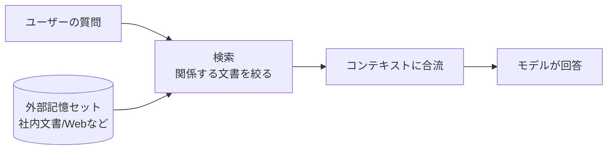
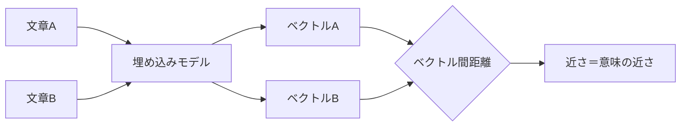
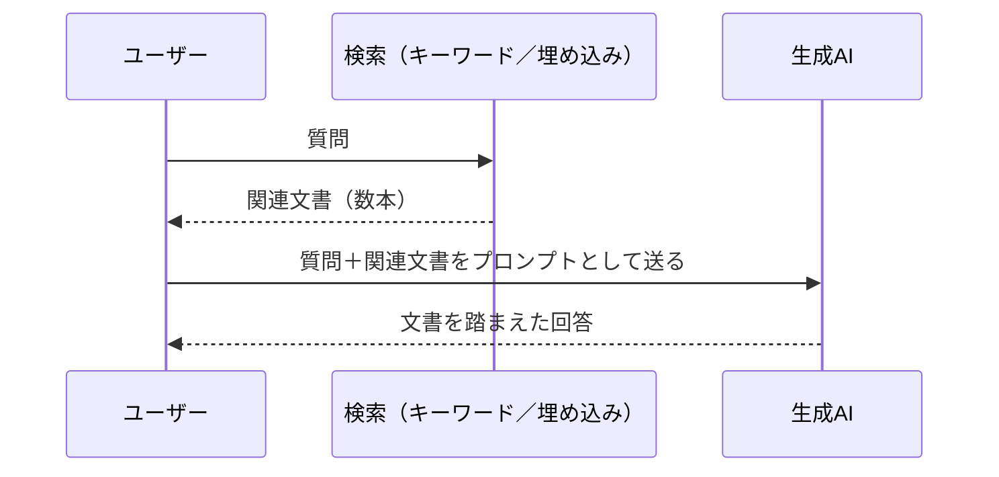
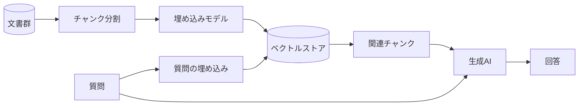

# Appendix: 拡張検索と埋め込み検索

「RAG」「Embedding」「ベクトル検索」、そして最近よく耳にする「グラウンディング」。生成AIまわりの記事を読んでいると、似たような場面で違う言葉が次々に出てきて、整理しきれないまま読み進めることになりがちです。本付録は、これらの語が実際には何の話をしているのかを、利用者の側の理解として揃えるための地図です。

結論を先に置いておきます。これらはいずれも、**生成AIに「自前で持っていない知識」を参照させるための、外部記憶セットを構築する仕組み**の話です。仕組みを支える要素として、キーワード検索と埋め込み検索という性質の異なる2つの検索方式が登場します。本付録では、まずその2つを並べて整理し、そのうえでRAGとグラウンディングという呼び方の違いに触れます。

## 対象読者と前提

- [6章](06-hallucination-and-knowledge-literacy.md)で「学習カットオフ」と「コンテキストで補える情報」の関係を読んだ人
- [8章](08-common-capabilities.md)でコネクタの仕組み（外部の情報を会話に持ち込む経路）を把握した人
- 業務で生成AIに社内文書や資料を参照させたい、もしくはRAGという単語を見かけて気になっている人

エンジニア向けの実装ガイドではありません。仕組みを「会話と意思決定の語彙」として身につけ、社内で議論したり、ベンダーの提案を読み解いたりするための足場を作ることを目標にします。

## 「外部記憶セット」という捉え方

[6章](06-hallucination-and-knowledge-literacy.md)で確認したとおり、生成AIが学習時点で持っている知識には、**学習カットオフ**という時間的な区切りがあります。社内文書のように、そもそもモデルの学習データに含まれていない情報も同じです。これらをモデルに使わせるには、**会話のコンテキストに後から差し込む**しかありません。

差し込むだけなら、ユーザーが資料を貼り付ける、コネクタが取得結果を流し込む、といった経路で実現できます。ただ、社内に資料が10万本あるような状況では、毎回全部を貼り付けるわけにはいきません。コンテキストウィンドウには上限があり、入れ過ぎても精度が落ちます。

ここで登場するのが、**質問のたびに「関係しそうな数本」だけを取り出して渡す**仕組みです。

この絵の中央にある「検索」をどう作るかが、本付録のテーマです。検索の方式によって、得意な質問と苦手な質問がはっきり分かれます。

## キーワード検索と埋め込み検索

検索の方式は大きく2系統あります。古くから使われているキーワード検索と、生成AIブームとともに注目された埋め込み検索です。それぞれの性質を表で並べてから、順に見ていきます。

| 観点 | キーワード検索 | 埋め込み検索 |
| ---- | ---- | ---- |
| 一致の基準 | 文字列の一致（語彙ベース） | 意味の近さ（ベクトル間の距離） |
| 強い場面 | 製品名・型番・固有の語など、表記が一致する問い | 言い換え・同義語・概念レベルでの問い |
| 弱い場面 | 表記揺れ、同義語、概念的な問い合わせ | 固有名詞や型番のピンポイント検索 |
| 事前準備 | 転置インデックスの作成 | 文書の埋め込み計算とベクトル保存 |
| 計算コスト | 軽い | 埋め込み生成のぶんだけ重い |

### キーワード検索

`Salesforce 契約書 改訂` のように、書かれている語そのものを手がかりに探す方式です。Webの検索エンジン、社内の全文検索、データベースの`LIKE`検索などが該当します。代表的な実装としては、転置インデックスを使うElasticsearchやOpenSearch、ライブラリ層でのBM25などが挙げられます。

書かれている語と問いの語が一致していれば強い反面、表現が少しでもずれると取りこぼします。「契約書を改訂したい」と「契約条項を改めたい」では、人間が読めば同じ話に見えても、語彙のうえでは別物として扱われます。

### 埋め込み検索

文章を高次元のベクトル（数百〜数千個の数字の並び）に変換し、ベクトル同士の距離が近いものを「意味が近い」とみなす方式です。ここで使う「文章をベクトルに変換するモデル」が**埋め込みモデル（Embedding model）**で、変換結果のベクトルを**埋め込み（Embedding）**と呼びます。

埋め込みは、意味の似た文章を似た位置に配置する性質を持ちます。「契約書を改訂したい」と「契約条項を改めたい」は、語彙としては別ですが、ベクトル空間では近い場所に置かれます。結果として、同義語や言い換えにも反応する検索が成り立ちます。

一方、固有名詞や型番のピンポイント検索は苦手です。「voyage-3.5」のような固有のトークンは、ベクトル空間では近隣に意味的に近い語（他の埋め込みモデル名など）が並びやすく、文字列としての一致を期待した結果からはずれることがあります。

### ハイブリッド検索

実務では、2つを組み合わせる「ハイブリッド検索」が主流です。キーワード検索の結果と埋め込み検索の結果を、それぞれの順位やスコアを混ぜ合わせて統合します。固有名詞のピンポイント性と、言い換えへの寛容さを両取りする狙いです。製品名つきの社内ドキュメント検索や、ナレッジベースのQA用途では、ほぼこの構成が前提になります。

## RAG: 検索結果をプロンプトに合流させる「型」

ここまでの話を、生成AIに対する一連の手順としてまとめたのが、**RAG（Retrieval-Augmented Generation、検索拡張生成）**です。直訳すれば「検索で補強した生成」で、[6章](06-hallucination-and-knowledge-literacy.md)でも一度名前だけ触れました。手順は次の3段だけです。

RAGそのものは特別な技術というより、**段取りの呼び名**です。検索で何を引いてくるか、引いてきた結果をどうプロンプトに組み込むか、回答の根拠として何を引用させるか。設計の自由度はここに集中しており、品質も主にここで決まります。

埋め込み検索を使ったRAGの構成を、用語の整理を兼ねて図にすると、こうなります。

各部品を一言ずつ整理しておきます。

- **チャンク分割**: 文書を段落や数百トークン単位に切り分ける。長すぎると検索の粒度が荒くなり、短すぎると意味が散る
- **埋め込みモデル**: 文章をベクトルに変換するモデル。OpenAIの`text-embedding-3-*`、Voyage AIの`voyage-3.5`などが代表例
- **ベクトルストア**: 大量のベクトルから「近いもの」を高速に取り出す保管庫。Pinecone、Weaviate、pgvectorなどがよく使われる
- **生成AI**: 取り出した関連チャンクを参照しながら回答を組み立てる。Claude、Geminiなど

利用者の立場では、これらの部品を自分で組み立てる必要はありません。多くの社内ナレッジ製品は、この一式を裏で動かしてチャット風のUIだけを見せています。Difyのような[Appendix「ワークフローツール」](appendix-workflow-tools.md)で触れたLLMアプリ志向のツールも、RAGの構築を主目的の1つとしています。

## 「グラウンディング」という呼び方

GoogleはGemini文脈で、外部情報を参照しながら回答する機能を**グラウンディング（Grounding）**と呼んでいます。代表例が「Grounding with Google Search」で、Gemini APIから有効化すると、モデルが検索結果を踏まえて回答を返し、合わせて引用URLや検索クエリも返してくれます。

仕組みのレベルでは、RAGとグラウンディングは大きく重なります。**外部から取り出した情報を、生成のプロンプトに合流させて回答を組み立てる**という骨格は同じです。違いは強調点と運用範囲にあります。

| 観点 | RAG | グラウンディング（Geminiの呼称） |
| ---- | ---- | ---- |
| 言葉の出自 | 学術用語（Lewis et al., 2020） | Googleが製品文脈で採用 |
| 重点 | 検索した文書を生成の素材として使う | 回答を**事実に接地（ground）させる**ことの強調 |
| 想定する情報源 | 任意の外部記憶（社内文書／Web／DB） | Google検索、Google Maps、自社の検索APIなど |
| 利用者の体験 | チャットの裏で関連文書を引いて回答 | 同上＋引用URLや検索クエリの返却 |

利用者の感覚としては、「グラウンディングはRAGをGoogle側の文脈で呼び直したもの」と理解しておくと、製品の説明文を読み解きやすくなります。設計者目線では、Geminiのグラウンディング機能を使うときに運用面の縛りが追加で乗ってきます。Google検索によるグラウンディングは検索候補の表示が利用条件になっており、こうした実務上の差が出てくる点は押さえておきたいところです。

## 利用者として接する場面

裏でRAGが動いていることに気づきにくい場面と、明示的に意識する場面があります。代表的なものを並べておきます。

| 場面 | 内側で起きていること |
| ---- | ---- |
| 社内ナレッジ検索のチャットUI | 質問を埋め込みに変換 → 社内文書のベクトルストアを引く → 関連数本をプロンプトに合流 → 回答 |
| ChatGPT／Claude／Geminiの「Web検索」モード | 検索クエリを内部で生成 → 検索結果を取得 → 結果を踏まえて回答（Geminiは「グラウンディング」と表記） |
| Notion AI／Slack AIなどのSaaS内蔵AI | ワークスペース内の文書を埋め込み済み → 質問のたびに関連文書を引いて回答 |
| 各社の「ファイルをアップロードして質問」機能 | アップロードファイルをチャンク分割・埋め込み → 質問のたびに関連箇所を引く |

利用者として押さえておくと役に立つのは、**「検索で何が引かれたか」を確認する習慣**です。多くの製品は、引用元の文書名やURLを返してきます。回答が外れたときは、まず**検索結果の段階でずれていないか**を見ると、原因の切り分けが進めやすくなります。プロンプトの言い換えで改善することも多く、これは[6章](06-hallucination-and-knowledge-literacy.md)で触れた「揺らぎテスト」と相性のよい習慣です。

## 始め方の現実的な順序

社内で「RAGを使った何かを始めてみたい」となったときの、実務的な進め方です。

- 自分たちの**ユースケースが本当にRAGを必要としているか**を先に見極める。たとえば、参照する文書が少数で、毎回手で貼れる規模なら、RAGを組まずにアップロード機能で十分なことが多い
- 既存のSaaS（Notion AI、Glean、Microsoft 365 Copilotなど）が想定する用途に合致するなら、それを採用するほうが、自前構築より時間あたりの成果は安定する
- どうしても自前構築が要る場合も、ベクトルストアの選定より先に、**チャンク分割と評価セット**を整える。検索結果の質が低いと、どんな高機能なベクトルストアを選んでも回答は改善しない
- ハイブリッド検索を最初から前提にする。固有名詞や製品名が混ざる業務文書では、純粋な埋め込み検索だけでは取りこぼしが目立つ

評価セットというのは、「この質問なら、この文書のこの箇所が引かれてほしい」を100問ほど書き出した正解集のことです。RAG構築の現場では、これがあるかどうかで議論の進み方がまるで変わってきます。

## まとめ

- 「RAG」「Embedding」「グラウンディング」は、**生成AIに外部記憶を参照させる仕組み**の話で、レイヤーの異なる語が混ざっている
- 検索方式には、文字列一致の**キーワード検索**と、意味の近さで引く**埋め込み検索**があり、実務ではハイブリッドが標準
- **RAG**は「検索結果をプロンプトに合流させる」段取りの呼び名で、特定技術ではなく型の名前
- Geminiの「**グラウンディング**」は、外部情報に回答を接地させることを強調した呼び方で、骨格はRAGと重なる
- 利用者の側では、引用元の確認と質問の言い換えで、内側の検索段階のずれを見つけやすくなる

## 参考

- Anthropic「Embeddings」: <https://docs.anthropic.com/ja/docs/build-with-claude/embeddings>（最終確認：2026-04-25）
- Google「Grounding with Google Search (Gemini API)」: <https://ai.google.dev/gemini-api/docs/google-search>（最終確認：2026-04-25）
- OpenAI「Vector embeddings」: <https://developers.openai.com/api/docs/guides/embeddings>（最終確認：2026-04-25）
- Lewis, Patrick et al.「Retrieval-Augmented Generation for Knowledge-Intensive NLP Tasks」: <https://arxiv.org/abs/2005.11401>（最終確認：2026-04-25）
