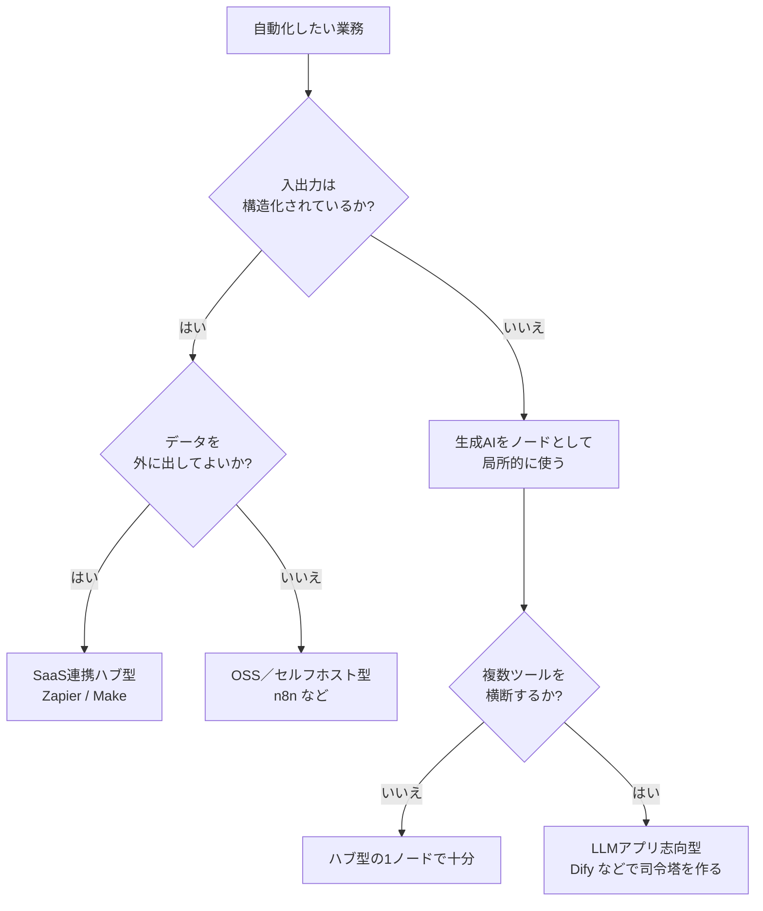

# Appendix: ワークフローツール

業務の自動化に取り組むと、「Zapier」「Make」「n8n」「Dify」といった「ワークフローツール」の名前を目にする機会が増えます。本付録は、これらに生成AIを組み込むときの選び方と注意点を整理します。

この領域は機能追加の頻度が高いため、画面や料金の細部は公式ドキュメントを一次ソースとして参照します。本付録では、変化の少ない「考え方」のほうに焦点を絞ります。

## 対象読者と前提

- [8章](08-common-capabilities.md)で生成AIの共通的な使い方（チャット、アーティファクト、コネクタ）を把握した人
- [10章](10-security-agent-era.md)のセキュリティ（エージェント時代のガバナンス）を一読した、もしくは後で読むつもりの人
- 自分で業務アプリを書かない立場で、複数のSaaSをまたいだ自動化を検討している非エンジニア

本付録はエンジニア向けではありません。手を動かす説明は最小限にとどめ、検討の場で使う言葉をそろえることを優先します。

## ワークフローツールは複数サービスをノーコードでつなぐ仕組み

**ワークフローツール**は、複数のサービスや処理をノーコードまたはローコードで一連の流れにつなぐ仕組みの総称です。トリガー（きっかけ）となるイベントを起点に、条件分岐や変換をはさみ、別のサービスへ結果を届けます。

流れを図にすると次のとおりです。

ワークフローツール自体は生成AI以前から存在するカテゴリです。「変換・判断」の中身として生成AIが入ることで、ルールでは記述しにくかった処理（問い合わせの要約、自由記述の分類など）が自動化の対象に加わりました。

## 連携ハブ・セルフホスト・LLMアプリの3タイプで分ける

同じ「ワークフローツール」と呼ばれていても、設計思想は3タイプに分かれます。

| タイプ | 代表例 | 向いている用途 |
| ---- | ---- | ---- |
| SaaS連携ハブ型 | Zapier、Make、Workato | 既存SaaS同士の接続を手早く構築する |
| OSS／セルフホスト型 | n8n、Activepieces、Windmill | データを社外へ出さず、細かく制御する |
| LLMアプリ志向型 | Dify、LangFlow、Flowise | 生成AIを主役にしたミニアプリを作り、APIで呼び出す |

### SaaS連携ハブ型

ZapierとMakeは長く運用されているサービスで、既製のコネクタ（組み込み済みの接続先）が数千種類用意されています。生成AIのノードも標準で備わっており、「届いたメールをClaudeに要約させてSlackに流す」ような構成を、画面操作だけで組み立てられます。導入の手数が少なく、設定の説明も画面にそろっている形です。商用SaaSのため、利用が増えると課金額もそのまま増えます。

### OSS／セルフホスト型

n8nはOSSで、自社サーバ上で動かせます。データが社外に出る経路を最小化したい、監査ログを自前で保持したい、といった要件が出るときの選択肢です。最近はLLMノードやベクトル検索ノードもそろっており、エンジニアリング体制があれば、ハブ型で実現していることはおおむね再現できます。

### LLMアプリ志向型

Difyは目的が異なります。「LLMを中心に据えたミニアプリをノーコードで作り、そのアプリをAPI経由で外部から呼び出す」という発想です。プロンプト管理、ナレッジベース、評価機能など、生成AI運用に必要な機能が同居しており、チャットボットやRAGアプリを継続的に作る現場に向きます。

3タイプの境界はきっぱり分かれているわけではなく、重なる領域もあります。実務では「SaaS同士の接続はハブ型、生成AI側の処理はLLMアプリ志向型、それらをOSSのワークフローで束ねる」という組み合わせも珍しくありません。

## 生成AIの差し込み方はノード・司令塔・自走の3パターン

ワークフローの中で生成AIを使う形は、3つのパターンに分けられます。それぞれ向いている用途と、想定すべきリスクが違うため、名前で区別しておくと検討の場で論点がそろいます。

| パターン | 一言で | 主なリスク |
| ---- | ---- | ---- |
| ノードとして呼ぶ | 1ステップだけLLMに判断・変換を依頼する | 入力の前処理不足による品質ブレ |
| LLMファーストの司令塔 | LLMが全体の流れを組み立てる | プロンプト肥大化と再現性低下 |
| エージェント的自走 | LLMが自分でツールを呼び、手順を決める | 想定外の副作用、ガバナンス面の課題 |

### ノードとして呼ぶ

採用しやすく、最初に試しやすい型です。ワークフロー全体の流れは人が設計し、「この1ステップだけ文章理解が必要」という箇所だけを生成AIに頼みます。要約、分類、翻訳、メール文面のたたき台生成など、入出力がはっきりしたタスクに向きます。

この型の要点は、入力範囲を絞ることと、出力形式を固定することです。JSON形式での出力を指示し、スキーマに合わない場合は再試行する、といった検証を手前で用意します。

### LLMファーストの司令塔

流れの中枢にLLMを置き、「どのツールをどの順で呼ぶか」まで含めて判断させる型です。複数のコネクタを柔軟に組み替える用途と相性のよい構造で、DifyのワークフローやLangChain系のフレームワークが扱いやすい領域です。

この型は表現力が高い一方で、プロンプトが次第に大きくなり、再現性も落ちやすくなります。プロンプトをコードと同様にバージョン管理し、テストケースで挙動を確認する進め方が、長期の運用で扱いやすい形になります。

### エージェント的自走

[7章](07-terminology.md)で紹介した「エージェント」を、ワークフロー上に乗せる型です。ゴールだけを与え、使えるツールの一覧を渡して、その先の手順はLLMに任せます。うまく回る場面では成果が大きい一方、想定外のツールを想定外の順で呼ぶ副作用が伴います。

使い始めの段階では、実行を人の手前で止めて承認する段取りを残します。[10章](10-security-agent-era.md)で扱うサンドボックス環境と操作ログの確保は、この型を運用するうえでの前提として位置づけます。

## 入出力の構造と外出可否でツールを選ぶ

最初の1本を組むときは、次のフローで判断材料を整理できます。

「いきなりエージェント的自走から始める」分岐をフローに含めていないのは意図したものです。自走型は、ノード型と司令塔型で運用の作法を整えてから順番に追加する形のほうが、副作用を制御しやすくなります。

## よくある失敗パターンと対策

実務でよく見かける失敗例と、回避策を表にまとめます。

| 失敗パターン | 何が起きるか | 対策 |
| ---- | ---- | ---- |
| すべてをLLMに任せる | 請求額と不具合が同時に増える | 正規表現や条件分岐で済む判断はノーコード側で書く |
| プロンプトを画面上で直書き | バージョン管理ができず復旧不能 | プロンプトはGit等で履歴管理し、ツールには参照させる |
| 本番環境でいきなり実行する | 意図しない操作がそのまま実害に直結する | サンドボックス環境と、書き込み系の承認フローを分ける |
| 機密データを無自覚に流す | 規約違反や情報漏えいが発生しうる | データ区分ごとに利用可能ツールをホワイトリスト化する |
| 使用量アラートなしで運用する | 月末の請求額で初めて問題に気づく | ツールとLLM双方に実行数・トークン数の上限を設定する |

最終行は、運用後に発見しても取り得る対応の幅が狭くなりがちです。アラート設定を最初に組み込んでおくと、原因の切り分けが進めやすくなります。

## 始め方は週次の定型業務をノード型で1本

はじめて組むときに無理のない手順は次のとおりです。

- 自動化の候補を、週に1回以上発生する定型業務から選ぶ（頻度が低いと、かけた時間に対する効果が読み取りにくい）
- 入出力を1枚にまとめる（トリガー／前処理／AI判断／アクション／例外対応）
- まずはSaaS連携ハブ型でノードとして呼ぶパターンから試す
- 動作が安定したら、同系統の業務を2〜3本集めて、司令塔型へリファクタリングする
- 自走型へ移すのは、ログと承認フローを含むガバナンスが整ってから

最初から完成形を狙わず、たたき台を人が校正する形で3週間ほど運用してから自動化の幅を広げる進め方が、運用の作法までそろえるうえで扱いやすい順序になります。

## まとめ

- ワークフローツールは、SaaS連携ハブ型・OSS／セルフホスト型・LLMアプリ志向型の3タイプで大別できる
- 生成AIの差し込み方は、ノード・司令塔・自走の3パターンを段階的に進める
- 最初の課題は、エージェントの導入よりも、プロンプトのバージョン管理とコスト上限の整備
- データの外出可否と業務のリスク等級を軸に、使うツールとパターンを決める

## 参考

- Zapier「AI Actions／AIノード」: <https://zapier.com/ai>（最終確認：2026-04-24）
- Make「AI AgentsとLLM連携」: <https://www.make.com/en/ai-automation>（最終確認：2026-04-24）
- n8n「AI & LangChainノード」: <https://docs.n8n.io/advanced-ai/>（最終確認：2026-04-24）
- Dify「ドキュメント」: <https://docs.dify.ai/>（最終確認：2026-04-24）
