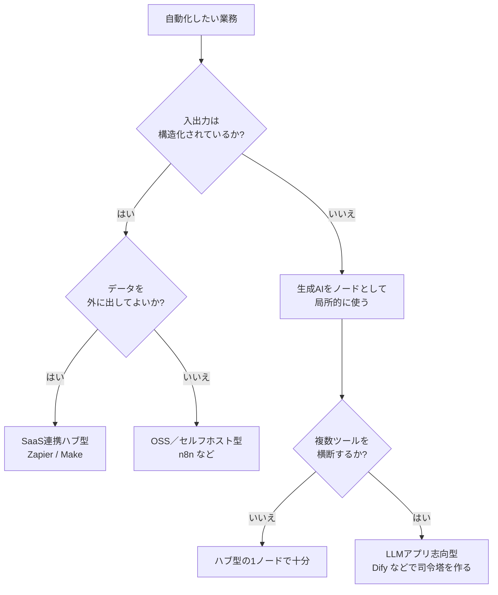

# Appendix: ワークフローツール

業務の自動化を少しでも本気で考えたことがあれば、「Zapier」「Make」「n8n」「Dify」といった名前を一度は耳にしたことがあるはずです。本付録は、これら「ワークフローツール」に生成AIを組み込むとき、何から考え始めればよいかを整理するための地図です。カタログとしてではなく、選び方と踏みどころを伝えるつもりで書いています。

ツールの世界は新車発表会並みの頻度で新機能が出ますので、画面や料金の細部は公式を一次ソースとしてご確認ください。ここでは、賞味期限の長い「考え方」だけを扱います。

## 対象読者と前提

- 8章で生成AIの共通的な使い方（チャット、アーティファクト、コネクタ）を把握した人
- 10章のセキュリティ（エージェント時代のガバナンス）を一読した、もしくは後で読むつもりの人
- 自分では業務アプリを書かないが、複数のSaaSをまたいだ自動化を「誰かに頼む前に下絵くらいは描きたい」人

本付録はエンジニア向けではありません。手を動かす部分はなるべく減らし、会話と意思決定のための言葉を揃えることを優先します。

## 「ワークフローツール」とは何を指すか

ここで言うワークフローツールとは、**複数のサービスや処理を、ノーコードもしくはローコードで一連の流れにつなぐ仕組み**の総称です。トリガー（きっかけ）となるイベントを起点に、条件分岐や変換をはさみ、別のサービスへ結果を届けます。

図にすると、だいたいこんな形です。

生成AI以前から存在するカテゴリなのですが、ここに「変換・判断」の中身として生成AIが入ることで、**ルールでは書きにくかった仕事**が一気に自動化の射程に入ってきました。たとえば「問い合わせの要約」や「自由記述の分類」などです。

## ツールの性格分け

同じ「ワークフローツール」でも、思想はかなり違います。大きく3タイプに分けて眺めるとぶれません。

| タイプ | 代表例 | 向いている用途 |
| ---- | ---- | ---- |
| SaaS連携ハブ型 | Zapier、Make、Workato | 既存SaaSどうしの「つなぎ込み」を手早く回す |
| OSS／セルフホスト型 | n8n、Activepieces、Windmill | データを外に出したくない、細かい制御を効かせたい |
| LLMアプリ志向型 | Dify、LangFlow、Flowise | 生成AIを主役にしたミニアプリを作り、APIで呼び出す |

### SaaS連携ハブ型

ZapierとMakeは老舗で、既製のコネクタ（組み込み済みの接続先）が数千種類あります。生成AIのノードも標準で用意されており、「届いたメールをClaudeに要約させてSlackに流す」ような定番構成を、画面クリックだけで組めます。早い、わかりやすい、請求書が自動で届く、というタイプです。

### OSS／セルフホスト型

n8nはOSSで、自社サーバに置いて動かせます。データが社外に出る経路を最小化したい、監査のためにログを自分たちで持ちたい、といった要求があるときに出番がきます。最近はLLMノードやベクトル検索ノードも充実しており、ある程度のエンジニアリング力があれば、ハブ型でできることはだいたい再現できます。

### LLMアプリ志向型

Difyは毛色が異なります。こちらは「LLMを中心に据えたミニアプリをノーコードで作り、そのアプリをAPIとして外部から呼ぶ」という発想です。プロンプト管理、ナレッジベース、評価機能など、生成AI運用に必要な道具が最初から同居しています。チャットボットやRAGアプリを量産する現場に向きます。

3タイプはきっぱり分かれているわけではなく、重なる領域もあります。実務では、「SaaSのつなぎ込みはハブ型、AI側の頭脳はLLMアプリ志向型、それらをOSSのオーケストレーションで束ねる」という三段構えも珍しくありません。

## 生成AIを差し込む3つのパターン

ワークフローの中で生成AIをどう使うかは、大きく3つのパターンに分かれます。力の入れどころと事故の起きやすさが違いますので、名前をつけて区別しておくと議論しやすくなります。

| パターン | 一言で | 主なリスク |
| ---- | ---- | ---- |
| ノードとして呼ぶ | 1ステップだけLLMに判断・変換を頼む | 入力の前処理不足による品質ブレ |
| LLMファーストの司令塔 | LLMが全体の流れを組み立てる | プロンプト肥大化と再現性低下 |
| エージェント的自走 | LLMが自分でツールを呼び、手順を決める | 想定外の副作用、ガバナンス問題 |

### ノードとして呼ぶ

いちばん安全で、最初に採用しやすい型です。ワークフロー全体の流れは人が設計し、「この1ステップだけは文章理解が要るから、生成AIに頼む」と局所的に使います。要約、分類、翻訳、メール文面のたたき台生成など、入出力がはっきりしたタスクに向きます。

この型の肝は、**入力を絞ることと、出力の形を縛ること**です。JSON形式での出力を指示し、スキーマに合わない場合は再試行する、といったガードを手前で用意してください。

### LLMファーストの司令塔

流れの中枢にLLMを据え、「どのツールをどの順で呼ぶか」まで含めて考えさせる型です。複数のコネクタを柔軟につなぎ替えたい用途と相性のよいパターンで、DifyのワークフローやLangChain系のフレームワークが扱いやすい領域です。

この型は表現力が高い反面、プロンプトが次第に大きくなり、再現性も落ちやすくなります。プロンプトをコードと同じようにバージョン管理し、テストケースで挙動を確認する進め方が、実運用に耐えるやり方です。

### エージェント的自走

7章で紹介した「エージェント」を、ワークフロー上に乗せる型です。ゴールだけを与え、使えるツールの一覧を渡して、あとはLLMに任せます。噛み合えば成果が大きい一方、**想定外のツールを想定外の順で呼ぶ**副作用が付き物です。

使い始めのうちは、実行を人の手前で止めて承認する段取りが欠かせません。10章で触れているサンドボックスと操作ログの確保は、この型では必須の前提として扱ってください。

## 使い分けのフロー

最初の1本を組むときは、次のフローで考えると判断しやすくなります。

「いきなりエージェント的自走から始める」分岐がないのは、**意図的に外しています**。自走型は、ノード型と司令塔型で使い方の土台ができてから足す順番で取り組んでください。

## よくある失敗パターンと対策

実務でよく見かける踏み抜きポイントと、その回避策をまとめます。

| 失敗パターン | 何が起きるか | 対策 |
| ---- | ---- | ---- |
| すべてをLLM頼みにする | 請求額と不具合が同時に膨らむ | 正規表現や条件分岐で済む判断はノーコード側で書く |
| プロンプトを画面上で直書き | バージョン管理ができず復旧不能 | プロンプトはGit等で履歴管理し、ツールには参照させる |
| 本番環境でいきなり回す | 意図しない操作がそのまま実害に直結する | サンドボックス環境と、書き込み系の承認フローを分ける |
| 機密データを無自覚に流す | 規約違反・情報漏えいの温床 | データ区分ごとに利用可能ツールをホワイトリスト化する |
| 使用量アラートなしで放流 | 月末の請求額で初めて問題に気づく | ツールとLLM双方に実行数・トークン数の上限を設定する |

最後の行に心当たりがある場合は、先にアラートを仕込んでしまうのが確実です。請求を見てから動くと、対応できる選択肢はだいぶ狭くなります。

## 始め方

はじめて組むときの現実的な手順です。

- 自動化の候補を**週に1回以上発生する定型業務**から選ぶ（頻度が低いと、かけた時間に対する効果が読みにくい）
- 入出力を紙の上で1枚にまとめる（トリガー／前処理／AI判断／アクション／例外対応）
- まずはSaaS連携ハブ型で**ノードとして呼ぶ**パターンから試す
- うまく動いたら、同系統の業務を2〜3本集めて、司令塔型へリファクタリングする
- 自走型へ移すのは、ログと承認フローを含むガバナンスを整えてから

いきなり完璧な自動化を狙わず、**たたき台を人が校正する流れ**で3週間ほど回してみる進め方が、全体としては速く安定運用に届きます。

## まとめ

- ワークフローツールは、**SaaS連携ハブ型／OSS・セルフホスト型／LLMアプリ志向型**の3タイプで大別すると迷わない
- 生成AIの差し込み方は、**ノード／司令塔／自走**の3パターンを段階的に登っていく
- 最初の課題は、目立つエージェントではなく**プロンプトのバージョン管理**と**コスト上限**。土台から順に固める
- データの外出可否と、業務のリスク等級で、使うツールとパターンを決める

## 参考

- Zapier「AI Actions／AIノード」: <https://zapier.com/ai>（最終確認：2026-04-24）
- Make「AI AgentsとLLM連携」: <https://www.make.com/en/ai-automation>（最終確認：2026-04-24）
- n8n「AI & LangChainノード」: <https://docs.n8n.io/advanced-ai/>（最終確認：2026-04-24）
- Dify「ドキュメント」: <https://docs.dify.ai/>（最終確認：2026-04-24）
